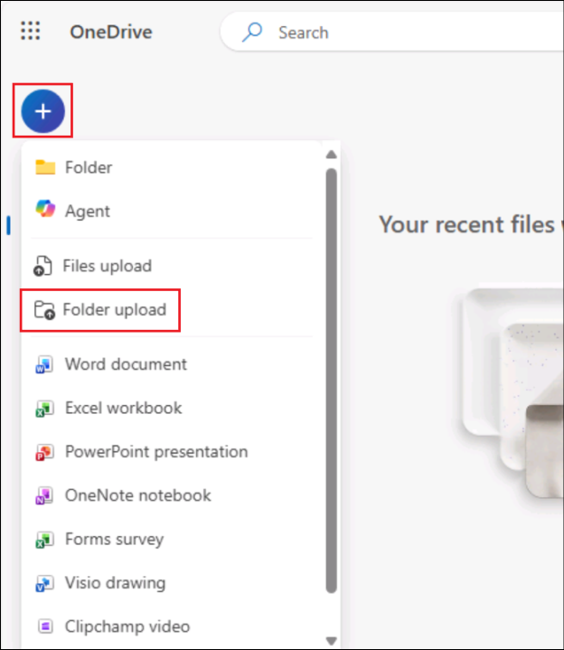

# Exercise 2: Build HR Assistant Agent with Copilot Studio

### Estimated Duration: 30 minutes

## Overview

This lab aims to streamline and enhance the process of employee transitions within an organization. Participants will learn how to use Microsoft 365 Copilot to identify suitable internal candidates, create customized transition plans, and generate effective communication materials. They will also leverage Copilot Studio to automate workflows, develop onboarding and training materials, and set up performance monitoring mechanisms. By utilizing these AI-powered tools, the lab focuses on ensuring a smooth and efficient transition process, improving internal mobility, and supporting employee success in their new roles.

## Scenario

Your company, Contoso Enterprises, is looking to hire a new Data Analyst and wants to streamline the entire recruitment and onboarding process using Microsoft 365 Copilot. The HR department aims to screen candidates quickly, develop training materials, collect feedback, and conduct performance reviews.

## Lab Objective

- Task 1: Quickly screen candidates
- Task 2: Develop training materials
- Task 3: Collect feedback
- Task 4: Performance Reviews
  
### Architecture Diagram


### Task 1: Quickly screen candidates

**Objective**: Rapidly evaluate a large number of applications for the Data Analyst position.

   - Action: The HR manager uses Microsoft 365 Copilot to analyze resumes and filter candidates based on specific criteria like relevant experience, technical skills, and educational background. Copilot highlights the top candidates for you to look over.

1. Click on **Apps -> OneDrive (1)** from the left pane, and Click on **My files (2)**.

      

2. Click on **+ -> Folder upload**.

      

3. Navigate to `C:\LabFiles\Day-1\Data`, click on `CV` folder and select **Upload**.

     

4. Once again click on **+ Add new** and select **Folder upload**.

5. Navigate to `C:\LabFiles\Day-1`, click on the `data` file and click on **Upload**. Select **Upload** on the `Upload 19 files to this site?` pop-up.

    

6. In the Copilot window, click on **Chat**, click on **Add Content** icon. and and select **Upload images and files**. 

    

7. In the file explorer pop-up, navigate to `C:\LabFiles\Day-1\Data\CV` **(1)** folder, select **first 3** **(2)** files and click on **Open** **(3)**.

    

8. In the **Copilot chat**, once the **3 files** are uploaded successfully click on **Send** button.
   
    >[!Note] **Note:** Enter a message like +++Profiles+++ to the Copilot if it asks to enter message before uploading the documents.

    

10. In the Copilot window, Again click on **Copilot chat** **(1)**, click on **Add content** **(2)** icon and select **Upload from this device**. 

    

11. In the file explorer pop-up, navigate to `C:\LabFiles\Day-1\Data\CV` **(1)** folder, select **last 2** **(2)** files and click on **Open** **(3)**.

    

12. In the **Copilot chat**, once the **2 files** are uploaded successfully click on **Send** button.

    >[!Note] **Note:** Enter a message like +++Profiles+++ to the Copilot if it asks to enter message before uploading the documents.
    
    

13. In the Chat box, provide the below prompt and hit the **Send** button:
  
    ```
    Microsoft 365 Copilot, please help me filter and shortlist resumes of Data Analyst candidates based on required qualifications such as experience in SQL, Python, and data visualization tools.
    ```

14. Following up with the below prompt and hitting the **Send** button

    ```
    Create a summary report of top Data Analyst candidates, including their skills, work experience, and educational background.
    ```

    

**Outcome**: The HR team efficiently identifies the most qualified candidates, saving time and ensuring a focused recruitment effort.
  
### Task 2:  Develop training materials.

**Objective**: Prepare comprehensive training materials for the new hire.

  - Action: The HR team uses Copilot to create personalized training documents, including role-specific guides, company policies, and an overview of tools and technologies used. Copilot ensures that the training materials are thorough and tailored to the new employee's role.

1. In the Chat box, provide the below prompt and hit the **Send** button:

    ```
    Generate a comprehensive onboarding training plan for the new Data Analyst, including topics like company policies, data tools training, and team introductions.
    ```

    

2. Following up with the below prompt and hitting the **Send** button.

    ```
    Create an interactive training presentation covering data analysis best practices and key performance metrics.
    ```

    

    > **Note**: After executing this prompt, you will get a PowerPoint presentation to be downloaded, and then you can edit or design it. If the file was not downloaded, please try to find the hyperlink with the presentation title as shown in the screenshot.
    
    > **Note**: After executing this prompt, PowerPoint presentation to be downloaded option is not showing up please rerun the above prompt.

Outcome: The new hire receives well-organized training materials, enabling them to get up to speed and effectively perform their duties quickly.

### Task 3:  Collect feedback

Objective: Gather feedback from new employees and interviewers to improve the recruitment and onboarding processes.

Action: The HR team utilizes Copilot to generate and distribute feedback surveys to new hires and interviewers. Copilot collects and analyzes the responses, providing insights into the strengths and areas for improvement in the process.

1. In the Chat box, provide the below prompt and hit the **Send** button:

    ```
    Create a feedback form for interviewers to evaluate Data Analyst candidates based on technical skills, problem-solving abilities, and cultural fit.
    ```

2. Following up with the below prompt and hitting the **Send** button.

    ```
    Send out a survey to new hires to gather feedback on their onboarding experience and identify areas for improvement.
    ```

Outcome: The HR department gains valuable feedback, allowing them to refine their recruitment and onboarding practices, ensuring a better experience for future hires.

## Task 04:  Performance Reviews

Objective: Conduct regular performance reviews to assess the new employee's progress and development.

Action: The HR manager uses Copilot to create performance review templates and schedule review meetings. Copilot helps track the employee's achievements, gather feedback from colleagues, and compile performance reports.

1. In the Chat box, provide the below prompt and hit the **Send** button:

    ```
    Set up a performance review schedule for the new Data Analyst, with quarterly reviews and goal-setting sessions.
    ```

2. Following up with the below prompt and hitting the **Send** button.
  
    ```
    Generate a template for performance review reports, including sections for achievements, areas of improvement, and future goals.
    ```

Outcome: The new employee receives constructive feedback and support, aiding their professional growth and contributing to their long-term success within the company.

### Review

FutureTech Enterprises is in the process of hiring a new Data Analyst and seeks to streamline the recruitment and onboarding process using Microsoft 365 Copilot. The HR department aims to achieve the following objectives:

- Quickly Screen Candidates: Efficiently filter and shortlist candidates based on qualifications and experience.
- Develop Training Materials: Create comprehensive onboarding materials and training plans for the new Data Analyst.
- Collect Feedback: Gather feedback from interviewers and new hires to improve the recruitment and onboarding process.
- Conduct Performance Reviews: Set up regular performance reviews and goal-setting sessions to track the new hire's progress.

By leveraging Microsoft 365 Copilot, FutureTech Enterprises aims to enhance the efficiency and effectiveness of the entire process, ensuring a smooth and seamless experience for all parties involved.

### You have successfully completed the lab!
