# Exercise 3: Incorporate actions in HR Agent

### Estimated Duration: 60 minutes

### Overview

Implementing awards and recognition using Microsoft Copilot Studio streamlines the process of nominating and recognizing employees for their contributions and achievements.

### Scenario

Your company, Contoso Enterprises, is expanding its software development team. The HR department aims to use Microsoft 365 Copilot to streamline the recruitment process and ensure a smooth and efficient experience for both candidates and the hiring team.

### Objectives

- Create a nomination.

### Task 01:  Create a Nomination.

In this task, you are going to create an agent to help employees submit nomination forms by using Copilot Studio. When creating nominations in Microsoft 365 Copilot, it's important to collect comprehensive details to ensure that the nominations are well-documented and effective.

1. Add a new tab in the Edge browser and open the **Microsoft Copilot Studio** using the fillowing link:
   
   ```
   https://copilotstudio.microsoft.com/
   ```

   >**Note:** Please avoid refreshing the page, as it may take some time for Copilot Studio to load. Sometimes, especially on the first launch, it can take 10–15 minutes to load due to backend dynamics on Microsoft's side.
   
3. Sign in.

  

4. In the **Copilot Studio**, from the left pane select **+ Create** **(1)** and click on **+ New agent** **(2)**.

    

5. In the New Agent, Select **Skip to Configure**.

    

6. Enter the following details to configure the agent and click on the **Create** button **(4)**.

   - Name: **Nomination Agent**  **(1)**. 
   - Description: Provide the description below in the description box **(2)**

       ```
       The Nomination Agent in Copilot Studio is designed to streamline the process of creating, managing, and reviewing nominations within Tech Innovators Inc. This agent helps HR teams and managers efficiently handle nominations for awards and recognitions. It allows users to create detailed nominations, capturing necessary nominee information, award categories, and business cases. The agent automatically generates comprehensive summaries for each nomination, facilitating quick and informed decision-making. It also streamlines the review and submission process, enabling easy access to candidate achievements and recognitions. By organizing and managing the list of nominations, the Nomination Manager ensures transparency and easy tracking, leading to a more efficient and effective nomination process.
        ```
   - Instructions: Provide instructions below to the Nomination Agent **(3)**

        ```
        Create Nomination: Use the create Nomination function to initiate the nomination process. This function will prompt the user to enter necessary details such as the nominee's name, position, department, award category, and business case.
        Generate Nomination Summary: Call the generate Nomination Summary function to automatically create a concise summary of the nomination. This summary will include key candidate information, achievements, and contributions based on the input provided during the nomination creation.
        Review and Submit Nomination: Implement the review And Submit Nomination function to allow users to review the generated summary and all nomination details. Once reviewed, the function will enable users to submit the nomination for approval.
        View Recognition: Use the viewRecognition function to allow users to access and acknowledge the achievements and recognitions of candidates. This function will display a list of recognitions received by nominees.
        View Nominations: Implement the view Nominations function to provide users with an organized view of all submitted nominations. This function will ensure transparency and easy tracking of the nomination process, allowing users to monitor the status and progress of each nomination.
        ```

        

7. In the copilot studio, scroll to the top, click on **Topics** **(1)**, then select **All** **(2)** and select **Conversation Start** **(3)**.

    

8. In the **Conversation Start** Workflow, select on **Change trigger** **(1)** under Trigger node, and change the trigger to **Event received** **(2)**.  

    

9. Click on the area under the **Message** node, and replace the message as below:

    ```
    Hello, I'm Nomination Agent, a virtual assistant. I am here to help you submit a nomination, generate a Nomination Summary, view Recognition, and view Nomination. Before going for any other action, please submit a nomination.
    ```

    

10. Under the **Message** node, click **Add Node** **(1)**, and then choose **Ask a question** **(2)**.

    

11. On the **Ask a question** node. Enter the following details and click on **Save** **(7)**.
    - Enter **Do you want to submit a nomination?**  **(1)** in the message box,
    - Select **+ New Option** **(2)** add **Yes**  **(3)** again select **+ New Option** and add **No**  **(4)**.
    - Click on **Var1** **(5)** under Save user response as and change the Usage to **Global(any topic can access)** **(6)**.
    
    
    

12. Under the **Ask a question** node, click on **Add Node** **(1)**, then choose **Ask with adaptive Card** **(2)**.

    


13. In the **Ask with adaptive Card** node, Click on ellipses **(...) (1)** and Select **Properties(2)**. 

    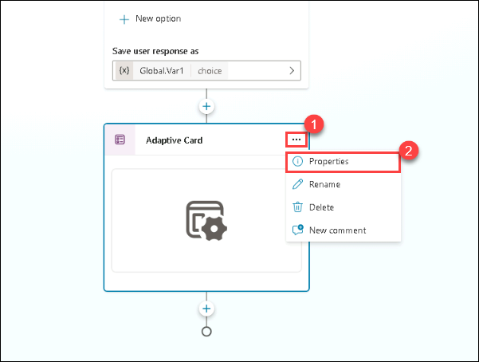


14. Click on the **Edit adaptive card** option.

    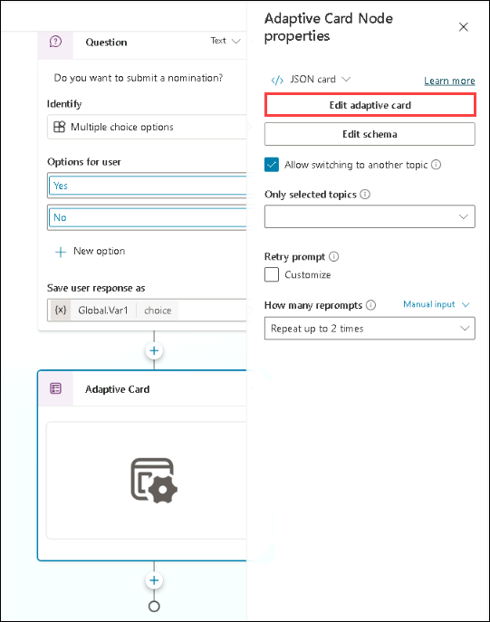


15. Inside the **Card payload editor**. Replace the below provided **JSON script** **(1)**. and click on **Save (2)** and than on **Close**.

    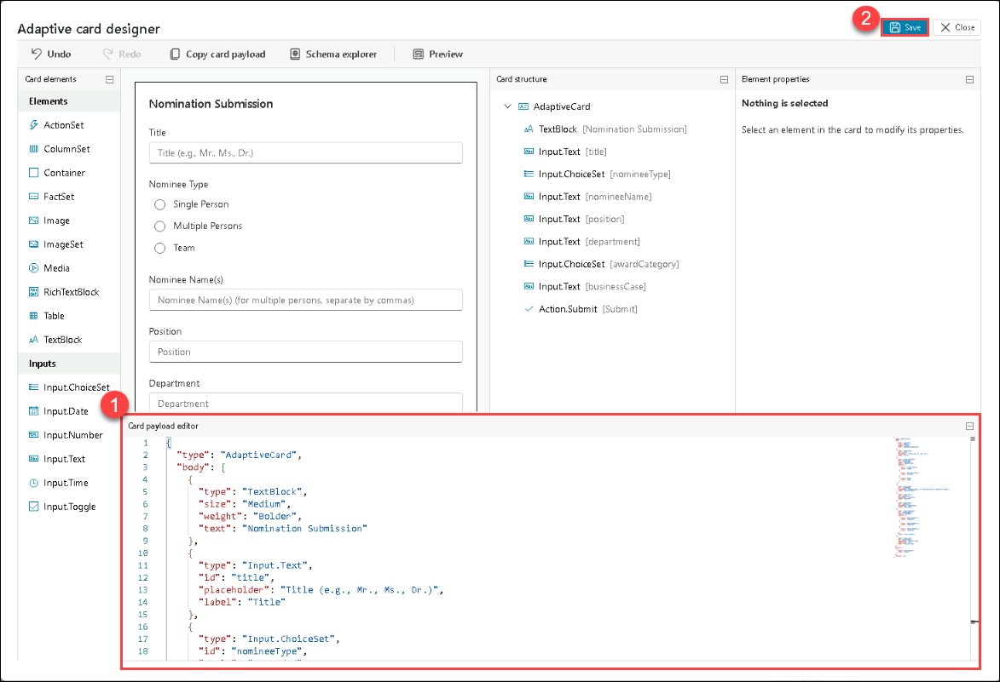

    ```json
    {
          "type": "AdaptiveCard",
          "body": [
            {
              "type": "TextBlock",
              "size": "Medium",
              "weight": "Bolder",
              "text": "Nomination Submission"
            },
            {
              "type": "Input.Text",
              "id": "title",
              "placeholder": "Title (e.g., Mr., Ms., Dr.)",
              "label": "Title"
            },
            {
              "type": "Input.ChoiceSet",
              "id": "nomineeType",
              "style": "expanded",
              "label": "Nominee Type",
              "choices": [
                {
                  "title": "Single Person",
                  "value": "single"
                },
                {
                  "title": "Multiple Persons",
                  "value": "multiple"
                },
                {
                  "title": "Team",
                  "value": "team"
                }
              ]
            },
            {
              "type": "Input.Text",
              "id": "nomineeName",
              "placeholder": "Nominee Name(s) (for multiple persons, separate by commas)",
              "label": "Nominee Name(s)"
            },
            {
              "type": "Input.Text",
              "id": "position",
              "placeholder": "Position",
              "label": "Position"
            },
            {
              "type": "Input.Text",
              "id": "department",
              "placeholder": "Department",
              "label": "Department"
            },
            {
              "type": "Input.ChoiceSet",
              "id": "awardCategory",
              "style": "expanded",
              "choices": [
                {
                  "title": "Award Category 1",
                  "value": "category1"
                },
                {
                  "title": "Award Category 2",
                  "value": "category2"
                },
                {
                  "title": "Award Category 3",
                  "value": "category3"
                }
              ],
              "label": "Award Category"
            },
            {
              "type": "Input.Text",
              "id": "businessCase",
              "placeholder": "Business Case",
              "isMultiline": true,
              "label": "Business Case"
            }
          ],
          "actions": [
            {
              "type": "Action.Submit",
              "title": "Submit"
            }
          ],
          "version": "1.4"
        }
    ```

    
16. Make sure all the variables generated by the adaptive cards are set to global, and select **Save**.

    

    

17. Under the **Ask with adaptive Card** node, click on **Add Node** **(1)**, then select **Add an action** **(2)**, and then choose **New Agent Flow**  **(3)**. 

    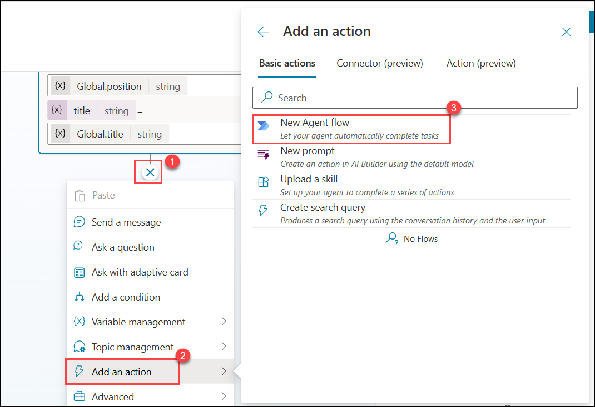

18. In Agent flows under Designer tab.  Click on **Save draft**.

    


19. Click on **Flows**(1) tab and click on **Edit agent flow** (2).

    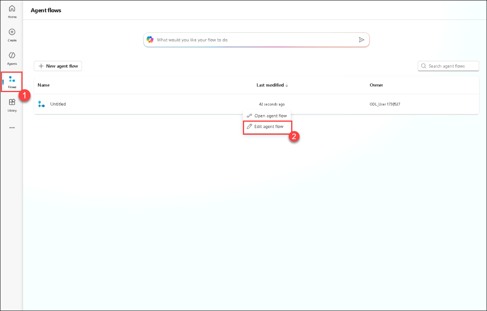

20. Click on **Overview**(1) tab and click on **Edit** (2).

    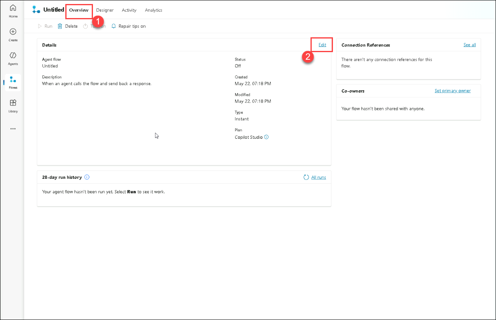

21. Enter **NominationFlow**(1) in the Flow name field and click on **Save**(2).  

    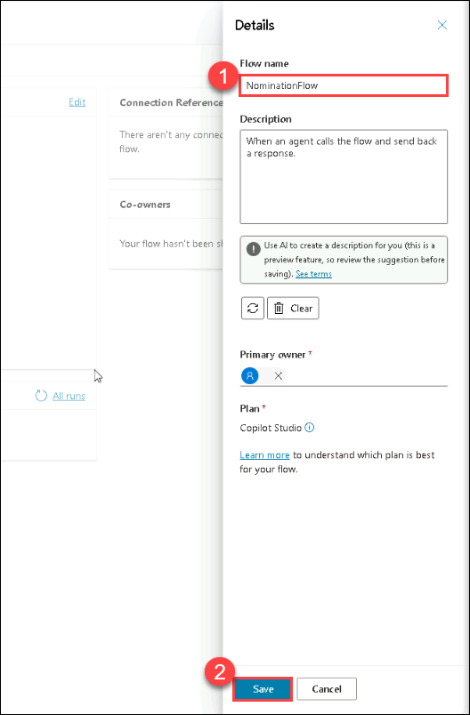

22. Click on **Designer (1)**  tab and Click on **When an agent calls the flow** **(2)** node, under **Parameters** session click on **+ Add an Input** , select **Text** **(3)**, enter the **Title** **(4)** in the text box.

    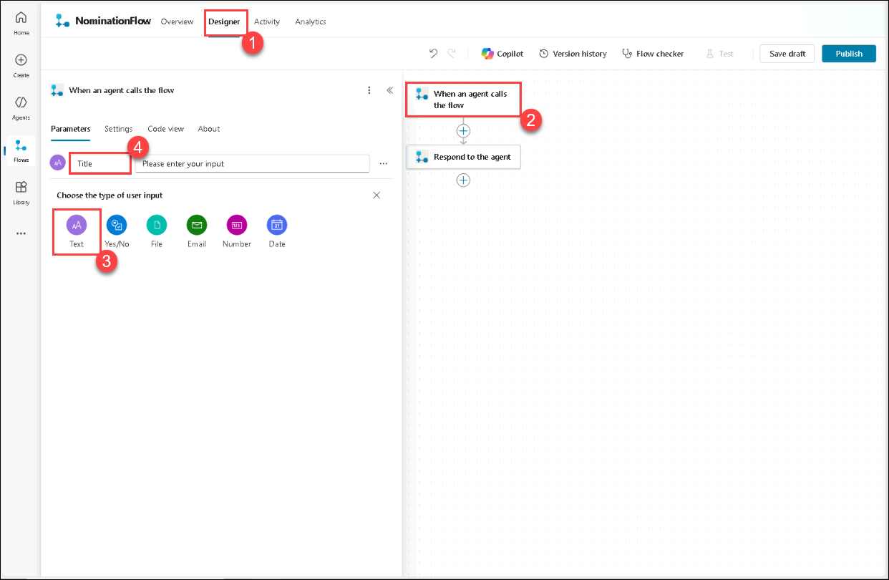

23. Repeat the steps click on **+ Add an Input** **(1)**, select **Text** **(2)**, enter the following **Parameters**

    - NomineeType
    - NomineeName
    - Position
    - Department
    - AwardCategory
    - BusinessCase

24. Once all the Parameters are added, click on **Collapse**.

    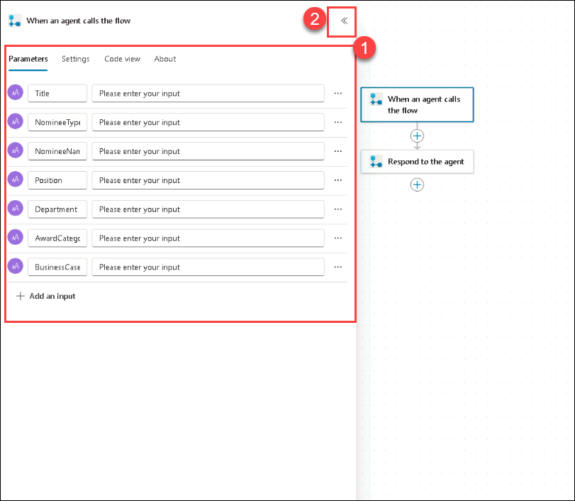

25. Click on **Add action** **(1)**, below the **When an agent calls the flow**, search for the **Add a row into a table** **(2)**, and select **Add a row into a table** **(3)**.

    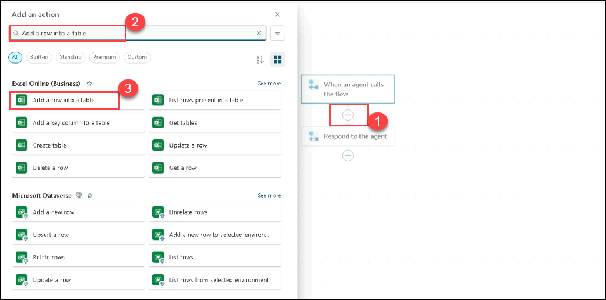


26. Click on **Sign in**. A new browser tab will popup. Select the account which you are already logged in.

    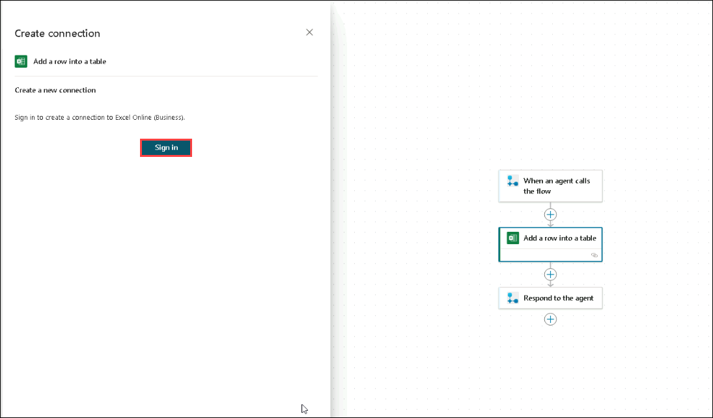


27. Click on **Allow Access**.    


28. In **Add a row into a table**  configurations and fill the following details: 

    - Location: From the drop-down select **OneDrive for Business** **(1)**
    - Document Library: From the drop-down, select **OneDrive** **(2)**.
    - File: Select **/data/NominationList.xlsx** **(3)**.
        - Click on the **folder** **(1)** icon and navigate to the **data** **(2)** folder, and select **NominationList.xlsx** **(3)**.

            
          
    - Table: From the drop-down, select **Table1** **(4)**.

    

29. From the **Advanced Parameters**, please select Title, NomineeType, NomineeName, Position, Department, AwardCategory, and BusinessCase.

    

30. Under **Advanced parameters**, in the Title text box, type **/** **(1)** and choose **Insert dynamic content** **(2)**. Next to **When an agent calls the flow**, click **See more** **(3)** and then select **Title** **(4)**.

    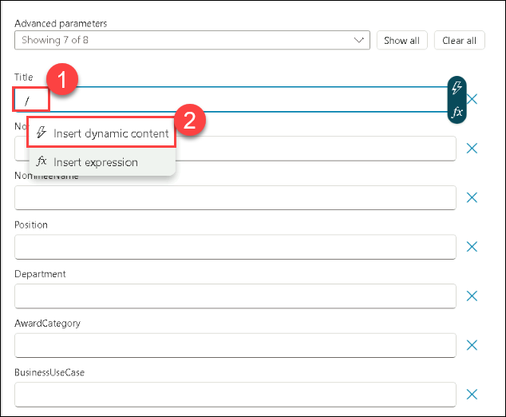
    

    > **Note**: Make sure you are selecting under **When an agent calls the flow**

31. Just like the previous steps, follow these instructions for each field:

      - In the respective text box, type **/** and choose **Insert dynamic content**. Next to **Run a flow from Copilot**, click **See more** and select the appropriate option:
         - NomineeType
         - NomineeName
         - Position
         - Department
         - AwardCategory
         - BusinessCase
      
      - Once you’ve made all the updates(1), click **Publish**()2 to save and apply them.
   
           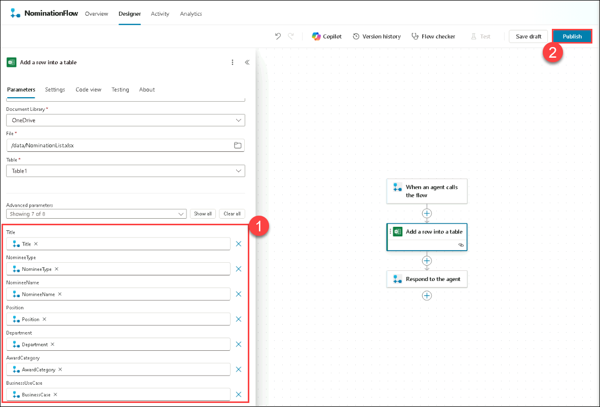

32. Navigate back to the **Agents** (1)page, and Select the **Nomination Agent** (2).

    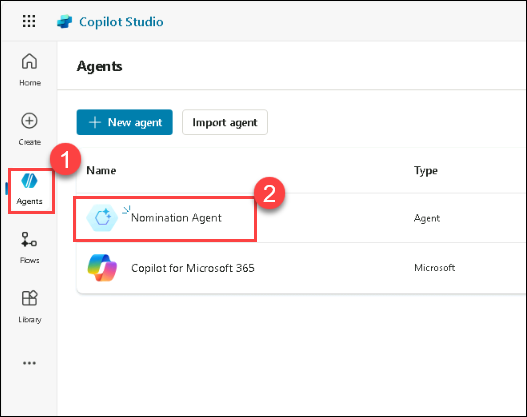

33. Click on **Topics**(1) tab and select **Conversation Start** (2).

    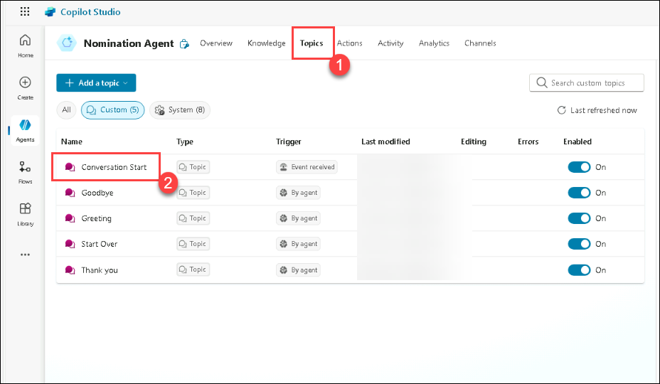

34. In the **Add a tool** section, use the search bar to find **NominationFlow**, then select it to add it to the node.

    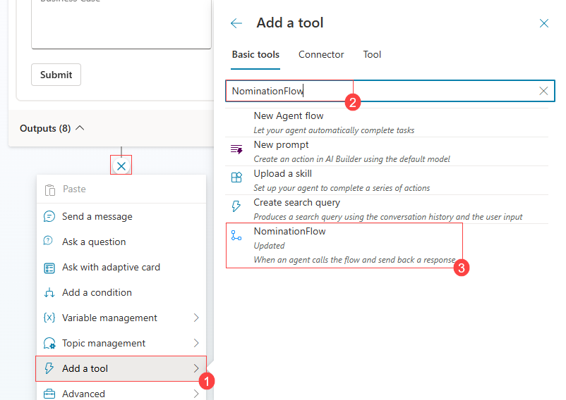

35. Select each action variable and merge it with the variable in the list.

    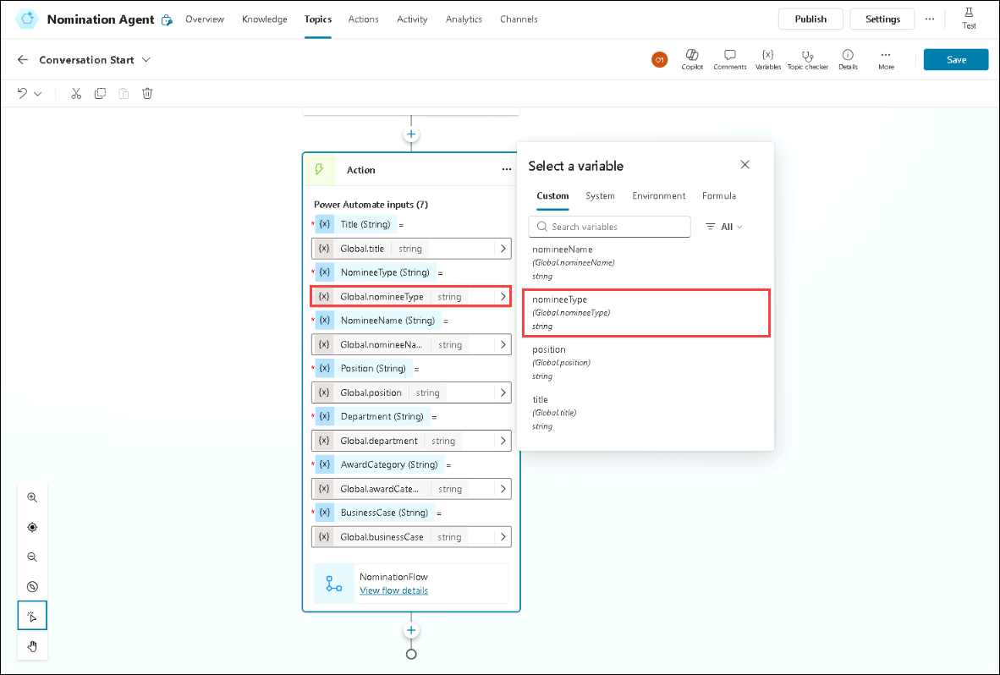

36. Under the **Action** node, click on **Add Node** **(1)**, then choose **Send a message** **(2)**.

    

37. Then enter, **You have successfully submitted Nominations.** Then select **Save**.

    

38. Submit a Nomination by using the Nomination Agent.

In this task, you have completed the creation of Nominationagent.

### Review

After completing this lab on implementing awards and recognition using Microsoft Copilot Studio, you'll have gained hands-on experience in setting up a structured system for nominating and recognizing employees' achievements. You'll understand how to utilize the prebuilt Awards and Recognition agent to guide users through creating, summarizing, reviewing, and submitting nominations.

Completed successfully the tasks below:
- Create nomination.
