# Exercise 4: Enabling Autonomous Capabilities in Microsoft Copilot Studio for HR Activities

### Estimated Duration: 60 minutes

### Overview

The prebuilt Awards and Recognition agent guides users through creating nominations, generating summaries, and reviewing and submitting nominations.

### Objectives

- Generate a nomination summary.

### Task 01: Generate a nomination summary.

To generate a nomination summary, we are going to add a topic in our Nomination Agent.

1. In the **Nomination Agent**, click on **Topics** **(1)**, then click the **+ Add a topic** **(2)** drop-down and select **From blank** **(3)**.

    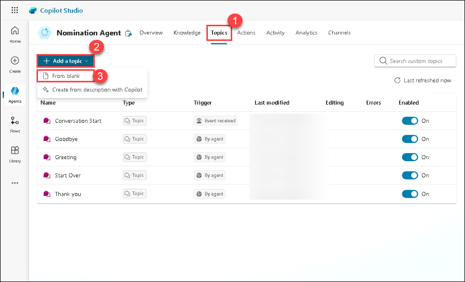

2. Rename the topic as **+++Generate Nomination Summary+++**.

    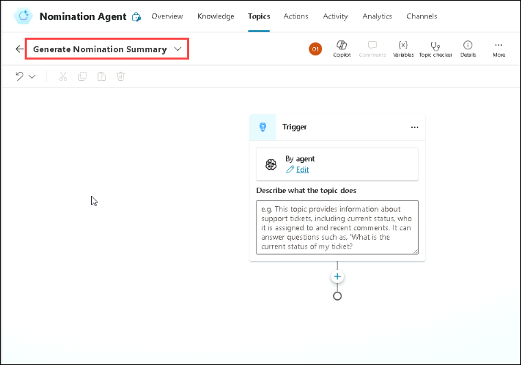


3. Under the **Trigger** node, click **Add Node** **(1)**, and then choose **Send a message** **(2)** node.

    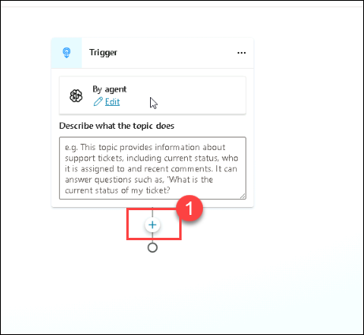

    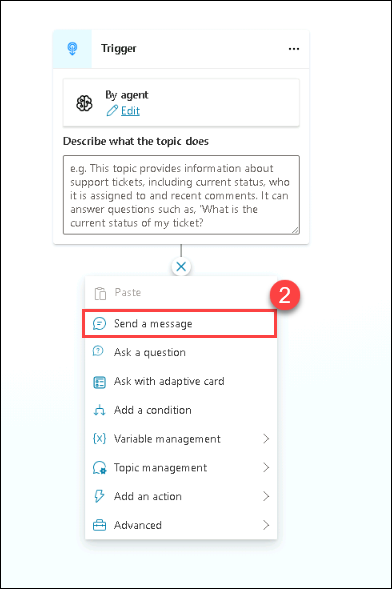

4. Click on the area under the **Message** node, and replace the message as below.

    ```
    I am here to generate a nomination summary from the SharePoint list named 'Nomination List'.
    ```

    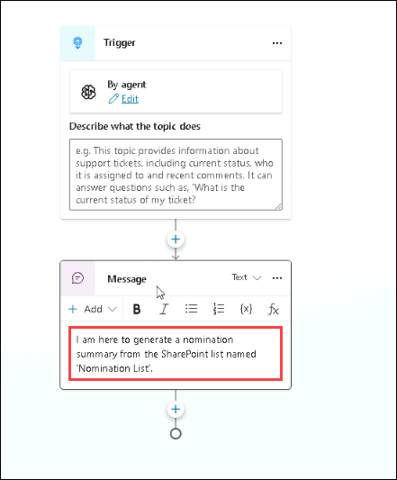

5. Under the **Send a message** node, click **Add Node** **(1)**, and then choose **Ask a Question** **(2)** node.

    

6. On the **Ask a question** node enter the following details and click on **Save** **(7)**.
    - Enter **+++Do you want to generate a nomination summary?+++**  **(1)** in the message box,
    - Select **+ New Option** **(2)** add **+++Yes+++**  **(3)** again select **+ New Option** and add **+++No+++**  **(4)**.
    - Click on **Var1** **(5)** under **Save user response as**.
       - Update the Variable name as **+++isConfirmed+++** **(6)** and change the Usage to **Global(any topic can access)** **(7)**.
    
       

9. Under the **Condition** node (**Yes**), click **Add Node** **(1)**, click on **Variable managemant** **(2)** and select **Set a variable value** **(3)**.

      

10. In the **Set variable value** node, click **Select a variable** **(1)** under **Set variable**, and then choose **Create a new variable** **(2)**.

    

11. Click on the **newly created variable** **(1)**, enter the variable name as **+++summaryvar+++** **(2)**, set it as **Global** **(3)**. Set the value to **+++Yes+++** under **To value** and then click **Save** **(3)**. 

    

    > **Note**: If a pop-up appears saying **Save topic with errors?**, click the **Save** button to proceed.

12. Click **Add node** **(2)** below the **Set variable value** node, select **Add a tool** **(3)**, and choose **New Agent Flow** **(4)**. 

    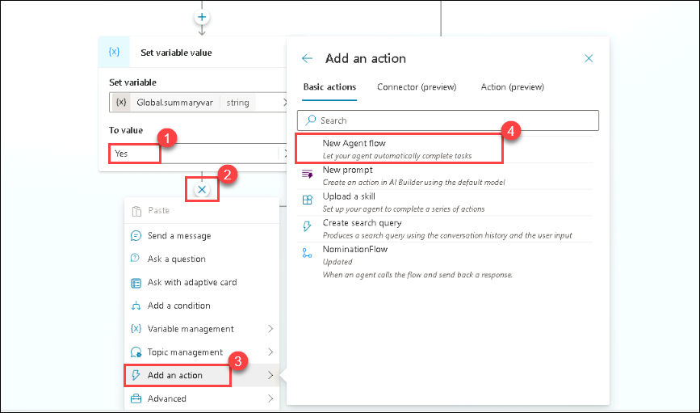

13. In Agent flows under Designer tab.  Click on **Save draft**.

    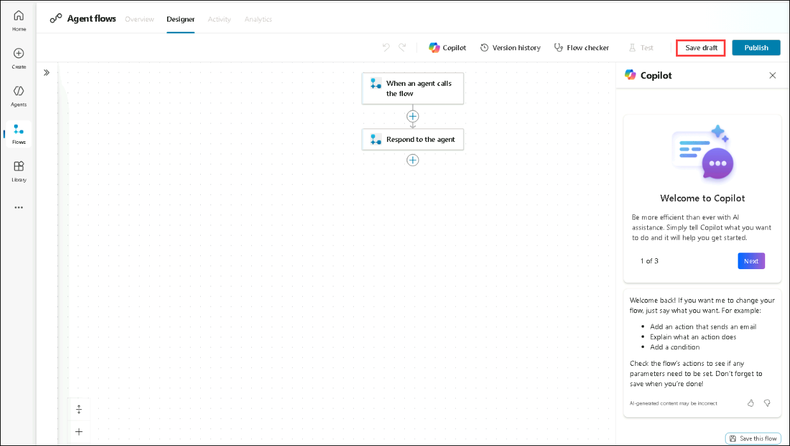

14. Click on **Overview**(1) tab and click on **Edit** (2).

    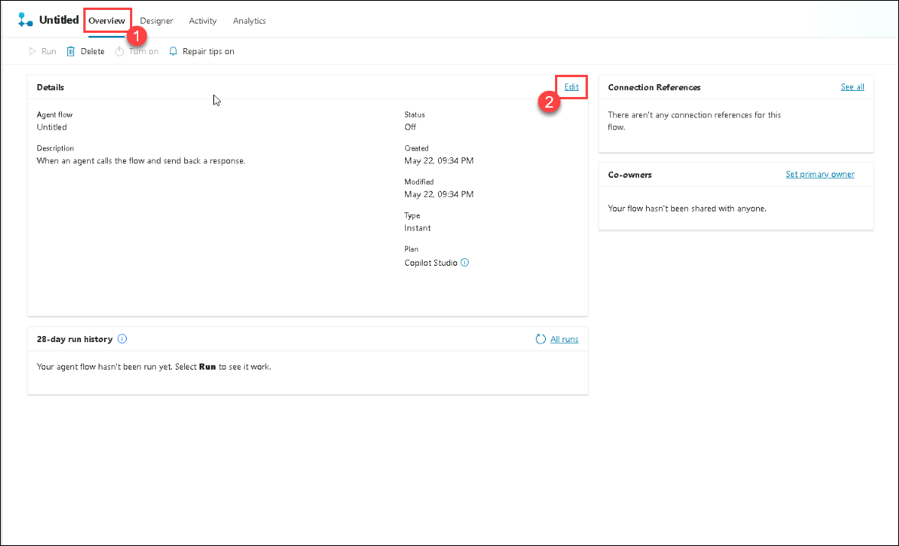

15. Enter **+++SummaryFlow+++**(1) in the Flow name field and click on **Save**(2).

    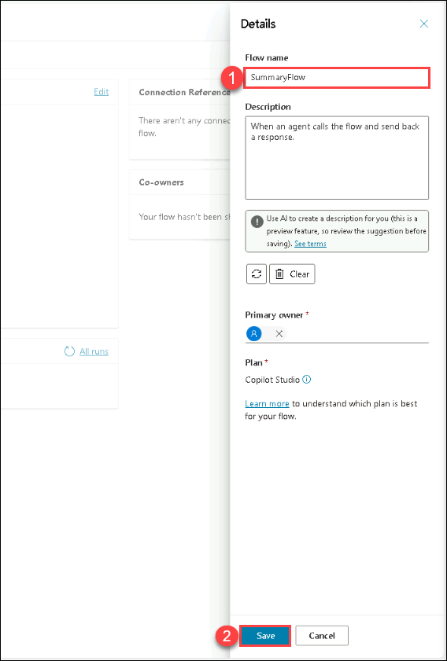


16. Click on **Designer** (1) tab and Click on **When an agent calls the flow** (2) node, under **Parameters**. Click on **+ Add an Input**, select **Text** **(3)**, enter **+++Input+++** **(4)** in the text box. once the parameters are added, click on **Collapse** **(5)**.

    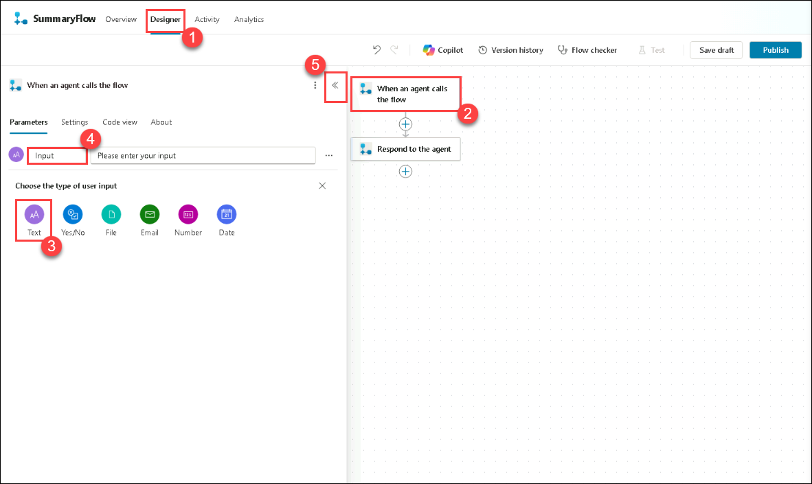  

17. Click on **Add action** **(1)**, below the **When an agent calls the flow**, search for the **+++List rows present in the table+++** **(2)**, and select **List rows present in the table** **(3)**.

    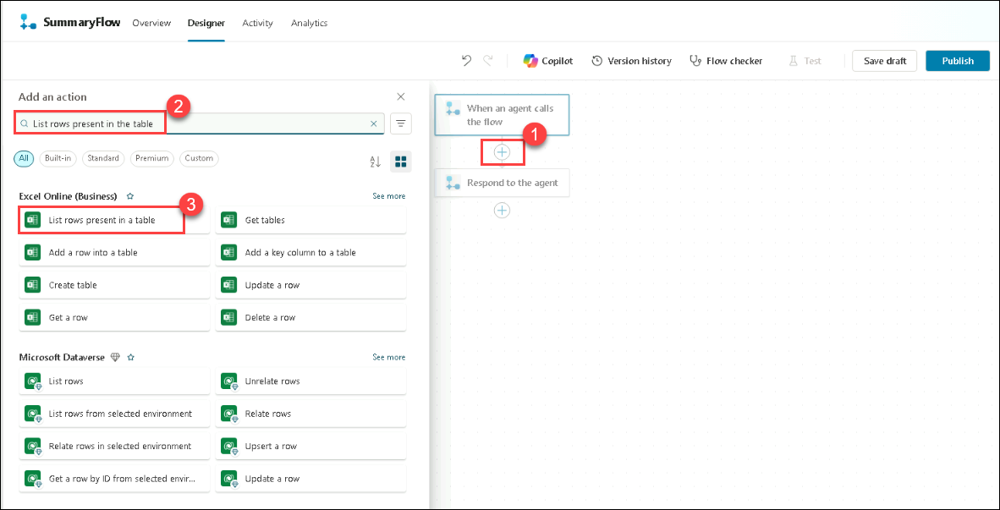

18. Select **List rows present in the table** and fill the following details: 

    - Location: From the drop-down select **OneDrive for Business** **(1)**
    - Document Library: From the drop-down, select **OneDrive** **(2)**.
    - File: Select **/data/NominationList.xlsx** **(3)**.
        - Click on the **folder** **(1)** icon and navigate to the **data** **(2)** folder, and select **NominationList.xlsx** **(3)**.

            
          
    - Table: From the drop-down, select **Table1** **(4)** and click on **Collapse** **(5)**. 

      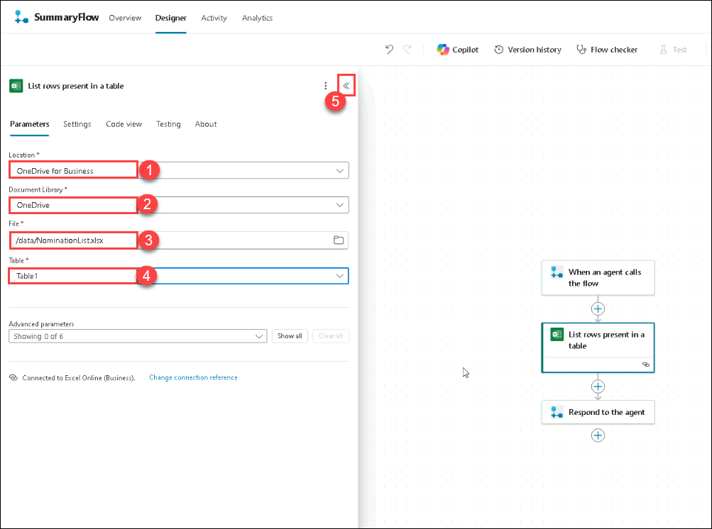

19. Click on **Add an action** **(1)** below the **List rows present in the table** step. In the search bar, type **+++select+++** **(2)**, and then choose **Select** **(3)** under **Data Operation**.

    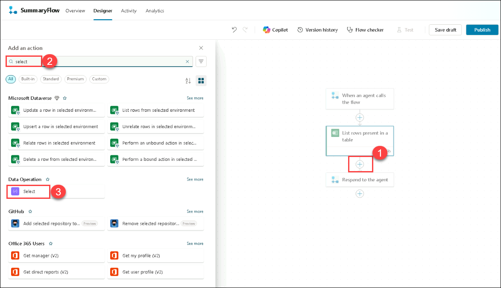

20. Under **From**, in the Title text box, type **/** **(1)** and choose **Insert dynamic content** **(2)**. Then, select **body/value** **(3)** from the **List rows present in the table** section.
    
    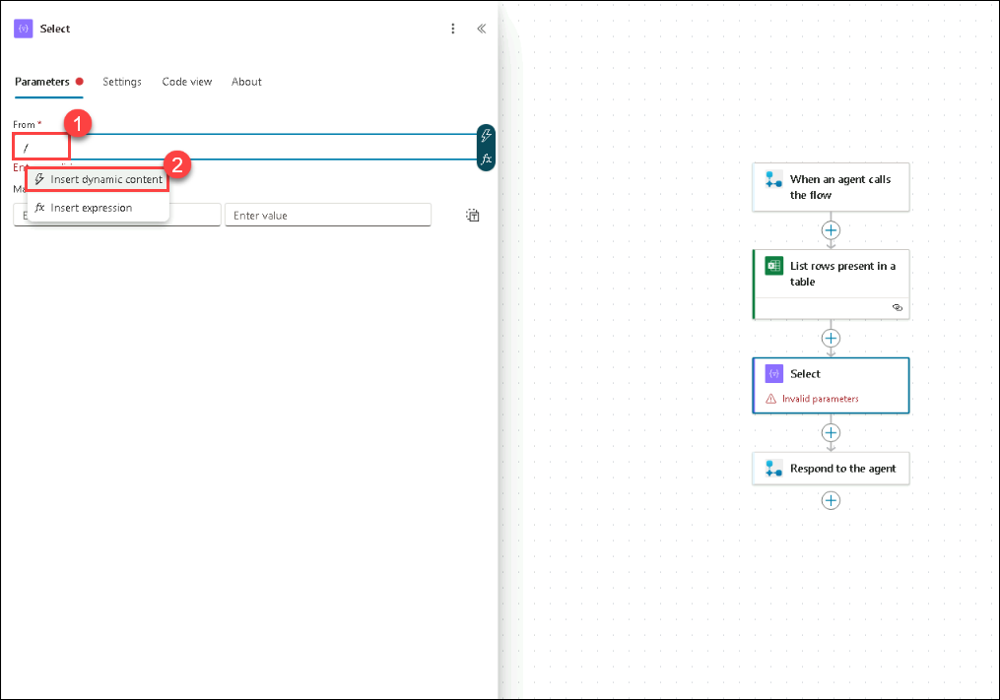
    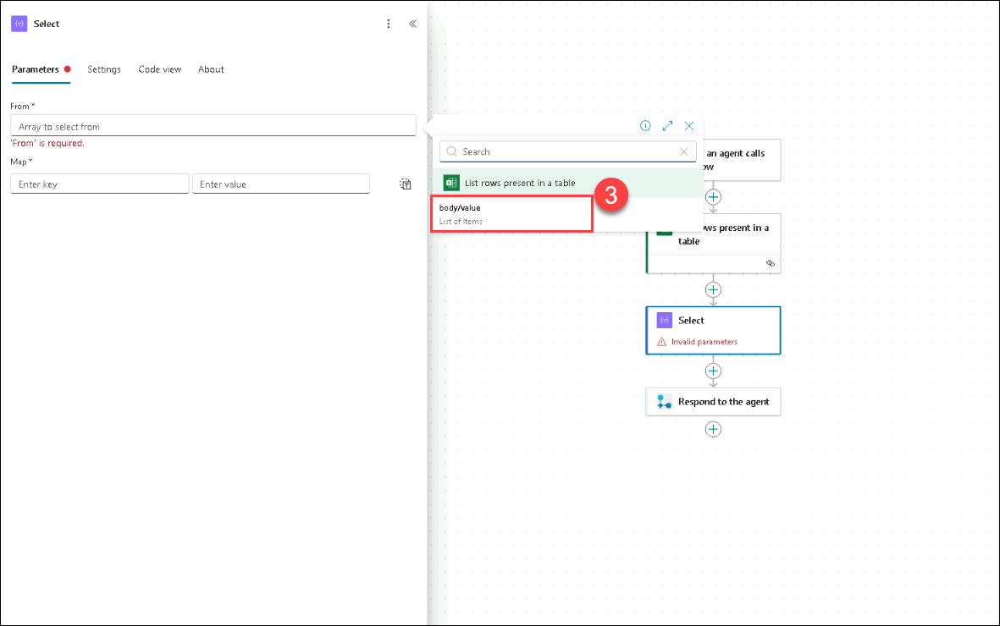

21. Under **Map**, in the **Enter key** text box, type **+++Nominee Type+++** **(1)**. In the **Enter value** text box, type **/** **(2)** and choose **Insert dynamic content** **(3)**. In the dynamic content section, click **See more** **(4)** next to **List rows present in a table**, and then select **NomineeType** **(5)**.

    

22. Now, follow the same steps to add the remaining key-value pairs from the table below:

     | **Key**           | **How to get the Value** |
     |-------------------|--------------------------|
     | +++Nominee Name+++      | Select **NomineeName** from **List rows present in a table** |
     | +++Position+++          | Select **Position** from **List rows present in a table** |
     | +++Department+++        | Select **Department** from **List rows present in a table** |
     | +++Award Category+++    | Select **AwardCategory** from **List rows present in a table** |
     | +++BusinessUseCase+++     | Select **BusinessUseCase** from **List rows present in a table** |
   
     Once you’ve added all these mappings, your **Select** action parameters will include all the necessary fields with the appropriate dynamic content values.

      

23. Click on **Add an action** **(1)** below the **Select** step. In the search bar, type **+++Create a HTML table+++** **(2)**, and then choose **Create a HTML table** **(3)** under **Data Operation**.

    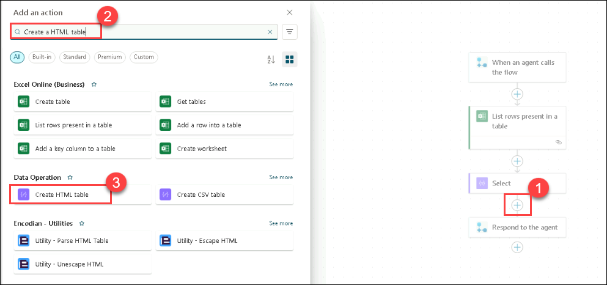

24. In the **Create a HTML table**, in the **Array to create table from** text box under **From**, type **/** **(2)**, and choose **Insert dynamic content** **(3)**. In the dynamic content section, select **Output** **(4)** under **Select**.

    

25. Click below **Create a HTML table** **(1)**. In the search bar, type **+++Send an Email (V2)+++** **(2)**, and then choose **Send an Email (V2)** **(3)** under **Office 365 Outlook**.

    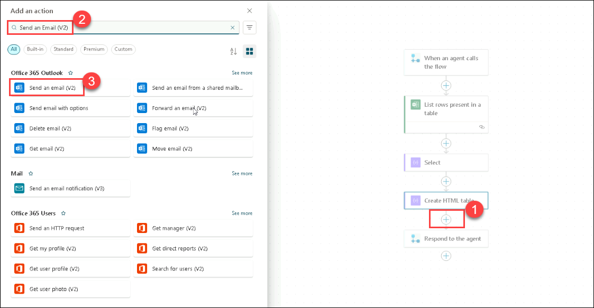

26. Click on **Sign in**. A new browser tab will popup. Select the account which you are already logged in.

    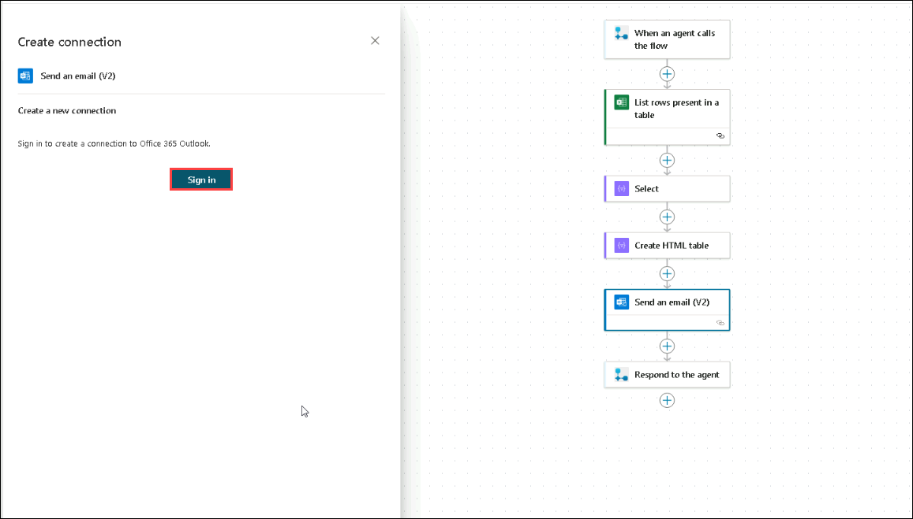

27. Click on **Allow Access**.  

    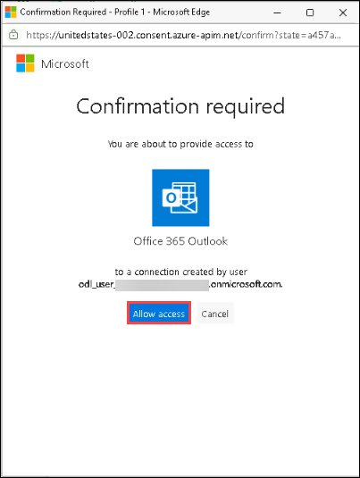

28. Fill in the following details for the **Send an Email (V2)** action.

    | Paremeters | Values | 
    |----------|----------|
    | To       | Select the current user email address <inject key="AzureAdUserEmail"></inject>. **(1)** | 
    | Subject  | +++Nomination Summary+++ **(2)** | 
    | Body     | Copy and paste the following  **(3)**|

     ```
     Hello User, 

     Please find the Nomination summary here:

     //add output from create HTML table trigger

     Thanks & Regards
     Nomination Agent
     ```
               
      

29. In the **Body** section of the **Send an Email (V2)** action, replace **//add output from create HTML table trigger** with **/** **(1)**, then choose **Insert dynamic content** **(2)**. From the list, select **Output** **(3)** under **Create HTML table**. 

    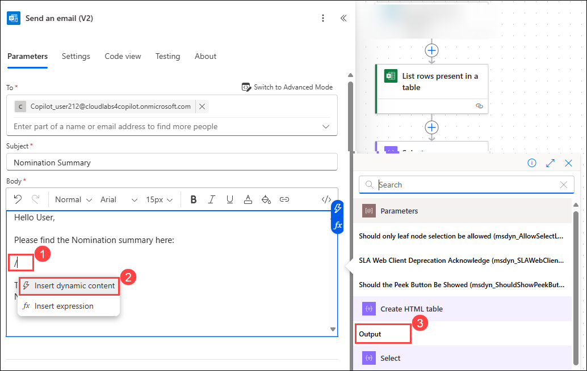

30. Once you’ve inserted the **Output** from the **Create HTML table** into the **Body** section of **Send an Email (V2)**, your final email body should match the one shown in the provided screenshot (make sure formatting, spacing, and dynamic content placement match exactly). After verifying the email body, click on the **Publish** button to save and apply the changes.

    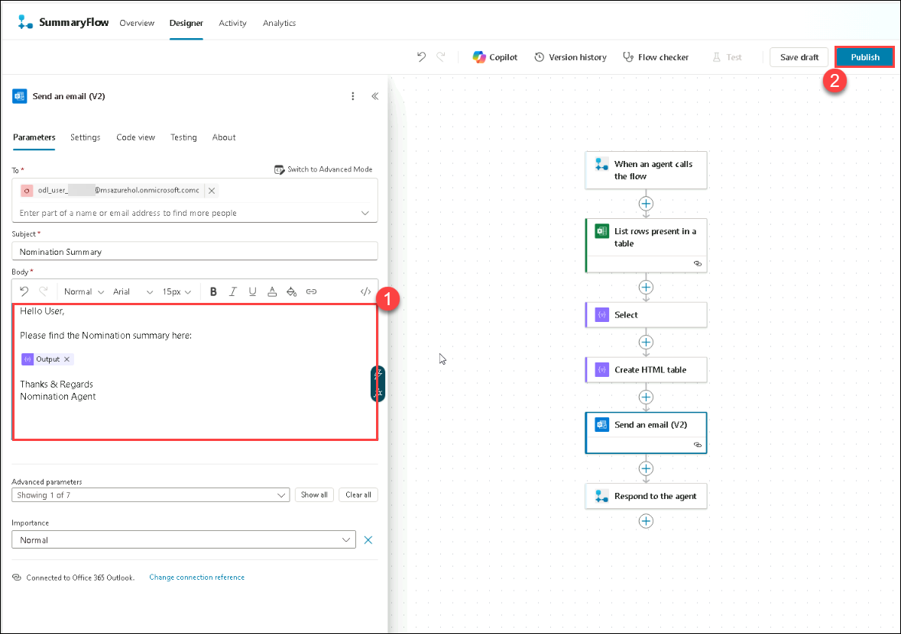

31. Navigate back to the **Agents** (1)page, and Select the **Nomination Agent** (2).

    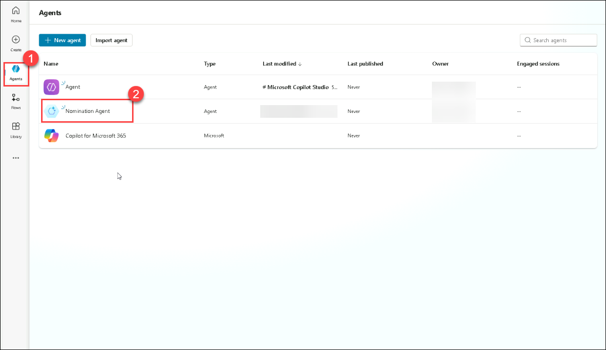

32. Click on **Topics**(1) tab and select **Generate Nomination Summary** (2).

    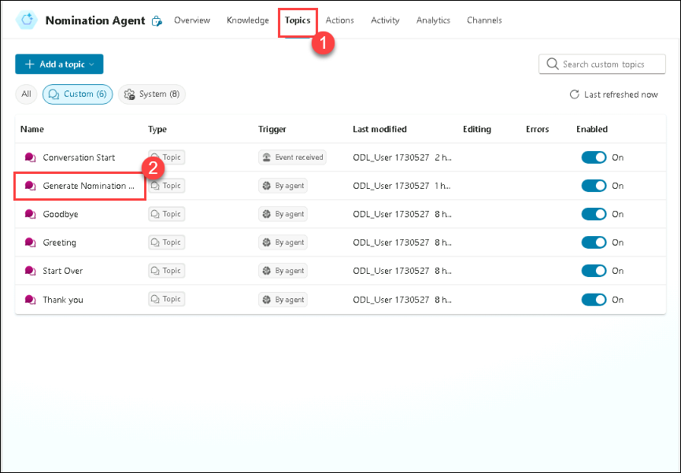

33. In the **Add a tool** section, use the search bar to find **SummaryFlow**, then select it to add it to the node.

    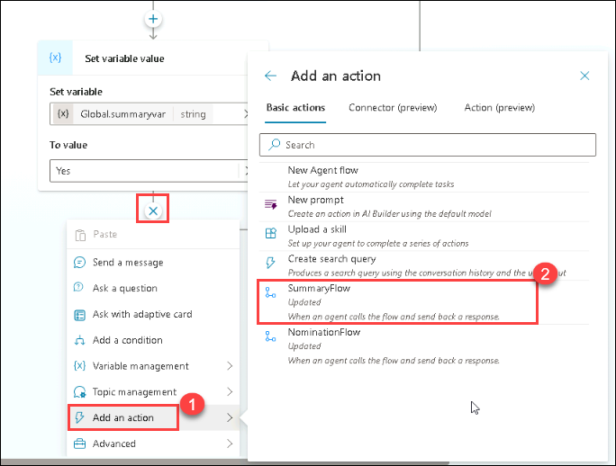

34. In the **Action** node, select the **summaryvar** variable on the action node for Power Automate input.

    

35. Under the **Action** node, click on **Add Node** **(1)**, then choose **Send a message** **(2)**.

    

36. In the **Send a message** node, enter the **below message** and select **Save**.

      ```
      Nomination Agent successfully sent the summary of the nomination to your email. Please check your email.

      Thanks & Regards
      Nomination Agent

      ```

       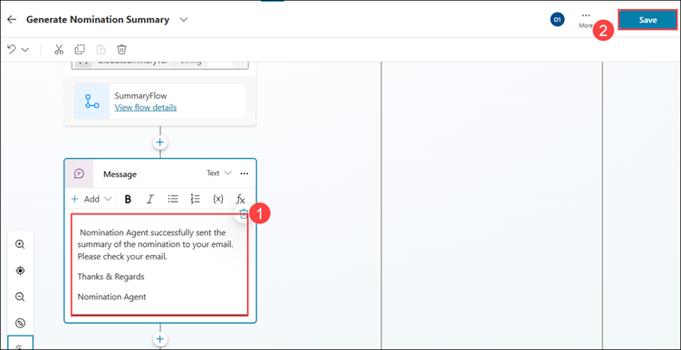

37. In the **Agent interface**, click on **Test (1)**. If a prompt appears asking **"Do you want to submit a Nomination?"**, select **No (2)**.
       
       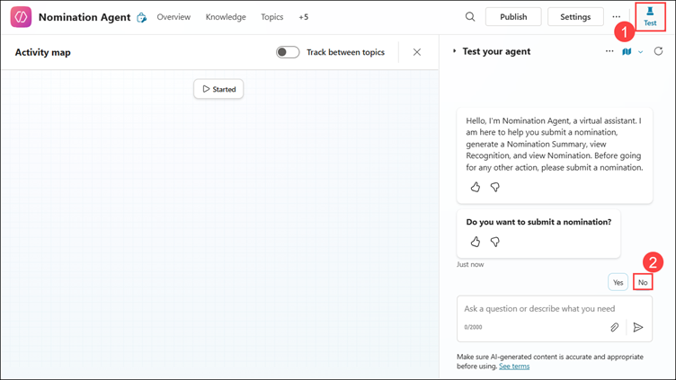

38.	In the **Test** section, type +++**Generate Nomination summary**+++ (1) in the test chat box and click the **Send** (2) button.

       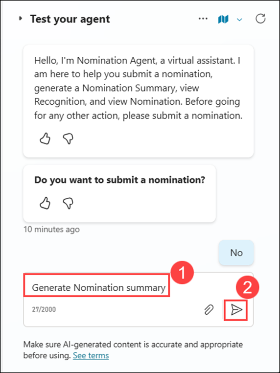

39.	Then the Agent will ask if you would like to generate a nomination summary. Select **Yes**.

       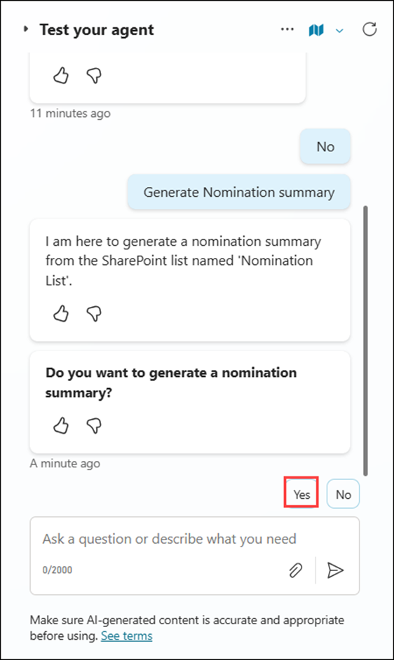

    >[!note] **Note:** If you see **Connect to continue for Office 365 Outlook and Excel Online (Business)**, follow the steps above, refresh the chat, and continue from **Step 35 to 37**; if not, proceed directly to **Step 38**.
    >
    >-	If prompted with Connect to** continue for Office 365 Outlook and Excel Online (Business)**, click on **Allow**.
    >
    >       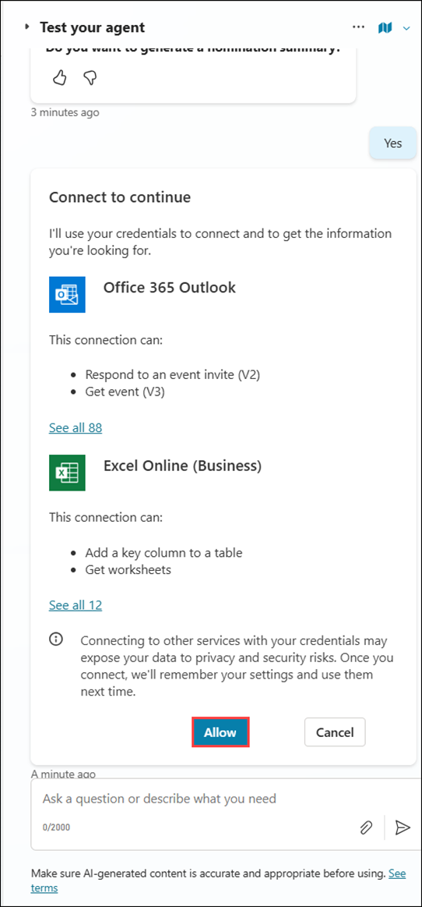
    >
    >-   If still unable to connect, click on **Open Connection Manager**, which will redirect you to **Manage your connections**.
    >
    >       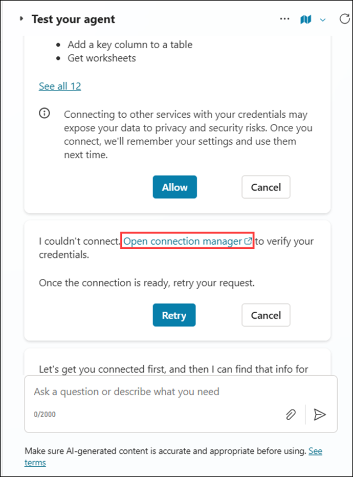
    >
    >-	In the **Manage your connections** section, click on **Connect** nect to the **NominationFlow**.
    >
    >       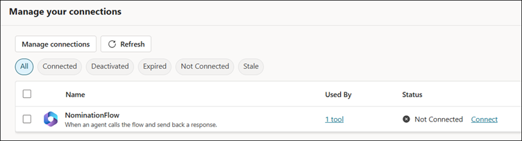
    >
    >-  In the pop-up to **Create or pick connections**, once you see **Connection succeeded**, click on **Submit**.
    >       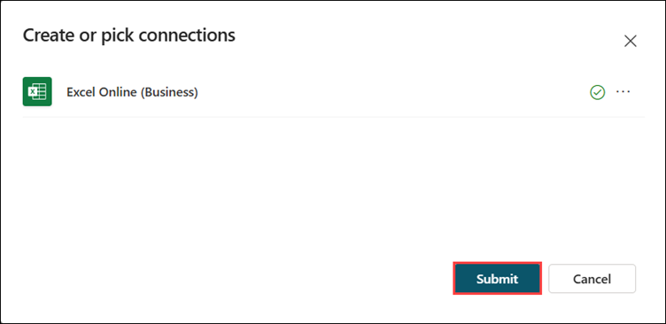

    >[!Note] **Note:** After selecting **"Yes"** in response to **"Generate Nomination Summary"**, if the confirmation message “Nomination Agent successfully sent the nomination summary to your email. Please check your email” does not appear and instead the **"Nomination Submission Form"** is displayed, kindly proceed by clicking **"Submit"** at the bottom of the form. If an error message appears after submission, it can be safely **disregarded**. Please retype **"Generate Nomination Summary"** in the chat to initiate the intended action. You should then see the confirmation message indicating that the **Nomination Summary has been sent successfully**.

    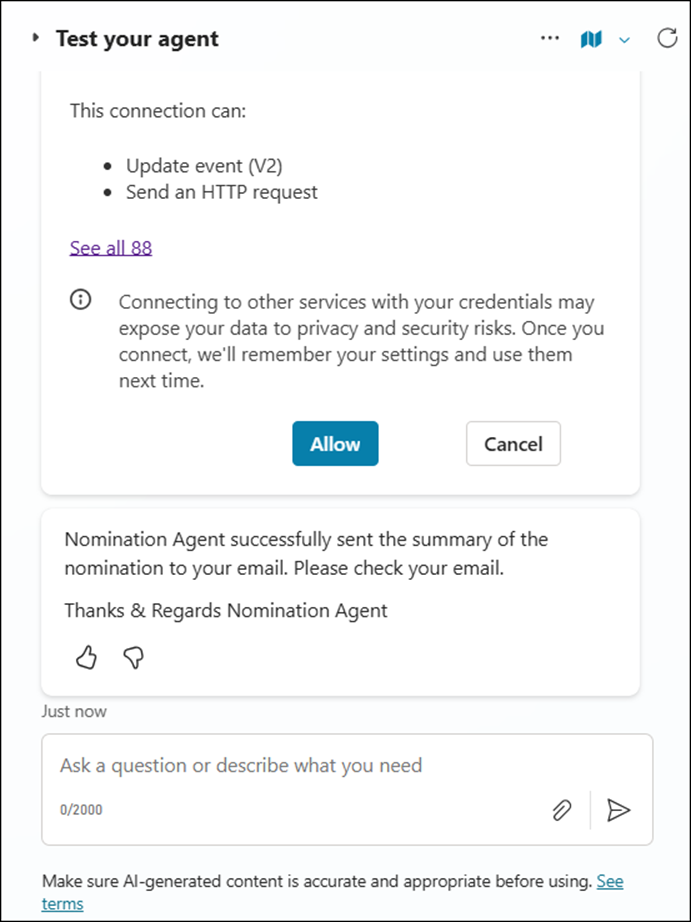

40.	Add a new tab in your Microsoft Edge browser and navigate to https://outlook.com to go to the **Outlook** home page. Click on **sign in**.

    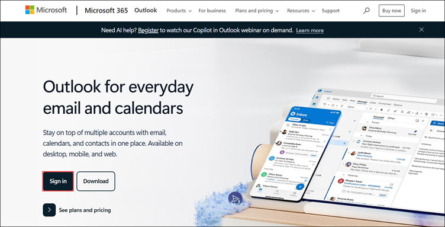

41.	On the **Sign into Microsoft Azure tab**, you will see a login screen. Enter the following email/username (1), and then click on **Next** (2).
    -   **Email/Username:**

        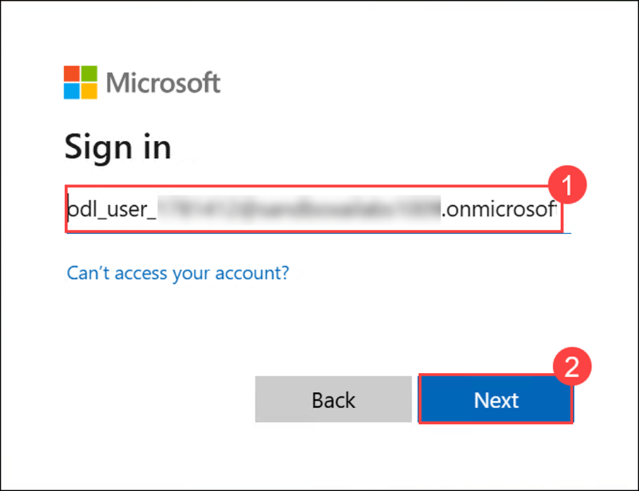

42.	Now enter the following password (1) and click on **Sign in** (2).

    -	**Password:**

        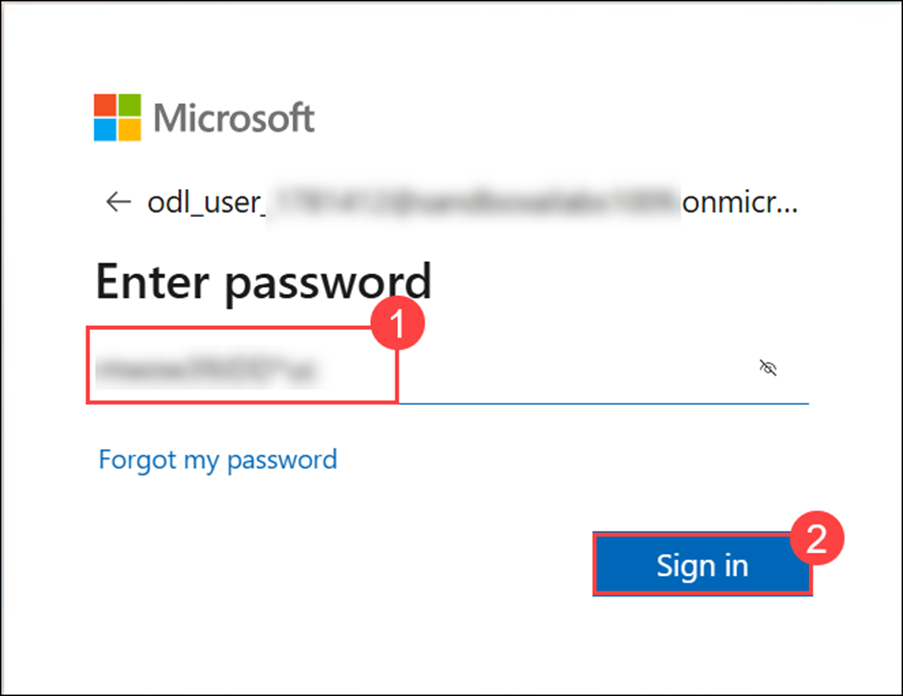

43.	If you see the pop-up **Stay Signed in?**, click **No**.

    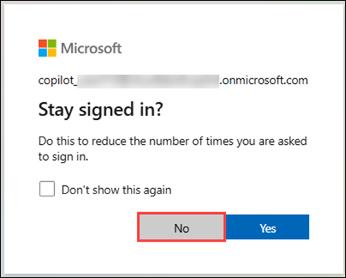

    >[!Note] **Note:** After signing in, if you see a pop-up titled **Copilot everywhere you need it**, simply close the window to continue.
    >
    >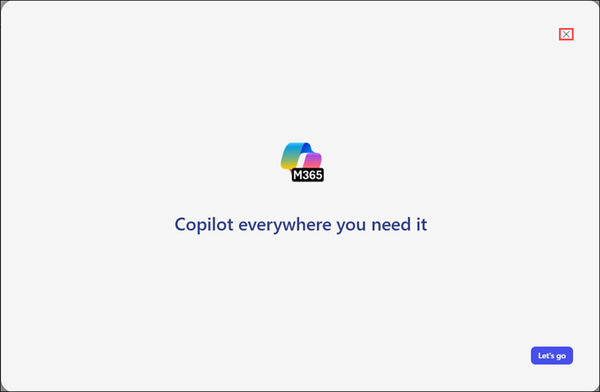

44.	You will get a message showing "Nomination Agent successfully sent the nomination summary to your email. Please check your email." Check the email of the current user. You will see the email from the agent

    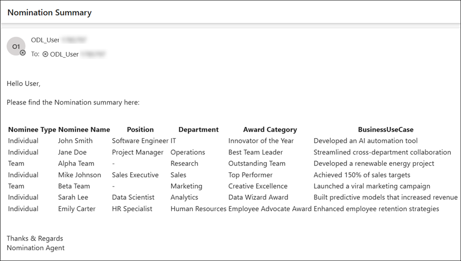

### Summary

You'll be able to manage and view nominations and recognitions, enhancing employee engagement and motivation. This lab equips you with the tools to efficiently acknowledge and celebrate contributions within your organization, leveraging Microsoft Copilot Studio's capabilities.

Completed successfully the tasks below:
- Generate a nomination summary.
