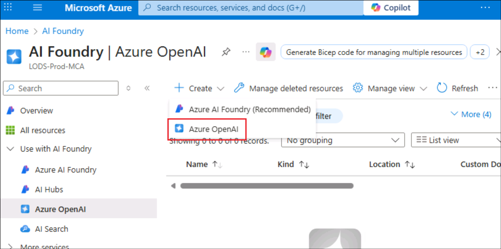
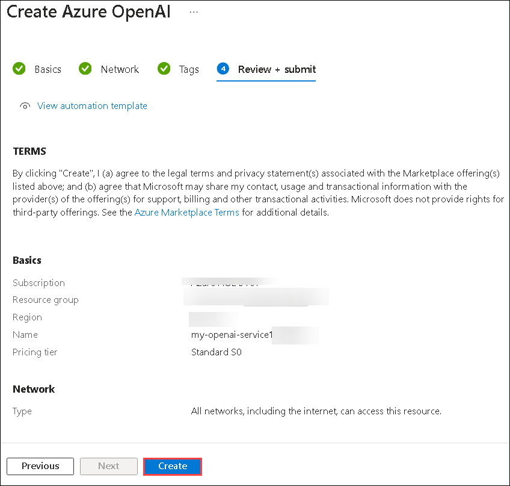
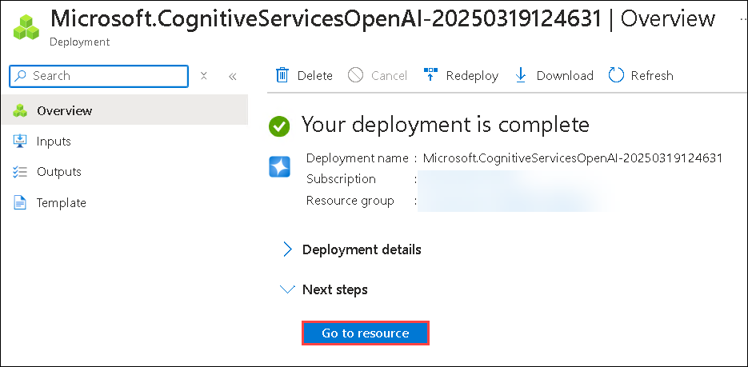
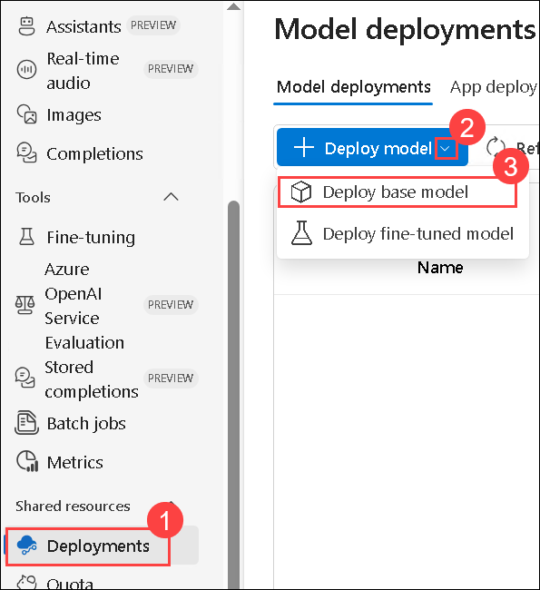
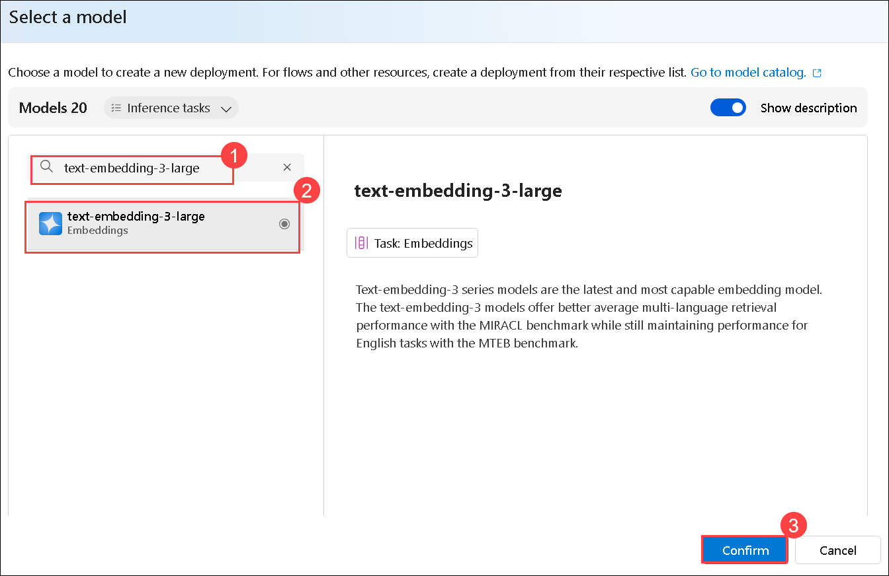
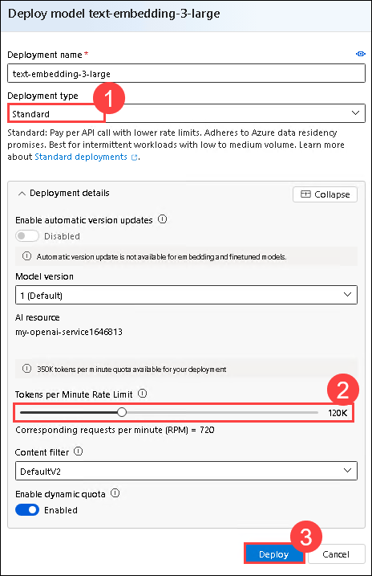
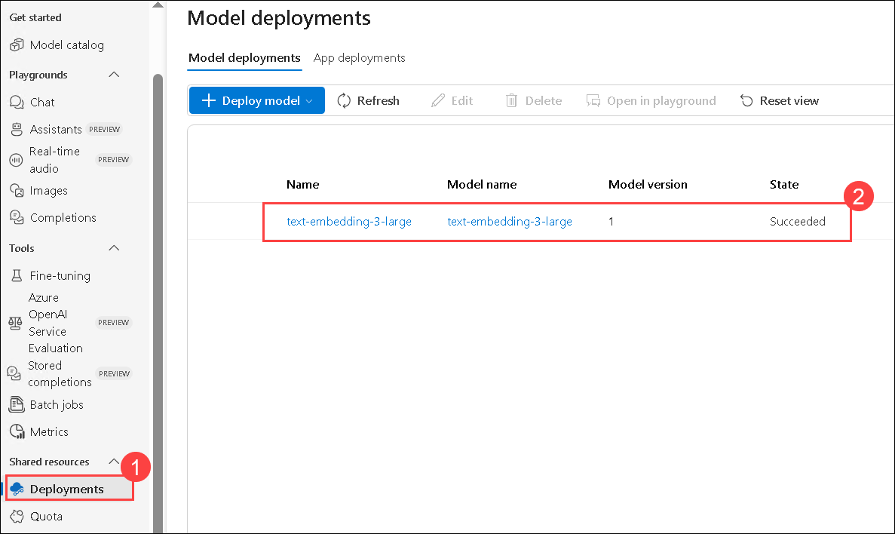
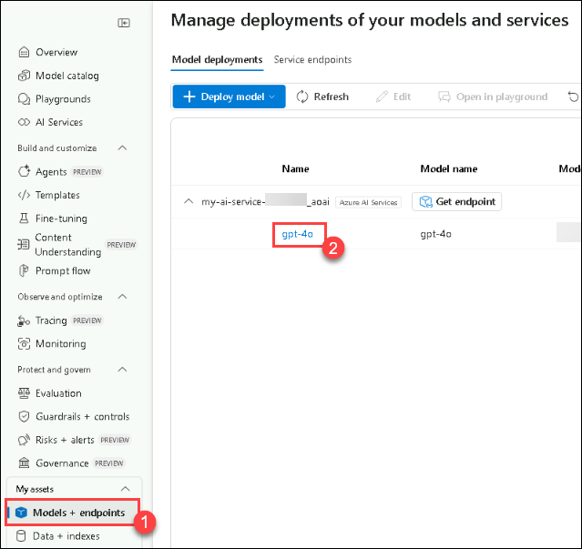
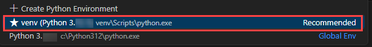

# Exercise 1: Setup AI Project and perform Chat Completion from VS Code
## Estimated duration : 120 minutes
## Lab scenario

In this hands-on lab, you will set up the necessary environment for building AI Agents. You will begin by configuring an AI Project in Microsoft Foundry, followed by deploying a Large Language Model (LLM) and embedding models. Next, you will establish connectivity from Visual Studio Code to the AI Project. Finally, you will perform a simple chat completion call to validate the setup.

## Lab Objectives

In this lab, you will perform:

- Task 1: Setting up the AI Project in the Microsoft Foundry
- Task 2: Deploying an LLM and embedding models
- Task 3: Install dependencies, create a virtual environment, and create an environment variables file

## Task 1: Setting up the AI Project in the Microsoft Foundry

In this task, you will create and configure an AI Project within Microsoft Foundry. This involves setting up the necessary resources, defining project parameters, and ensuring that the environment is ready for deploying AI models. By the end of this task, you will have a fully initialized AI Project, serving as the foundation for further development and experimentation.

1. Login to Azure Portal at +++https://portal.azure.com+++ using the below credentials.

	- Username - +++@lab.CloudPortalCredential(User1).Username+++
      
    - TAP - +++@lab.CloudPortalCredential(User1).TAP+++

3. In the Search resources box at the top of the portal, enter +++Microsoft Foundry+++, and then select Microsoft Foundry under Services.

    


4. In the left navigation pane for the AI Foundry, select **AI Hubs (1)**. On the AI Hubs page, click on **Create (2)** and select **Hub (3)** from the drop-down.

    

5. On the **Create an Azure AI hub** pane enter the following details:
   - Subscription : **Leave default subscription**
   - Resource Group :  **AgenticAI** (1)
   - Region : **East US** (2)
   - Name : +++ai-foundry-hub@lab.LabInstance.Id+++ (3) 
      
    

   - Connect AI Services incl. OpenAI : Click on **Create New (1)**.
   - Connect AI Services incl. OpenAI : Provide a name +++my-ai-service@lab.LabInstance.Id+++ **(2)**.  
   - Click on **Save (3)**, followed by **Next:Storage (4)**

    
   
6. Click on **Review + Create** tab followed by **Create.**

    

    
  
7. Wait for the deployment to be completed and then click on **Go to resource**.

    

8. On the Overview pane, click on **Launch Microsoft Foundry**. This will navigate you to the Microsoft Foundry portal.

    

9. Select **+ New project** on the Hub Overview.

    

10. Provide the project name as +++ai-foundry-project@lab.LabInstance.Id+++ then select **Create (2)**.

    

11. Once the project is created, copy the **Project connection string**, then paste it into Notepad or a secure location, as they will be required for upcoming tasks.

    


   
## Task 2: Deploying an LLM and embedding models

In this task, you will deploy a large language model (LLM) and an embedding model within your Microsoft Foundry project. These models will be used for AI-driven applications and vector-based search capabilities in upcoming labs.

1. In your **AI Foundry project**, navigate to the **My assets (1)** section, then select **Models + endpoints (2)**. Click **Deploy model (3)**, and choose **Deploy base model (4)** to proceed.

    

1. On a **Select a model** window, search for **gpt-4o (1)**, select **gpt-4o (2)** and select **Confirm (3)**

    

1. On **Deploy model gpt-4o** window, select **Customize**.

    

      - Deployment Name: **gpt-4o (1)**
      - Deployment type: **Global Standard (2)**
      - Change the **Model version to 2024-08-06 (Default) (3)**
      - Change the Tokens per Minute Rate Limit to **200K (4)**
      - Click on **Deploy (5)**

       

1. Click on **Model + Endpoints (1)**, there you can see the deployed **gpt-4o (2)** model.

    

1. Navigate back to **Azure Portal** and search for **+++Open AI+++ (1)** and select **Azure Open AI (2)** resource.

    

1. On the **AI Foundry | Azure OpenAI** page, select **+ Create -> Azure OpenAI** to create Azure OpenAI resource.

    
   
1. On **Create Azure OpenAI** page, provide the following settings and select **Next (6)**:

      | Setting | Value | 
      | --- | --- |
      | Subscription | Keep the default subscription **(1)** |
      | Resource group | **AgenticAI (2)** |
      | Region | **East US (3)** |
      | Name | +++my-openai-service@lab.LabInstance.Id+++ **(4)** |
      | Pricing tier | **Standard S0 (5)** |

    

1. Select **Next** until Review + submit tab appears.

1. On the **Review + submit** page, select **Create**
 
    

1. Wait until the deployment succeeds, then select **Go to resource**.

    

1. On the **my-openai-service** resource page, select **Go to Azure AI Foundry portal**.

    

1. In your AI Foundry project, navigate to the **Shared resources** section, then select **Deployments (1)**. Click **Deploy model (2)**, and choose **Deploy base model (3)** to proceed.

    

      > **Note**: The import and vectorize wizard in Azure AI Search, which will be used in subsequent labs, does not yet support text embedding models within your AI Foundry project. Because of this, we need to create an Azure OpenAI service and deploy a text embedding model there. We will use this text embedding model later when we create our vector index.

1. On a **Select a model** window, search for **text-embedding-3-large (1)**, then select **text-embedding-3-large (2)** and select **Confirm (3)**

    

1. On **Deploy model text-embedding-3-large** window, 

      - Deployment type: Select **Standard (1)**
      - Tokens per Minutes Rate Limit: **120K (2)**
      - Select **Deploy (3)** to deploy the model.

	

1. Click on **Deployment (1)**, you can see the deployed **text-embedding-3-large (2)** model.

    


## Task 3: Install dependencies, create a virtual environment, and create an environment variables file

In this task, you will install the required dependencies, set up a virtual environment, and create an environment variables file. This ensures a controlled development environment and securely manages configuration settings for your AI project.

1. On your **Lab VM**, launch **Visual Studio Code**.

1. Click on **File (1)**, then **Open Folder**.

     

1. Navigate to `C:\LabFiles\Day-2` **(1)**, select the **azure-ai-agents-labs (2)** folder and then click on **Select folder (3)**.

     

1. Click on **Yes, I Trust the authors**,

    

1. Click on the **elipses(...) (1)**, then **Terminal (1)** and then **New Terminal (3)**.

    

1. Make sure your in **azure-ai-agents-labs** project directory. Run the below powershell commands to create and activate your virtual environment:

      ```powershell
      python -m venv venv
      venv/Scripts/activate
      ```

    

1. Run the below powershell command. This installs all the required packages:

      ```powershell
      pip install -r requirements.txt
      pip install azure-ai-ml azure-identity
      ```
    

1. Run the below powershell command to  install or upgrade pip to the latest version.

      ```powershell
      python.exe -m pip install --upgrade pip
      ```

    

1. Run the below command to log into your Azure account.

      ```
      az login
      ```

1. Select the **Work or School account** and login using your credentials.

    

1. Once the Authorization is completed, navigate back to the Visual studio code.

    

1. Open the **Sample.env** file and provide the necessary environment variables. 

    

      - Navigate to Microsoft Foundry portal, click on **gpt-4o(2)** model from the **Models + endpoints(1)** section under My assets, copy the under **Endpoint** from right pane, copy and paste the **Target URI (1)** and **Key (2)** in a notepad
      
    
	
    

1. On the **Sample.env** file,

      - `AIPROJECT_CONNECTION_STRING`: Provide **Project connection string** value you have copied in step 9 of Task 1
      - `CHAT_MODEL_ENDPOINT`: Provide the **Target URI** of **gpt-4o** model you have copied in the previous step
      - `CHAT_MODEL_API_KEY`: Provide the **Key** value of **gpt-4o** model you have copied in the previous step
      - `CHAT_MODEL`: **gpt-4o**

    

1. Save changes to the **Sample.env** file.

1. Run the below powershell command. This creates your **.env** file:

      ```powershell
      cp sample.env .env
      ```

       

1. Later Open the **Lab 1 - Project Setup.ipynb** file. The **Lab 1 - Project Setup.ipynb** notebook guides you through setting up an AI Project in Microsoft Foundry, deploying an LLM and embedding models, and configuring VS Code connectivity. It also includes a simple Chat Completion API call to verify the setup. Running this notebook ensures that your environment is correctly configured for developing AI-powered applications. 

    

1. Select the **Select kernel (1)** setting available in the top right corner and select **Install/enable selected extensions (python+jupyter) (2)**.

    

1. Select **Python Environments** to ensure that Jupyter Notebook runs in the correct Python interpreter with the necessary dependencies installed. 

    

1. Select **venv (Python 3.x.x)** from the list as this version is likely required for compatibility with Microsoft Foundry SDK and other dependencies.

    

      > **Note:** If **venv (Python 3.x.x)** does not appear in the list. Close and Open the Visual studio code. 

1. Run the first cell to import necessary Python libraries for working with Azure AI services.   

    

1. Run the below cell to retrieve the project connection string and model name from environment variables. These values are needed to interact with the Large Language Model (LLM) securely, without hardcoding sensitive information.

    

1. Run the below cell to connect to your Microsoft Foundry project using the connection string. This establishes a secure connection with AIProjectClient, enabling interactions with your project resources.

    

1. Run the below cell to interact with the GPT-4o model using your Microsoft Foundry project. This code initializes a chat client, sends a request for a joke about a teddy bear, and prints the response. Finally see the output provided from the chat model.

    

## Review

In this lab, you have accomplished the following:
- Set up the AI Project in Microsoft Foundry.
- Deployed an LLM and embedding models.
- Established connectivity from VS Code to the AI Project.
- Performed a simple Chat Completion call.

### You have successfully finished the lab. Select **Next** to continue to the next lab.
