# Exercise 3: Develop a multi-agent system

## Estimated time: 30 minutes

## Lab scenario

In this lab, you will be creating a multi-agent system consisting of 4 agents working together to generate reports about health plan documents. You will build these 4 AI Agents:

- **Search Agent** - This agent will search an Azure AI Search index for information about specific health plan policies.
- **Report Agent** - This agent will generate a detailed report about the health plan policy based on the information returned from the Search Agent.
- **Validation Agent** - This agent will validate that the generated report meets specified requirements. In our case, making sure that the report contains information about coverage exclusions.
- **Orchestrator Agent** - This agent will act as an orchestrator that manages the communication between the Search Agent, Report Agent, and Validation Agent.

  

Orchestration is a key part of multi-agentic systems since the agents that we create need to be able to communicate with each other in order to accomplish the objective.

We'll use the Azure AI Agent Service to create the Search, Report, and Validation agents. However, to create the Orchestrator Agent, we'll use Semantic Kernel. The Semantic Kernel library provides out-of-the-box functionality for orchestrating multi-agent systems.

## Lab Objective

In this lab, you will complete the following tasks:

- Task 1: Create the Azure AI Search Index
- Task 2: Create the Search, Report, and Validation Agents.

## Task 1: Create the Azure AI Search Index

In this task, you will create an **Azure AI Search index** to store vectorized representations of health insurance plan documents, enabling efficient retrieval for AI-driven search and analysis.

1. Navigate to **Azure portal**, search for **AI Search (1)** and select **AI Search (2)** resource from the services.

   

1. This will navigate you to the AI Foundry, within **AI Search** (1), click on **Create**(2).

   

1. On the **Create a Search service** pane enter the following details and click on **Review + Create** (4)

   - Subscription : **Leave default subscription**
   - Resource Group : Select **AgenticAI (1)**
   - Service Name : **my-search-service-<inject key="Deployment ID" enableCopy="false"></inject> (2)**
   - Location : **<inject key="Region" enableCopy="false"></inject>** **(3)**

      

1. On the **Review + Create**, click on **Create**

   

1. Wait for until the deployment is completetd and then click on **Go to resource**

   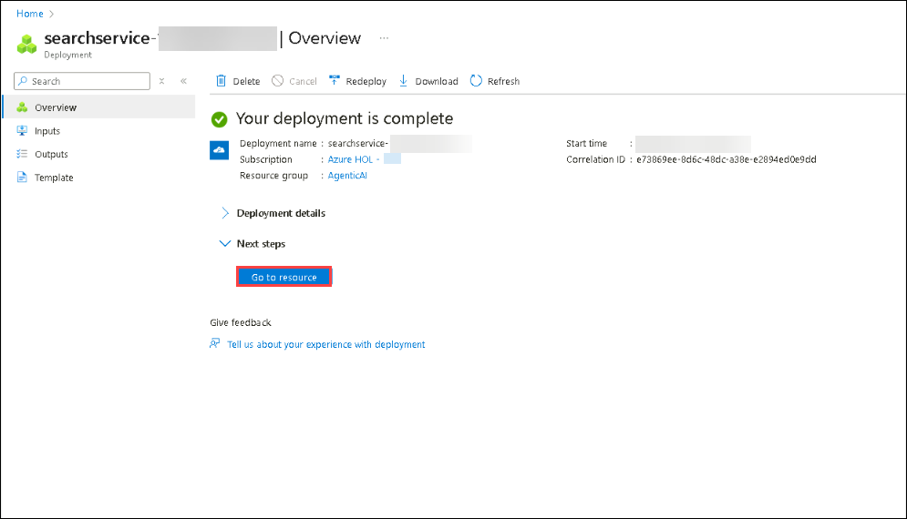

1. Navigate to **Keys (1)** under **Settings** in the left menu. Under **API Access control** select **Both(2)**.

   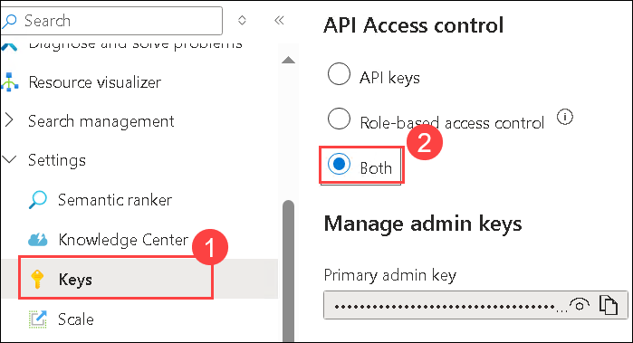

1. Select **Yes** for **Are you sure want to update the API Access Control for this serach service**.

   

1. Navigate to **Identity(1)** under **Settings**. Under System-assigned set the Status to **On(2)** and click on **Save(3)**.

   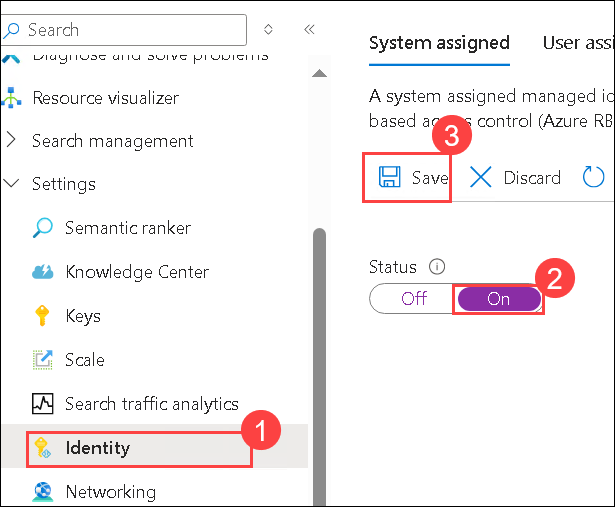

1. Select **Yes** for **Enable System assigned managed identity**.

   

1. On the Azure portal, search for **Storage accounts (1)** and select **Storage accounts (1)** from the services.

   

1. Select the storage account that begins with **aifoundry**.

   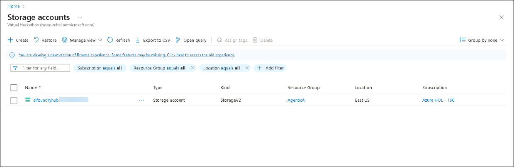

1. Select **Access control (IAM) (1)**, then click on **Add(2)**, and then select **Add role assignment**.

   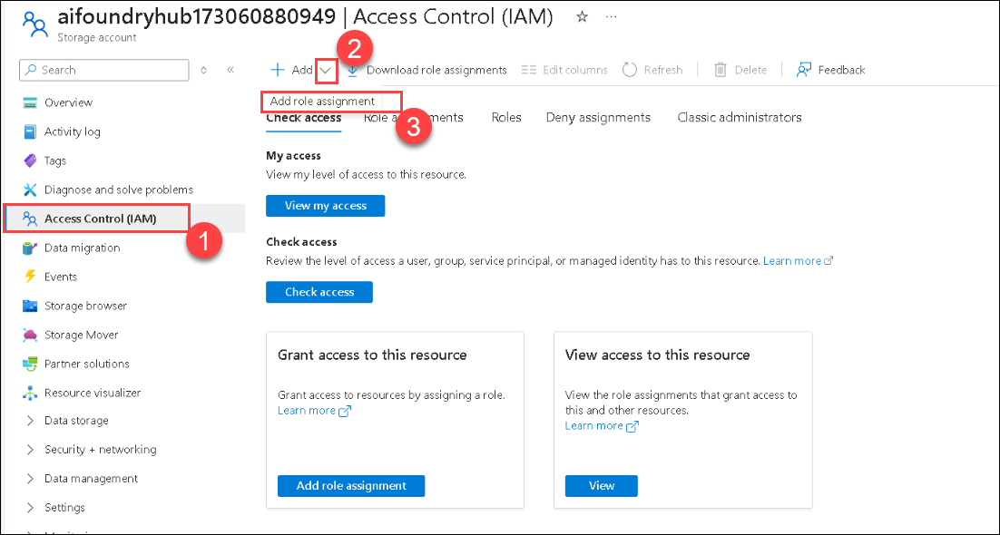

1. Under **Job function roles**, search for **Storage Blob Data Reader (1)**, select **Storage Blob Data Reader (2)**, and then select **Next (3)**.

   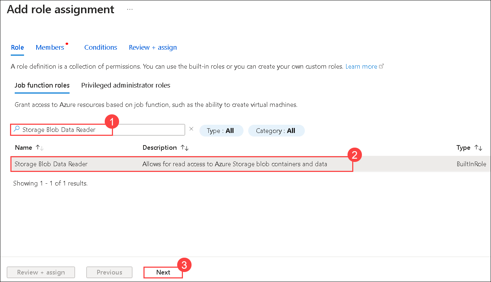

1. On the **Add role assignment** page,

   - Under Members, select **Managed identity(1)**
   - Select **Members (2)**
   - Managed identity: **search service(1)** **(3)**
   - Then select **my-search-service-<inject key="Deployment ID" enableCopy="false"></inject>**(4) search service.
   - Click on **Select (5)**

       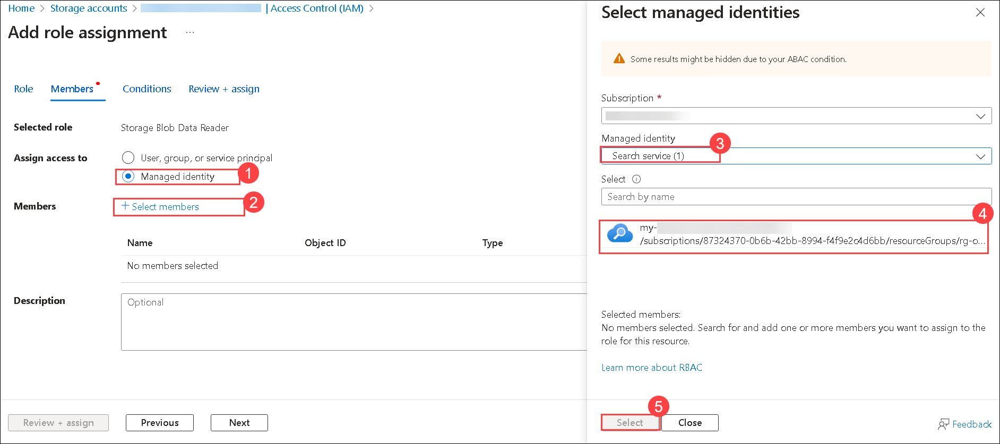

1. Click on **Review + assign** twice.

    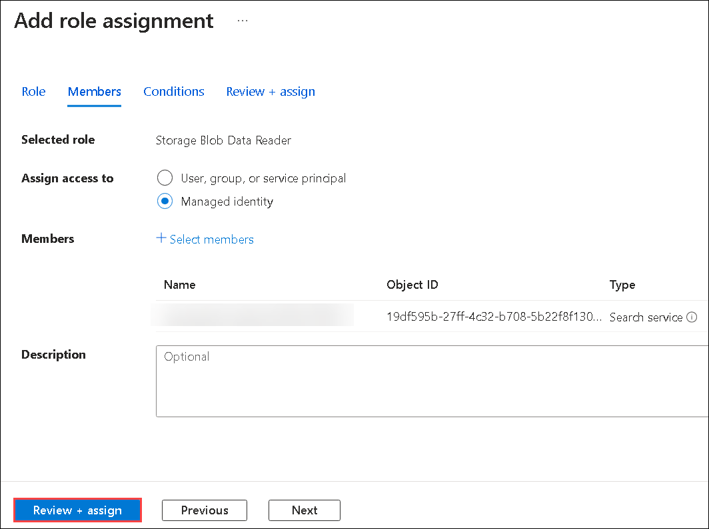

1. Go to the **Azure OpenAI**, **my-openai-service<inject key="DeploymentID" enableCopy="false" /></inject>**.

   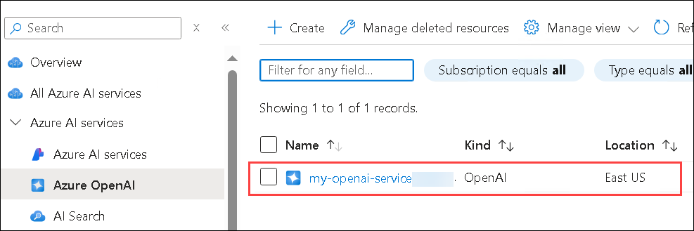

1. Select **Access control (IAM) (1)**, then click on **Add(2)**, and then select **Add role assignment**.

   

1. Under **Job function roles**, search for **Cognitive Services OpenAI User (1)**, select **Cognitive Services OpenAI User (2)**, and then select **Next (3)**.

   

1. On the **Add role assignment** page,

   - Under Members, select **Managed identity(1)**
   - Select **Members (2)**
   - Managed identity: **search service(1)** **(3)**
   - Then select **my-search-service-<inject key="Deployment ID" enableCopy="false"></inject>**(4) search service.
   - Click on **Select (5)**

       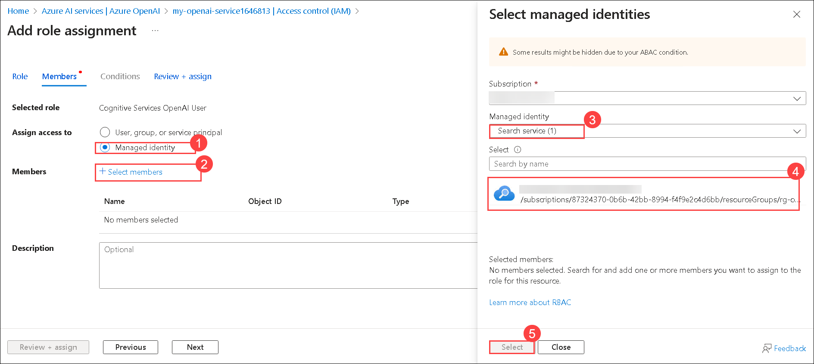

1. Select **Review + assign** twice.

    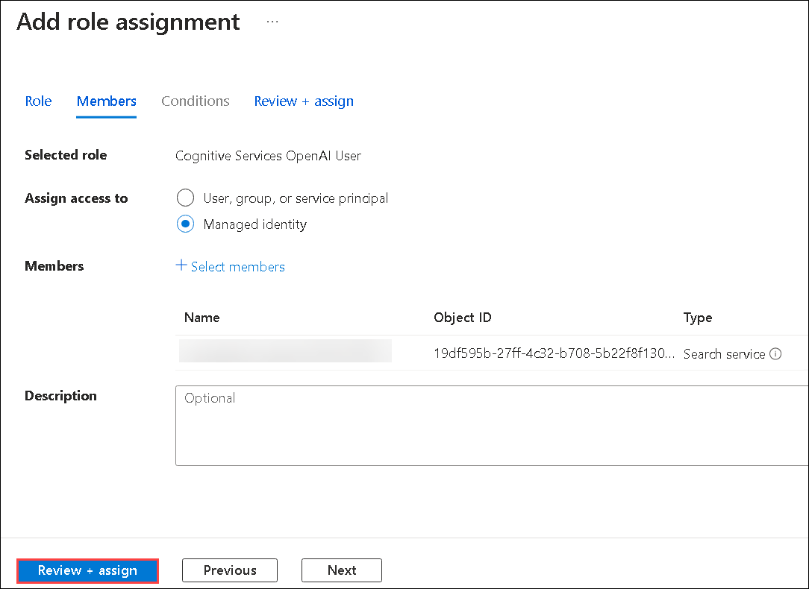

1. Navigate to **Azure Portal**, search for **Storage account (1)** and select the **Storage account (2)**.

   

1. Select the Storage account that starts with **aifoundryhub**.

   

1. Click on **Containers (1)** under data storage, then select **+Container(2)**.

   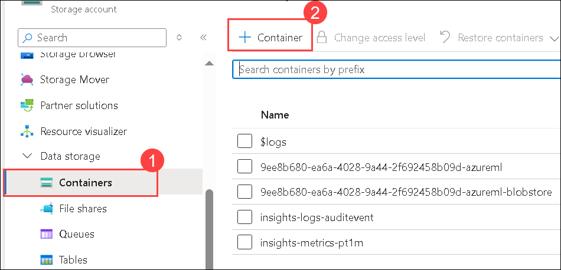

1. On New Container page enter **`healthplan`(1)** as name and click on **Create (2)**.

   

1. Open **healthplan** container by clicking on it.

   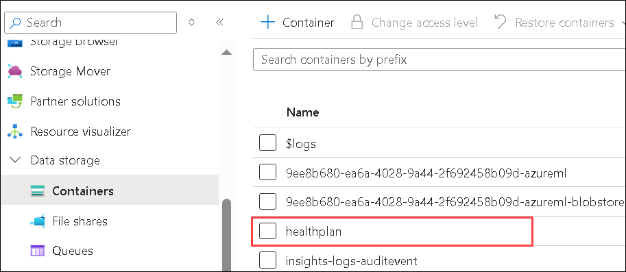

1. Click on **upload (1)** to upload the file and then Click on **browse for files (2)**.

   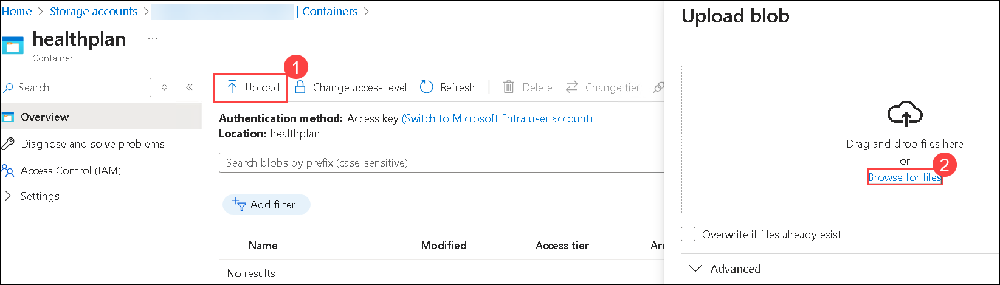

1. Navigate to `C:\LabFiles\Day-2-Azure-AI-Agents\azure-ai-agents-labs\data` **(1)** and select both the PDFs to upload **(2)**, and click on **Open (3)**.

   

1. Click on **Upload**.

1. Navigate to **Azure AI search** service and select **my-search-service-<inject key="Deployment ID" enableCopy="false"></inject>**.

    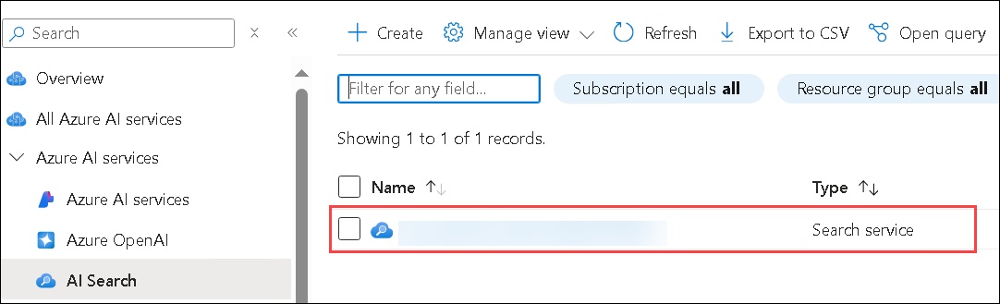

1. Click on **import and vectorize data**.

    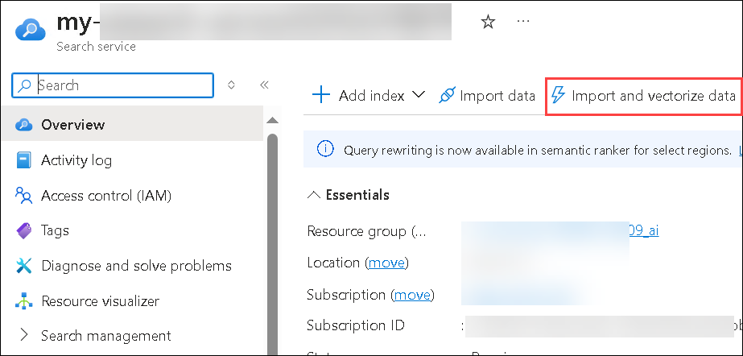

1. Select **azure blob storage**.

    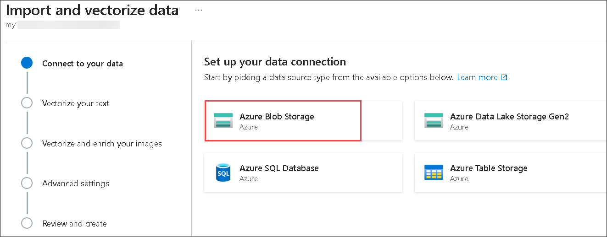

1. Choose **RAG** Model.

   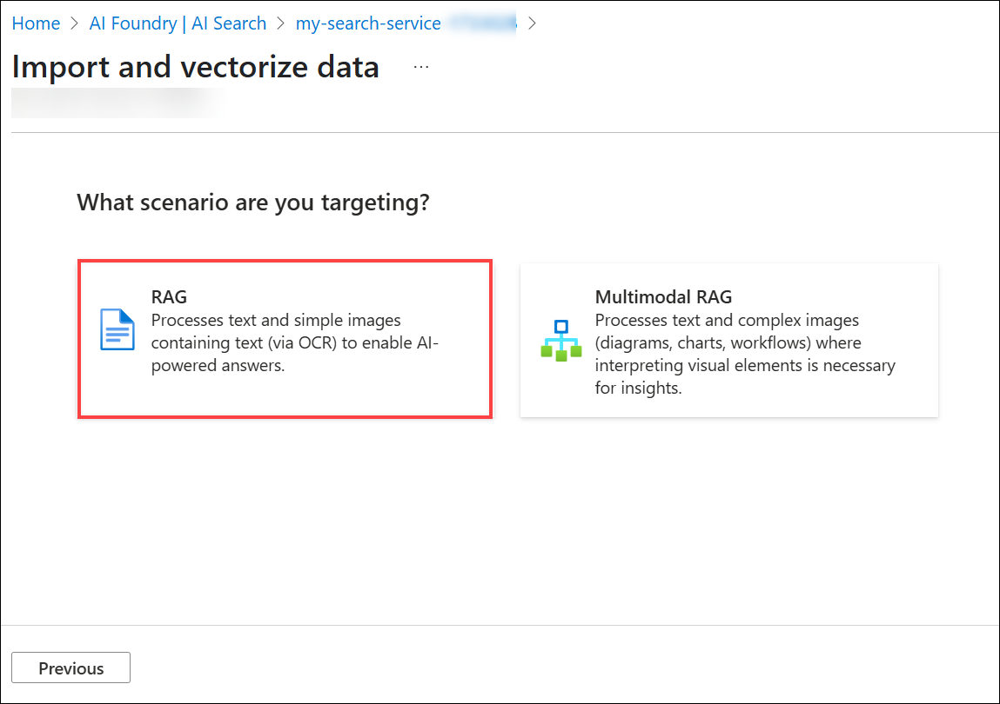

1. On Configure your Azure Blob Storage , enter the following details and click on **Next(5)**:
   |Setting|Value|
   |---|---|
   |Subscription|Leave it as default **(1)**|
   |Storage account|select the storage account **aifoundryhubxxxxx** (2)|
   |Blob container|**healthplan**(3)|
   |Management identity type|**System-assigned**(4)|

      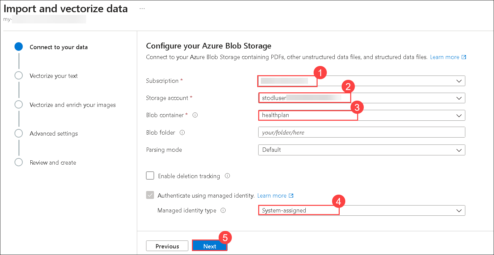

1. On Vectorize your text, enter the following details and click on **Next (7)**:
   |Setting|Value|
   |---|---|
   |Kind|**Azure OpenAI (1)**|
   |Subscription|leave it default **(2)**|
   |Azure OpenAI service|**my-openai-service<inject key="DeploymentID" enableCopy="false" /></inject>** **(3)**|
   |Model deployment|**text-embedding-3-large** **(4)**|
   |Authentication type|**System assigned identity** **(5)**|
   |Acknowledgement rectangle|**Checked** **(6)**|

      

1. Click on **Next** twice.
1. Enter **health-plan (1)** for **Objects name prefix** and click on **Create (2)**.

      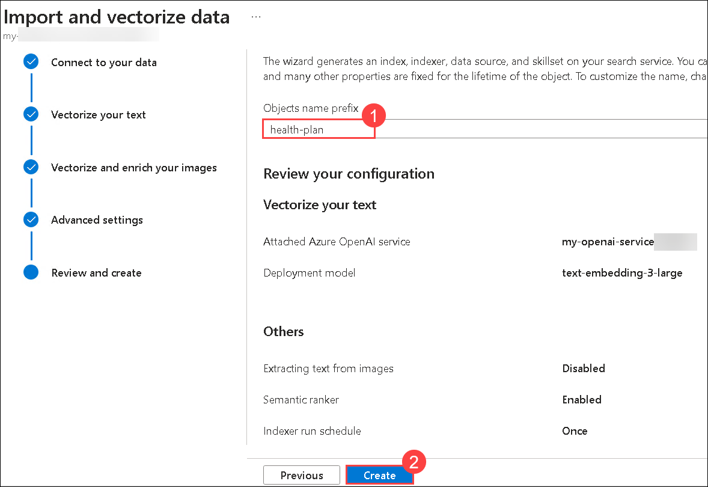

     > **Note**: The uploading of data to indexes in search service might take 5-10 minutes.

1. Navigate to your **Overview** (1) page of **ai-foundry-project-<inject key="Deployment ID" enableCopy="false"></inject>**. and click on **Open In management center**(2).

   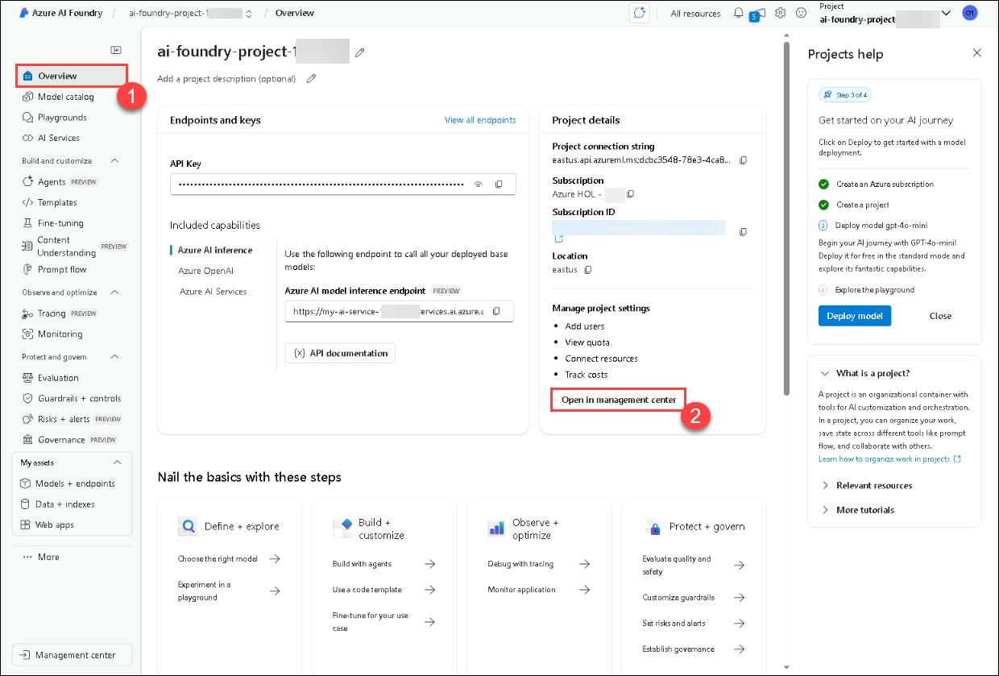
1. Select **Connected resources** (1) and click on **New connection** (2).

   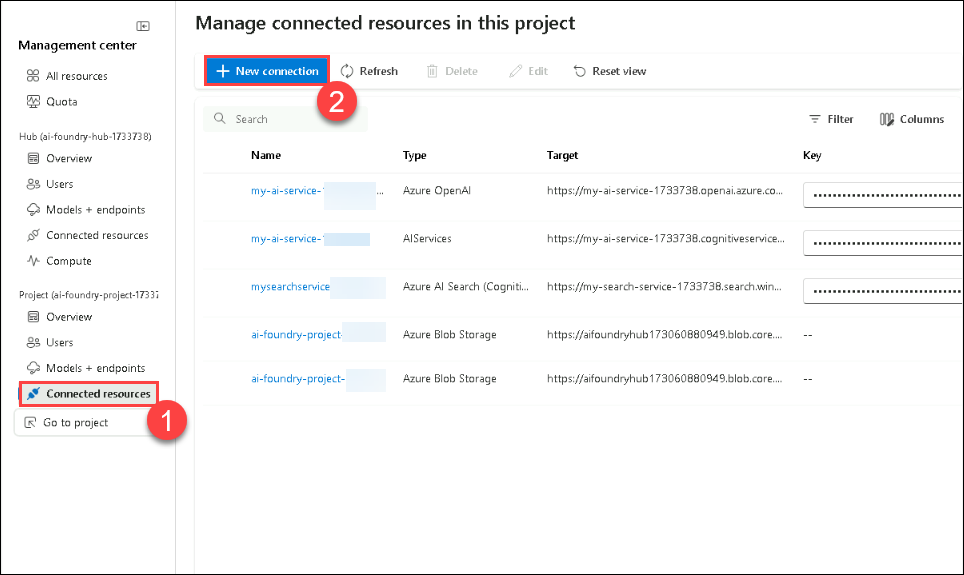
1. Enter **Azure AI Search**(1) in search bar and select **Azure AI Search**(2).

   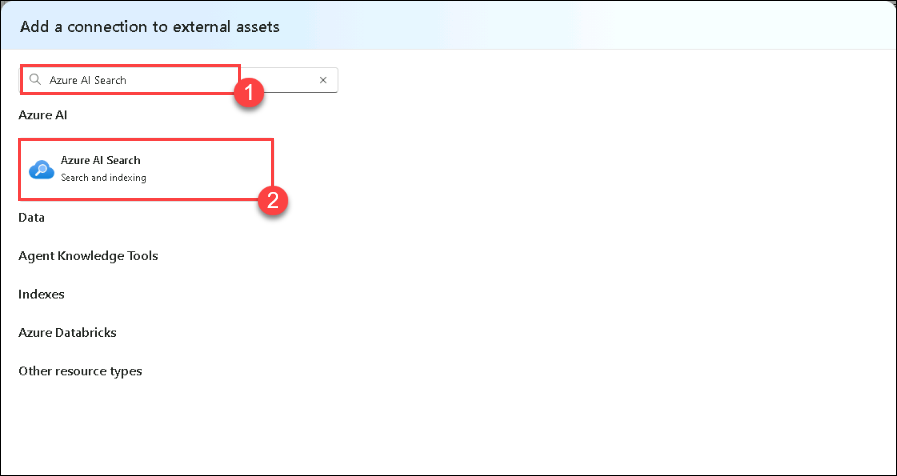
1. Click on **Add connection** to proceed.

   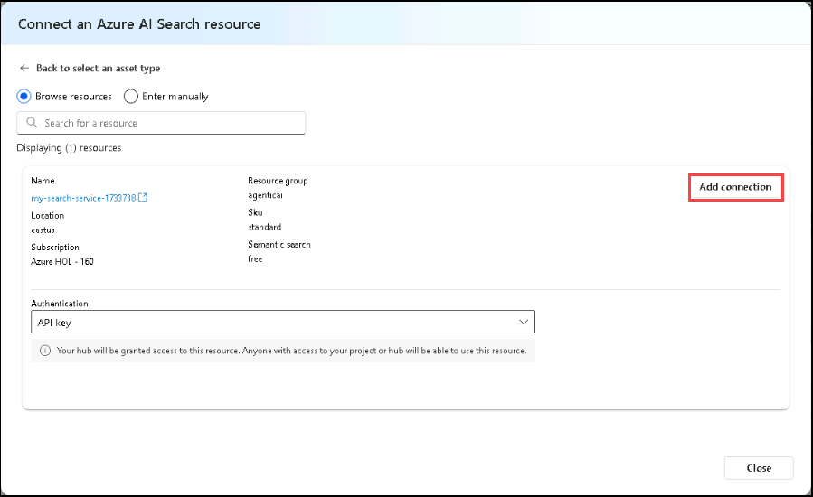

> **Congratulations** on completing the task! Now, it's time to validate it. Here are the steps:
> - Hit the Validate button for the corresponding task. If you receive a success message, you can proceed to the next task. 
> - If not, carefully read the error message and retry the step, following the instructions in the lab guide. 
> - If you need any assistance, please contact us at cloudlabs-support@spektrasystems.com. We are available 24/7 to help you out.

  <validation step="c17f22af-8d87-4475-9768-4560c242c690" />   

## Task 2: Create the Search, Report, and Validation Agents

In this task, you will create the Search, Report, and Validation Agents to retrieve, generate, and validate health plan reports. These agents will work together to ensure accuracy and compliance with requirements. Each agent plays a distinct role in retrieving, compiling, and ensuring the accuracy of the reports.

1. Open the **Lab 4 - Develop A Mult-Agent System.ipynb** file, this **Lab 4 - Develop A Mult-Agent System.ipynb** notebook guides you through developing a multi-agent system with Search, Report, Validation, and Orchestrator Agents to generate and validate health plan reports. Each agent plays a distinct role in retrieving, compiling, and ensuring the accuracy of the reports.

      

1. Select the **Select kernel (1)** setting available in the top right corner and select **venv (Python 3.x.x) (2)** from the list.

      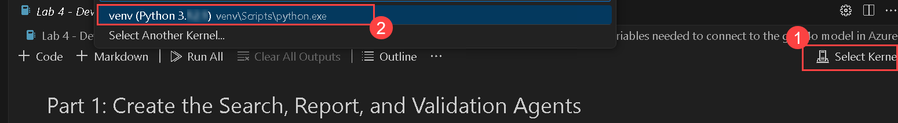

1. Run this cell to develop a **multi-agent system** that integrates Azure AI Search, GPT-4o, and Semantic Kernel for intelligent task execution. This setup enables multiple AI agents to collaborate on retrieving information, generating responses, and handling complex queries.

      

1. Run this cell to create the **Search Agent**, which retrieves health plan details from Azure AI Search using GPT-4o. This agent enables efficient retrieval of structured information from health plan documents.

      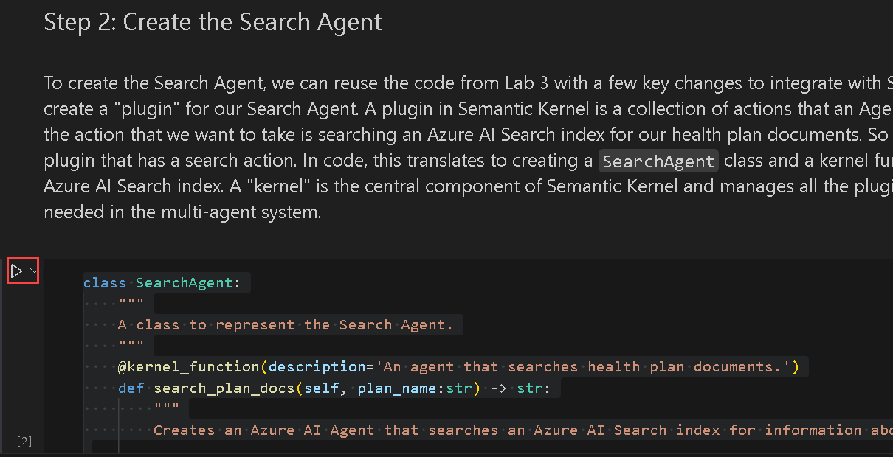

1. Run this cell to create the **Report Agent**, which generates detailed reports on health plans using GPT-4o. This agent enhances documentation by providing structured insights, coverage details, and exclusions for various plans.

      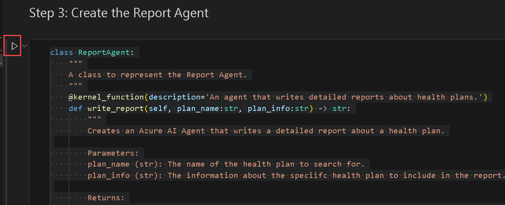

1. Run this cell to create the **Validation Agent**, which ensures that reports generated by the Report Agent meet quality standards, specifically checking for coverage exclusions.

      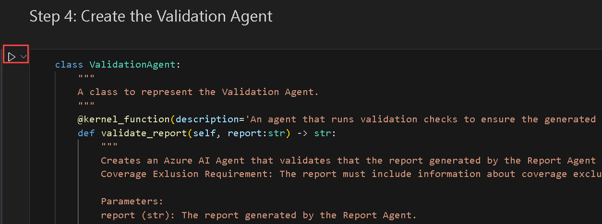

1. Finally observe the output.

      

1. **Create a multi-agent system** : When you run the below cell, you will see a chat box pop up at the top of VS Code asking you to input the name of a health plan.

      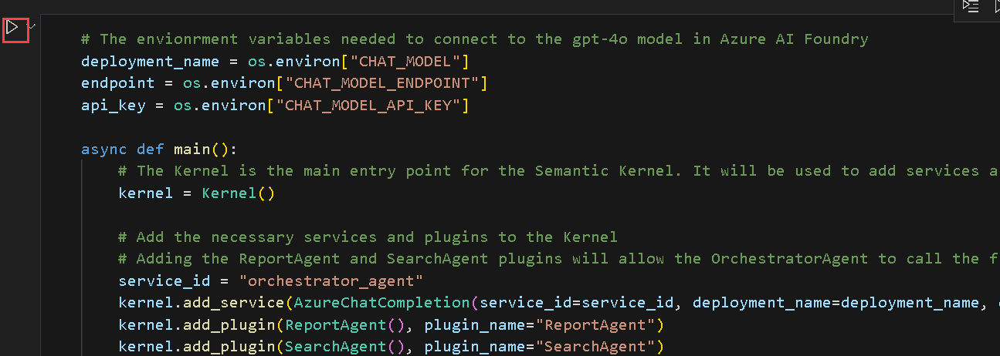

1. If you recall, we uploaded two health plans to the search index. Type one of the following health plans in the box and press enter to begin running the multi-agent system:

    - Northwind Health Standard
    - Northwind Health Plus

      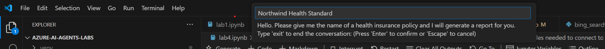

        > **Note**: After the successful run of the cell you will recieve the following outcome.

         ```
         Orchestrator Agent is starting...
         Calling SearchAgent...
         SearchAgent completed successfully.
         Calling ReportAgent...
         ReportAgent completed successfully.
         Calling ValidationAgent...
         ValidationAgent completed successfully.
         The report for Northwind Plus has been generated. Please check the Northwind Plus Report.md file for the report.
         Orchestrator Agent is starting...
         ```

1. Type `exit` the box and press enter to stop the running the code block.

## Review

In this lab, you have accomplished the following:

- Created the Search, Report, and Validation Agents.

## You have successfully completed the lab.
