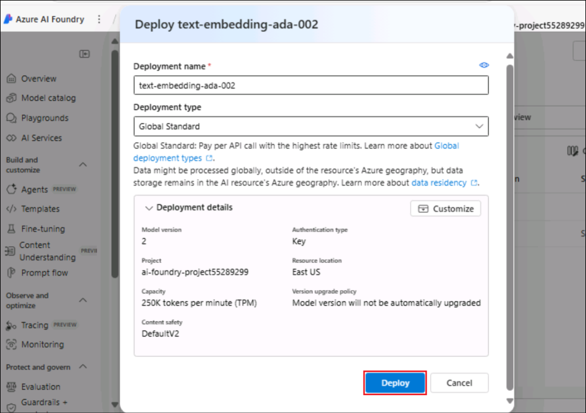
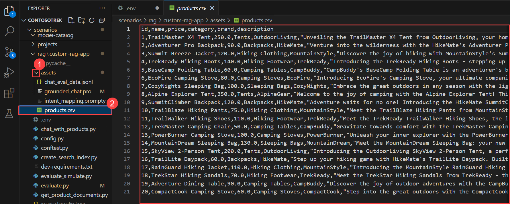
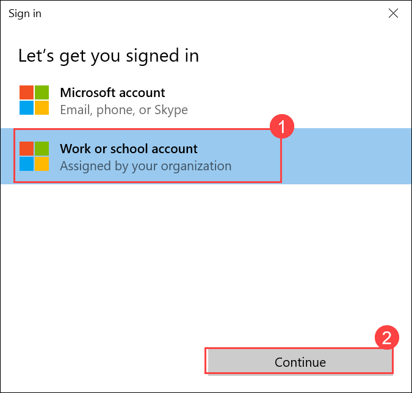
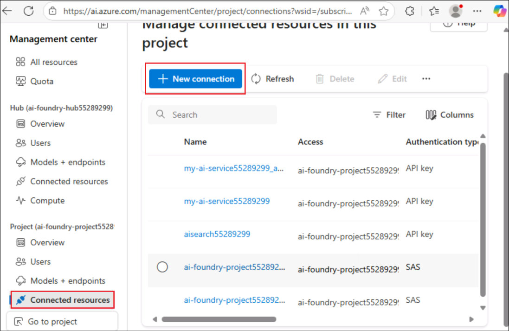
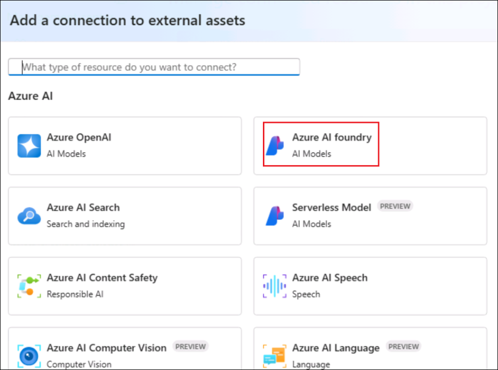
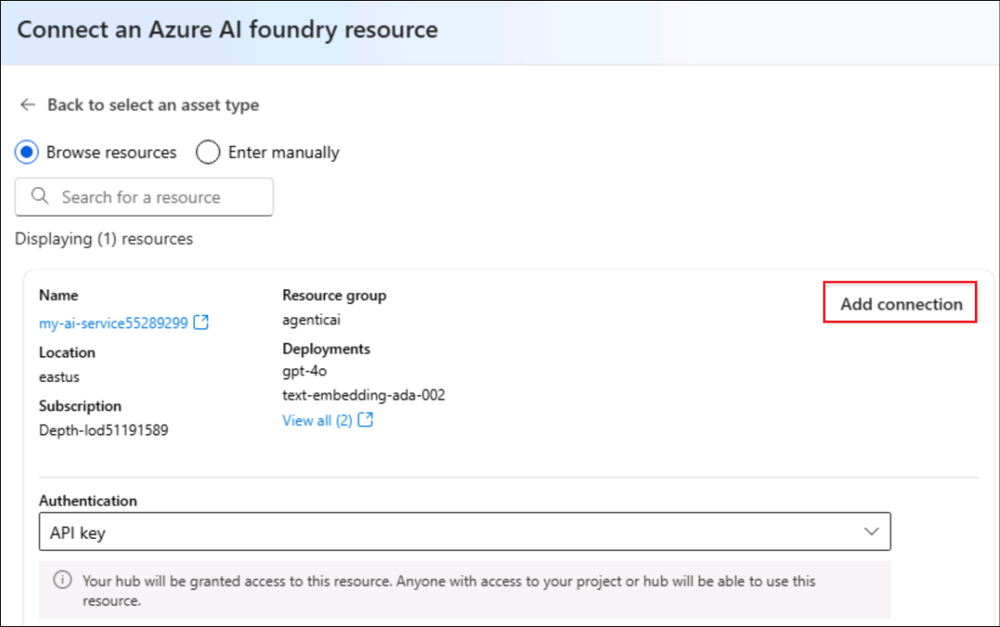
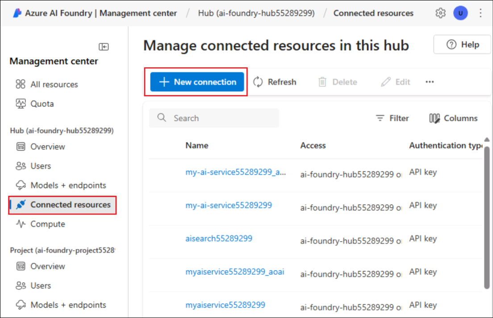
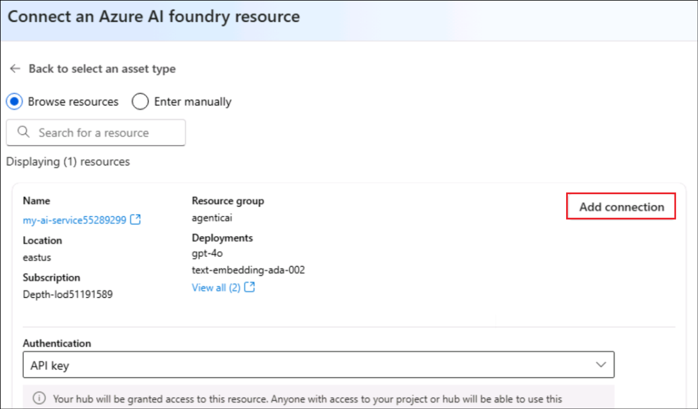
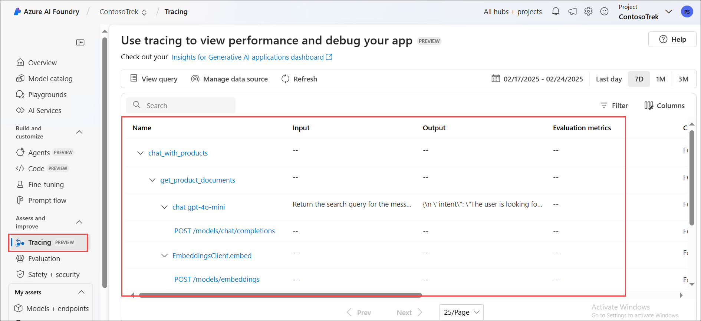

# Exercise 2: Build a Retrieval-Augmented Generation (RAG) Pipeline

In this exercise, you will enhance a basic chat application by integrating a Retrieval-Augmented Generation (RAG) pipeline. This includes indexing knowledge sources, implementing a retrieval mechanism, generating responses with augmented knowledge, and adding telemetry logging to monitor performance and accuracy.

## Objectives

In this exercise, you will complete the following tasks:

- Task 1: Indexing Knowledge Sources
- Task 2: Implementing the Retrieval Pipeline
- Task 3: Generating Responses with Augmented Knowledge
- Task 4: Add telemetry logging

### Task 1: Indexing Knowledge Sources 

In this task, you will index knowledge sources by processing and storing vectorized data from a CSV file using a search index. You will also authenticate your Azure account, execute the indexing script, and register the index to your cloud project.

1. Open a new tab in the browser and navigate to Azure AI Foundry portal using below link

    ```
    https://ai.azure.com/
    ```

1. Click on the **Azure AI Foundry** Icon on top left.
1. Select the AI foundry project that you created earlier in the lab i.e. **ai-foundry-project- (1)**
1. Click on **Models + endpoints (1)** under **My assets** in the left pane and then click on **+ Deploy model**, followed by **Deploy Base model (2)**.

1. Search for **+++text-embedding-ada-002+++**, select the model and click on **Confirm**.
1. Click on **Deploy**.

    
   
1. In Visual Studio Code, navigate to `rag/custom-rag-app/assets` **(1)** folder and select **products.csv** file **(2)**. This file contains examples of all data sets to be used in your chat app.

    

1. Select **create_search_index.py**, which stores vectorized data from the embeddings model.  

    

1. Go through the following code list as it contains:

    - Code to import the required libraries, create a project client, and configure some settings:


      *imports_and_config*


    - Code to add the function to define a search index:  


      *create_search_index*


    - Code to create the function to add a CSV file to the index:    


      *add_csv_to_index*


    - Code to run the functions, build the index, and register it to the cloud project:  


      *test_create_index*
    

1. From your console, log in to your Azure account and follow the instructions for authenticating your account:

    ```bash
    az login
    ```

    

1. Minimize the Visual Studio Code window.

    - Select **Work or School account (1)** and click **Continue (2).**

        

    - Enter the **Username <inject key="AzureAdUserEmail"></inject> (1)**,  then click **Next (2).**

      

    - Enter the **TAP <inject key="AzureAdUserPassword"></inject> (1)**, then click **Sign in (2).**  

    - Click on **No, sign in to this app only.**

          

1. Navigate back to the Visual Studio Code terminal and press **Enter** to accept the default subscription if prompted.

    

1. Back on the Azure AI Foundry tab, Select **Management Center**.

1. Under your Project select **Connected resources**.  Then select **+New connection**.  Select **Azure AI Foundry**, then choose **Add connection** then **Close**.

    

    

    

1. Next, select **Connected resources** below your Foundry hub. Then select **+New connection**.  Select **Azure AI Foundry**, then choose **Add connection** then **Close**.

    

    
   
1. Back in VS Code run the below commands to install the specfic version of Azure AI Project & Infernce:

    +++pip install azure-ai-projects==1.0.0b5+++
   

   
    +++pip install azure-ai-inference==1.0.0b8+++
   

1. Run the code to build your index locally and register it to the cloud project:


    +++python create_search_index.py+++
  

    

    > **Note:** In case of an error, please run the below command and re-run the index creation command above.


    +++pip install --upgrade azure-search-documents+++
  


### Task 2: Implementing the Retrieval Pipeline 

In this task, you will implement the retrieval pipeline by extracting relevant product documents from the search index. You will configure and execute a script that transforms user queries into search requests, retrieving the most relevant results from the indexed knowledge source.

1. Select the **get_product_documents.py** file containing the script to get product documents from the search index.

    

      - This file contains the code to import the required libraries, create a project client, and configure settings.
      - Code to add the function to get product documents.
      - Finally, add code to test the function when you run the script directly.

1. Expand **assets (1)** and select **intent_mapping.prompty (2)**. This template instructs how to extract the user's intent from the conversation.      

    

      - The **get_product_documents.py** script uses this prompt template to convert the conversation to a search query.

1. Now, run the command below in the terminal to test what documents the search index returns from a query.

     ```bash
     python get_product_documents.py --query "I need a new tent for 4 people, what would you recommend?"
     ```

         

### Task 3: Generating Responses with Augmented Knowledge     

In this task, you will generate responses using augmented knowledge by leveraging retrieved product documents. You will run a script that integrates retrieval-augmented generation (RAG) capabilities to provide relevant and grounded responses based on user queries.

1. Select the **chat_with_products.py** file. This script retrieves product documents and generates a response to a user's question.

    

      - This script contains code to import the required libraries, create a project client, and configure settings.   
      - Code to generate the chat function that uses the RAG capabilities.
      - Finally, add the code to run the chat function. 

1. Expand the **assets (1)** folder and select **grounded_chat.prompty (2)**. This template instructs how to generate a response based on the user's question and the retrieved documents.

    

      - The **chat_with_products.py** script calls this prompt template to create a response to the user's question.

1. Run the command below in the terminal to use the script and test your chat app with RAG capabilities.

    ```bash
    python chat_with_products.py --query "I need a new tent for 4 people, what would you recommend?"
    ```

      

### Task 4: Add Telemetry Logging

In this task, you will enable telemetry logging by integrating Application Insights into your project. This allows you to monitor and analyze your RAG application's performance, track queries, and log response details for better observability and debugging.

1. Navigate back to Azure AI Foundry portal and select the AI foundry project that you created earlier in the lab i.e. **ai-foundry-project-<inject key="Deployment ID" enableCopy="false"></inject> (1)**

1. Select the **Tracing (1)** tab to add an **Application Insights** resource to your project, and then click on the **Create new (2)** option to create a new resource.

    

1. Enter the name as **+++Applicationinsight+++ (1)**, then click on **Create (2)**.

    

1. Navigate back to the VS Code terminal and run the below command to install the *azure-monitor-opentelemetry*.

      ```bash
      pip install azure-monitor-opentelemetry
      ```

       

    > **Note:** Wait for the installation to complete. This might take some time.

1. Add the *--enable-telemetry* flag when you use the *chat_with_products.py* script:

      
      +++python chat_with_products.py --query "I need a new tent for 4 people, what would you recommend?" --enable-telemetry+++ 
           

       

1. **Ctrl+click** on the link in the console output to see the telemetry data in your Application Insights resource **(1)** and click **Open (2)**.    

    

1. This will take you to the **Azure AI Foundry** portal, **Tracing** tab, where you can see the telemetry data in your Application Insights resource. 

    

      > **Note:** If it does not appear immediately, select **Refresh** in the toolbar. It may take around 5 minutes to appear.

1. In your project, you can **filter** your traces as you see fit. Click on **Filter**.

    

1. Click on **+ Add filter**, set the filter to **Success (1)**, **Equal to (2)** -> **True (3),** and then click on **Apply (4)**.

    

1. Now, you can only see the data with Success as **True**.

    

### Review

This exercise focused on building a Retrieval-Augmented Generation (RAG) pipeline by indexing knowledge sources and implementing an efficient retrieval system. Participants generated AI responses enriched with relevant data and integrated telemetry logging to monitor and optimize system performance.

In this exercise, you have accomplished the following tasks:
- Task 1: Indexed Knowledge Sources
- Task 2: Implemented the Retrieval Pipeline
- Task 3: Generated Responses with Augmented Knowledge
- Task 4: Added telemetry logging

### You have successfully finished the exercise. Click **Next** to continue to the next exercise.
