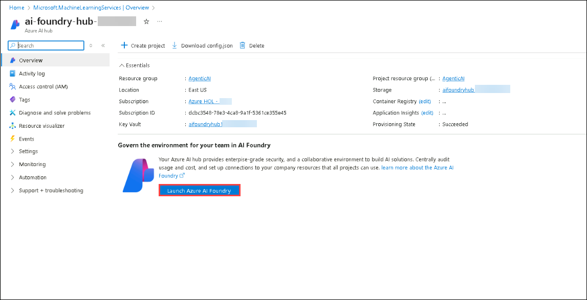
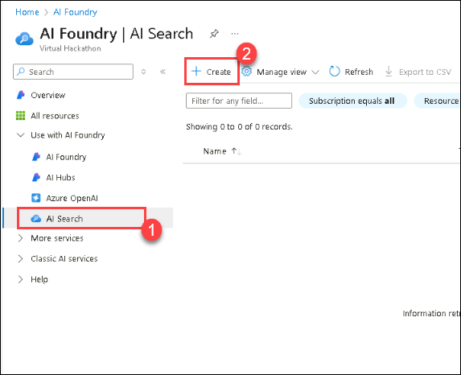
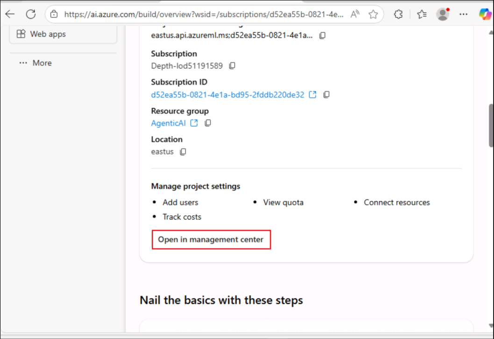
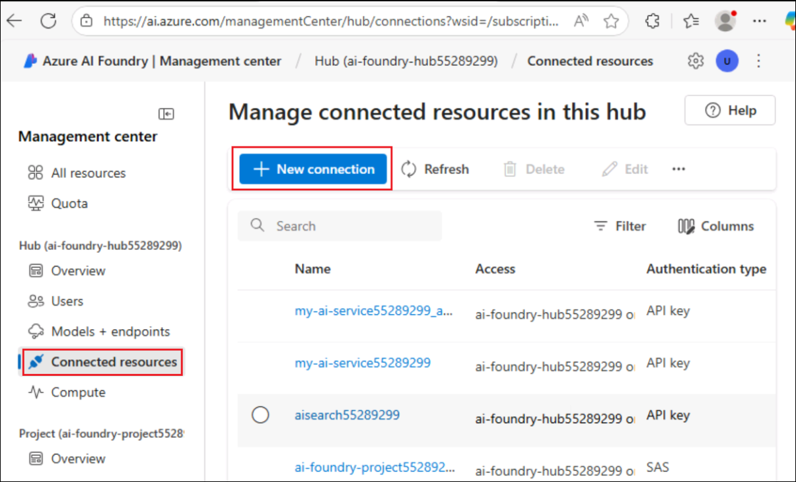

# Exercise 1: Set Up Azure AI Foundry SDK and Provision Resources 

In this exercise, you will set up the Azure AI Foundry SDK. This includes configuring the environment, deploying foundation models, and ensuring seamless integration with Azure AI services for knowledge retrieval and inference.

### Task 1: Setting up the Prerequisite Resources

1. On the Azure Portal page +++https://portal.azure.com+++, in the Search resources box at the top of the portal, enter +++Azure AI Foundry+++, and then select Azure AI Foundry under Services.

   

2. In the left navigation pane for the AI Foundry, select **AI Hubs**. On the AI Hubs page, click on **Create** and select **Hub** from the drop-down.
   
   

4. On the **Create an Azure AI hub** pane enter the following details:
   - Subscription : **Leave default subscription**
   - Resource Group :  **AgenticAI**
   - Region : **EastUS**
   - Name : +++ai-foundry-hub@lab.LabInstance.Id+++ 
   - Connect AI Services incl. OpenAI : Click on **Create New**
   - Connect AI Services incl. OpenAI : Provide a name +++my-ai-service@lab.LabInstance.Id+++  
   - Click on **Save**, followed by **Next:Storage**

   

   
   
6. Click on **Review + Create** tab followed by **Create.**

    

    
   
8. Wait for the deployment is completed and then click on **Go to resource**.

    
   
10. On the Overview pane, click on **Launch Azure AI Foundry**. This will navigate you to the Azure AI Foundry portal..

    
    
12. Select **+ New project** on the Hub Overview.

    
    
14. Provide the project name as +++ai-foundry-project@lab.LabInstance.Id+++ then select **Create**.

    
    
1. In your **AI Foundry project**, navigate to the **My assets** section, then select **Models + endpoints**. Click **Deploy model**, and choose **Deploy base model** to proceed.

    
   
1. On a **Select a model** window, search for **+++gpt-4o+++**, select **gpt-4o** and select **Confirm**

    


1. On **Deploy model gpt-4o** window, select **Customize**.

    

      - Deployment Name: **gpt-4o**
      - Deployment type: **Global Standard**
      - Change the **Model version to 2024-08-06 (Default)**
      - Change the Tokens per Minute Rate Limit to **200K**
      - Click on **Deploy (5)**

    
   
1. Navigate back to **Azure Portal** and search for **+++AI Search+++** and select **AI Search** resource.

    
   
1. On the **AI Foundry | AI Search** page, select **+ Create** to create Azure OpenAI resource.

    

1. On **Create a Search service** page, provide the following settings and select **Next (6)**:

      | Setting | Value | 
      | --- | --- |
      | Subscription | Keep the default subscription |
      | Resource group | **AgenticAI** |
      | Region | **East US 2** |
      | Name | +++aisearch@lab.LabInstance.Id+++ |
      | Pricing tier | **Standard S0** |

      
   
1. Select **Review + create**, then **Create**

    
   
1. Back on the Azure AI Foundry tab, Select **Management Center**.

    
   
1. Under your Project select **Connected resources**.  Then select **+New connection**.  Select **Azure AI Search**, then choose **Add connection** then **Close**.

    

    
   
1. Next, select **Connected resources** below your Foundry hub. Then select **+New connection**.  Select **Azure AI Search**, then choose **Add connection** then **Close**.
   
    

    

    

### Task 2: Install the requirements for the Project

In this task, you will clone the GitHub repository for the project to access the necessary files for building the chat app.

1. On your **Lab VM**, launch **Visual Studio Code**.

1. Click on **File (1)**, then **Open Folder**.

1. Navigate to `C:\LabFiles\Day-3` **(1)**, select the **Custom-RAG-App (2)** folder and then click on **Select folder (3)**.

1. Click on **Yes, I trust the author**.

    

1. Expand **scenarios (1)**, then **rag/custom-rag-app (2)**. Select **requirements.txt (3)**. This file contains the necessary packages for setting up Azure AI Foundry SDK. **(4)**

    

     >**Note**: This file contains the necessary packages for building and managing an AI-powered application using the Azure AI Foundry SDK, including authentication, AI inference, search, data processing, and telemetry logging.

1. Right-click on the **rag/custom-rag-app (1)** folder, then select **Open in Integrated Terminal (2)**.

    

1. Install the required packages by running the following command.

    ```bash
    pip install -r requirements.txt
    ```

        

      >**Note:** Wait for the installation to complete. It might take some time.


### Task 3: Configure Environment Variables

In this task, you will set up and configure the necessary environment variables to ensure seamless integration between your RAG application and Azure AI Foundry services.

1. Open a new tab in the browser and navigate to Azure AI Foundry portal using below link

    ```
    https://ai.azure.com/
    ```

1. Click on the **Azure AI Foundry** Icon on top left.
1. Select your AI foundry project.
1. Navigate to your **Overview (1)** page of **ai-foundry-project-** and then copy and paste the **Project connection string (2)** in a notepad. You will be using it in the next step.

    
   
1. Get back to **Visual Studio Code**.

1. Right-click on **.env.sample (1)** and select **Rename (2)**.

    

1. Rename the file to `.env`.

1. Click on the `.env` file and update the following values in the file

    - Replace **your_connection_string** with the **Project connection string** you copied in Step 2.
    - CHAT_MODEL="gpt-4o"
    - EVALUATION_MODEL="gpt-4o"
    - INTENT_MAPPING_MODEL="gpt-4o"

    

1. Press **Ctrl+S** to save the file.

### Review

This exercise guided participants through setting up a project in Azure AI Foundry, deploying and managing AI models, and creating an Azure AI Search service for efficient data retrieval. They integrated the search service with their project, cloned a GitHub repository containing necessary resources, and configured environment variables to ensure seamless execution.

In this exercise, you have accomplished the following:
- Task 1: Install the requirements for the Project
- Task 2: Configure Environment Variables

### You have successfully finished the exercise. Click **Next** to continue to the next exercise.
