# Exercise 1: Understanding the Lifecycle of Flow Development

## Lab Overview
In this lab, you will explore the lifecycle of developing AI applications using Azure AI Foundry's Prompt Flow. You'll start by understanding the structured process, including initialization, experimentation, evaluation, refinement, and production stages. You will learn about different flow types, such as Standard, Chat, and Evaluation flows, and how they cater to various application needs. You'll also delve into the concept of flows and nodes within Prompt Flow, which enable seamless data processing and task execution.

## Lab Objective

In this lab, you will perform the following:
- Task 1: Comprehend the Flow Development Lifecycle

### Task 1: Setting up the Prerequisite Resources


1. Login to the Azure Portal page +++https://portal.azure.com+++ using the **Username** and **TAP** from the Resources tab.

   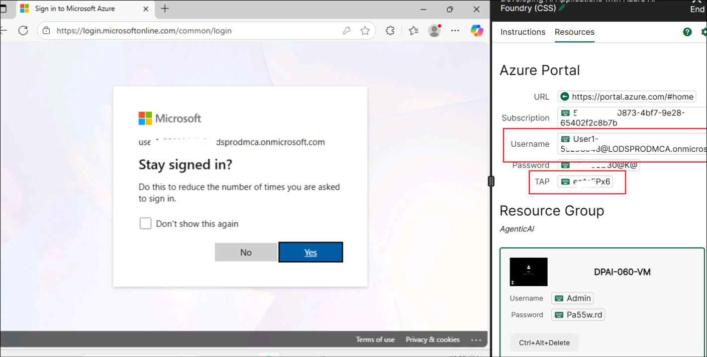
  
3. Select **Azure AI Foundry**.

   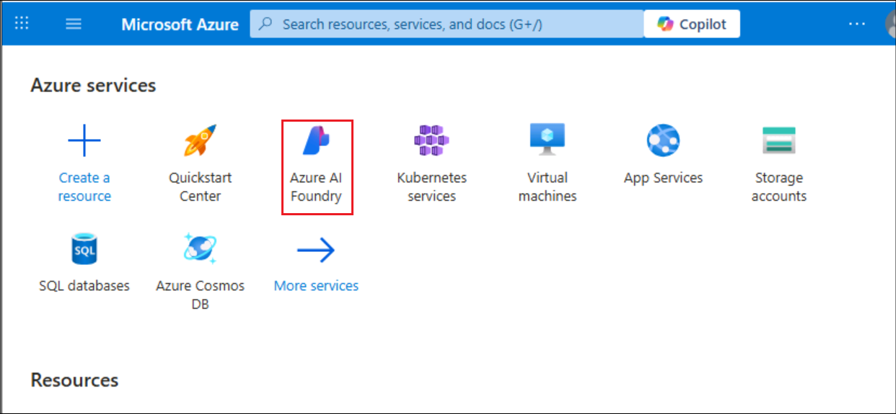
   
5. In the left navigation pane for the AI Foundry, select **AI Hubs**. On the AI Hubs page, click on **Create** and select **Hub** from the drop-down.

   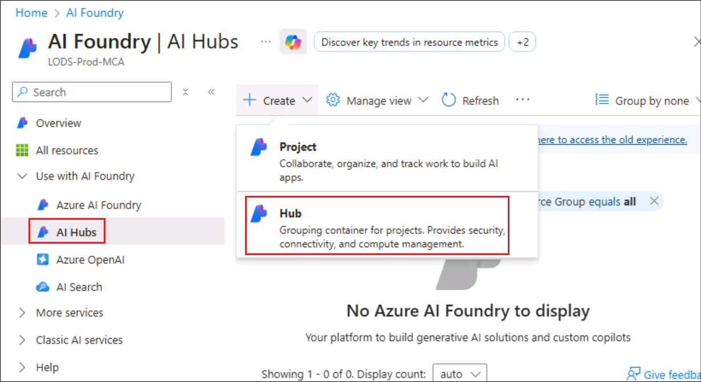

6. On the **Create an Azure AI hub** pane enter the following details:
   - Subscription : **Leave default subscription**
   - Resource Group :  **AgenticAI**
   - Region : **EastUS**
   - Name : +++ai-foundry-hub@lab.LabInstance.Id+++ 
   - Connect AI Services incl. OpenAI : Click on **Create New**
   - Connect AI Services incl. OpenAI : Provide a name +++my-ai-service@lab.LabInstance.Id+++  
   - Click on **Save**, followed by **Next:Storage**

   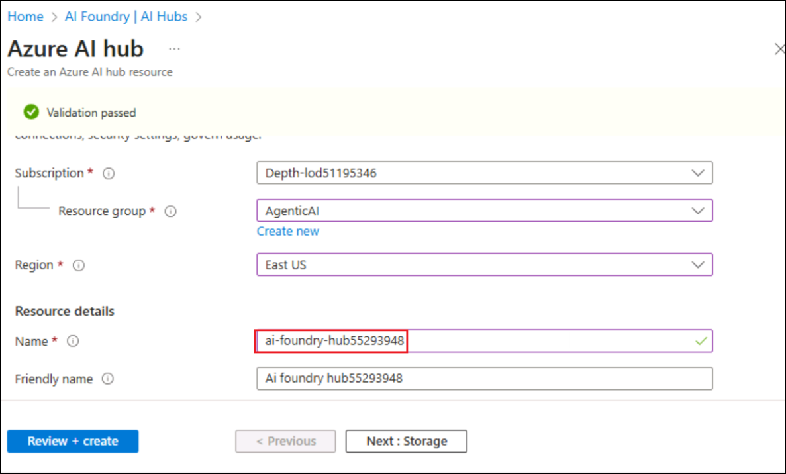

   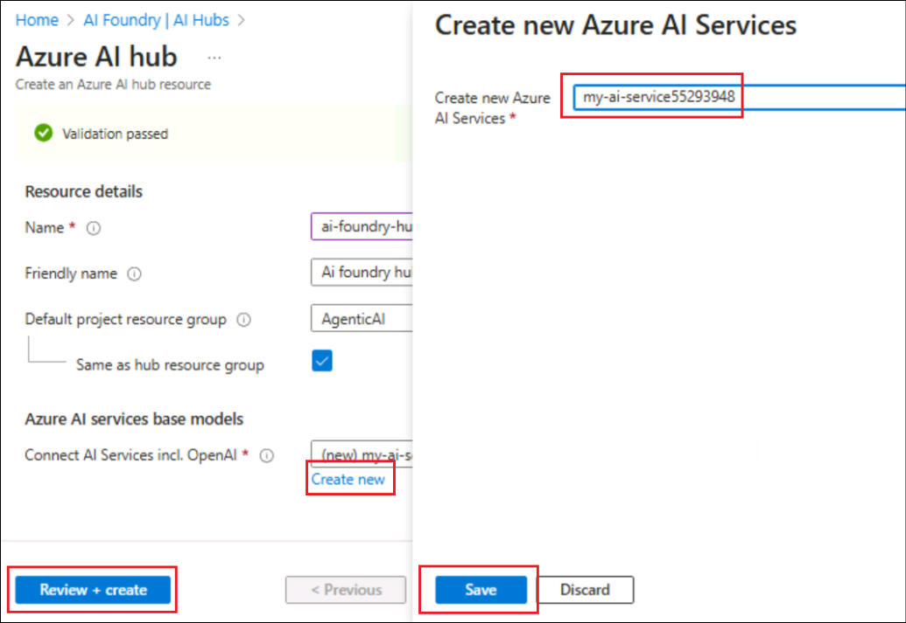
   
8. Click on **Review + Create** tab followed by **Create.**

   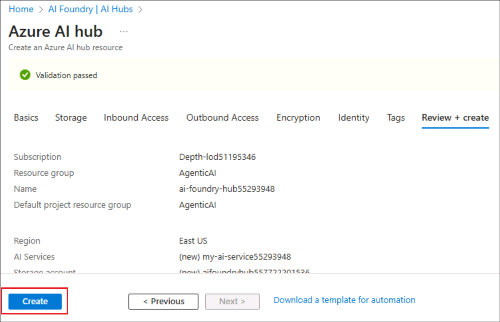

9. Wait for the deployment is completed and then click on **Go to resource**.

10. On the Overview pane, click on **Launch Azure AI Foundry**. This will navigate you to the Azure AI Foundry portal..

   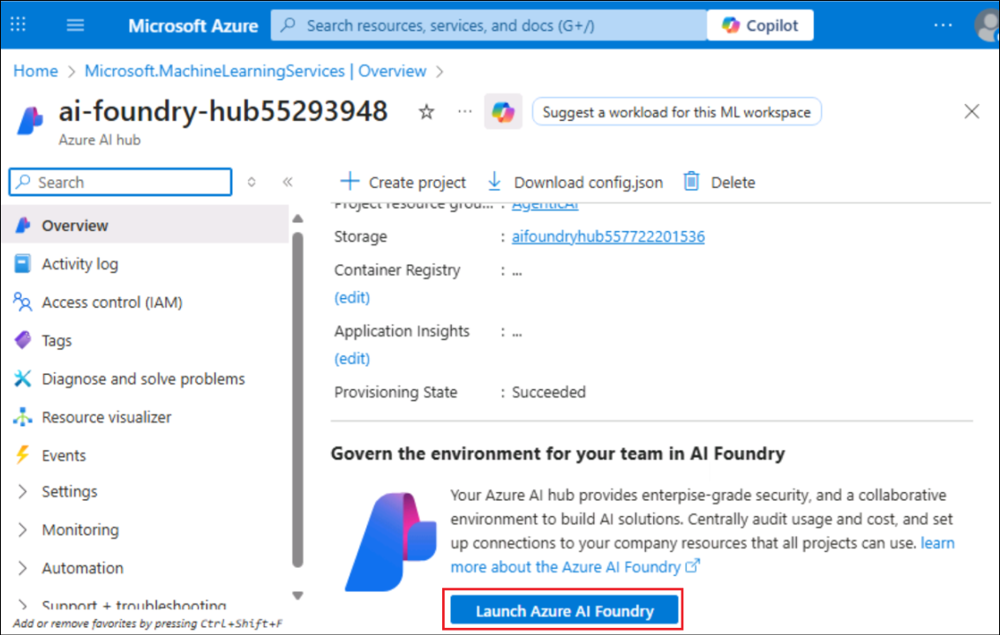

11. Select **+ New project** on the Hub Overview.

   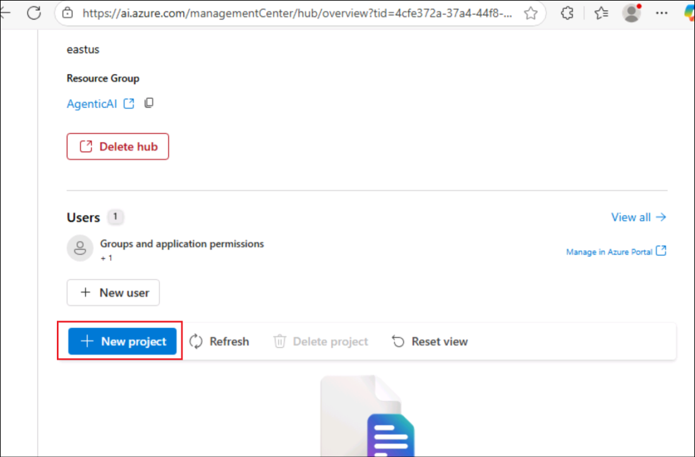
   
12. Provide the project name as +++ai-foundry-project@lab.LabInstance.Id+++ then select **Create**.

   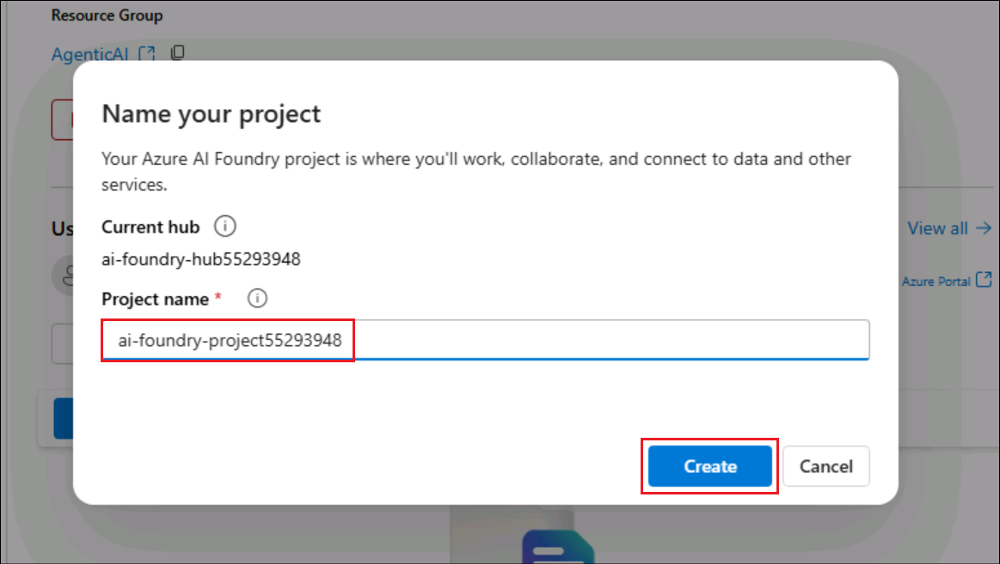
   
1. In your **AI Foundry project**, navigate to the **My assets** section, then select **Models + endpoints**. Click **Deploy model**, and choose **Deploy base model** to proceed.
   
1. On a **Select a model** window, search for **gpt-4o**, select **gpt-4o** and select **Confirm**

   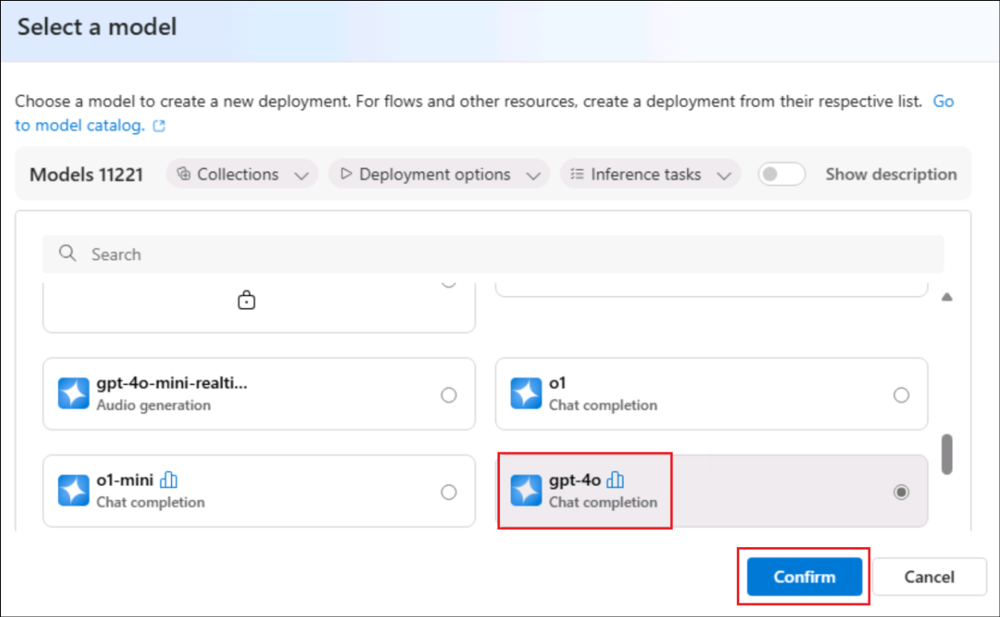

1. On **Deploy model gpt-4o** window, select **Customize**.


      - Deployment Name: **gpt-4o**
      - Deployment type: **Global Standard**
      - Change the **Model version to 2024-08-06 (Default)**
      - Change the Tokens per Minute Rate Limit to **200K**
      - Click on **Deploy (5)**

1. Navigate back to **Azure Portal** and search for **+++Open AI+++** and select **Azure Open AI** resource.

1. On the **AI Foundry | Azure OpenAI** page, select **+ Create -> Azure OpenAI** to create Azure OpenAI resource.

   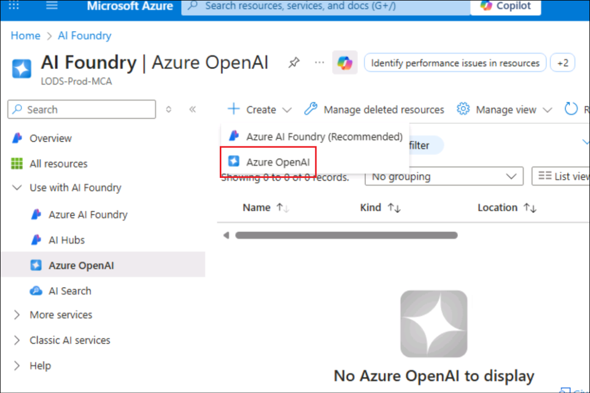
   
1. On **Create Azure OpenAI** page, provide the following settings and select **Next (6)**:

      | Setting | Value | 
      | --- | --- |
      | Subscription | Keep the default subscription |
      | Resource group | **AgenticAI** |
      | Region | **East US** |
      | Name | +++my-openai-service@lab.LabInstance.Id+++ |
      | Pricing tier | **Standard S0** |

   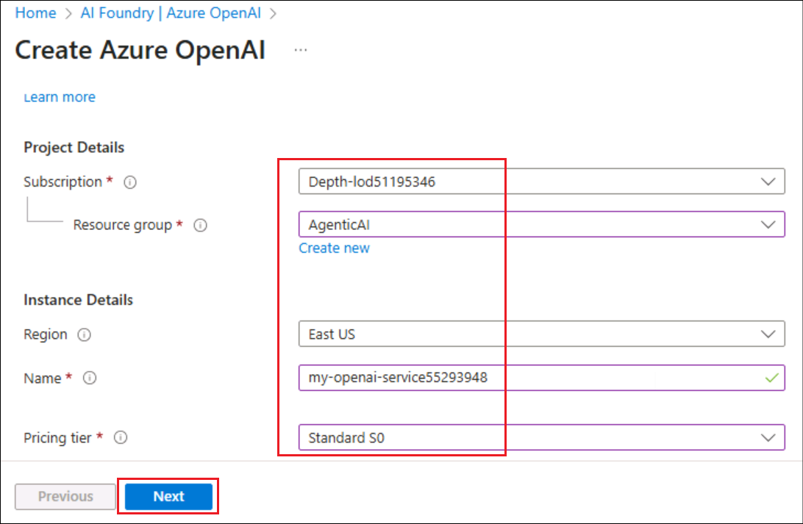
   
1. Select **Next** until Review + submit tab appears.

1. On the **Review + submit** page, select **Create**

   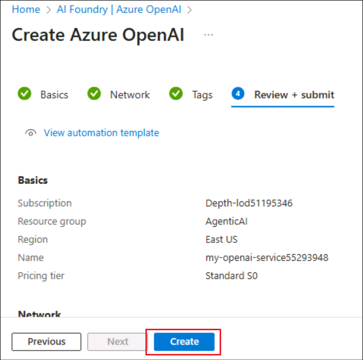
   
### Task 2: Comprehend the Flow Development Lifecycle (READ ONLY)

Prompt flow offers a well-defined process that facilitates the seamless development of AI applications. By using it, you can effectively progress through the stages of developing, testing, tuning, and deploying flows, ultimately resulting in the creation of fully fledged AI applications.

The lifecycle consists of the following stages:

- **Initialization**: Identify the business use case, collect sample data, learn to build a basic prompt, and develop a flow that extends its capabilities.
Experimentation: Run the flow against sample data, evaluate the prompt's performance, and iterate on the flow if necessary. Continuously experiment until satisfied with the results.
- **Evaluation and refinement**: Assess the flow's performance by running it against a larger dataset, evaluate the prompt's effectiveness, and refine as needed. Proceed to the next stage if the results meet the desired criteria.
- **Production**: Optimize the flow for efficiency and effectiveness, deploy it, monitor performance in a production environment, and gather usage data and feedback. Use this information to improve the flow and contribute to earlier stages for further iterations.

  >**Note**: By following this structured and methodical approach, prompt flow empowers you to develop, rigorously test, fine-tune, and deploy flows with confidence, resulting in the creation of robust and sophisticated AI applications.

### Task 2.1: Understand the types of flows

In this task, you will explore different flow types in Azure AI Foundry
1. Navigate to Azure AI foundry using the link below:
    ```
    https://ai.azure.com/
    ```
1. In Azure AI Foundry, Click on `Prompt flow` in the left pane and then select `+ Create`, here you can start a new flow by selecting a flow type or a template from the gallery.

- **Standard flow**: Designed for general application development, the standard flow allows you to create a flow using a wide range of built-in tools for developing LLM-based applications. It provides flexibility and versatility for developing applications across different domains.
- **Chat flow**: Tailored for conversational application development, the Chat flow builds upon the capabilities of the standard flow and provides enhanced support for chat inputs/outputs and chat history management. With native conversation mode and built-in features, you can seamlessly develop and debug their applications within a conversational context.
- **Evaluation flow**: Designed for evaluation scenarios, the evaluation flow enables you to create a flow that takes the outputs of previous flow runs as inputs. This flow type allows you to evaluate the performance of previous run results and output relevant metrics, facilitating the assessment and improvement of their models or applications.

  

### Task 2.2: Understand a flow
In this task, you will explore **Prompt flow** a feature within the Azure AI Foundry.

1. A flow in Prompt flow serves as an executable workflow that streamlines the development of your LLM-based AI application. It provides a comprehensive framework for managing data flow and processing within your application.

1. Prompt flow is a feature within the Azure AI Foundry that allows you to author flows. Flows are executable workflows often consist of three parts:

    - **Inputs**: Represent data passed into the flow. Can be different data types like strings, integers, or boolean.
    - **Nodes**: Represent tools that perform data processing, task execution, or algorithmic operations.
    - **Outputs**: Represent the data produced by the flow.

      
      
1. Within a flow, nodes take center stage, representing specific tools with unique capabilities. These nodes handle data processing, task execution, and algorithmic operations, with inputs and outputs. By connecting nodes, you establish a seamless chain of operations that guides the flow of data through your application.

1. To facilitate node configuration and fine-tuning, a visual representation of the workflow structure is provided through a DAG (Directed Acyclic Graph) graph. This graph showcases the connectivity and dependencies between nodes, providing a clear overview of the entire workflow.

### Task 2.3: Explore the tools available in prompt flow

In this task, you will explore the tools available in Prompt Flow within Azure AI Foundry.

1. Tools are the fundamental building blocks of a flow.

1. Three common tools are:

    - **LLM tool**: Enables custom prompt creation utilizing Large Language Models.
    - **Python tool**: Allows the execution of custom Python scripts.
    - **Prompt tool**: Prepares prompts as strings for complex scenarios or integration with other tools.

    
   
1. Each tool is an executable unit with a specific function. You can use a tool to perform tasks like summarizing text, or making an API call. You can use multiple tools within one flow and use a tool multiple time.

1. One of the key benefits of Prompt flow tools is their seamless integration with third-party APIs and python open source packages. This not only improves the functionality of large language models but also makes the development process more efficient for developers.
   
## Review
In this lab you have completed the following tasks:
- Comprehended the Flow Development Lifecycle

### You have successfully completed the lab. Click on **Next >>** to procced with next exercise.
