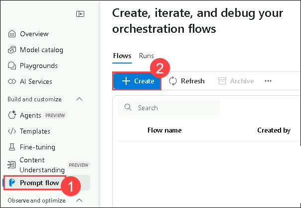
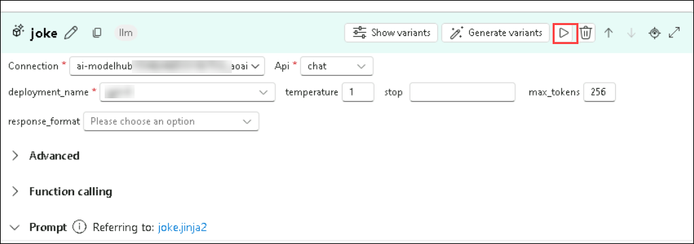
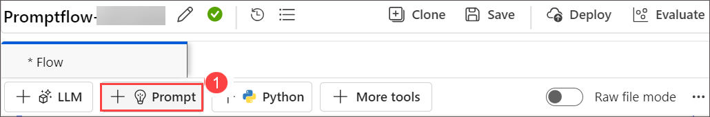
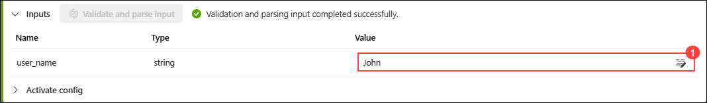

# Exercise 2: Building and Customizing Prompt Flows

## Lab Overview

In this lab, you will gain hands-on experience in initializing a Prompt Flow project in Azure AI foundry, setting up the necessary environment to begin developing, testing, and refining AI applications. You will create and customize prompts within Azure AI foundry's Prompt Flow. Starting with the creation of a new flow, you will add and configure the Prompt tool and develop a flow incorporating LLM (Large Language Model) and Prompt tools. By authoring a sample flow and running it with custom inputs, you'll learn how to monitor flow execution and evaluate outputs, thereby understanding the practical steps involved in developing, testing, and refining AI-driven workflows.

## Lab Objectives

In this lab, you will perform the following:

- Task 1 : Create and Customize Prompts
- Task 2 : Develop a Flow with LLM and Prompt Tools

### Task 1 : Create and Customize Prompts

Creating and customizing prompts involves designing specific, targeted questions or statements to elicit desired responses or actions. This process includes defining clear objectives, understanding the audience, and using precise language to ensure clarity and relevance. Customization can further refine prompts to align with particular contexts or user needs, enhancing engagement and effectiveness in various applications such as education, customer service, and AI interactions.

1. Open a new tab in the browser and navigate to Azure AI Foundry portal using below link

    ```
    https://ai.azure.com/
    ```
1. Click on the **Azure AI Foundry** Icon on top left.
1. Select the AI foundry project that you created earlier in the lab i.e. **ai-foundry-project-<inject key="Deployment ID" enableCopy="false"></inject> (1)**.
1. From the left navigation pane, select **Prompt flow (1)** > **+ Create (2)** to add the Prompt tool to your flow.

    

1. On **Create a new flow** blade, under **Standard flow**, click on **Create (1)**, then enter below provided Folder name, and click on **Create (3)**

    ```
   promptflow-<inject key="DeploymentID" enableCopy="false"/>
    ```

    

    > **Note:** If you encounter any permission errors, wait for 5 minutes and recreate the prompt flow with a unique name when you see the Folder name already exists error. Once the flow is created, rename it to **promptflow-<inject key="DeploymentID" enableCopy="false"/> (2)** by selecting the **edit icon (1)** and click on **Save (3)**.

    


### Task 2 : Develop a Flow with LLM and Prompt Tools

Developing a flow with Large Language Models (LLMs) and prompt tools involves designing a structured interaction where the LLM is guided by carefully crafted prompts to generate desired outputs. This process typically includes defining the objective, selecting appropriate LLMs, and iteratively refining prompts based on the model's responses to ensure accuracy and relevance. Prompt tools assist in managing and optimizing this interaction, enabling more efficient and effective use of LLMs in tasks such as content creation, data analysis, and automated customer support.

1. The prompt flow authoring page opens. You can start authoring your flow now. By default you see a sample flow. This example flow has nodes for the LLM and Python tools.

1. Optionally, you can add more tools to the flow. The visible tool options are **LLM, Prompt, and Python**. To view more tools, select **+ More tools**.

    

1. From the **Graph**, select **joke (1)**. Choose an existing connection **ai-xxxxxxxx_aoai (2)** from the drop-down menu, and for deployment, select the deployment, **gpt-4o (3)**, in the LLM tool editor.

    

1. Scroll up, and for **Input**, enter any fruit name of your choice like **Apple (1)**.

    

1. Select **Save (1)**, and select **Start compute session (2)**.

    

    > **Note:** It might take **10-15 minutes** to start the session. Wait till compute session starts.

1. Once the compute session is complete, click the play button inside the **joke** node to run the **joke node**.

    

1. Once the joke node run has been completed, click on the **echo (1)** node from the graph and click on the **Play (2)** button.

    

1. Once all nodes have successfully executed, select **Run** from the toolbar.

    

1. Once the flow run is completed, select View outputs to view the flow results. The output will look similar to the image as shown below.

    

1. You can view the flow run status and output in the **Outputs** section.

    

1. From the top menu, select **+ Prompt (1)** to add the Prompt tool to your flow, give the name of the flow as **modelflow (2)**, and select **Add (3)**.

    
   
    .png>)

1. Add this code inside the **modelflow** prompt tool **(1)**, and select **Validate and parse input (2)**

    ```jinja
    Welcome to Joke Bot !
    
     Hello, {{ user_name }}!
    
     Hello there!
    
    Pick a category from the list below and get ready to laugh:
    1. 🐶 Animal Jokes – From pets to wildlife, it’s a zoo of laughs.
    2. 💼 Office Humor – Relatable jokes for the 9-to-5 grind.
    3. 💻 Tech & Programmer Jokes – Debug your mood with geeky giggles.
    4. 📚 School & Exam Jokes – A+ comedy for students and survivors.
    5. ⚡ One-Liners – Quick, witty, and straight to the funny bone.
    6. 😏 Sarcastic Jokes – Dry, sharp, and deliciously savage.
    ```

    

    > **Note:** The **Validate and parse input** button may occasionally appear greyed out. However, you can still click it—it will function as expected.

1. In the input section add these following value, select **Save (2)** and **Run (3)**.

   - user_name: **John (1)**

    

1. If you encounter any warnings while running, as shown in the screenshot below, click **Run Anyway**.

    

1. Once the flow run is completed, select View outputs to view the flow results. The output will look similar to the image as shown below.

    

1. You can view the flow run status and output in the Outputs section.

    

## Review

In this lab you have completed the following tasks:

- Created and Customized Prompts
- Developed a Flow with LLM and Prompt Tools

### You have successfully completed the lab. Click on **Next >>** to proceed with next exercise.
