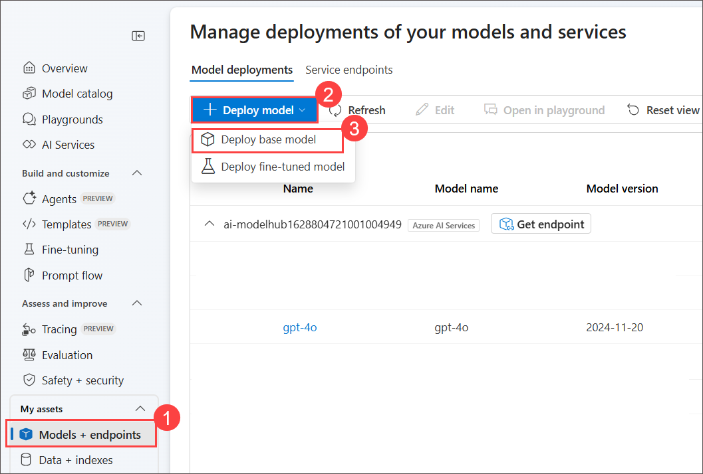
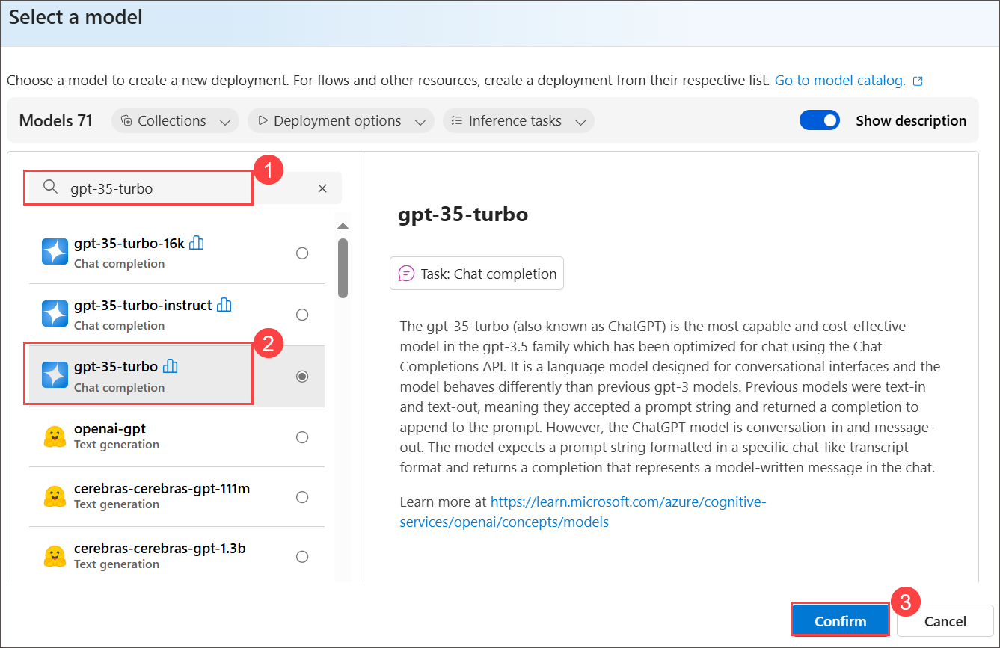
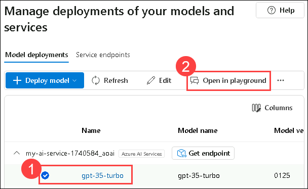
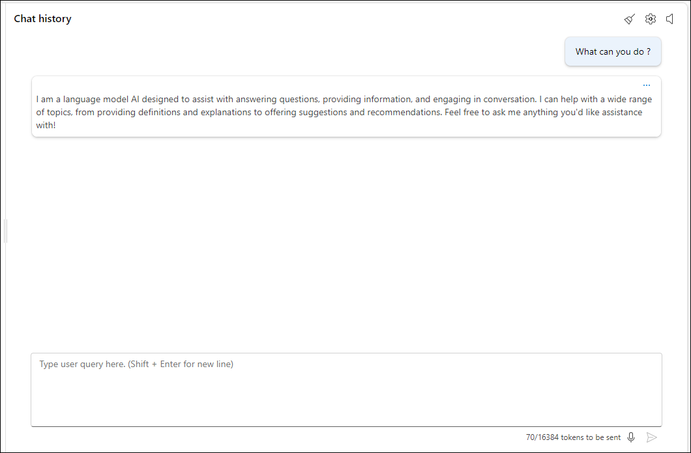
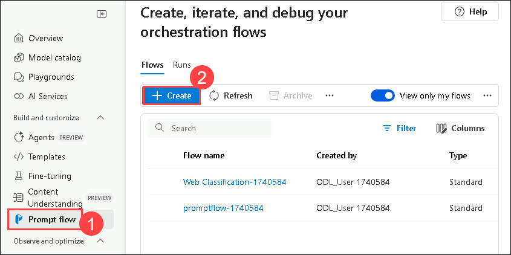
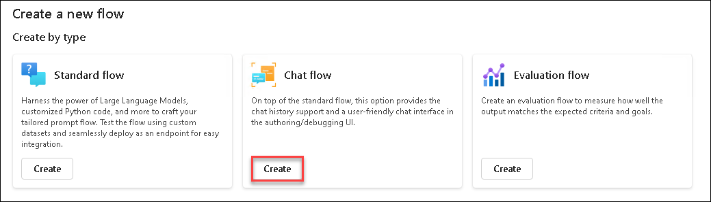
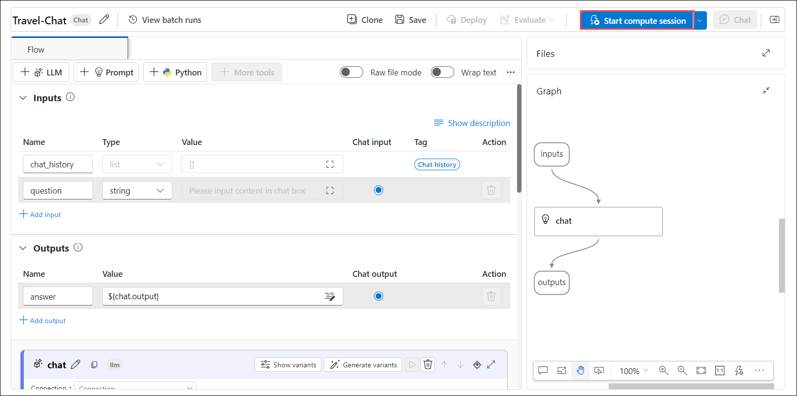
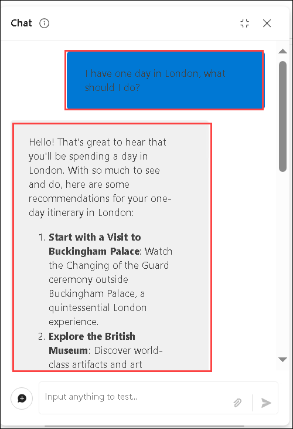

# Exercise 5: Implementing Chat Flow and Tool Integration


## Lab Overview
In this lab, you will be designing and implementing a chat flow to interact with a deployed language model. You'll start by creating a basic chat flow using Azure AI foundry, which includes integrating inputs, an LLM node, and configuring the output to reflect chat responses. You will then test the chat flow, ensure it functions correctly, and deploy it to a production environment. The final steps involve verifying the deployment, testing the deployed flow with sample queries, and exploring options for integrating the chat flow into applications as a custom copilot.

## Lab Objectives
In this lab, you will perform the following:
- Task 1: Design and Implement a Chat Flow
- Task 2: Use LLM and Prompt Tools in Flows

>[!alert] Due to high demand, AML Compute quota may be unavailable for some users, which may prevent execution of certain lab steps in this exercise. However, this will **not impact your lab progress**. You can read through the steps, and understand the exercise. Thank you for your understanding.

## Task 1: Design and Implement a Chat Flow
Design and implement a chat flow using Azure AI foundry to interact with a deployed language model, test its functionality, and deploy it for production use.

1. From the left navigation menu, under **My assets**, select **Model + endpoints (1)**.

1. On the **Manage deployments of your models, apps, and services**, under **Model deployments** tab, select **+ Deploy model (2)** and then select **Deploy base model (3)** from the dropdown.

    

1. On the **Select a model** page, search for **gpt-35-turbo (1)**, select **gpt-35-turbo (2)**, select **Confirm (3)** under the **gpt-35-turbo**.

    

1. On **Deploy model gpt-35-turbo** enter Deployment name: **gpt-35-turbo** and click on **Customize**.

1. On **Deploy model gpt-35-turbo** follow these instructions to create the deployment and click on **Deploy (5)**:
   
   - Deployment Name : **gpt-35-turbo (1)**
   - Deployment type: **Standard (2)**
   - Model version: **0125 (Default) (3)**
   - Tokens per Minute Rate Limit (thousands): **10K (4)**

    
     
1. Navigate back to **Model + endpoints**. On the **Model + deployments** page, select **gpt-35-turbo (1)** and click **Open in playground (2)**

    

1. In the chat window, enter the query **What can you do?**.

    >**Note:** The answer is generic because there are no specific instructions for the assistant. To make it focused on a task, you can change the system prompt.
    > Wait for 5 mins if you get an error while querying.
   
     

    >**Note:** The output will be different; it will not be the same. However, it will look similar to the screenshot.

1. Update the below in the **Give the model instructions and context (1)** section under **Setup** tab:-

    ```
    **Objective**: Assist users with travel-related inquiries, offering tips, advice, and recommendations as a knowledgeable travel agent.

    **Capabilities**:
    - Provide up-to-date travel information, including destinations, accommodations, transportation, and local attractions.
    - Offer personalized travel suggestions based on user preferences, budget, and travel dates.
    - Share tips on packing, safety, and navigating travel disruptions.
    - Help with itinerary planning, including optimal routes and must-see landmarks.
    - Answer common travel questions and provide solutions to potential travel issues.

    **Instructions**:
    1. Engage with the user in a friendly and professional manner, as a travel agent would.
    2. Use available resources to provide accurate and relevant travel information.
    3. Tailor responses to the user's specific travel needs and interests.
    4. Ensure recommendations are practical and consider the user's safety and comfort.
    5. Encourage the user to ask follow-up questions for further assistance.
    ```
   
1. Select **Apply changes (2)**.

    

1. Click on **Continue**.     

1. In the chat window, enter the same query as before: **What can you do?**. Note the change in response.

    

     > **Note:** The output will be different; it will not be the same. However, it will look similar to the screenshot.

1. From the left navigation pane, select **Prompt flow (1) > + Create (2)** to add the Prompt tool to your flow.

    

1. On **Create a new flow** blade, under **Chat flow**, click on **Create**, then enter **Travel-Chat** for Folder name, then click on **Create**. 

    

1. A simple chat flow is created for you. Note there are two inputs (**chat history and the user’s question**), an LLM node that will connect with your deployed language model, and an output to reflect the response in the chat.

    

1. To be able to test your flow, you need compute. Select **Start compute session** from the top bar.

    
   
    > **Note:** The compute session will take 1-3 minutes to start.
   
1. Select the LLM node named **chat**. Replace the existing prompt with the below prompt:

    ```
    system:
    **Objective**: Assist users with travel-related inquiries, offering tips, advice, and recommendations as a knowledgeable travel agent.

    **Capabilities**:
    - Provide up-to-date travel information, including destinations, accommodations, transportation, and local attractions.
    - Offer personalized travel suggestions based on user preferences, budget, and travel dates.
    - Share tips on packing, safety, and navigating travel disruptions.
    - Help with itinerary planning, including optimal routes and must-see landmarks.
    - Answer common travel questions and provide solutions to potential travel issues.

    **Instructions**:
    1. Engage with the user in a friendly and professional manner, as a travel agent would.
    2. Use available resources to provide accurate and relevant travel information.
    3. Tailor responses to the user's specific travel needs and interests.
    4. Ensure recommendations are practical and consider the user's safety and comfort.
    5. Encourage the user to ask follow-up questions for further assistance.

    
    user:
    {{item.inputs.question}}
    assistant:
    {{item.outputs.answer}}
    

    user:
    {{question}}
    ```

    

1. Select **Save**.

1. You still need to connect the LLM node to your deployed model. In the **LLM node** section, 

   - **Connection**: Select **my-ai-service<inject key="DeploymentID" enableCopy="false"/>_aoai (1)**
   - **Deployment_name**: Select the **gpt-35-turbo (2)** model you deployed.
   - **response_format**: Select **{“type”:”text”} (3)**.

    
   
## Task 2: Use LLM and Prompt Tools in Flows

Now that you’ve developed the flow, you can use the chat window to test the flow.

1. Ensure the compute session is running. Select **Save (1)**. Select **Chat (2)** to test the flow.

    

1. Enter the query: **I have one day in London, what should I do?** and review the output.

    

    > **Note:** The output will be different; it will not be the same. However, it will look similar to the screenshot.

>[!alert] You will not be able to perform the following steps because endpoint provisioning is not enabled on this cloud-slice subscription. You may review the steps to understand the process conceptually, then continue with the next exercise.


1. Select **Deploy** to deploy the flow with the following settings:

      
   
      - Basic settings:
        - Endpoint: **New (1)**
        - Endpoint name: +++modelendpoint@lab.LabInstance.Id+++ **(2)**
        - Deployment name: +++modeldeploy@lab.LabInstance.Id+++ **(3)**
        - Virtual machine: **Standard_DS3_v2 (4)**
        - Instance count: **3 (5)**
        - Inferencing data collection: **Enabled (6)**
        - Select **Review + Create (7)**

    

1. Select **Create**    

1. In Azure AI foundry, from the left navigation pane, under **My assets**, select **Model + endpoints**


1. Select the **Model deployments (1)** tab to find your deployed flow. It may take some time before the deployment is listed and successfully created. When the deployment has succeeded, select the newly created deployment **(2)**.

      

1. Wait untill the **Provisioning state** become **Succeeded (1)**, then only you will get the **Test (2)** tab.

      

1. Navigate to **Test** tab, enter the prompt **What is there to do in San Francisco?** and review the response.

      

      > **Note:** The output will be different; it will not be the same. However, it will look similar to the screenshot.

1. Enter the prompt **Where else could I go?** and review the response.

      

      > **Note:** The output will be different; it will not be the same. However, it will look similar to the screenshot.

1. View the **Consume** page for the endpoint, and note that it contains connection information and sample code that you can use to build a client application for your endpoint - enabling you to integrate the prompt flow solution into an application as a custom copilot.

      


## Review
In this lab you have completed the following tasks:
- Designed and Implement a Chat Flow
- Used LLM and Prompt Tools in Flows

### You have successfully completed the lab. Click on **Next >>** to proceed with next exercise.
