# 실습 1: Copilot Studio 에이전트 빌더 살펴보기

### 예상 소요 시간: 30분

## 개요

이 실습에서는 Microsoft 365 Copilot 앱 내에서 Microsoft Designer를 기반으로 동작하는 이미지 생성(Image Generator) 기능을 자세히 살펴봅니다. 이 기능은 선언적 에이전트(declarative agent)를 활용해, 사용자 프롬프트에 따라 시각적으로 매력적이고 맥락에 잘 부합하는 이미지를 자동으로 생성해 줍니다. 본 실습을 통해 사용자는 Copilot 인터페이스를 이용해 풍경 일러스트, 행사 전단지 등 다양한 그래픽을 단순한 설명만으로 만들어내는 방법을 학습하게 됩니다. 아울러 Microsoft 365 Copilot 앱에 로그인하고 Visual Creator에 접근하여, 실제 예제를 활용한 실습 과정도 함께 진행합니다.

## Copilot Studio 에이전트 빌더 개요

Microsoft 365 Copilot의 Copilot Studio 에이전트 빌더를 사용하면, Microsoft 365 Copilot용 에이전트(또는 [선언적 에이전트](https://learn.microsoft.com/ko-kr/microsoft-365-copilot/extensibility/overview-declarative-agent))를 쉽고 빠르게 구축할 수 있습니다.

Copilot Studio 에이전트 빌더는 즉각적이고 상호작용이 가능한 AI 개발 환경을 제공하므로, 단순한 프로젝트를 신속하게 작성하는 데 적합합니다. 만약 외부 서비스와의 통합이 필요한 Actions 같은 고급 기능을 사용해야 하거나 더 복잡한 시나리오를 구현해야 하는 경우에는, 더 강력한 기능과 도구를 제공하는 전체 Microsoft Copilot Studio의 사용을 권장합니다.

에이전트 빌더를 통해 Microsoft 365 Copilot에서 사용할 수 있는 에이전트를 생성하고, 조직의 필요에 맞게 맞춤 설정할 수 있습니다. 다음과 같은 시나리오에 특히 유용하게 활용할 수 있습니다:

- 조직의 규정에 맞춰 글쓰기나 프레젠테이션을 코칭해주는 에이전트
- 사용자의 새 팀에 대한 정보를 제공하고 온보딩을 지원하는 팀 온보딩 에이전트

    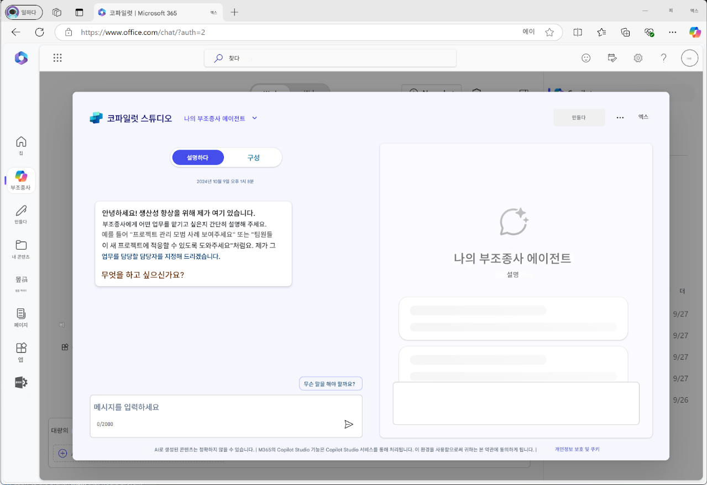

또한, SharePoint 콘텐츠나 Microsoft Graph 커넥터를 통해 제공되는 데이터를 활용하여 전용 지식 소스를 지정할 수 있습니다. 생성한 에이전트는 Microsoft 365 Copilot과의 대화에서 활용하기 전에 테스트할 수 있으며, 필요 시 조직 내 다른 사용자와 공유할 수도 있습니다.

다음 앱이나 사이트에서 에이전트를 생성할 수 있습니다:

- microsoft365.com/chat
- office.com/chat
- Microsoft Teams 데스크톱 및 웹 클라이언트

  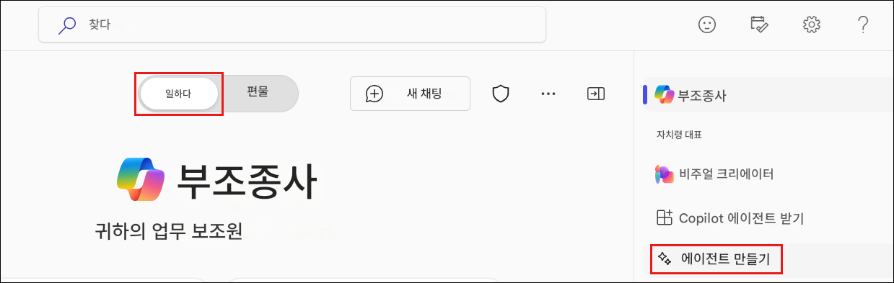

## Copilot Studio 에이전트 빌더로 에이전트 만들기

Copilot Studio 에이전트 빌더를 사용하면 직관적인 인터페이스를 통해 자연어 또는 수동 입력 방식으로 선언적 에이전트를 빠르고 쉽게 생성할 수 있습니다.

- 선언적 에이전트를 작성하는 방법에는 두 가지가 있습니다:
  - **설명** 탭을 통해 자연어로 작성
  - **구성** 탭을 통해 수동으로 작성

- **설명으로 에이전트 만들기**

설명 탭을 사용하면 일반적인 자연어(plain language)를 통해 에이전트를 손쉽게 생성할 수 있습니다. 사용자가 대화 방식으로 정보를 입력하면, 에이전트의 이름, 설명, 지침이 지속적으로 업데이트되어 에이전트의 동작이 점차 정교해집니다. 이 방식은 자연어 기반의 직관적인 사용자 경험을 제공하며, 맞춤형 에이전트를 쉽게 풍부하게 만들 수 있도록 도와줍니다.

에이전트는 에이전트 빌더가 제시하는 질문에 순차적으로 응답함으로써 자연어로 구성됩니다. 빌더는 각 대화 단계마다 에이전트를 점진적으로 업데이트하고, 변경 사항은 자동으로 저장됩니다. 대화 도중 언제든지 에이전트 정보를 수정할 수 있으며, 이름, 설명, 지침의 변경 내용은 자동으로 반영됩니다. 다만, 설명 탭에서는 아이콘이나 지식 원본(knowledge sources)을 직접 추가할 수 없으며, 이러한 항목이나 기능(capabilities)을 설정하려면 구성 탭을 사용해야 합니다.

  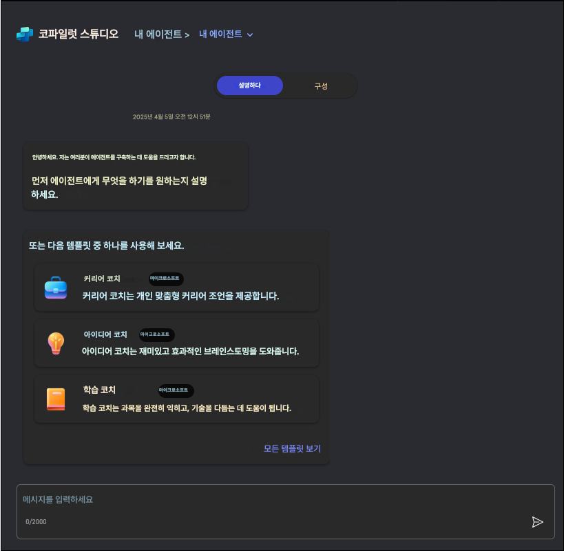

- **구성으로 에이전트 만들기**

설명 탭 외에도 구성 탭을 사용하면 에이전트의 동작을 직접 구성할 수 있습니다. 이 방법을 통해 에이전트의 설정을 보다 정밀하고 세부적으로 제어할 수 있습니다.

다음 단계를 따라 수동으로 에이전트를 구성해 보십시오:

1. 에이전트 빌더 인터페이스 상단의 **구성** 탭으로 이동합니다.
2. 다음 항목들을 순서대로 구성합니다:

   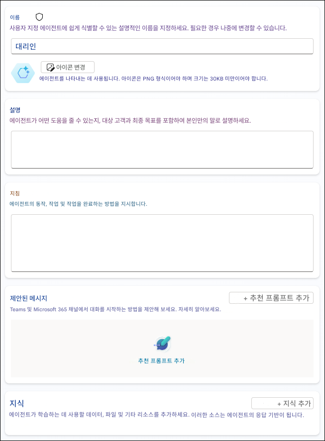

  a. **이름:** 에이전트에 대해 설명적이고 고유한 이름을 입력합니다(최대 30자).

  b. **아이콘:** 에이전트에 고유한 시각적 아이덴티티를 부여하기 위해 PNG 이미지를 업로드합니다(최대 192x192 픽셀, 1MB). 배경이 투명한 이미지가 가장 적합합니다.

  c. **설명:** 에이전트의 목적을 LLM이 이해할 설명 탭 외에도 구성 탭을 사용하면 에이전트의 동작을 직접 구성할 수 있습니다. 이 방법을 통해 에이전트의 설정을 보다 정밀하고 세부적으로 제어할 수 있습니다.

  d. **지침:** 에이전트가 어떤 방식으로 동작해야 하는지, 그리고 어떤 작업을 수행해야 하는지를 정의합니다. 이 지침은 Microsoft 365 Copilot의 기능을 확장하는 데 활용됩니다.(최대 8,000자). 이전에 설명 탭을 사용한 경우, 이 항목이 자동으로 생성되었을 수 있습니다. 보다 효과적인 지침 작성을 위해 [효과적인 지침 작성 가이드](https://learn.microsoft.com/en-us/microsoft-365-copilot/extensibility/declarative-agent-instructions)를 참고하세요.

  e. **추천 프롬프트**: 사용자가 에이전트의 기능을 이해할 수 있도록 예시 프롬프트를 만드세요. 각 프롬프트에는 사용자를 안내하는 이름과 설명이 있어야 합니다.

  f. **지식**: SharePoint 사이트, 폴더, 파일 또는 Microsoft Graph 커넥터를 포함하여 최대 20개의 지식 원본을 추가할 수 있습니다. 자세한 내용은 [지식 원본 추가](https://learn.microsoft.com/en-us/microsoft-365-copilot/extensibility/copilot-studio-agent-builder-build#add-knowledge-sources) 설명서를 참조하세요.
  
  설명 탭과 구성 탭은 작업 중에도 지속적으로 동기화됩니다. 구성 탭에서 수정한 내용은 설명 탭에 자동으로 반영되며, 그 반대의 경우도 동일하게 적용됩니다. 개발 단계에 따라 가장 적합한 탭을 선택해 자유롭게 전환하며 작업할 수 있습니다

## 효과적인 에이전트를 만들기 위한 모범 사례

1. **지침은 구체적으로 작성하세요**:  에이전트가 수행해야 할 작업과 피해야 할 행동을 명확히 정의해 주세요. 

2. **지식 원본은 신중하게 선택하세요**: 에이전트가 참조할 콘텐츠는 품질이 높고 관련성이 있어야 합니다.

3. **설명은 자연어로 명확하게 작성하세요**: 에이전트의 목적과 역할이 쉽게 이해될 수 있도록 자연스럽고 명료한 표현을 사용하세요.

4. **시작 프롬프트는 실용적으로 작성하세요**: 사용자가 에이전트를 효과적으로 활용할 수 있도록, 대표적인 사용 예시를 구체적이고 유용하게 제시하세요.

5. **피드백을 반영해 지속적으로 개선하세요**: 사용자 경험과 상호작용 결과를 분석하여 에이전트를 반복적으로 개선해 나가세요.

6. **개인정보 보호와 보안을 고려하세요**: 에이전트가 참조하는 데이터 소스에 민감한 정보가 포함되지 않도록 주의하고, 관련 규정을 준수하세요.

7. **기능은 명확히 제한하고 집중하세요**: 너무 많은 기능을 포함시키기보다는, 핵심 기능 몇 가지에 집중하여 정확하고 안정적인 성능을 제공하는 것이 더욱 효과적입니다.

이 생성부터 테스트, 배포, 관리까지의 전체 과정을 따르면, Microsoft 365 Copilot을 통해 생산성을 높이고 전문적인 지원을 제공하는 효과적인 에이전트를 구축할 수 있습니다.

## 목표

- 과제 1: 이미지 생성기

## 과제 1: 이미지 생성기

이미지 생성기 기능은 선언형 에이전트가 사용자 프롬프트를 활용하여 이미지를 자동으로 생성할 수 있도록 지원합니다. 이 기능은 기존 [Microsoft Designer](https://designer.microsoft.com/)의 기술을 기반으로 하며, 시각적으로 매력적이고 맥락에 부합하는 그래픽을 생성할 수 있습니다. 주요 기능은 다음과 같습니다:

1. Edge 브라우저에서 새 탭을 열고 [Microsoft 365 Copilot 앱](https://m365.cloud.microsoft/) **(1)** 을 실행 후, 로그인 **(2)** 을 클릭합니다.

    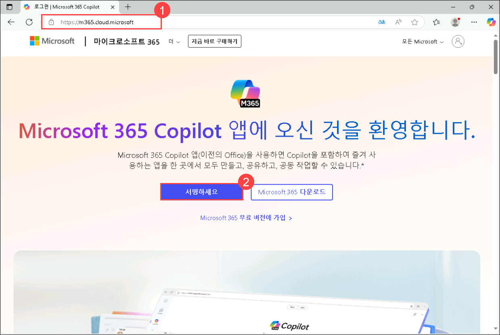

1. **Microsoft Azure에 로그인 탭**에 로그인 화면이 표시됩니다. 다음 이메일/사용자 이름을 입력 **(1)** 하고, 다음 **(2)** 를 클릭합니다.
   
   - **Email/Username:** AzureAdUserEmail

     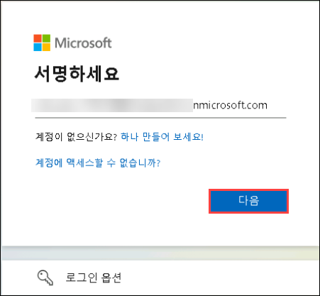

1. 이제 다음 비밀번호를 입력 **(1)** 한 후, 로그인 **(2)** 을 클릭합니다.

   - **Password:** AzureAdUserPassword

      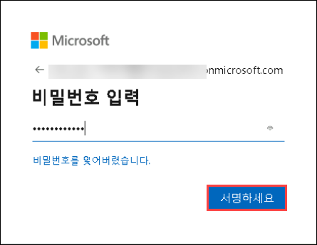
   
1. **계속 로그인 상태를 유지하시겠습니까?** 라는 팝업이 나타나면 **아니요** 를 클릭합니다.

   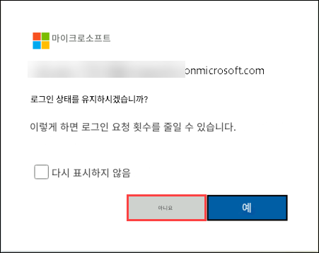

1. 왼쪽 패널에서 **앱 실행기(Apps Launcher) (1)** 를 선택한 후 **Microsoft 365 Copilot (2)** 을 클릭합니다.

   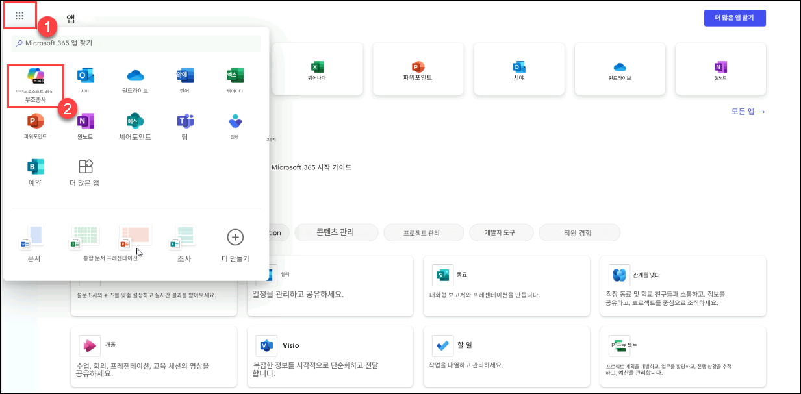

1. **Copilot 채팅 추가(Add Copilot Chat)** 를 클릭하고, 다른 알림이 나타나면 모두 닫습니다.

   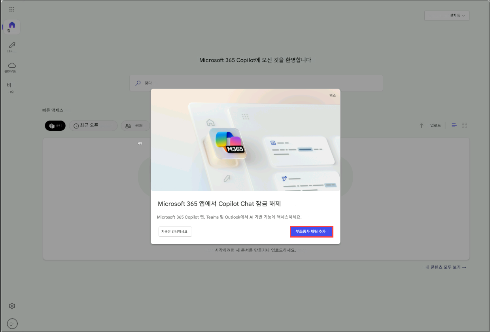

   > **참고**: 팝업이 보이지 않는 경우, 페이지를 새로 고침해 주세요.

1. 이제 **이미지 생성기** 예제를 실행해 봅니다.

   - 채팅 창에 **Create an image of a serene beach at sunset with palm trees and gentle waves** (야자수와 잔잔한 파도가 있는 해질녘의 고요한 해변 이미지를 생성해 주세요) **(1)** 를 입력하고, **보내기** **(2)** 버튼을 클릭합니다. 

     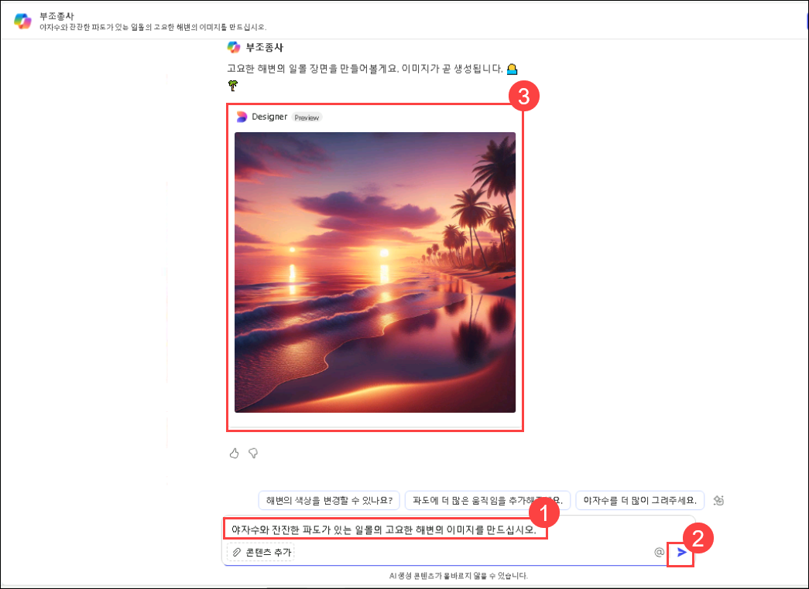

<!--   - 채팅 창에 **Design a flyer for a summer music festival and add a date for May 15, 2025** (2025년 5월 15일 날짜가 포함된 여름 음악 축제 전단지를 디자인해 주세요) **(1)** 를 입력하고, **보내기** **(2)** 버튼을 클릭합니다. 

     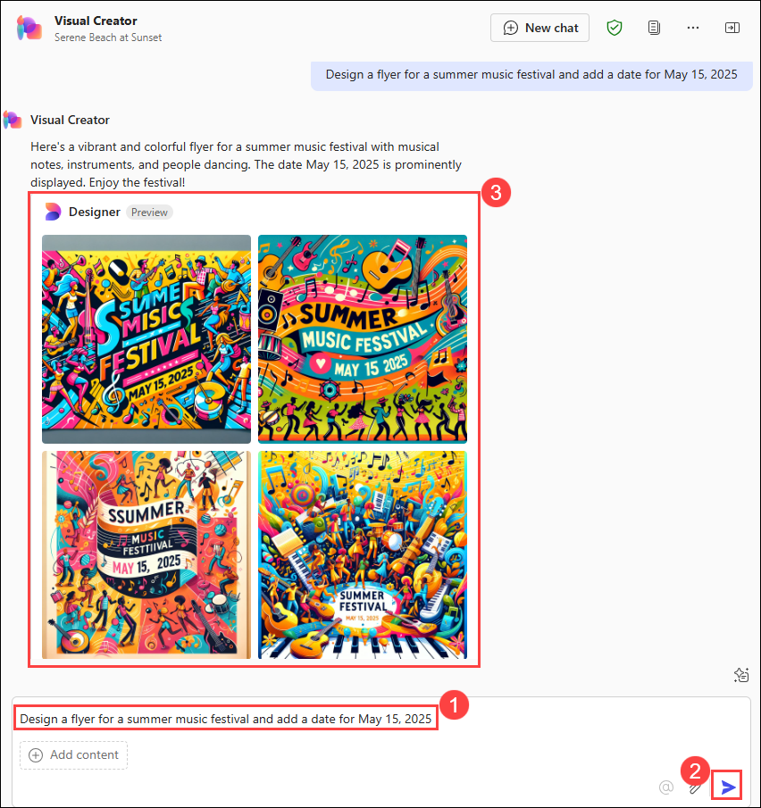
-->

## 복습

이번 실습에서는 자연어 프롬프트를 통해 AI 기반 도구를 사용하여 시각적으로 매력적인 이미지를 손쉽게 생성해 보았습니다.

### 실습을 성공적으로 완료하셨습니다!