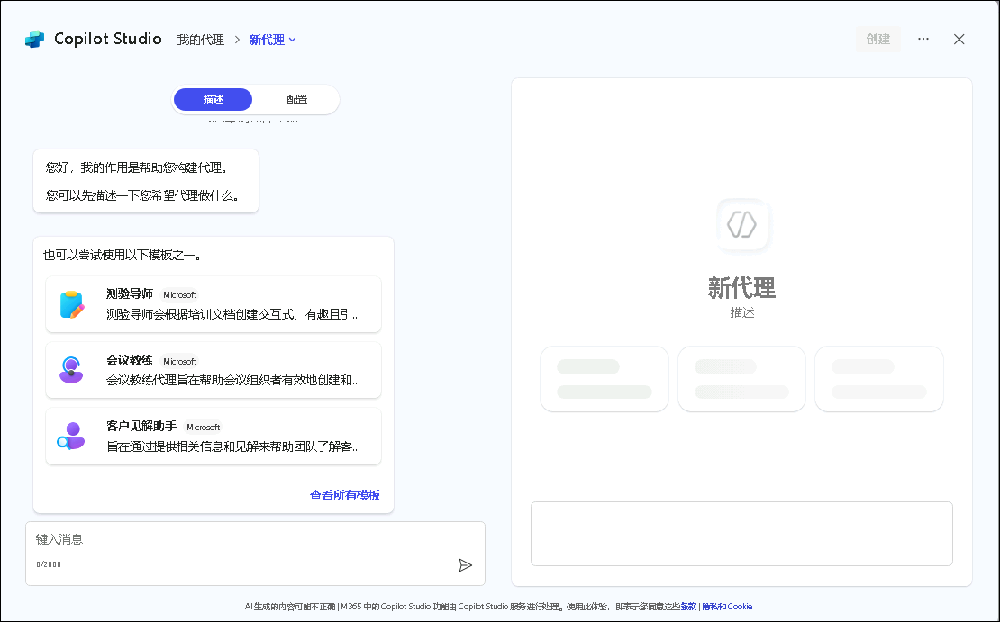
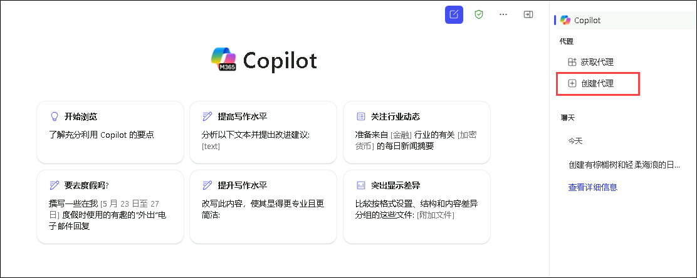
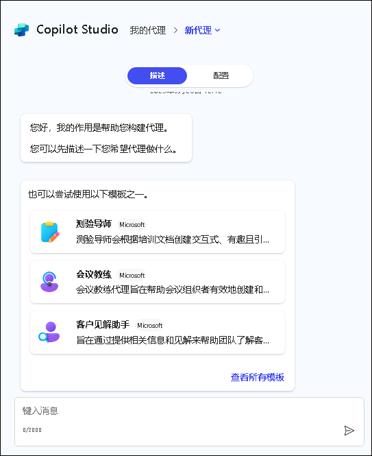
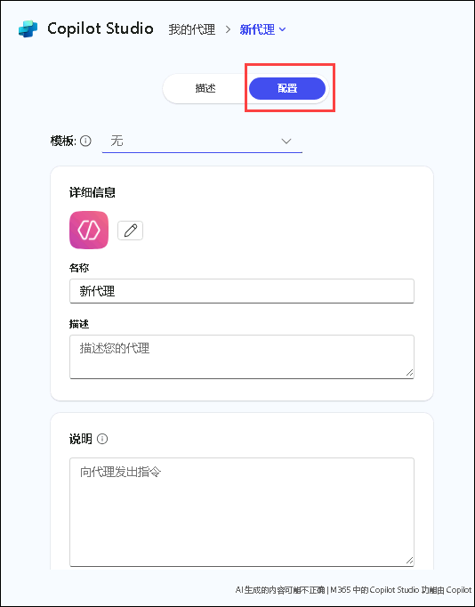
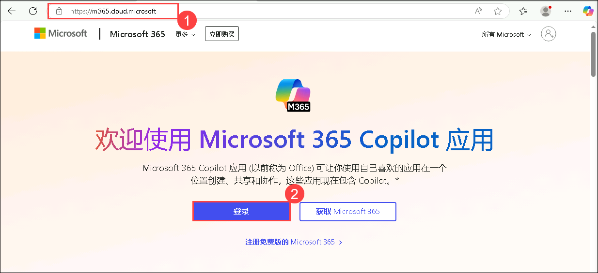
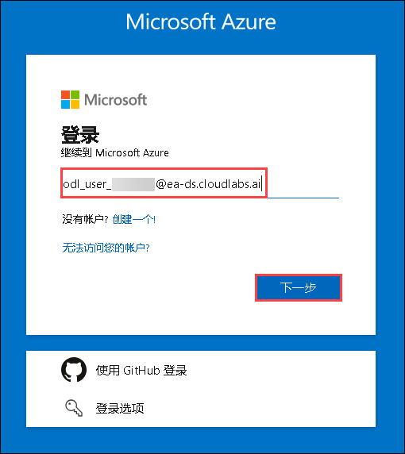
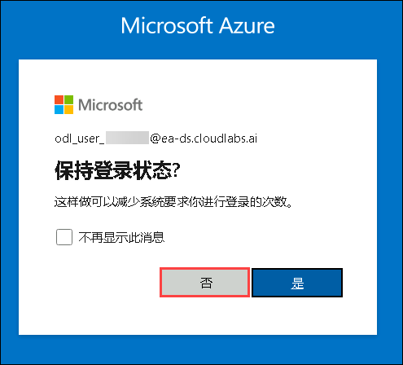
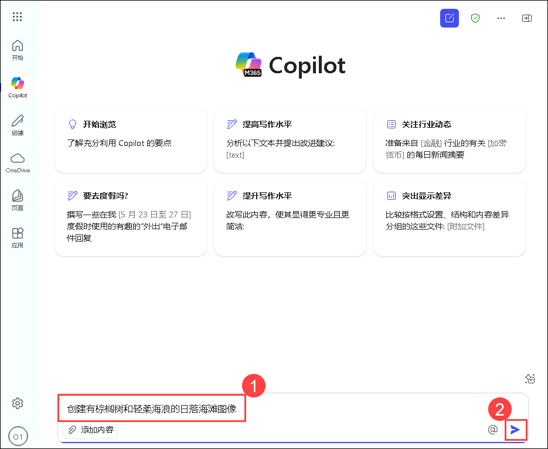
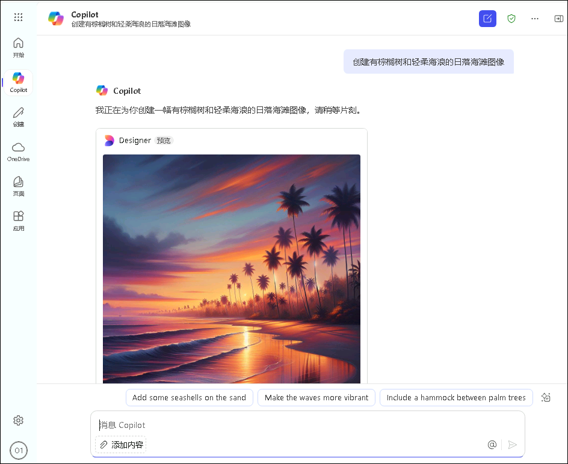

# 练习 1: 探索 Copilot Studio 智能体构建器

### 预计时长: 30 分钟

## 概述

在本实验中，您将探索 Microsoft 365 Copilot 应用中由 Microsoft Designer 提供支持的图像生成功能。该功能使声明式智能体能够根据用户提示生成美观且符合上下文情境的图片。通过 Copilot 界面，您只需输入描述性文字即可学习如何创建风景插图和活动海报等图形。本实验将指导您登录 Microsoft 365 Copilot 应用、访问视觉创作工具，并通过真实案例体验 AI 驱动图像生成的便捷性与创造力。

## Copilot Studio 智能体构建器概述

Microsoft 365 Copilot 中的 Copilot Studio 智能体构建器使您能够轻松快速构建用于 Microsoft 365 Copilot 的声明式代理（也称为[声明式代理](https://learn.microsoft.com/en-us/microsoft-365-copilot/extensibility/overview-declarative-agent)）。

Copilot Studio 智能体构建器在 Microsoft 365 Copilot 中提供即时交互式 AI 开发体验，非常适合快速简单的项目。如需集成外部服务等高级功能，建议使用完整的 Microsoft Copilot Studio，它提供了更复杂的工具集。

使用 Copilot Studio 智能体构建器可创建定制化智能体，覆盖以下典型场景：
- 根据组织标准提供写作或演示指导的智能体
- 为新团队成员提供特定信息并帮助完成入职任务的智能体

    

支持的知识源包括 SharePoint 内容和 Microsoft Graph 连接器提供的信息。部署前可进行测试，并支持在组织内共享。

可在以下平台构建智能体：
- microsoft365.com/chat
- office.com/chat
- Microsoft Teams 桌面版和网页版

  

## 使用 Copilot Studio 构建智能体

Copilot Studio 的代理生成器提供了一个直观的界面，使您能够通过自然语言输入或手动配置，快速创建声明式代理。

您可以通过两种方式创建声明式代理：

- **Describe 标签页**：使用自然语言进行创建
- **Configure 标签页**：通过手动配置进行构建

- **描述你的代理**: 

    描述选项卡让您能用日常对话的方式快速定义代理。只需像聊天一样说明需求（如"创建一个解答员工福利问题的助手"），系统就会自动解析并生成代理框架，同时实时优化名称、描述和指令。系统会即时应用所有修改，无需技术背景即可完成基础配置，适合快速验证想法或调整代理风格。

    虽然自然语言模式简化了创建流程，但图标上传、知识库连接等高级功能仍需在"配置"选项卡中完成。这种双模式设计既保证了易用性，又确保专业用户能精准控制代理行为，您可随时切换两种方式来完善代理功能。

  

2. **手动配置模式**：

   除了使用**描述**选项卡外，您还可以通过**配置**选项卡直接配置代理的行为。这种方法能让您更精准地控制代理设置。

   请按照以下步骤手动配置您的代理：

   1. 在代理生成器界面顶部导航至**配置**选项卡

   2. 依次配置以下字段：

      

      a. **名称**：输入描述性名称（最多30个字符）  
      
      b. **图标**：上传PNG格式图片（最大192×192像素，1MB大小，建议使用透明背景）  
      
      c. **描述**：编写清晰的描述文本，帮助LLM理解智能体用途（同时显示在应用目录中）  
      
      d. **指令**：定义智能体行为规则和任务要求（最多8000字符），参考[编写有效指令](https://learn.microsoft.com/en-us/microsoft-365-copilot/extensibility/declarative-agent-instructions)  
      
      e. **知识**：添加最多20个知识源（包括SharePoint站点、文件夹、文件或Microsoft Graph连接器），详见[添加知识源](https://learn.microsoft.com/en-us/microsoft-365-copilot/extensibility/copilot-studio-agent-builder-build#add-knowledge-sources)  
      
      f. **功能**：添加扩展能力，详见[为声明式代理添加功能](https://learn.microsoft.com/en-us/microsoft-365-copilot/extensibility/add-agent-capabilities)  
      
      g. **示例提示**：创建带名称和描述的示例查询，指导用户有效使用

**描述**和**配置**选项卡在工作过程中保持实时同步。您在**配置**选项卡中所做的任何修改，在返回**描述**选项卡时都会自动体现，反之亦然。您可以根据开发阶段的实际需要，自由切换使用这两种方式。

## 最佳实践

1. **明确具体指令**：清晰定义智能体应执行和不应执行的操作  

2. **精选知识源**：选择高质量、相关的内容来源  

3. **自然语言描述**：使用自然流畅的语言描述智能体用途  

4. **创建有效示例**：提供展示智能体能力的示例查询  

5. **迭代优化**：根据用户反馈持续改进智能体  

6. **注意隐私安全**：谨慎选择连接的数据源  

7. **保持功能聚焦**：专注做好少量核心功能比大而全更有效  

完整流程包含创建、测试、部署和管理四个阶段，您可以构建高效的智能代理，借助Microsoft 365 Copilot提升工作效率并提供专业化辅助支持。

## 实验目标
- 任务 01: 图像生成器

## 任务 01: 图像生成器

该图像生成功能使声明式代理能够根据用户提示生成图像。图像生成器调用 [Designer](https://designer.microsoft.com/) 的底层引擎，可创建视觉精美且符合上下文的图形，包含以下特性：

1. 在 Edge 浏览器新建标签页并打开 [Microsoft 365 Copilot 应用](https://m365.cloud.microsoft/) **(1)**，点击 **登录** **(2)**

    

2. 在 Azure 登录界面输入邮箱 **(1)** 后点击 **下一步** **(2)**
   - **邮箱:** AzureAdUserEmail

     

3. 输入 TAP **(1)** 并点击 **登录**
   
4. 出现"是否保持登录状态？"提示时点击 **否**

   

5. 您将登陆 Copilot 聊天页面。让我们尝试一个 图像生成器示例。 

   * 在文本框中输入：**创建一幅日落时分宁静海滩的图像，画面中有棕榈树和轻柔的海浪** **(1)**，然后点击 **发送** **(2)** 按钮。

     
     
     

## 总结
本实验您已掌握如何通过自然语言提示使用 AI 工具生成精美图像，体验了 Copilot Studio 智能体构建器的核心功能。

### 实验完成！ 
