# 練習 1：探索 Copilot Studio 智能代理建構器

### 預計時長：30 分鐘

## 實驗概覽

在本次實驗課程中，您將在 Microsoft 365 Copilot 應用程式中探索由 Microsoft Designer 提供支援，內建的圖像生成器（Image Generator）功能。此功能使 宣告式智能代理（Declarative Agents） 能夠根據使用者提示生成具有視覺吸引力且符合背景需求的圖像。透過學習 Copilot 介面的操作方式，您將了解如何僅透過輸入描述性文字，創建風景插畫、活動宣傳海報等圖像內容。課程將引導您完成 登入 Microsoft 365 Copilot 應用程式、存取視覺創作工具（Visual Creator），並透過實際案例進行測試，以體驗 AI 驅動的圖像生成如何提升創造力與便利性。

## Copilot Studio 智能代理建構器概述

Microsoft 365 Copilot 的 Copilot Studio 智能代理建構器（Agent Builder） 使您能夠輕鬆快速地建立智能代理（亦稱為 [宣告式智能代理(Declarative Agents）](https://learn.microsoft.com/en-us/microsoft-365-copilot/extensibility/overview-declarative-agent)）以供 Microsoft 365 Copilot 使用。

Copilot Studio 智能代理建構器 在 Microsoft 365 Copilot 中提供即時、互動式的 AI 開發體驗，適用於快速且簡單的專案。如果您需要更進階的功能，例如 Actions（行動）來整合外部服務，建議您使用完整版本的 Microsoft Copilot Studio，它提供更全面的工具與功能，以應對更複雜的需求。

您可以利用 Copilot Studio 智能代理建構器 來建立並自訂智能代理，使其適用於 Microsoft 365 Copilot，涵蓋各種特定情境的應用案例，例如：

  - 提供寫作或簡報指導的智能代理，可根據企業標準量身打造建議內容。
  - 團隊入職智能代理，可提供新員工所需的特定資訊，並協助完成入職流程。

    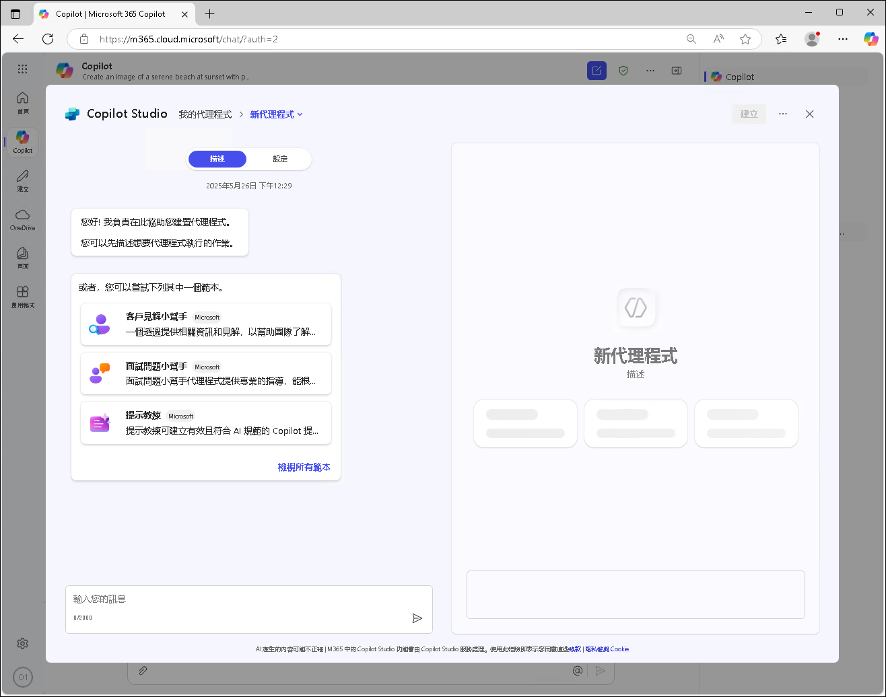

您可以指定專屬的知識來源，包括 SharePoint 上的內容及 Microsoft Graph 連接器 所提供的資訊。此外，您還可以在正式部署智能代理之前進行測試，以確保其能夠順利運行於 Microsoft 365 Copilot 的對話環境中，或與組織內的其他人共享。

您可以從以下應用程式和網站建立智能代理：

- microsoft365.com/chat
- office.com/chat
- Microsoft Teams 桌面版與網頁版客戶端

  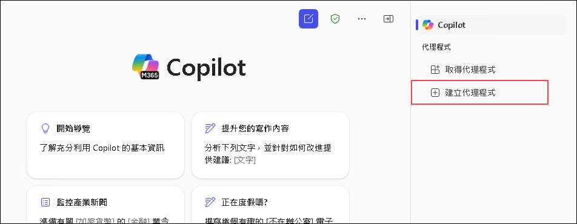

## 使用 Copilot Studio 智能代理建構器來建立代理

Copilot Studio 智能代理建構器（Agent Builder） 提供一個簡單易用的介面，讓您能夠快速且輕鬆地建立宣告式智能代理（Declarative Agents），無論是透過自然語言還是手動編寫方式。

- 您可以透過以下兩種方式建立您的宣告式智能代理：

  - 在 **Describe** 分頁中，使用自然語言建立代理。
  - 在 **Configure** 分頁中，以手動方式構建代理。

- **描述您的代理**：

  描述（Describe）分頁允許您透過簡單的自然語言建立智能代理。當您以對話方式提供資訊時，智能代理的名稱、描述和指示 會隨時更新，以細化其行為。這種體驗提供了一種豐富而簡單的自然語言方式來創建客製化的代理。建立智能代理後，您可以隨時返回該代理，並透過 「描述」 分頁以自然語言更新它。

  代理建構器（Agent Builder） 會提出問題，並根據您的回答逐步更新代理，每次對話的變更都會自動保存。您可以在任何對話環節中對智能代理進行更新，包括智能代理名稱、描述和指示也會自動變更。不過，您無法直接在「描述」分頁中新增圖示或知識來源，若需新增圖示、知識來源或擴充功能，請前往 「設定」 分頁進行調整。

  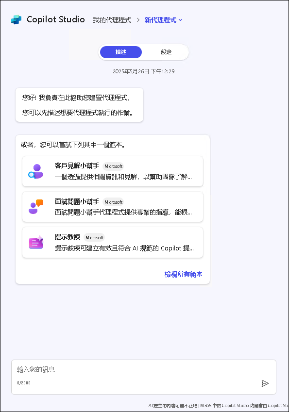

- **設定您的智能代理**:

  除了使用 「描述」 分頁外，您還可以直接透過 「設定」 分頁調整代理的行為。此方法讓您能夠更精細地控制和調整智能代理的設定。

  請按照以下步驟手動設定您的智能代理：

  1. 在智能代理建構器介面頂端，前往 「設定」 分頁。
  2. 依序設定以下欄位：
      
      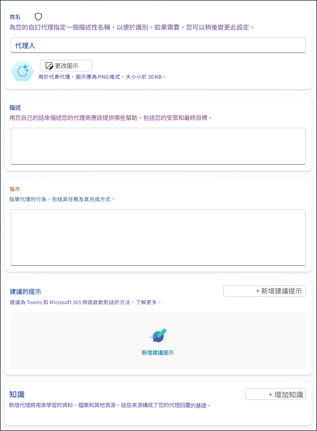

     a. **姓名**：輸入具有描述性且獨特的代理名稱（最多 30 個字元）。

     b. **圖示**：上傳 PNG 格式的圖像（最大尺寸 192x192 像素，最大 1MB）來賦予您的代理明確的視覺識別。建議使用透明背景的圖像，以獲得最佳效果。

     c. **描述**：撰寫清晰的代理描述，以幫助 LLM 理解其用途。此描述也將顯示在應用程式目錄中。

     d. **指示**：定義您的代理應如何運作，以及它應執行的任務。這些指示可擴展 Microsoft 365 Copilot 的能力（最多 8,000 字元）。如果您已在「描述」分頁設定了代理，這些指示可能會自動生成。如需撰寫指南，請參考 [撰寫有效的指示](https://learn.microsoft.com/en-us/microsoft-365-copilot/extensibility/declarative-agent-instructions)。

     e. **建議的提示**： 創建示例提示，以幫助用戶了解您的代理可以做什麼。每個提示應該有一個名稱和描述，以指導用戶。

     f. **知識**：新增最多 20 個知識來源，包括 SharePoint 網站、資料夾、文件或 Microsoft Graph 連接器。如需詳細設定說明，請參考 [新增知識來源](https://learn.microsoft.com/en-us/microsoft-365-copilot/extensibility/copilot-studio-agent-builder-build#add-knowledge-sources) 文件。

「描述」和「設定」分頁在您開發智能代理時會保持同步。您在「設定」分頁進行的任何變更，返回「描述」分頁時都會反映出來，反之亦然。您可以自由切換分頁，根據每個開發階段的需求，選擇最適合您的方式來建立智能代理。

## 建立高效智能代理的最佳實踐

要打造最優秀的 Microsoft 365 Copilot 的智能代理，請遵循以下原則：

1. **明確定義指示**：清楚說明您的代理應執行與不應執行的操作。

2. **精心策劃知識來源**：選擇高品質、相關性強的內容來源。

3. **使用自然語言撰寫描述**：撰寫能有效傳達代理用途的清晰描述。

4. **建立有用的起始提示**：提供示範性提示，幫助使用者了解如何使用代理。

5. **根據使用者回饋不斷改進**：持續根據使用者的經驗優化您的代理。

6. **考量隱私與安全性**：謹慎評估連結至代理的數據來源，以確保資訊安全。

7. **保持專注**：專注於少數幾個核心功能的代理，通常比嘗試執行過多任務的代理表現更佳。

透過完整的流程，從建立、測試、部署到管理，您可以打造高效的智能代理，提升生產力並為使用者透過 Microsoft 365 Copilot ，提供專業的輔助功能。

## 目標

- 任務 1：圖像生成器

## 任務 1：圖像生成器

圖像生成器（Image Generator）功能讓宣告式智能代理（Declarative Agents）能夠根據使用者提示生成圖像。此功能運用現有的 [Designer](https://designer.microsoft.com/) 技術來創建視覺吸引力強且符合背景需求的圖形，並包含以下特點：

1. 新增 Edge 瀏覽器分頁，然後開啟 [Microsoft 365 Copilot 應用程式](https://m365.cloud.microsoft/) **(1)**，接著點擊 **登入** **(2)**。

    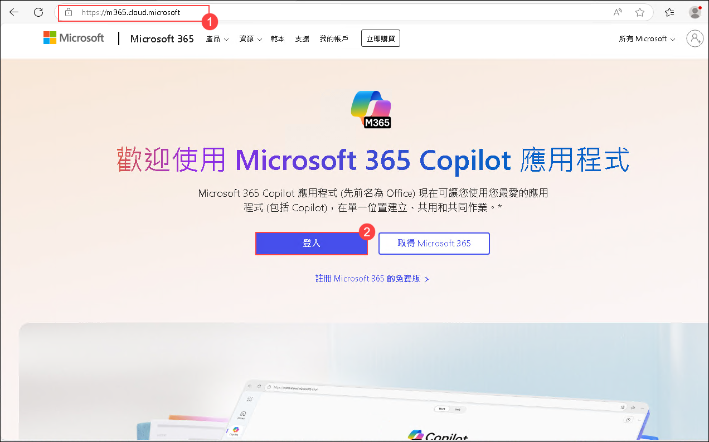

2. 在 **登入 Microsoft Azure 分頁**，您將看到登入畫面。請輸入以下 電子郵件/使用者名稱 **(1)**，然後點擊 **下一步** **(2)**。
   
   - **電子郵件/使用者名稱:** AzureAdUserEmail

     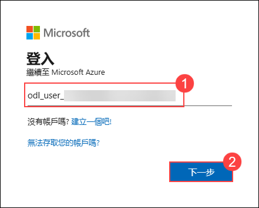

3. 現在，輸入以下 密碼 **(1)**，然後點擊 **登入** **(2)**。

   - **密碼:** AzureAdUserPassword

      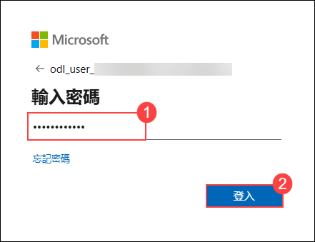

4. 如果出現 **保持登入嗎?** 的彈出視窗，請點擊 **否**。

   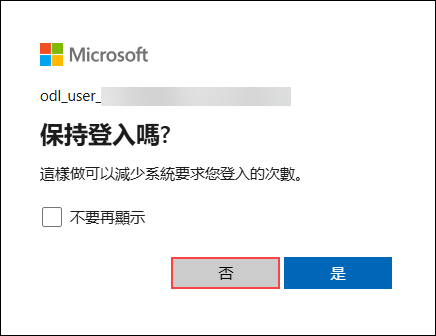

5. 從左側窗格中選擇 **「套用啟動器」** **(1)** ，然後按一下 **「Microsoft 365 Copilot」** **(2)**。

    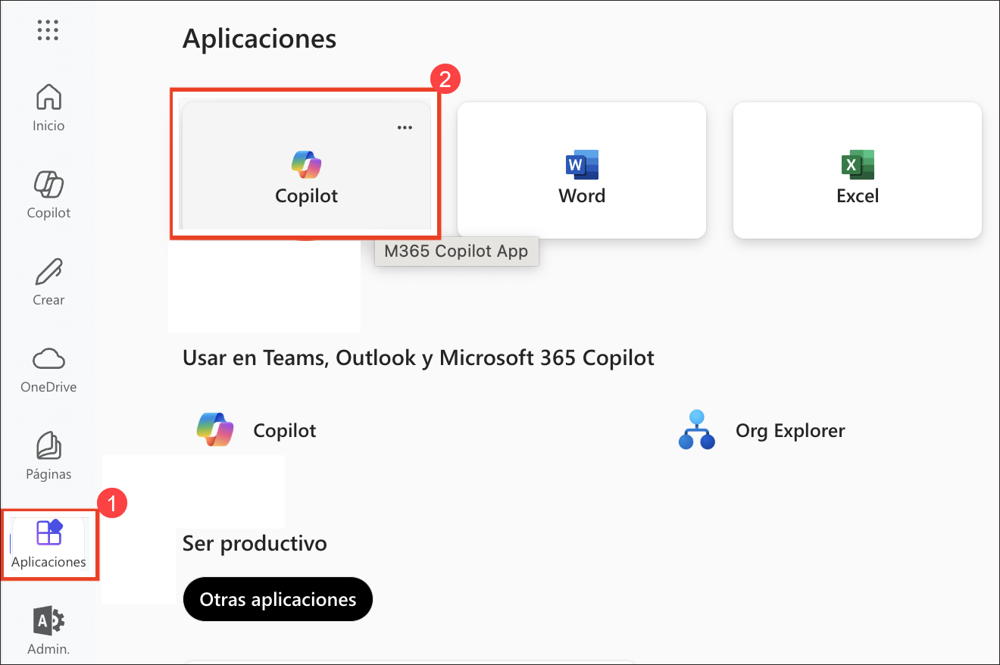

6. 點擊 **新增副駕駛聊天** 並關閉所有其他通知（如果出現）。

     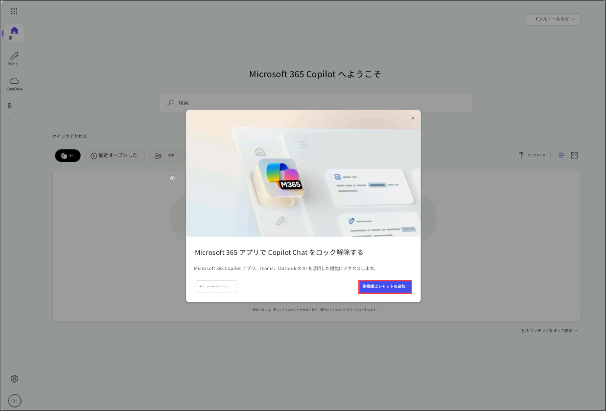

     >**注意**: 如果您無法看到彈出窗口，請刷新頁面。

6. 讓我們來試試 **「圖像生成器」** 的範例。

   - 在文字框中，輸入 **Create an image of a serene beach at sunset with palm trees and gentle waves** **(1)**，然後點擊 **傳送** **(2)** 按鈕。

     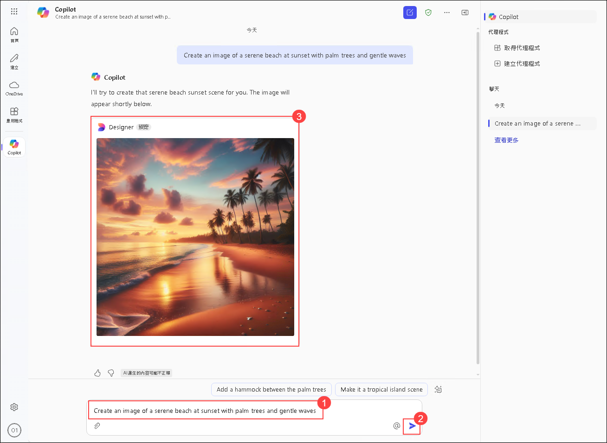

## 回顧

在本次實驗課程中，您已成功運用 AI 驅動工具，透過自然語言提示輕鬆生成引人入勝的視覺內容。

### 恭喜！您已成功完成本次實驗課程!
### 前往下一個實驗課程，請點選導覽連結。
