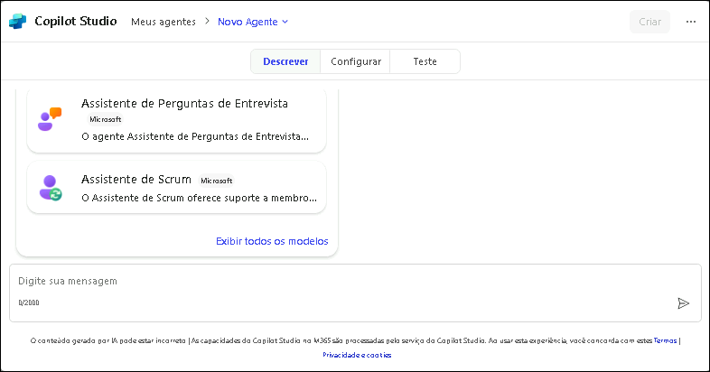
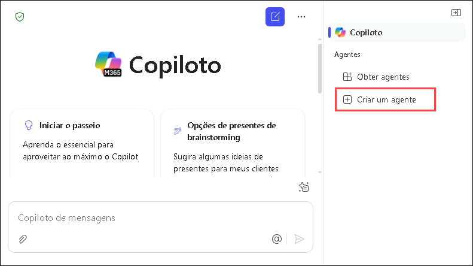
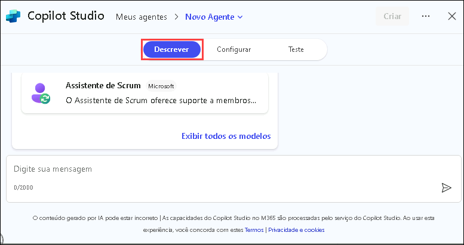
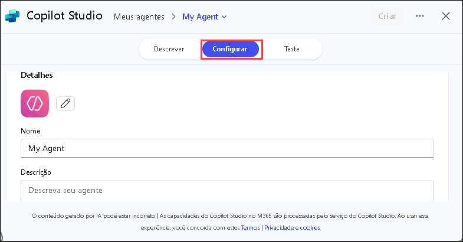
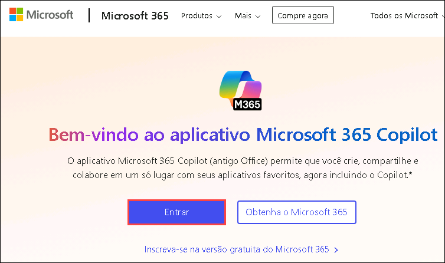
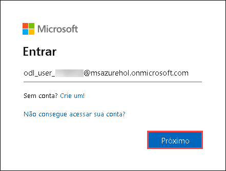
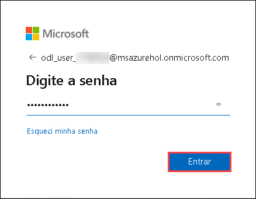
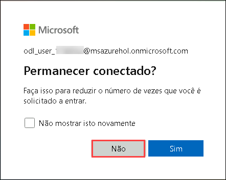
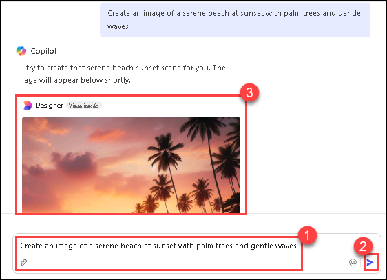

# Exercício 1: Explorar o Construtor de Agentes do Copilot Studio

### Duração Estimada: 30 minutos

## Visão Geral

Neste laboratório, você explorará o recurso de Gerador de Imagens, alimentado pelo Microsoft Designer, dentro do aplicativo Microsoft 365 Copilot. Essa funcionalidade permite que agentes declarativos gerem imagens visualmente atraentes e contextualmente relevantes a partir de instruções fornecidas pelos usuários. Ao navegar pela interface do Copilot, você aprenderá a criar gráficos como ilustrações de paisagens e panfletos de eventos apenas inserindo textos descritivos. O laboratório orienta você no processo de login no aplicativo Microsoft 365 Copilot, acesso ao Criador Visual e experimentação com exemplos do mundo real para vivenciar a facilidade e criatividade da geração de imagens com IA.

## Visão Geral do Construtor de Agentes do Copilot Studio

O Construtor de Agentes do Copilot Studio no Microsoft 365 Copilot permite que você crie agentes (também conhecidos como [agentes declarativos](https://learn.microsoft.com/pt-br/microsoft-365-copilot/extensibility/overview-declarative-agent)) de forma rápida e fácil.

Ele oferece uma experiência de desenvolvimento interativo e imediata dentro do Microsoft 365 Copilot, ideal para projetos simples e rápidos. Se precisar de recursos mais avançados, como Ações para integrar serviços externos, é recomendado utilizar o Microsoft Copilot Studio completo, que oferece um conjunto mais abrangente de ferramentas e funcionalidades.

Use o Construtor de Agentes para criar e personalizar agentes que podem ser usados com o Microsoft 365 Copilot em cenários específicos, como:

* Um agente que oferece dicas de escrita ou apresentação conforme os padrões da organização.
* Um agente de integração de novos colaboradores que responde com informações específicas sobre a nova equipe do usuário e o ajuda a concluir tarefas de onboarding.

   

Você pode especificar fontes de conhecimento dedicadas, incluindo conteúdos no SharePoint e informações fornecidas por conectores do Microsoft Graph. Também é possível testar o agente antes de implantá-lo em conversas com o Copilot ou compartilhá-lo com outras pessoas da organização.

Você pode criar agentes a partir dos seguintes apps e sites:

* microsoft365.com/chat
* office.com/chat
* Cliente web e desktop do Microsoft Teams

   

## Criar agentes com o Construtor de Agentes do Copilot Studio

O Construtor de Agentes oferece uma interface simples para criar agentes declarativos, seja usando linguagem natural ou de forma manual.

Você pode criar o agente de duas formas:

- Pela aba **Descrever**, usando linguagem natural.
- Pela aba **Configurar**, onde você monta o agente manualmente.

### Descreva seu agente:

A aba Descrever permite criar um agente usando linguagem simples. À medida que você fornece informações em forma de conversa, o nome, descrição e instruções do agente são atualizados continuamente para refinar seu comportamento. É uma forma prática e intuitiva de personalizar seu agente. Depois de criado, você pode voltar à aba Descrever e continuar editando via linguagem natural.

Você cria agentes respondendo às perguntas feitas pelo construtor. A cada interação, o agente é atualizado, e as alterações são salvas automaticamente. No entanto, não é possível adicionar um ícone ou fontes de conhecimento pela aba Descrever — para isso, use a aba Configurar.

### Configure seu agente:

Além da aba Descrever, você pode configurar diretamente o comportamento do agente na aba *Configurar*, obtendo mais controle e precisão.

Siga os passos abaixo:

1. Vá até a aba **Configurar** no topo da interface.
2. Preencha os seguintes campos em sequência:

   

   a. **Nome**: Insira um nome único e descritivo (máx. 30 caracteres).
   b. **Ícone**: Carregue uma imagem PNG (máx. 192x192 pixels, 1 MB). Fundos transparentes funcionam melhor.
   c. **Descrição**: Escreva uma descrição clara para ajudar a IA a entender o propósito do agente.
   d. **Instruções**: Defina como o agente deve se comportar e quais tarefas deve realizar (máx. 8.000 caracteres). Se você usou a aba Descrever antes, essas instruções podem ser geradas automaticamente.
   e. **Conhecimento**: Adicione até 20 fontes de conhecimento (sites SharePoint, arquivos, conectores do Microsoft Graph).
   f. **Capacidades**: Adicione funcionalidades especializadas ao seu agente.
   g. **Prompt de exemplo**: Crie prompts de exemplo para mostrar aos usuários o que seu agente pode fazer. Cada prompt deve ter um nome e descrição.

As abas Descrever e Configurar permanecem sincronizadas. Alterações feitas em uma aba aparecerão na outra.

## Melhores práticas para agentes eficazes

Para criar agentes eficientes para o Microsoft 365 Copilot:

1. **Seja específico nas instruções**: Defina claramente o que o agente deve ou não fazer.
2. **Escolha bem as fontes de conhecimento**: Priorize conteúdos relevantes e de qualidade.
3. **Use linguagem natural nas descrições**.
4. **Crie prompts iniciais úteis**: Oriente os usuários com bons exemplos.
5. **Tenha iterações baseadas no feedback:** Melhore seu agente constantemente baseado nas experiências do seus usuários.
6. **Atenção à privacidade e segurança**: Cuidado com as fontes conectadas.
7. **Mantenha o foco**: Agentes com funções específicas costumam funcionar melhor.

Seguindo todo o processo — da criação ao teste, implantação e gerenciamento — você poderá criar agentes que aumentam a produtividade e oferecem assistência especializada no Microsoft 365 Copilot.

## Objetivo

* Tarefa 01: Gerador de imagens

## Tarefa 01: Gerador de imagens

O recurso de geração de imagens permite que agentes declarativos criem imagens com base nas instruções dos usuários. Ele utiliza a funcionalidade existente do [Designer](https://designer.microsoft.com/) para gerar gráficos visualmente atrativos e contextualmente adequados. Os recursos incluem:

1. Abra uma nova aba no navegador Edge e acesse o [Microsoft 365 Copilot](https://m365.cloud.microsoft/) **(1)**, clique em **Entrar** **(2)**.

   

2. Na aba **Entrar no Microsoft Azure**, você verá a tela de login. Digite o seguinte e-mail/nome de usuário **(1)** e clique em **Avançar** **(2)**.

   - **Email/Nome de usuário:** AzureAdUserEmail

     

3. Agora digite a seguinte senha **(1)** e clique em **Entrar** **(2)**.

   - **Senha:** AzureAdUserPassword

     

4. Se aparecer o pop-up **Permanecer conectado?**, clique em **Não**.

   

5. No menu à esquerda, clique em **Copilot** **(1)**.

6. Vamos testar exemplos com o **Gerador de imagens**.

   * Na caixa de texto, digite **Crie uma imagem de uma praia serena ao pôr do sol com coqueiros e ondas suaves** **(1)** e clique no botão **Enviar** **(2)**.

     

## Revisão

Neste laboratório, você utilizou ferramentas com inteligência artificial para gerar visuais impactantes a partir de comandos em linguagem natural.

### Você concluiu o laboratório com sucesso!