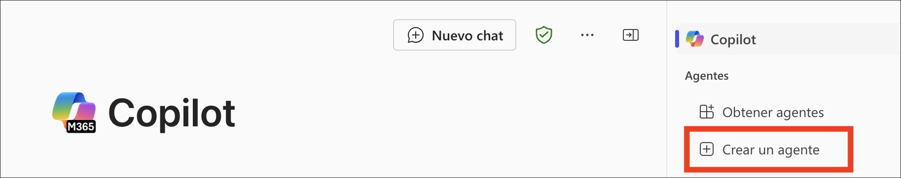
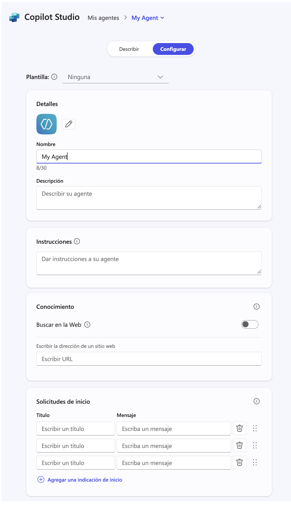

# 演習 1: Copilot Studio エージェント ビルダーを探索する

### 推定所要時間: 30 分

## 概要

このラボでは、Microsoft 365 Copilot アプリ内の Microsoft Designer によって提供される 画像生成機能 を探索します。この機能を使用すると、宣言型エージェント がユーザーのプロンプトから視覚的に魅力的でコンテキストに合った画像を生成できます。Copilot インターフェースを操作することで、風景のイラストやイベントのフライヤーなどを記述的なテキストを入力するだけで作成できる方法を学びます。ラボでは、Microsoft 365 Copilot アプリにサインインし、Visual Creator にアクセスし、実際のユースケースを試すことで、AIを活用した画像生成の簡便さと創造性を体験できます。

## Copilot Studio エージェント ビルダーの概要

Microsoft 365 Copilot の Copilot Studio エージェント ビルダー を使用すると、エージェント ([宣言型エージェント](https://learn.microsoft.com/microsoft-365-copilot/extensibility/overview-declarative-agent)とも呼ばれます) を簡単かつ迅速に構築できます。

Copilot Studio エージェント ビルダー は、Microsoft 365 Copilot 内で インタラクティブなAI開発体験 を提供し、迅速かつシンプルなプロジェクトに最適です。外部サービスの統合が必要な高度な機能（アクションなど）が求められる場合は、より包括的なツールや機能を備えた Microsoft Copilot Studio の利用を推奨します。

Copilot Studio エージェント ビルダーを使用して、次のような シナリオ特化型エージェント を作成・カスタマイズできます:

  - 組織の基準に合わせた文章作成やプレゼン指導を行うエージェント。
  - 新しいチームについての情報を提供し、オンボーディングのタスクを支援するエージェント。

    

Microsoft Graph コネクタの情報や SharePoint のコンテンツを含む専用の知識ソースを指定できます。また、Microsoft 365 Copilot 内の会話で使用する前に、エージェントの動作をテストし、組織内で共有できます。

エージェントは以下のアプリやサイトから作成可能です:

- microsoft365.com/chat
- office.com/chat
- Microsoft Teams のデスクトップ版と ウエブ クライアント

  

## Copilot Studio エージェント ビルダーを活用したエージェントの構築

Copilot Studio エージェント ビルダーでは、自然言語 または 手動設定 によって宣言型エージェントを簡単に構築できます。

- 宣言型エージェントは、2つの方法で作成できます:

  - **説明** タブを使用して、自然言語で作成する。
  - **構成** タブを使用して、手動で構築する。

- **エージェントの記述 (説明 タブ)**: 

  説明タブを使用すると、シンプルな自然言語でエージェントを作成できます。会話形式で情報を入力することで、エージェントの名前、説明、指示が継続的に更新され、エージェントの動作が洗練されていきます。この方法は、直感的で簡単にカスタマイズできる自然言語ベースの作成体験を提供します。エージェントの作成後も、説明タブを使用して、自然言語で更新が可能です。

  エージェントの作成は、エージェント ビルダーが提示する質問に回答することで進めます。会話の各ターンごとにエージェントが更新され、変更は自動的に保存されます。会話の任意のタイミングでエージェントを修正できます。名前、説明、指示の変更は自動的に適用されますが、アイコンや知識ソースの追加は 説明タブでは行えません。これらの設定を追加するには、構成タブを使用してください。

  

- **エージェントの設定 (構成 タブ)**:

  説明タブに加えて、構成タブを使用してエージェントの動作を直接設定することもできます。この方法を使うことで、エージェントの設定をより細かく制御し、精度を高めることができます。

  手動でエージェントを設定する手順:

  1. エージェント ビルダーのインターフェース上部にある **構成** タブに移動します。
  2. 以下の項目を順番に設定します。
      
      

     a. **名前:** エージェントに説明的でユニークな名前を入力します（最大30文字）。
     
     b. **アイコン:** PNG画像（最大192x192ピクセル、1MB）をアップロードして、エージェントに明確な視覚的識別を付与します。透明な背景の画像が最適です。
     
     c. **説明:** LLMがエージェントの目的を理解しやすくなるよう、明確な説明を作成します。この説明はアプリカタログにも表示されます。
     
     d. **指示:** エージェントの動作や実行するタスクを定義します。この指示はMicrosoft 365 Copilotの機能を拡張します（最大8,000文字）。説明タブを使用した場合、一部の内容は自動生成される可能性があります。詳細は、[効果的な指示を書く](https://learn.microsoft.com/microsoft-365-copilot/extensibility/declarative-agent-instructions)を参照してください。
     
     e. **ナレッジ:** 最大20件の知識ソースを追加できます。これには、SharePointサイト、フォルダー、ファイル、Microsoft Graphコネクタが含まれます。詳細な手順は、[知識ソースの追加](https://learn.microsoft.com/microsoft-365-copilot/extensibility/copilot-studio-agent-builder-build#add-knowledge-sources) を参照してください。
     
     f. **能力:** 専門的な機能を追加して、エージェントを強化できます。詳細は、[宣言型エージェントに機能を追加する](https://learn.microsoft.com/microsoft-365-copilot/extensibility/add-agent-capabilities)を参照してください。
     
     g. **スタータープロンプト:** エージェントの使い方をユーザーに理解してもらうためのサンプルプロンプトを作成します。各プロンプトには、名前と説明を設定し、ユーザーが適切に活用できるようにします。

説明 タブと 構成 タブは作業中に常に同期されています。構成 タブで行った変更は 説明 タブに戻った際に反映され、逆も同様です。開発の各段階で最適なアプローチを選択し、自由にタブを切り替えて使用できます。

## 効果的なエージェントを作成するためのベストプラクティス

Microsoft 365 Copilot のための効果的なエージェントを作成するには:

1. **指示を明確に定義する:** エージェントが行うべきことと、行うべきでないことを明確に設定する。

2. **知識ソースを慎重に選定する:** 高品質で関連性の高いコンテンツソースを選ぶ。

3. **自然言語で説明を記述する:** エージェントの目的を分かりやすく伝える説明を作成する。

4. **役立つスタータープロンプトを作成する:** ユーザーが適切な問い合わせをできるようなサンプルプロンプトを用意する。

5. **フィードバックに基づいて改良する:** ユーザーの体験をもとに継続的に改善を行う。

6. **プライバシーとセキュリティを考慮する:** エージェントに接続するデータソースに注意を払う。

7. **焦点を絞る:** 多くのことを詰め込みすぎず、いくつかのタスクを確実にこなせるエージェントを設計する。

この設計からテスト、展開、管理までのプロセスを確実に実施することで、生産性を向上させ、Microsoft 365 Copilot を活用した専門的な支援を提供できる効果的なエージェントを構築できます。

## 目的

- タスク 01: 画像生成

## タスク 01: 画像生成

画像生成機能は、宣言型エージェントがユーザーのプロンプトに基づいて画像を生成することを可能にします。画像生成機能は、既存の [Designer](https://designer.microsoft.com/) の機能を活用し、視覚的に魅力的でコンテキストに適したグラフィックを作成し、以下の機能を提供します：

1. Edgeブラウザーで新しいタブを開き、[Microsoft 365 Copilot アプリ](https://m365.cloud.microsoft/) **(1)** を開き、**サインイン (2)** をクリックします。

     

2. 「**Microsoft Azure にサインイン**」タブで、ログイン画面が表示されます。**Resources** タブの資格情報を使用してログインしてください。
   
4. **サインインしたままですか？** というポップアップが表示された場合は、**いいえ** をクリックします。

   

5. Copilotチャットページに移動します。Image generatorの例を試してみましょう。 

   - テキストボックスに **「Create an image of a serene beach at sunset with palm trees and gentle waves」 (1)** と入力し、**送信 (2)** ボタンをクリックします。
   
     >**任意:** 日本語訳のプロンプトは: **「ヤシの木と穏やかな波のある、夕暮れ時の静かなビーチのイメージを作成します」**

     

## レビュー

このラボでは、AIを活用したツールを使い、自然言語のプロンプトから魅力的なビジュアルを簡単に生成しました。

### ラボを正常に完了しました！
