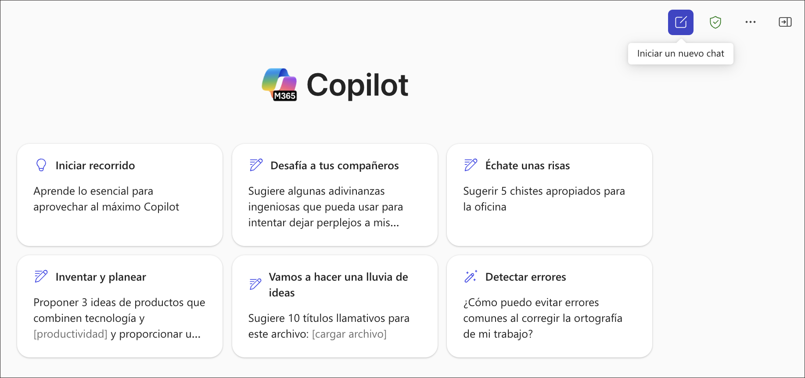

# Ejercicio 1: Explora el generador de agentes de Copilot Studio

### Duración estimada: 30 minutos

## Descripción general

En este laboratorio, explorarás la capacidad de Generador de Imágenes impulsada por Microsoft Designer dentro de la aplicación Microsoft 365 Copilot. Esta función permite a los agentes declarativos generar imágenes visualmente atractivas y contextualmente relevantes a partir de indicaciones del usuario. Navegando por la interfaz de Copilot, aprenderás a crear gráficos como ilustraciones escénicas y volantes de eventos simplemente ingresando texto descriptivo. El laboratorio te guía para iniciar sesión en la aplicación Microsoft 365 Copilot, acceder al Creador Visual y experimentar con ejemplos reales para vivir la facilidad y creatividad de la generación de imágenes impulsada por IA.

## Descripción general del generador de agentes de Copilot Studio

El generador de agentes de Copilot Studio en Microsoft 365 Copilot te permite crear agentes (también conocidos como [agentes declarativos](https://learn.microsoft.com/en-us/microsoft-365-copilot/extensibility/overview-declarative-agent)) para Microsoft 365 Copilot de manera fácil y rápida.

El generador de agentes de Copilot Studio ofrece una experiencia de desarrollo de IA interactiva e inmediata dentro de Microsoft 365 Copilot, ideal para proyectos rápidos y sencillos. Si necesitas capacidades más avanzadas como Actions para integrar servicios externos, se recomienda usar la versión completa de Microsoft Copilot Studio, que proporciona un conjunto completo de herramientas y funciones para requisitos más complejos.

Utiliza el generador de agentes de Copilot Studio para crear y personalizar agentes que pueden usarse con Microsoft 365 Copilot para cubrir casos de uso específicos, como:

  - Un agente que brinde asesoría en redacción o presentaciones adaptadas a los estándares de la organización.
  - Un agente de incorporación de equipo que responda con información específica sobre el nuevo equipo del usuario y lo ayude a completar tareas de onboarding.

    

Puedes especificar fuentes de conocimiento dedicadas, incluyendo contenido en SharePoint e información proporcionada por conectores de Microsoft Graph. También puedes probar el agente antes de desplegarlo para usarlo en tus conversaciones con Microsoft 365 Copilot o compartirlo con otros en tu organización.

Puedes crear agentes desde las siguientes aplicaciones y sitios:

- microsoft365.com/chat
- office.com/chat
- Cliente web y de escritorio de Microsoft Teams

  

## Crea agentes con el generador de agentes de Copilot Studio

El generador de agentes de Copilot Studio proporciona una interfaz sencilla que puedes usar para crear agentes declarativos de manera rápida y fácil, ya sea usando lenguaje natural o manualmente.

- Puedes crear tu agente declarativo de dos formas:

  - A través de la pestaña **Describe**, usando lenguaje natural.
  - A través de la pestaña **Configure**, donde puedes construirlo manualmente.

- **Describe tu agente**:

  La pestaña Describe te permite crear un agente usando lenguaje sencillo. A medida que proporcionas información de forma conversacional, el nombre, la descripción y las instrucciones del agente se actualizan continuamente para refinar su comportamiento. Esta experiencia ofrece una forma rica pero simple de crear un agente personalizado usando lenguaje natural. Después de crear un agente, puedes volver a la pestaña Describe para actualizarlo usando lenguaje natural.

  Construyes agentes en lenguaje sencillo respondiendo a las preguntas que el generador de agentes te hace. El generador actualiza progresivamente el agente en cada turno de la conversación, y los cambios se guardan automáticamente. Puedes hacer actualizaciones en cualquier turno. Los cambios en el nombre, descripción e instrucciones del agente se actualizan automáticamente. Sin embargo, no puedes agregar un icono o fuentes de conocimiento directamente desde la pestaña Describe. Usa la pestaña Configure para agregar un icono, fuentes de conocimiento o capacidades.

  

- **Configura tu agente**:

  Además de usar la pestaña Describe, también puedes configurar directamente el comportamiento del agente usando la pestaña Configure. Este método te da más control y precisión sobre la configuración de tu agente.

  Sigue estos pasos para configurar tu agente manualmente:

   1. Navega a la pestaña **Configure** en la parte superior de la interfaz del generador de agentes.
   2. Configura cada uno de los siguientes campos en secuencia:

      
      

      a. **Name**: Ingresa un nombre descriptivo y único para tu agente (máximo 30 caracteres).
     
      b. **Icon**: Sube una imagen PNG (máx. 192x192 píxeles, 1 MB) para darle una identidad visual distintiva a tu agente. Las imágenes con fondo transparente funcionan mejor.
     
      c. **Description**: Redacta una descripción clara que ayude al LLM a entender el propósito de tu agente. Esta descripción también aparecerá en el catálogo de aplicaciones.
     
      d. **Instructions**: Define cómo debe comportarse tu agente y qué tareas debe realizar. Estas instrucciones amplían las capacidades de Microsoft 365 Copilot (máximo 8,000 caracteres). Si usaste primero la pestaña Describe, estas pueden generarse automáticamente. Para orientación, consulta [Write effective instructions](https://learn.microsoft.com/en-us/microsoft-365-copilot/extensibility/declarative-agent-instructions).
     
      e. **Suggested Prompts**: Crea ejemplos de prompts para ayudar a los usuarios a entender lo que tu agente puede hacer. Cada prompt debe tener un nombre y una descripción para guiar a los usuarios.

      f. **Knowledge**: Agrega hasta 20 fuentes de conocimiento, que pueden incluir sitios de SharePoint, carpetas, archivos o conectores de Microsoft Graph. Para obtener instrucciones detalladas, consulta la documentación de [Add knowledge sources](https://learn.microsoft.com/en-us/microsoft-365-copilot/extensibility/copilot-studio-agent-builder-build#add-knowledge-sources).

Las pestañas Describe y Configure se mantienen sincronizadas mientras trabajas. Cualquier cambio que realices en la pestaña Configure se reflejará al volver a la pestaña Describe, y viceversa. Puedes cambiar libremente entre pestañas para usar el enfoque que prefieras en cada etapa del desarrollo.

## Mejores prácticas para agentes efectivos

Para crear los agentes más efectivos para Microsoft 365 Copilot:

1. **Sé específico con las instrucciones**: Define claramente lo que tu agente debe y no debe hacer.

2. **Selecciona cuidadosamente las fuentes de conocimiento**: Elige fuentes de contenido relevantes y de alta calidad.

3. **Usa lenguaje natural en las descripciones**: Escribe descripciones que comuniquen el propósito de tu agente.

4. **Crea prompts de inicio útiles**: Guía a los usuarios con ejemplos de consultas efectivas.

5. **Itera según la retroalimentación**: Mejora continuamente tu agente según la experiencia de los usuarios.

6. **Considera la privacidad y seguridad**: Ten en cuenta las fuentes de datos que conectas a tu agente.

7. **Mantén el enfoque**: Los agentes que hacen pocas cosas bien suelen funcionar mejor que los que intentan hacer demasiado.

Siguiendo este proceso completo desde la creación hasta las pruebas, el despliegue y la gestión, puedes construir agentes efectivos que mejoren la productividad y brinden asistencia especializada a través de Microsoft 365 Copilot.

## Objetivo

- Tarea 01: Generador de imágenes

## Tarea 01: Generador de imágenes

La capacidad de generador de imágenes permite a los agentes declarativos generar imágenes basadas en indicaciones del usuario. El generador de imágenes utiliza la funcionalidad existente de [Designer](https://designer.microsoft.com/) para crear gráficos visualmente atractivos y contextualmente relevantes, e incluye las siguientes características:

1. Abre una nueva pestaña en el navegador Edge y accede a la [aplicación Microsoft 365 Copilot](https://m365.cloud.microsoft/) **(1)**, y haz clic en **Sign in** **(2)**.

    

2. En la pestaña **Sign into Microsoft Azure**, verás una pantalla de inicio de sesión. Ingresa el siguiente correo/usuario **(1)** y haz clic en **Next** **(2)**.
   
   - **Email/Username:** AzureAdUserEmail

     

3. Ahora ingresa la siguiente contraseña **(1)** y haz clic en **Sign in** **(2)**.

   - **Password:** AzureAdUserPassword

      
   
4. Si ves la ventana emergente **Stay Signed in?**, haz clic en **No**.

   

5. Desde el panel izquierdo selecciona **Apps Launcher(1)** y haz clic en **Microsoft 365 Copilot(2)**.

    

6. Haz clic en **Add Copilot Chat** y cierra cualquier otra notificación si aparece.

    

7. Probemos ejemplos del **Generador de imágenes**.

   - En el cuadro de texto, ingresa **Create an image of a serene beach at sunset with palm trees and gentle waves** **(1)**, haz clic en el botón **send** **(2)**.

     

## Revisión

En este laboratorio, has utilizado herramientas impulsadas por IA para generar fácilmente contenido visual atractivo a partir de indicaciones en lenguaje natural.

### ¡Has completado exitosamente el laboratorio!
