# 실습 2: Copilot Studio로 인사 지원 에이전트 만들기

### 예상 소요 시간: 30분

## 개요

이 실습의 목표는 조직 내 인사 이동 과정을 간소화하고 고도화하는 데 있습니다. 참가자는 Microsoft 365 Copilot을 활용하여 적합한 내부 인재를 식별하고, 맞춤형 인사 이동 계획을 수립하며, 효과적인 커뮤니케이션 자료를 생성하는 방법을 학습합니다. 또한, Copilot Studio를 통해 워크플로우를 자동화하고 온보딩 및 교육 자료를 개발하며, 성과를 체계적으로 모니터링하는 방법도 익히게 됩니다.
AI 기반 도구를 적극적으로 활용함으로써 인사 이동 절차를 보다 원활하고 효율적으로 만들고, 인재의 내부 이동성을 향상시키며, 직원이 새로운 역할에 성공적으로 정착할 수 있도록 지원하는 데 중점을 둡니다.

## 시나리오

귀하의 회사인 Contoso Enterprises는 새로운 데이터 분석가(Data Analyst)를 채용할 예정이며, Microsoft 365 Copilot을 활용하여 전체 채용 및 온보딩 프로세스를 효율적으로 간소화하고자 합니다. 인사 부서는 후보자를 신속하게 선별하고, 맞춤형 교육 자료를 개발하며, 피드백을 수집하고 성과를 체계적으로 평가하는 것을 목표로 하고 있습니다.

## 목표

- 과제 1: 신속한 후보자 선별
- 과제 2: 교육 자료 개발
- 과제 3: 피드백 수집
- 과제 4: 성과 평가

## 아키텍처 다이어그램

  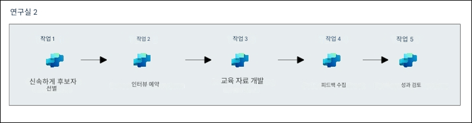

## 과제 1: 신속한 후보자 선별

목표: 데이터 분석가 직무에 지원한 다수의 지원서를 신속하게 평가합니다.

작업: 인사 담당자는 Microsoft 365 Copilot을 활용하여 제출된 이력서를 분석하고, 관련 경력, 기술 역량, 학력 배경 등 주요 기준에 따라 후보자를 필터링합니다. Copilot은 이러한 기준에 부합하는 상위 후보자를 자동으로 강조 표시하여, 보다 효율적인 검토와 의사결정을 지원합니다.

1. 왼쪽 패널에서 **OneDrive (1)** 를 클릭한 후, **내 파일(My files) (2)**을 클릭합니다.

      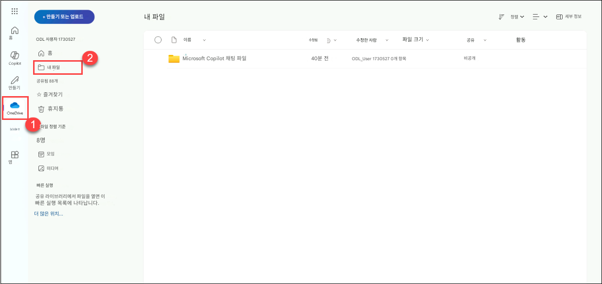

1. **+ 새로 만들기(Add new) (1)** 를 클릭하고 **폴더 업로드(Folder upload) (2)** 를 선택합니다.

      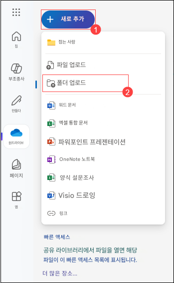

1. `C:\LabFiles\Day-1-Build-Agents-with-Copilot-Studio\Data` 경로로 이동한 후, `CV` 폴더를 클릭하고 **업로드** 를 선택합니다.
     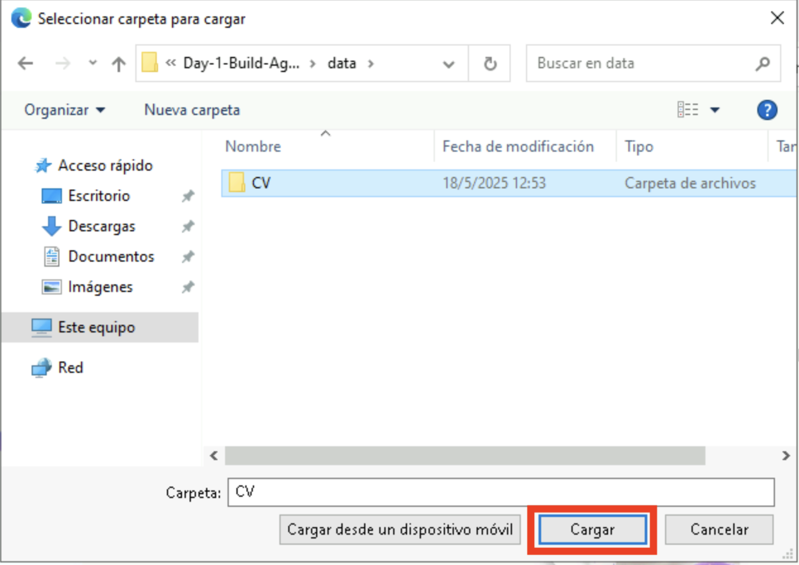

1. 다시 한 번 클릭하세요 **+ 새로 추가** 를 클릭한 후 **폴더 업로드** 를 선택합니다.

1. `C:\LabFiles\Day-1-Build-Agents-with-Copilot-Studio` 경로로 이동하여 `data` 폴더를 클릭한 후 **업로드(Upload)** 를 클릭합니다.
`이 사이트에 19개 파일을 업로드하시겠습니까? (Upload 19 files to this site?)` 팝업이 나타나면 **업로드(Upload)** 를 선택합니다.

   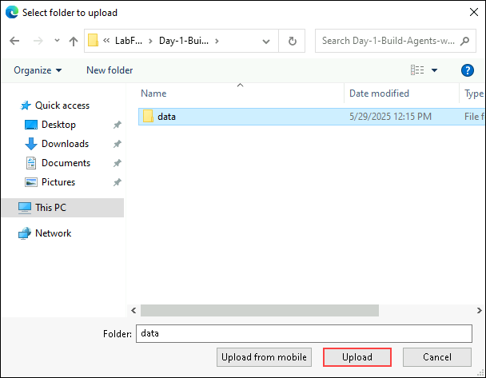

1. Copilot 창에서 **Copilot 채팅** **(1)**을 클릭하고 **콘텐츠 추가** **(2)** 아이콘을 클릭한 후 **이 장치에서 업로드(3)**를 선택합니다.

   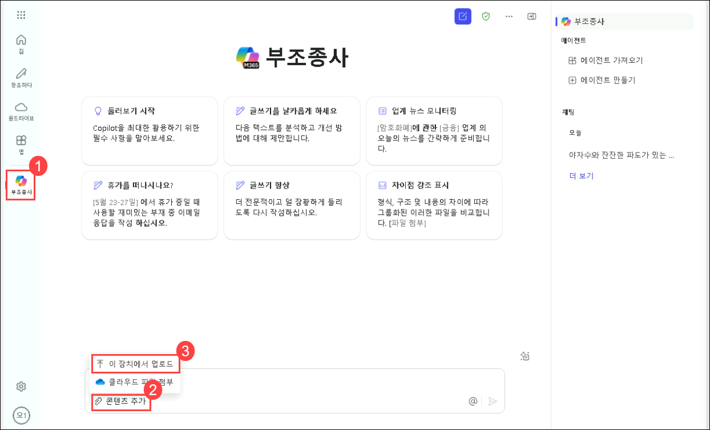

1. 파일 탐색기 팝업 창에서 `C:\LabFiles\Day-1-Build-Agents-with-Copilot-Studio\Data\CV` **(1)** 폴더로 이동한 후, **처음 3개의** **(2)** 파일을 선택하고 **열기** **(3)** 를 클릭합니다.

   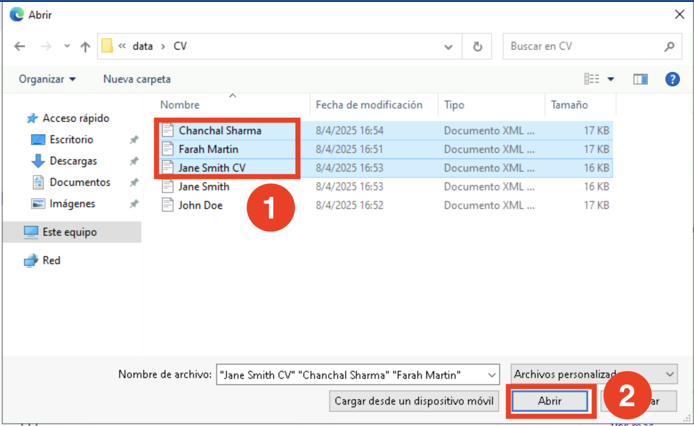

1. **Copilot 채팅** 에서 3개의 파일이 성공적으로 업로드되면 **보내기** 버튼을 클릭합니다.

   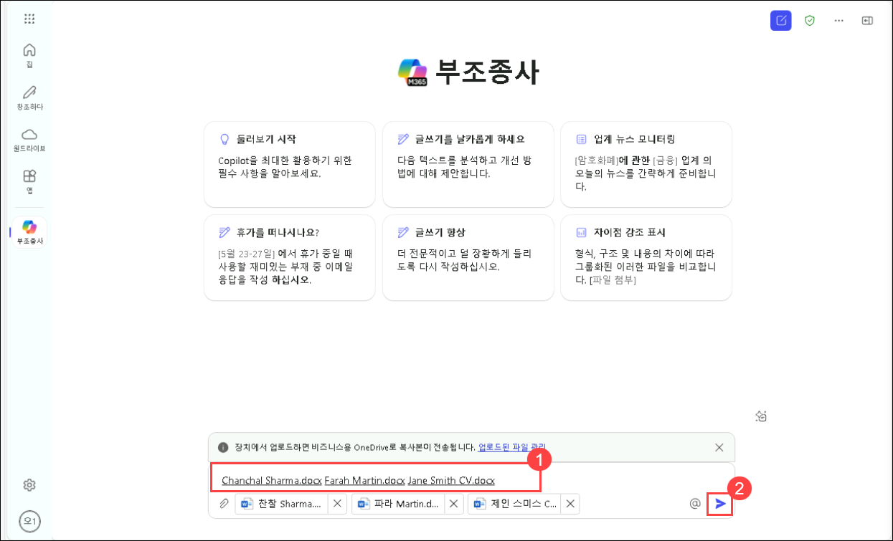

1. Copilot 창에서 **Copilot 채팅** **(1)** 을 클릭한 후, **콘텐츠 추가 (2)** 아이콘을 클릭합니다.

   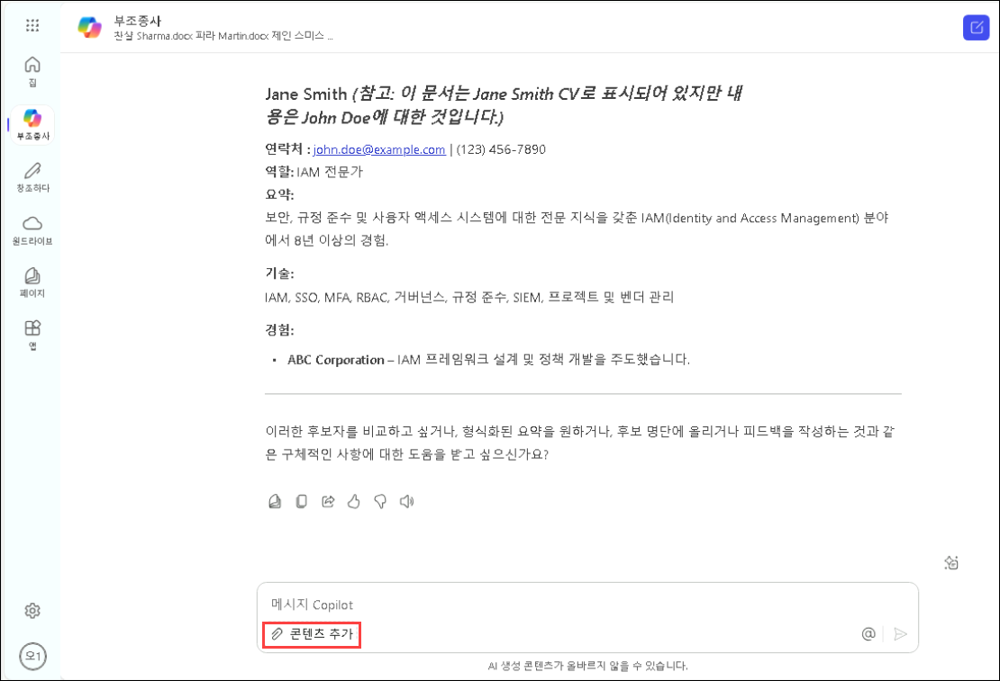

1. 파일 탐색기 팝업 창에서 `C:\LabFiles\Day-1-Build-Agents-with-Copilot-Studio\Data\CV` **(1)** 폴더로 이동한 후, **마지막 2개** **(2)** 파일을 선택하고 **열기** **(3)** 를 클릭합니다.

   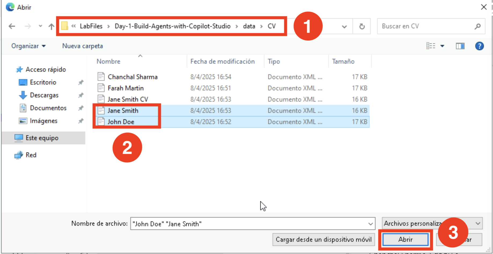

1. **Copilot 채팅** 에서 **2개의 파일** 이 성공적으로 업로드되면 **보내기** 버튼을 클릭합니다.

   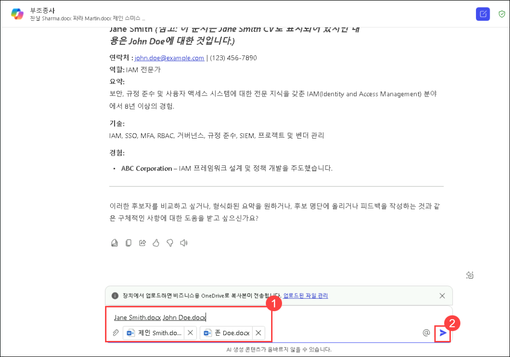

1. 채팅 창에 아래 프롬프트를 입력하고 **보내기** 버튼을 클릭합니다:
    ```
    Microsoft 365 Copilot, please help me filter and shortlist resumes of Data Analyst candidates based on required qualifications such as experience in SQL, Python, and data visualization tools.
    ```
    ```
    Microsoft 365 Copilot, 데이터 분석가 지원자의 이력서를 필터링하고, SQL, Python, 데이터 시각화 도구 등의 필수 자격 요건을 기준으로 후보자를 선별하는 데 도움을 주세요.
    ```

1. 다음 프롬프트를 입력한 후 **보내기** 버튼을 클릭합니다:

    ```
    Create a summary report of top Data Analyst candidates, including their skills, work experience, and educational background.
    ```
    ```
    상위 데이터 분석가 후보자들의 기술, 업무 경력, 학력 배경을 포함한 요약 보고서를 작성해 주세요.
    ```

   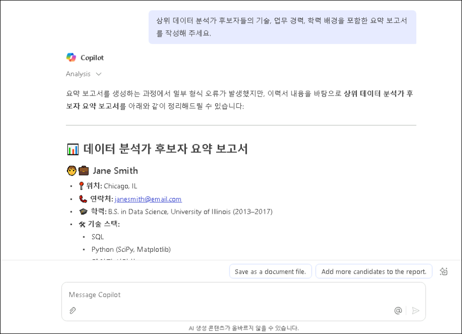

**결과**: 인사부는 가장 적합한 후보자를 효율적으로 식별함으로써 채용에 소요되는 시간을 절감하고, 보다 집중적인 채용 활동을 수행할 수 있습니다.

## 과제 2: 교육 자료 개발

목표: 신입 직원을 위한 종합적인 교육 자료를 준비합니다.

작업: 인사부는 Copilot을 활용하여 직무별 가이드, 회사 정책, 사용되는 도구 및 기술 개요를 포함한 맞춤형 교육 문서를 작성합니다. Copilot은 각 교육 자료가 신입 직원의 역할과 업무 요구사항에 정확히 부합하도록 지원하여, 실질적이고 효과적인 온보딩이 가능하도록 합니다.

1. 채팅 창에 아래 프롬프트를 입력하고 **보내기** 버튼을 클릭합니다.

    ```
    Generate a comprehensive onboarding training plan in the chat for the new Data Analyst, including topics like company policies, data tools training, and team introductions.
    ```
    ```
   새로운 데이터 분석가를 대상으로 회사 정책, 데이터 도구 교육, 팀 소개 등의 주제를 포함하여 포괄적인 온보딩 교육 계획을 채팅에서 작성합니다.
    ```

    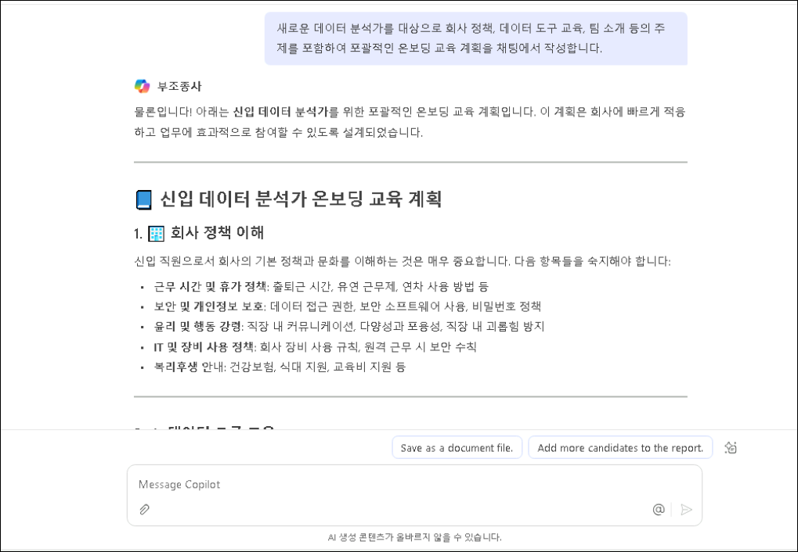

1. 아래 프롬프트를 입력한 후 **보내기** 버튼을 클릭합니다.
    ```
    Create an interactive training presentation covering data analysis best practices and key performance metrics.
    ```
    ```
   데이터 분석 모범 사례와 핵심 성과 지표를 다루는 교육용 프레젠테이션을 작성해 주세요.
    ```

    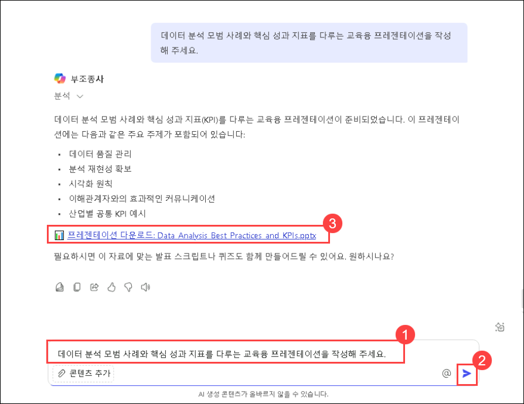

    > **참고**: 이 프롬프트를 실행하면 다운로드 가능한 PowerPoint 프레젠테이션이 생성되며, 이후 자유롭게 편집하거나 디자인할 수 있습니다. 파일이 자동으로 다운로드되지 않는 경우, 스크린샷에 표시된 것처럼 프레젠테이션 제목의 하이퍼링크를 통해 직접 다운로드할 수 있습니다.
    
    > **참고**: 프롬프트 실행 후 PowerPoint 프레젠테이션 다운로드 옵션이 표시되지 않는 다면, 위의 프롬프트를 다시 실행해 보시기 바랍니다.

결과: 신입 직원은 체계적으로 구성된 교육 자료를 통해 빠르게 업무에 적응하고, 효과적으로 직무를 수행할 수 있습니다.

## 과제 3: 피드백 수집

목표: 신입 직원과 면접관으로부터 피드백을 수집하여 채용 및 온보딩 프로세스를 지속적으로 개선합니다.

작업: 인사부는 Copilot을 활용하여 신입 직원과 면접관에게 피드백 설문지를 생성하고 배포합니다. Copilot은 설문 응답을 자동으로 수집하고 분석하여, 현재 프로세스의 강점과 개선이 필요한 영역에 대한 인사이트를 제공합니다.


1. 채팅 창에 아래 프롬프트를 입력한 후 **보내기** 버튼을 클릭합니다:

    ```
    Create a feedback form for interviewers to evaluate Data Analyst candidates based on technical skills, problem-solving abilities, and cultural fit.
    ```

    ```
    면졉관이 데이터 분석가 후보자들을 기술 역량, 문제 해결 능력, 조직 문화 적합도 등을 기준으로 평가할 수 있도록 피드백 양식을 작성해 주세요.
    ```

1. 아래 프롬프트를 입력한 후 **보내기** 버튼을 클릭합니다:
    ```
    Send out a survey to new hires to gather feedback on their onboarding experience and identify areas for improvement.
    ```
    ```
    신입 직원들에게 온보딩 경험에 대한 피드백을 수집하고, 개선이 필요한 영역을 파악할 수 있도록 설문을 발송해 주세요.
    ```

결과: 인사부는 유의미한 피드백을 바탕으로 채용 및 온보딩 절차를 개선하고, 향후 신입 직원에게 보다 향상된 경험을 제공할 수 있습니다.

## 과제 4: 성과 평가

목표: 신입 직원의 업무 진행 상황과 성장 상태를 평가하기 위해 정기적인 성과 평가를 실시합니다.

작업: 인사 담당자는 Copilot을 활용하여 성과 평가 템플릿을 생성하고, 평가 미팅 일정을 예약합니다. Copilot은 직원의 성과를 추적하고, 동료 피드백을 수집하며, 종합적인 성과 보고서를 작성하는 데 도움을 줍니다.


1. 채팅 창에 아래 프롬프트를 입력한 후 **보내기** 버튼을 클릭합니다:
    ```
    Set up a performance review schedule for the new Data Analyst, with quarterly reviews and goal-setting sessions.
    ```
    ```
    신입 데이터 분석가를 위한 성과 평가 일정을 설정해 주세요. 분기별 평가 및 목표 설정 세션을 포함해야 합니다.
    ```

1. 아래 프롬프트를 입력한 후 **보내기** 버튼을 클릭합니다:
    ```
    Generate a template for performance review reports, including sections for achievements, areas of improvement, and future goals.
    ```
    ```
    성과 평가 보고서 템플릿을 생성해 주세요. 템플릿에는 달성한 성과, 개선이 필요한 영역, 향후 목표에 대한 섹션이 포함되어야 합니다.
    ```

결과: 신입 직원은 건설적인 피드백과 지원을 통해 직무 역량을 성장시키고, 회사 내에서 장기적인 성공에 기여할 수 있습니다.

## 복습

Contoso Enterprises는 새로운 데이터 분석가를 채용하는 과정에 있으며, Microsoft 365 Copilot을 활용하여 채용 및 온보딩 프로세스를 간소화하고자 합니다. 인사부는 다음과 같은 핵심 목표 달성을 지향합니다:

- 후보자 신속 선별: 자격 요건과 경력을 기준으로 후보자를 효율적으로 필터링하고 선별합니다.
- 교육 자료 개발: 신입 데이터 분석가를 위한 종합적인 온보딩 자료와 직무 교육 계획을 수립합니다.
- 피드백 수집: 면접관과 신입 직원으로부터 피드백을 수집하여 채용 및 온보딩 경험을 개선합니다.
- 성과 평가 운영: 신입 직원의 성장과 업무 적응을 추적하기 위해 정기적인 성과 평가 및 목표 설정 미팅을 실시합니다.

Microsoft 365 Copilot를 활용하여 Contoso Enterprises는 전반적인 채용 및 온보딩 프로세스의 효율성과 효과를 높이고, 모든 참여자에게 보다 원활하고 일관된 경험을 제공하는 것을 목표로 합니다.

### 실습을 성공적으로 완료하셨습니다!
