# Exercício 2: Criar um Agente de RH com o Copilot Studio

### Duração Estimada: 30 minutos

## Visão Geral

Este laboratório tem como objetivo otimizar e aprimorar o processo de transições de funcionários dentro de uma organização. Os participantes aprenderão a usar o Microsoft 365 Copilot para identificar candidatos internos adequados, criar planos de transição personalizados e gerar materiais de comunicação eficazes. Também utilizarão o Copilot Studio para automatizar fluxos de trabalho, desenvolver materiais de integração e treinamento, e configurar mecanismos de monitoramento de desempenho. Ao utilizar essas ferramentas com tecnologia de IA, o foco do laboratório é garantir um processo de transição tranquilo e eficiente, promovendo a mobilidade interna e apoiando o sucesso dos colaboradores em seus novos cargos.

## Cenário

A sua empresa, Contoso Enterprises, está contratando um novo Analista de Dados e deseja agilizar todo o processo de recrutamento e integração usando o Microsoft 365 Copilot. O departamento de RH quer fazer a triagem de candidatos rapidamente, desenvolver materiais de treinamento, coletar feedback e conduzir avaliações de desempenho.

## Objetivo do Laboratório

- Tarefa 1: Fazer triagem rápida dos candidatos
- Tarefa 2: Desenvolver materiais de treinamento
- Tarefa 3: Coletar feedback
- Tarefa 4: Realizar Avaliações de Desempenho

### Diagrama de Arquitetura


### Tarefa 1: Fazer triagem rápida dos candidatos

Objetivo: Avaliar rapidamente um grande número de currículos para a vaga de Analista de Dados.

- Ação: O gerente de RH usa o Microsoft 365 Copilot para analisar os currículos e filtrar candidatos com base em critérios específicos como experiência relevante, habilidades técnicas e formação acadêmica. O Copilot destaca os principais candidatos para revisão.

1. Clique em **OneDrive (1)** no painel à esquerda, clique em **+ Criar ou carregar (2)** e selecione **Carregar pasta (3)**.

   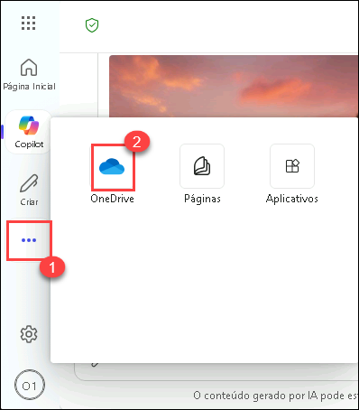

   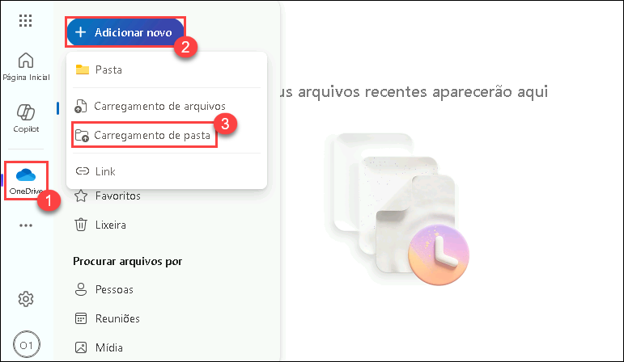

2. Navegue até `C:\LabFiles\Day-1-Build-Agents-with-Copilot-Studio\Data`, clique na pasta `CV` e selecione **Carregar**.

   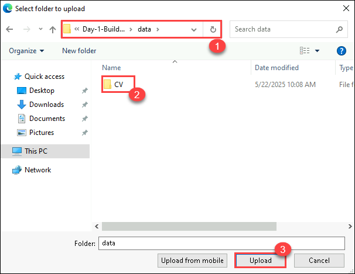

3. Clique novamente em **+ Criar ou carregar** e selecione **Selecionar arquivos para upload**.

4. Navegue até `C:\LabFiles\Day-1-Build-Agents-with-Copilot-Studio\Data`, clique no arquivo `NominationList.xlsx` e clique em **Abrir**.

   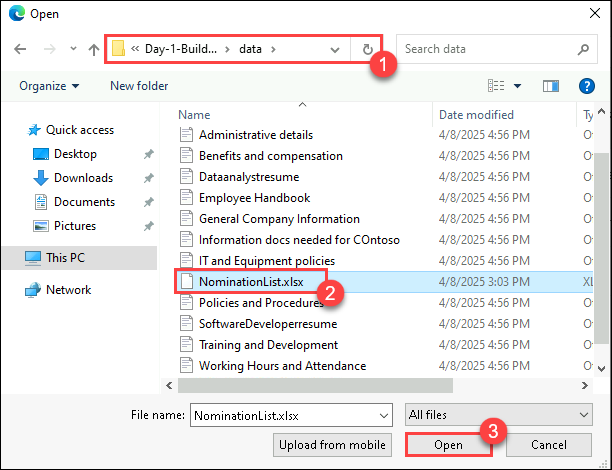

5. Na janela do Copilot, clique em **Copilot chat (1)** e clique no ícone **Anexar conteúdo (2)**.

   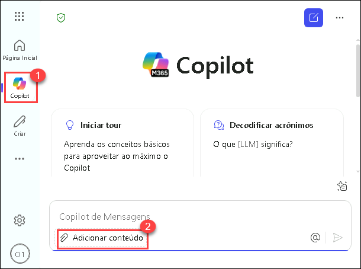

6. Na janela do explorador de arquivos, navegue até a pasta `C:\LabFiles\Day-1-Build-Agents-with-Copilot-Studio\Data\CV` **(1)**, selecione os **3 primeiros** arquivos **(2)** e clique em **Abrir (3)**.

   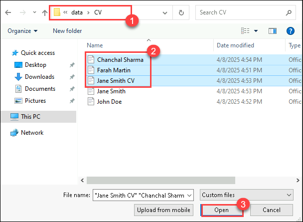

7. No **Copilot chat**, após o upload dos **3 arquivos**, clique no botão **Enviar**.

   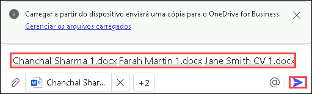

8. Clique novamente em **Copilot chat (1)** e em **Anexar conteúdo (2)**.

   

9. Na pasta `C:\LabFiles\Day-1-Build-Agents-with-Copilot-Studio\Data\CV` **(1)** Selecione os **2 últimos (2)** arquivos d e clique em **Abrir (3)**.

10. No **Copilot Chat**, após o upload dos **2 arquivos** **(1)**, clique em **Enviar** **(2)**.

     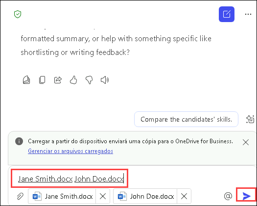

11. No campo de chat, insira o seguinte prompt e clique em **Enviar**:

    ```
    Microsoft 365 Copilot, por favor me ajude a filtrar e selecionar currículos de candidatos a Analista de Dados com base em qualificações exigidas como experiência em SQL, Python e ferramentas de visualização de dados.
    ```

12. Em seguida, use o prompt e clique no botão **Enviar**:

    ```
    Crie um relatório resumido dos principais candidatos a Analista de Dados, incluindo suas habilidades, experiência profissional e formação acadêmica.
    ```

      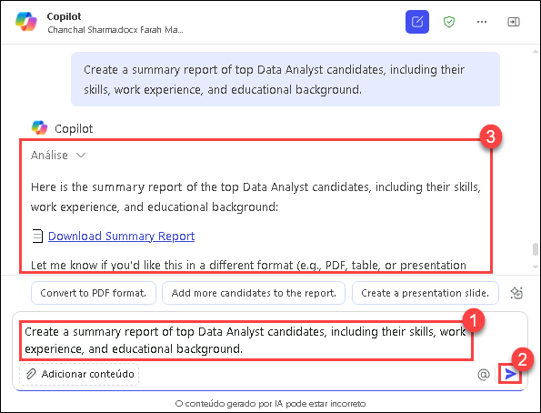

Resultado: A equipe de RH identifica de forma eficiente os candidatos mais qualificados, economizando tempo e focando nos melhores perfis.

### Tarefa 2: Desenvolver materiais de treinamento

Objetivo: Preparar materiais de treinamento abrangentes para o novo contratado.

- Ação: A equipe de RH usa o Copilot para criar documentos de treinamento personalizados, incluindo guias específicos para o cargo, políticas da empresa e uma visão geral das ferramentas e tecnologias utilizadas. O Copilot garante que os materiais sejam completos e alinhados ao novo cargo.

1. No chat, insira o seguinte prompt e clique em **Enviar**:

   ```
   Gere um plano de treinamento de integração abrangente para o novo Analista de Dados, incluindo tópicos como políticas da empresa, treinamento em ferramentas de dados e apresentação da equipe.
   ```

    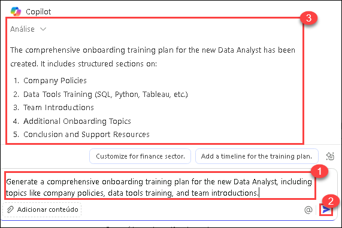

2. Em seguida, use o prompt:

   ```
   Crie uma apresentação de treinamento interativa abordando boas práticas em análise de dados e principais métricas de desempenho.
   ```

   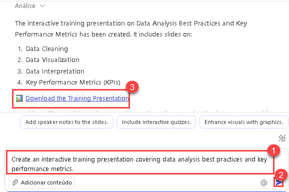

> **Nota**: Após executar esse prompt, será gerada uma apresentação do PowerPoint para download. Se o download não iniciar, procure um link com o título da apresentação conforme mostrado na imagem.

> **Nota**: Se após executar esse prompt, a apresentação donão estiver disponível para download reexecute o prompt.

Resultado: O novo colaborador recebe materiais de treinamento bem organizados, permitindo uma adaptação rápida e eficiente às suas funções.

### Tarefa 3: Coletar feedback

Objetivo: Reunir feedback de novos colaboradores e entrevistadores para aprimorar os processos de recrutamento e integração.

- Ação: A equipe de RH utiliza o Copilot para criar e distribuir formulários de feedback. O Copilot coleta e analisa as respostas, oferecendo insights sobre pontos fortes e aspectos a melhorar.

1. No chat, insira o seguinte prompt e clique em **Enviar**:

   ```
   Crie um formulário de feedback para que os entrevistadores avaliem os candidatos a Analista de Dados com base em habilidades técnicas, capacidade de resolução de problemas e adequação cultural.
   ```

2. Em seguida, use o prompt:

   ```
   Envie uma pesquisa para os novos contratados para coletar feedback sobre sua experiência de integração e identificar pontos de melhoria.
   ```

Resultado: O RH obtém feedback valioso para refinar os processos, garantindo uma melhor experiência para futuros colaboradores.


### Tarefa 4: Avaliações de Desempenho

Objetivo: Realizar avaliações regulares de desempenho para acompanhar o progresso e desenvolvimento do novo colaborador.

- Ação: O gerente de RH utiliza o Copilot para criar modelos de avaliação e agendar reuniões de acompanhamento. O Copilot ajuda a monitorar conquistas, coletar feedback e compilar relatórios de desempenho.

1. No chat, insira o seguinte prompt e clique em **Enviar**:

   ```
   Configure um cronograma de avaliações de desempenho para o novo Analista de Dados, com revisões trimestrais e sessões de definição de metas.
   ```

2. Em seguida, use o prompt:

   ```
   Gere um modelo de relatório de avaliação de desempenho, incluindo seções para conquistas, áreas de melhoria e metas futuras.
   ```

Resultado: O novo colaborador recebe feedback construtivo e apoio para seu crescimento profissional, contribuindo para seu sucesso a longo prazo na empresa.


### Revisão

A FutureTech Enterprises está contratando um novo Analista de Dados e busca agilizar os processos de recrutamento e integração com o uso do Microsoft 365 Copilot. O objetivo do departamento de RH é:

- Triagem Rápida de Candidatos: Filtrar e selecionar candidatos com base em qualificações e experiência.
- Desenvolvimento de Materiais de Treinamento: Criar conteúdos abrangentes de onboarding e treinamento.
- Coleta de Feedback: Reunir informações de entrevistadores e novos contratados para aprimorar os processos.
- Avaliações de Desempenho: Estabelecer avaliações regulares e sessões de definição de metas.

Ao aproveitar o Microsoft 365 Copilot, a FutureTech Enterprises busca aumentar a eficiência e a eficácia de todo o processo, garantindo uma experiência fluida e positiva para todos os envolvidos.


### Você concluiu o laboratório com sucesso!
