# 演習2: 副操縦士 スタジオを使用してHRアシスタントエージェントを構築する

### 推定所要時間: 30分

## 概要

このラボは、組織内の従業員の移行プロセスを合理化し、改善することを目的としています。参加者は、Microsoft 365 Copilotを使用して適切な内部候補者を特定し、カスタマイズされた移行計画を作成し、効果的なコミュニケーション資料を生成する方法を学びます。また、副操縦士 スタジオを活用してワークフローを自動化し、オンボーディングおよびトレーニング資料を作成し、パフォーマンス監視メカニズムを設定します。これらのAI搭載ツールを利用することで、ラボはスムーズで効率的な移行プロセスを確保し、内部の移動性を向上させ、新しい役割での従業員の成功を支援することに焦点を当てています。

## シナリオ

会社 (Contoso Enterprises)は、新しいデータアナリストを採用し、Microsoft 365 Copilotを使用して採用およびオンボーディングプロセス全体を合理化したいと考えています。HR部門は、候補者を迅速にスクリーニングし、トレーニング資料を作成し、フィードバックを収集し、パフォーマンスレビューを実施することを目指しています。

## ラボの目的

- タスク1: 候補者を迅速に選別する
- タスク2: トレーニング資料の開発
- タスク3: フィードバックを収集する
- タスク4: パフォーマンスレビュー
  
### アーキテクチャ図

  

### タスク1: 候補者を迅速に選別する

目的: データアナリストのポジションに対する多数の応募を迅速に評価する。

   - アクション: HRマネージャーはMicrosoft 365 Copilotを使用して履歴書を分析し、関連する経験、技術スキル、学歴などの特定の基準に基づいて候補者をフィルタリングします。Copilotはトップ候補者をハイライトします。

1. 左側のペインから **Apps -> OneDrive (1)** をクリックし、**私のファイル (2)** をクリックします。

    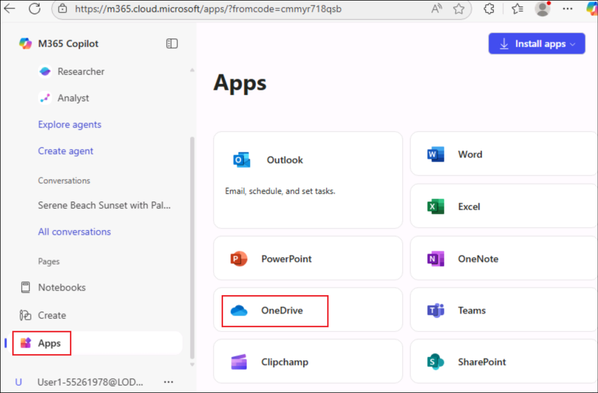


2. **+ 新規追加 (1)** をクリックし、**フォルダのアップロード (2)** を選択します。

    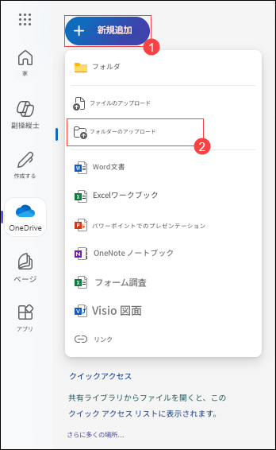


3. C:\LabFiles\Day-1-Build-Agents-with-Copilot-Studio\Data に移動し、CV フォルダーをクリックして **アップロード** を選択します。

     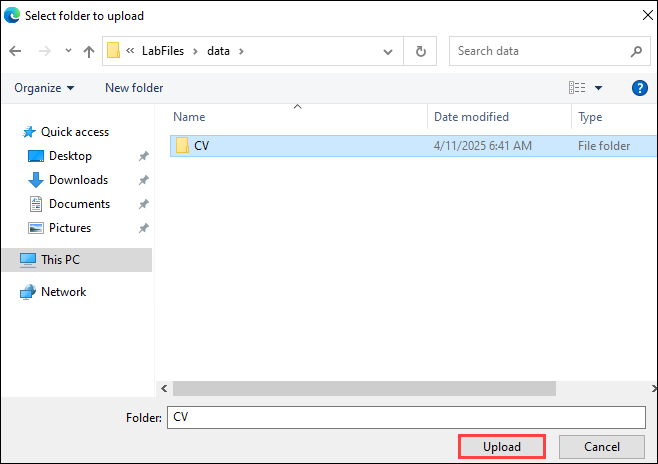

4. もう一度 [**+ 新規追加**] をクリックし、[**フォルダーのアップロード**] を選択します。

5. C:\LabFiles\Day-1-Build-Agents-with-Copilot-Studio に移動し、Data フォルダをクリックして **アップロード** をクリックします。「このサイトに 19 個のファイルをアップロードしますか？」というポップアップで **アップロード** を選択します。

   

6. Copilotウィンドウで、**副操縦士** **(1)** をクリックし、**コンテンツの追加** **(2)** アイコンをクリックします。そして、**このデバイスからアップロード(3)** を選択します。

   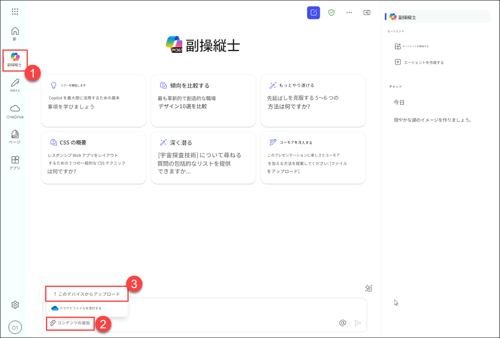

7. ファイルエクスプローラのポップアップで、`C:\LabFiles\Day-1-Build-Agents-with-Copilot-Studio\Data\CV` **(1)** フォルダーに移動し、**最初の3つ (2)** ファイルを選択して **開く (3)** をクリックします。

   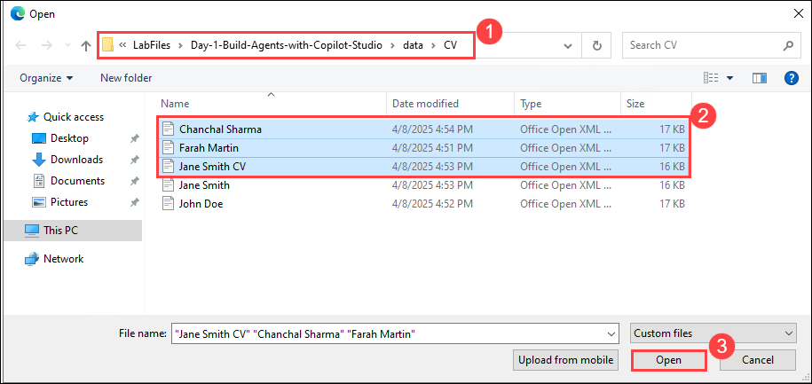

8. **Copilotチャット**で、**3つのファイル**が正常にアップロードされたら**送信**ボタンをクリックします。

   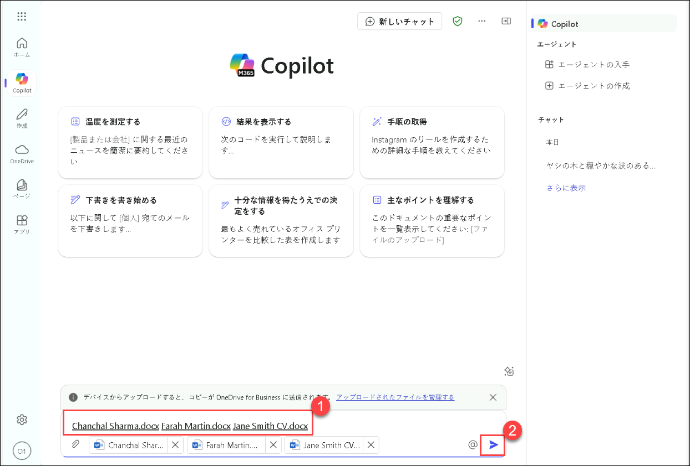

9. Copilot ウィンドウで、もう一度 **副操縦士 チャット** **(1)** をクリックし、**コンテンツの追加する** **(2)** アイコンをクリックして、**このデバイスからアップロード** を選択します。

   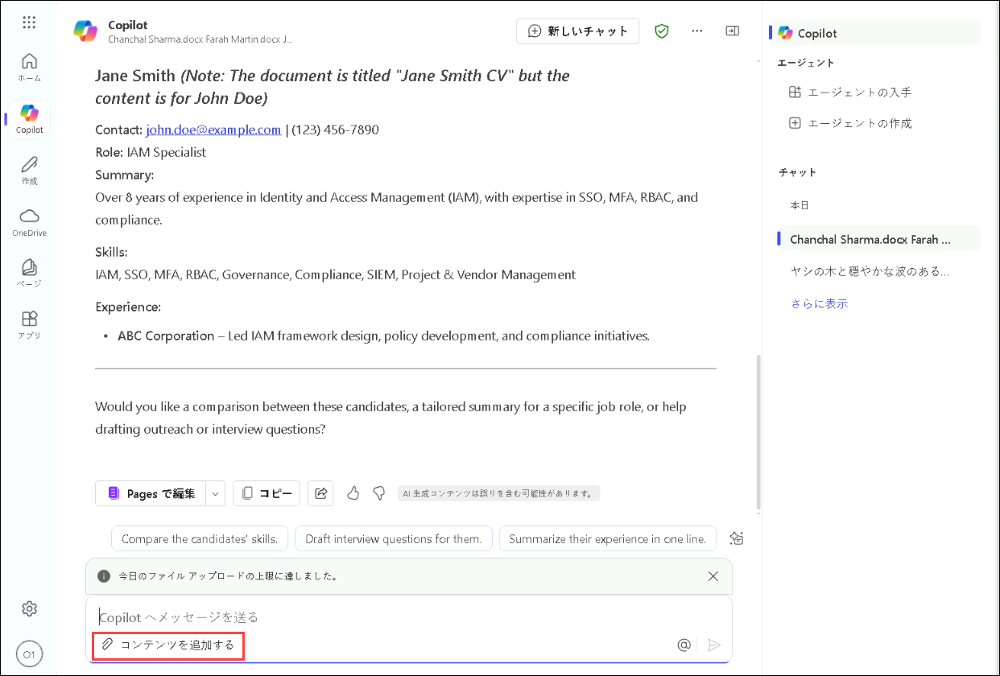

10. ファイルエクスプローラのポップアップで、`C:\LabFiles\Day-1-Build-Agents-with-Copilot-Studio\Data\CV` **(1)** フォルダーに移動し、**最後の2つ (2)** ファイルを選択して **開く (3)** をクリックします。

   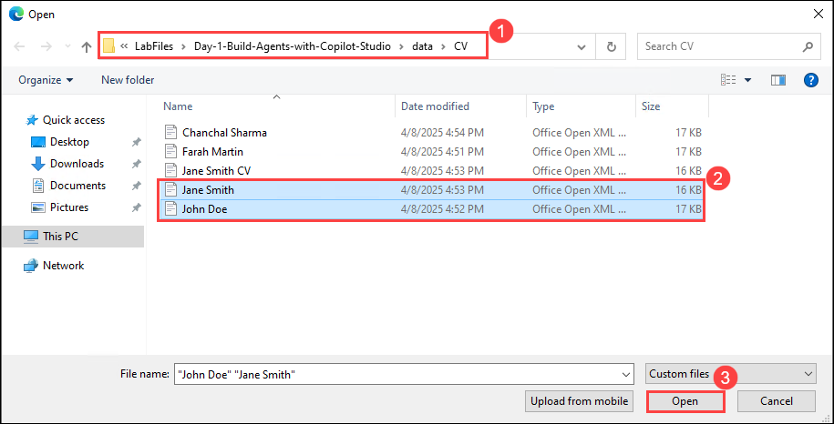

11. **副操縦士 チャット**で、**2つのファイル**が正常にアップロードされたら**送信**ボタンをクリックします。

   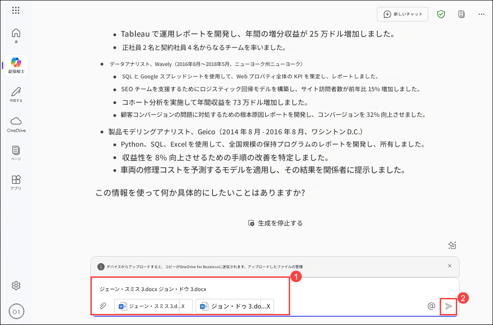

12. チャットボックスに以下のプロンプトを入力し、**送信**ボタンをクリックします:

    プロンプト:
    ```
    Microsoft 365 Copilot, please help me filter and shortlist resumes of Data Analyst candidates based on required qualifications such as experience in SQL, Python, and data visualization tools.
    ```
    >**任意:** 日本語訳のプロンプトは:
    ```
    Microsoft 365 Copilot、SQL、Python、およびデータ可視化ツールの経験などの必要な資格に基づいてデータアナリスト候補者の履歴書をフィルタリングし、ショートリストを作成してください。
    ```

13. 以下のプロンプトを続けて入力し、**送信**ボタンをクリックします。

    プロンプト:
    ```
    Create a summary report of top Data Analyst candidates, including their skills, work experience, and educational background.
    ```
    >**任意:** 日本語訳のプロンプトは:
    ```
    データアナリスト候補者のスキル、職務経験、および学歴を含むトップ候補者の概要レポートを作成してください。
    ```

   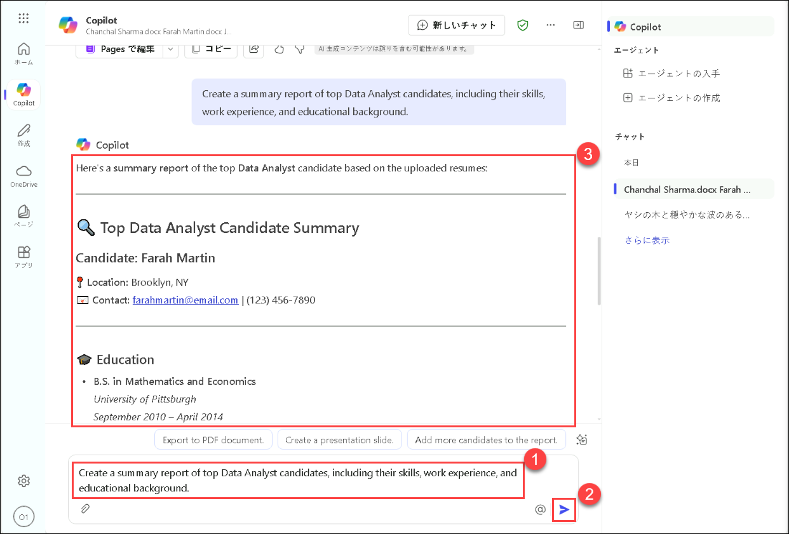

**結果:** HRチームは最も資格のある候補者を効率的に特定し、時間を節約し、焦点を絞った採用活動を確保します。
  
### タスク2: トレーニング資料の開発

目的: 新しい採用者のための包括的なトレーニング資料を準備する。

  - アクション: HRチームはCopilotを使用して、役割に特化したガイド、会社のポリシー、および使用されるツールと技術の概要を含むパーソナライズされたトレーニング文書を作成します。Copilotはトレーニング資料が徹底的で新しい従業員の役割に合わせて調整されていることを保証します。

1. チャットボックスに以下のプロンプトを入力し、**送信**ボタンをクリックします:

    プロンプト:
    ```
    Generate a comprehensive onboarding training plan for the new Data Analyst, including topics like company policies, data tools training, and team introductions.
    ```
    >**任意:** 日本語訳のプロンプトは:
    ```
    新しいデータアナリストのための包括的なオンボーディングトレーニング計画を作成してください。会社のポリシー、データツールのトレーニング、チーム紹介などのトピックを含めてください。
    ```

    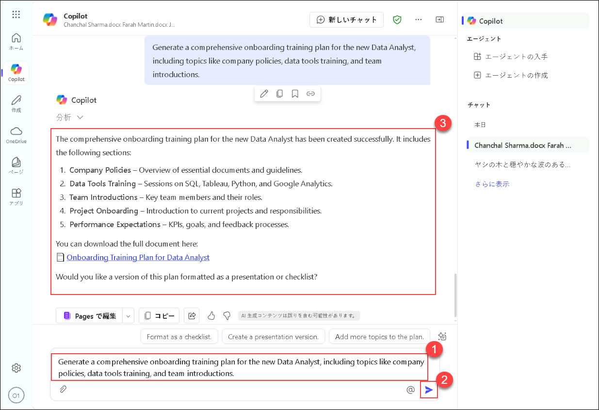

2. 以下のプロンプトを続けて入力し、**送信**ボタンをクリックします。

    プロンプト:
    ```
    Create an interactive training presentation covering data analysis best practices and key performance metrics.
    ```
    >**任意:** 日本語訳のプロンプトは:
    ```
    データ分析のベストプラクティスと主要なパフォーマンス指標をカバーするインタラクティブなトレーニングプレゼンテーションを作成してください。
    ```

    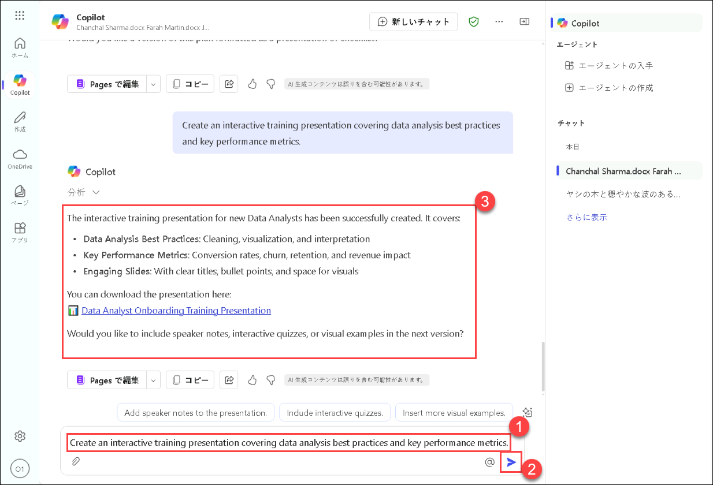

    > **注意:** このプロンプトを実行した後、ダウンロード可能なPowerPointプレゼンテーションが表示されます。その後、編集やデザインが可能です。ファイルがダウンロードされなかった場合は、スクリーンショットに示されているようにプレゼンテーションタイトルのハイパーリンクを探してください。
    
    > **注意:** このプロンプトを実行した後、ダウンロード可能なPowerPointプレゼンテーションオプションが表示されない場合は、上記のプロンプトを再実行してください。

結果: 新しい採用者はよく整理されたトレーニング資料を受け取り、迅速に業務を遂行し、効果的に業務を遂行することができます。

### タスク3: フィードバックを収集する

目的: 新しい従業員および面接官からフィードバックを収集し、採用およびオンボーディングプロセスを改善する。

アクション: HRチームはCopilotを使用してフィードバック調査を生成し、新しい採用者および面接官に配布します。Copilotは回答を収集し、分析し、プロセスの強みと改善点に関する洞察を提供します。

1. チャットボックスに以下のプロンプトを入力し、**送信**ボタンをクリックします:

    プロンプト:
    ```
    Create a feedback form for interviewers to evaluate Data Analyst candidates based on technical skills, problem-solving abilities, and cultural fit.
    ```
    >**任意:** 日本語訳のプロンプトは:
    ```
    面接官がデータアナリスト候補者を技術スキル、問題解決能力、および文化的適合性に基づいて評価するためのフィードバックフォームを作成してください。
    ```

2. 以下のプロンプトを続けて入力し、**送信**ボタンをクリックします。

    プロンプト:
    ```
    Send out a survey to new hires to gather feedback on their onboarding experience and identify areas for improvement.
    ```
    >**任意:** 日本語訳のプロンプトは:
    ```
    新しい採用者にアンケートを送信し、オンボーディング体験に関するフィードバックを収集し、改善点を特定してください。
    ```

結果: HR部門は貴重なフィードバックを得て、採用およびオンボーディングの実践を改善し、将来の採用者にとってより良い体験を確保します。

## タスク04: パフォーマンスレビュー

目的: 新しい従業員の進捗と成長を評価するために定期的なパフォーマンスレビューを実施する。

アクション: HRマネージャーはCopilotを使用してパフォーマンスレビューのテンプレートを作成し、レビュー会議をスケジュールします。Copilotは従業員の成果を追跡し、同僚からのフィードバックを収集し、パフォーマンスレポートを作成するのに役立ちます。

1. チャットボックスに以下のプロンプトを入力し、**送信**ボタンをクリックします:

    プロンプト:
    ```
    Set up a performance review schedule for the new Data Analyst, with quarterly reviews and goal-setting sessions.
    ```
    >**任意:** 日本語訳のプロンプトは:
    ```
    新しいデータアナリストのために四半期ごとのレビューと目標設定セッションを含むパフォーマンスレビューのスケジュールを設定してください。
    ```

2. 以下のプロンプトを続けて入力し、**送信**ボタンをクリックします。
  
    プロンプト:
    ```
    Generate a template for performance review reports, including sections for achievements, areas of improvement, and future goals.
    ```
    >**任意:** 日本語訳のプロンプトは:
    ```
    成果、改善点、および将来の目標を含むパフォーマンスレビュー報告書のテンプレートを作成してください。
    ```

結果: 新しい従業員は建設的なフィードバックとサポートを受け取り、専門的な成長を助け、会社内での長期的な成功に貢献します。

### レビュー

FutureTech Enterprisesは新しいデータアナリストを採用する過程にあり、Microsoft 365 Copilotを使用して採用およびオンボーディングプロセスを合理化したいと考えています。HR部門は以下の目的を達成することを目指しています:

- 候補者を迅速にスクリーニングする: 資格と経験に基づいて候補者を効率的にフィルタリングし、ショートリストを作成する。
- トレーニング資料を作成する: 新しいデータアナリストのための包括的なオンボーディング資料とトレーニング計画を作成する。
- フィードバックを収集する: 面接官および新しい採用者からフィードバックを収集し、採用およびオンボーディングプロセスを改善する。
- パフォーマンスレビューを実施する: 新しい採用者の進捗を追跡するために定期的なパフォーマンスレビューと目標設定セッションを設定する。

Microsoft 365 Copilotを活用することで、FutureTech Enterprisesはプロセス全体の効率と効果を向上させ、関係者全員にとってスムーズでシームレスな体験を確保することを目指しています。

### ラボを無事に完了しました！
