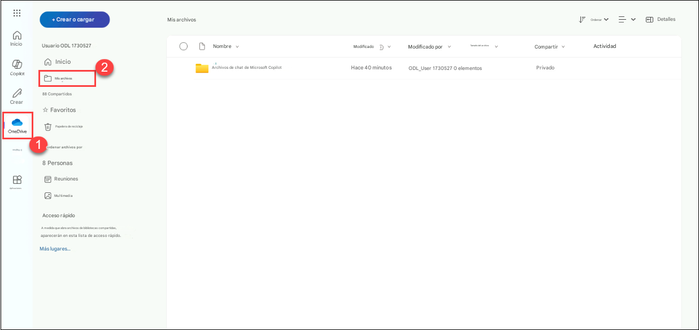
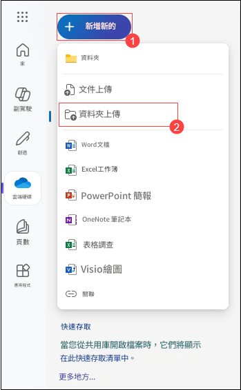

# 練習 2：使用 Copilot Studio 建立 HR 助理智能代理

### 預計時長：30 分鐘

## 實驗概覽

本次實驗課程旨在優化並提升企業內員工轉職的流程。參與者將學習如何運用 Microsoft 365 Copilot 來識別合適的內部候選人、制定客製化轉職計畫，並生成有效的溝通材料。此外，他們還將利用 Copilot Studio 來自動化工作流程、開發入職與培訓資源，並設立績效監測機制。透過這些 AI 驅動工具，本次課程的重點在於確保轉職過程順暢高效，促進內部流動性（Internal Mobility），並支持員工在新角色中的成功發展。

## 情境說明

您的公司 Contoso Enterprises 正在尋找一位新的 資料分析師（Data Analyst），希望透過 Microsoft 365 Copilot 來簡化整個招聘與入職流程。 HR 部門的目標是快速篩選候選人、開發培訓材料、收集回饋，以及進行績效評估。

## 實驗目標

- 任務 1：快速篩選候選人
- 任務 2：開發培訓材料
- 任務 3：收集回饋
- 任務 4：績效評估
  
## 架構圖

  

### 任務 1：快速篩選候選人

目標: 迅速評估大量申請者，以遴選適合的 資料分析師（Data Analyst） 人選。

   - 行動步驟: - HR 經理使用 Microsoft 365 Copilot 來分析履歷，並根據特定條件篩選候選人，例如 相關經驗、技術技能及學歷背景。 Copilot 會標示出頂尖候選人，供您進一步審核。

1. 按一下左側窗格中的 **OneDrive (1)**，然後按一下 **我的檔案 (2)**。

    

2. 點擊 **+ 新增新的** **(1)** 並選擇 **資料夾上傳** **(2)**。

      

3. 前往 `C:\LabFiles\Day-1-Build-Agents-with-Copilot-Studio\Data`，點擊 `CV` 資料夾，然後選擇 **上傳**。

     

4. 再次點擊 **+ 建立或上傳**，然後選擇 **檔案上傳**。

      

5. 前往 `C:\LabFiles\Day-1-Build-Agents-with-Copilot-Studio`，點擊 `data` 檔案，然後點擊 **Upload**。在彈出的 `Upload 19 files to this site?` 視窗中選擇 **Upload**。

   

6. 在 Copilot 視窗中，按一下 **Copilot Chat** **(1)**，按一下 **新增內容** **(2)** 圖示。並選擇 **從這個裝置上傳** **(3)**。

   

7. 在檔案總管的彈出視窗中，前往 `C:\LabFiles\Day-1-Build-Agents-with-Copilot-Studio\Data\CV` **(1)** 資料夾，選擇 **前三個** **(2)** 檔案，然後點擊 **開啟** **(3)**。

   

8. 在 **Copilot Chat** 中，當 **三個檔案** **(1)** 成功上傳後，點擊 **傳送** **(2)**按鈕。

   **注意:** 如果 Copilot 要求在上傳文檔之前輸入消息，請向 Copilot 輸入 +++Profiles+++ 之類的消息。
  
   

9. 在 Copilot 視窗中，按一下 **Copilot Chat** ，按一下 **新增內容** **(1)** 圖示。並選擇 **從這個裝置上傳** **(2)**。

   

10. 在檔案總管的彈出視窗中，前往 `C:\LabFiles\Day-1-Build-Agents-with-Copilot-Studio\Data\CV` **(1)** 資料夾，選擇 **最後兩個** **(2)** 檔案，然後點擊 **開啟** **(3)**。

   

11. 在 **Copilot chat** 中，當 **2 個檔案** **(1)** 成功上傳後，點擊 **傳送** **(2)** 按鈕。

    **注意:** 如果 Copilot 要求在上傳文檔之前輸入消息，請向 Copilot 輸入 +++Profiles+++ 之類的消息。
    
    

11. 在聊天框中輸入以下提示，然後點擊 **傳送** 按鈕：
  
    ```
    Microsoft 365 Copilot，請幫助我篩選並挑選符合資格的資料分析師候選人履歷，篩選標準包括 SQL、Python 以及數據視覺化工具的相關經驗。
    ```

12. 接著，在聊天框中輸入以下提示 **(1)**，然後點擊 **傳送** **(2)**按鈕：

    ```
    建立一份頂尖資料分析師候選人的摘要報告，包括他們的技能、工作經驗及學歷背景。
    ```

    

**成果**: HR 團隊能夠高效識別最符合資格的候選人，節省時間並確保招聘工作的重點明確。
  
### 任務 2：開發培訓材料

目標: 為新聘員工準備完善的培訓材料。

  - 行動步驟: HR 團隊使用 Copilot 來建立 個人化培訓文件，包括職位專屬指南、公司政策，以及工具與技術概覽。Copilot 確保培訓材料內容全面，並根據新員工的職位需求進行定制。

1. 在聊天框中輸入以下提示 **(1)**，然後點擊 **傳送** **(2)**按鈕：

    ```
    為新任資料分析師生成全面的入職培訓計畫，包括公司政策、數據工具培訓及團隊介紹等主題。
    ```

    

2. 接著，在聊天框中輸入以下提示 **(1)**，然後點擊 **傳送** **(2)**按鈕：

    ```
    建立一份互動式培訓簡報，涵蓋數據分析的最佳實踐及關鍵績效指標。
    ```

    

    > **注意**: 執行此提示後，您將獲得一份 PowerPoint 簡報 **(3)** 可供下載，然後您可以編輯或設計該文件。如果檔案未成功下載，請嘗試尋找簡報標題的超連結，如螢幕截圖所示。

    
    > **注意**: 執行此提示後，如未顯示 PowerPoint 簡報下載選項，請重新執行上述提示。


成果: 新員工獲得完善的培訓材料，使其能夠快速適應並高效履行職責。

### 任務 3：收集回饋

目標: 收集新員工及面試官的回饋，以改進招聘與入職流程。

行動步驟: HR 團隊利用 Copilot 生成並發送回饋調查給新員工及面試官。 Copilot 收集並分析回應，提供流程優勢及改進方向的深入洞察。

1. 在聊天框中輸入以下提示，然後點擊 **傳送** 按鈕：

    ```
    建立一份回饋表單，供面試官評估資料分析師候選人，評估標準包括技術技能、解決問題能力以及文化契合度。
    ```

2. 接著，在聊天框中輸入以下提示，然後點擊 **傳送** 按鈕：

    ```
    發送調查問卷給新員工，以收集他們對入職體驗的回饋，並識別可改進的領域。
    ```

成果: HR 部門獲得寶貴回饋，使其能夠改進招聘與入職流程，確保未來新員工獲得更好的體驗。

## 任務 4：績效評估

目標: 定期進行績效評估，以衡量新員工的成長與發展。

行動步驟: HR 經理 使用 Copilot 來建立 績效評估模板 並安排評估會議。 Copilot 協助追蹤員工成就、收集同事回饋，並整合績效報告。

1. 在聊天框中輸入以下提示，然後點擊 **傳送** 按鈕：

    ```
    為新任資料分析師設置績效評估時間表，包含每季度一次的評估以及目標設定會議。
    ```

2. 接著，在聊天框中輸入以下提示，然後點擊 **傳送** 按鈕：
  
    ```
    建立績效評估報告模板，包括成就、改進領域及未來目標等章節。  
    ```

成果: 新員工獲得 建設性回饋 和 支持，幫助其職業成長，並促進其在公司內的長期成功。

### 回顧

Contoso Enterprises 正在招募資料分析師，並希望透過 Microsoft 365 Copilot 來簡化招聘與入職流程。 HR 部門的主要目標如下：

- 快速篩選候選人：依據資格與經驗高效篩選並挑選候選人。
- 開發培訓材料：創建完整的入職培訓文件與計畫，以幫助新員工快速適應。
- 收集回饋：收集面試官與新員工的回饋，以改善招聘與入職流程。
- 進行績效評估：設置定期績效評估與目標設定會議，追蹤新員工的成長與發展。

透過 Microsoft 365 Copilot，Contoso Enterprises 期望提升整個招聘與入職流程的效率與效果，確保所有相關人員都能獲得順暢且無縫的體驗。

### 恭喜！您已成功完成本次實驗課程！
### 前往下一個實驗課程，請點選導覽連結。


