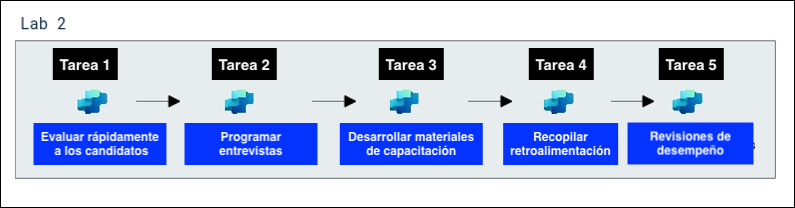

# 练习 2：使用 Copilot Studio 构建人力资源助手代理

### 预计用时：30 分钟

## 概述

本实验旨在简化和增强组织内员工转换流程。参与者将学习如何使用 Microsoft 365 Copilot 识别合适的内部候选人，创建定制化的转换计划，并生成有效的沟通材料。他们还将利用 Copilot Studio 自动化工作流程，开发入职和培训材料，并建立绩效监控机制。通过利用这些 AI 驱动的工具，本实验重点关注确保流程的顺畅高效，改善内部流动性，并支持员工在新角色中的成功。

## 描述

您的公司 Contoso Enterprises 正在寻找一名新的数据分析师，并希望使用 Microsoft 365 Copilot 简化整个招聘和入职流程。人力资源部门的目标是快速筛选候选人，开发培训材料，收集反馈，并进行绩效评估。

## 实验目标

- 任务 1：快速筛选候选人
- 任务 2：开发培训材料
- 任务 3：收集反馈
- 任务 4：绩效评估
  
### 架构图

  

### 任务 1：快速筛选候选人

目标：快速评估大量数据分析师职位申请。

   - 操作：使用 Microsoft 365 Copilot 分析上传的简历，根据特定标准（如相关经验、技术技能和教育背景）筛选候选人。Copilot 会为您突出显示最佳候选人。

1. 从左侧窗格点击 **OneDrive (1)**，点击 **+ 创建或上传 (2)** 并选择 **文件夹上传 (3)**。

      

1. 导航到 `C:\LabFiles\Day-1-Build-Agents-with-Copilot-Studio\data`，点击 `CV` 文件夹并选择 **上传**。

     

     

1. 再次点击 **+ 创建或上传** 并选择 **选择文件上传**。

   

1. 导航到 `C:\LabFiles\Day-1-Build-Agents-with-Copilot-Studio\data`，点击 `NominationList.xlsx` 文件并点击 **打开**。

   

1. 在 Copilot 窗口中，点击 **Copilot 聊天** **(1)**，点击 **附加内容** **(2)** 图标。

   

1. 在文件浏览器弹出窗口中，导航到 `C:\LabFiles\Day-1-Build-Agents-with-Copilot-Studio\data\CV` **(1)** 文件夹，选择 **前3个** **(2)** 文件并点击 **打开** **(3)**。

   

1. 在 **Copilot 聊天** 中，一旦 **3个文件** 成功上传，点击 **发送** 按钮。

   

1. 在 Copilot 窗口中，点击 **Copilot 聊天** **(1)**，点击 **附加内容** **(2)** 图标。

   

1. 在文件浏览器弹出窗口中，导航到 `C:\LabFiles\Day-1-Build-Agents-with-Copilot-Studio\data\CV` **(1)** 文件夹，选择 **最后2个** **(2)** 文件并点击 **打开** **(3)**。

   

1. 在 **Copilot 聊天** 中，一旦 **2个文件** 成功上传，点击 **发送** 按钮。

   

1. 在聊天框中输入以下提示并点击**发送**按钮：

    **英文：**
    ```
    Microsoft 365 Copilot, please help me filter and shortlist resumes of Data Analyst candidates based on required qualifications such as experience in SQL, Python, and data visualization tools.
    ```

    **中文：**
    ```
    Microsoft 365 Copilot，请帮我根据所需资格如 SQL、Python 和数据可视化工具的经验来筛选和列出数据分析师候选人简历。
    ```

2. 跟进以下提示并点击**发送**按钮：

    **英文：**
    ```
    Create a summary report of top Data Analyst candidates, including their skills, work experience, and educational background.
    ```

    **中文：**
    ```
    创建顶级数据分析师候选人的摘要报告，包括他们的技能、工作经验和教育背景。
    ```

   

**成果**：人力资源团队高效识别最合格的候选人，节省时间并确保招聘工作更加集中。
  
### 任务 2：开发培训材料

目标：为新员工准备全面的培训材料。

  - 行动：人力资源团队使用 Copilot 创建个性化培训文档，包括特定角色指南、公司政策和所使用工具与技术的概述。Copilot 能确保培训材料内容全面，并贴合新员工的岗位需求。

1. 在聊天框输入以下提示并点击**发送**按钮：


    **英文：**
    ```
    Generate a comprehensive onboarding training plan for the new Data Analyst, including topics like company policies, data tools training, and team introductions.
    ```

    **中文：**
    ```
    为新的数据分析师生成全面的入职培训计划，包括公司政策、数据工具培训和团队介绍等主题。
    ```

    

2. 跟进以下提示并点击**发送**按钮：

    **英文：**
    ```
    Create an interactive training presentation covering data analysis best practices and key performance metrics.
    ```

    **中文：**
    ```
    创建一个涵盖数据分析最佳实践和关键绩效指标的互动培训演示文稿。
    ```

    

    > **注意**：执行此提示后，系统会生成一个可下载的 PowerPoint 演示文稿，然后您可以编辑或设计它。如果文件未下载，请尝试查找带有如截图所示演示文稿标题的超链接。
    
    > **注意**：如果执行此提示后未显示 PowerPoint 演示文稿下载选项，请重新运行上述提示。

成果：新员工接收到组织良好的培训材料，使他们能够快速掌握并有效执行职责。

### 任务 3：收集反馈

目标：收集新员工和面试官的反馈，以改进招聘和入职流程。

行动：人力资源团队利用 Copilot 生成并分发反馈调查给新员工和面试官。Copilot 会自动汇总反馈内容，帮助 HR 团队发现流程优势与待优化之处。

1. 在聊天框中，提供以下提示并点击**发送**按钮：

    **英文：**
    ```
    Create a feedback form for interviewers to evaluate Data Analyst candidates based on technical skills, problem-solving abilities, and cultural fit.
    ```

    **中文：**
    ```
    创建一个面试官反馈表，用于根据技术技能、解决问题能力和文化契合度评估数据分析师候选人。
    ```

2. 跟进以下提示并点击**发送**按钮：

    **英文：**
    ```
    Send out a survey to new hires to gather feedback on their onboarding experience and identify areas for improvement.
    ```

    **中文：**
    ```
    向新员工发送调查，收集他们对入职体验的反馈并确定需要改进的领域。
    ```

成果：人力资源部门获得宝贵反馈，使他们能够完善招聘和入职实践，确保未来招聘人员获得更好的体验。

## 任务 4：绩效评估

目标：定期进行绩效评估，以评估新员工的进步和发展。

行动：人力资源经理使用 Copilot 创建绩效评估模板并安排评估会议。Copilot 帮助跟踪员工的成就，收集同事的反馈，并编制绩效报告。

1. 在聊天框中，提供以下提示并点击**发送**按钮：

    **英文：**
    ```
    Set up a performance review schedule for the new Data Analyst, with quarterly reviews and goal-setting sessions.
    ```

    **中文：**
    ```
    为新的数据分析师设置绩效评估计划，包括季度审核和目标设定会议。
    ```

2. 跟进以下提示并点击**发送**按钮：

    **英文：**
    ```
    Generate a template for performance review reports, including sections for achievements, areas of improvement, and future goals.
    ```

    **中文：**
    ```
    生成绩效评估报告模板，包括成就、改进领域和未来目标的部分。
    ```

成果：新员工接收到建设性反馈和支持，有助于他们的职业成长，并促进他们在公司内的长期成功。

### 总结

FutureTech Enterprises 正在招聘一名新的数据分析师，并希望使用 Microsoft 365 Copilot 简化招聘和入职流程。人力资源部门的目标包括：

- 快速筛选候选人：根据资格和经验高效筛选并列出候选人。
- 开发培训材料：为新数据分析师创建全面的入职材料和培训计划。
- 收集反馈：收集面试官和新员工的反馈，以改进招聘和入职流程。
- 进行绩效评估：设立定期绩效评估和目标设定会议，跟踪新员工的进展。

通过利用 Microsoft 365 Copilot，FutureTech Enterprises 旨在提高整个流程的效率和有效性，确保所有相关方都能获得顺畅无缝的体验。

### 恭喜，您已成功完成本实验！
