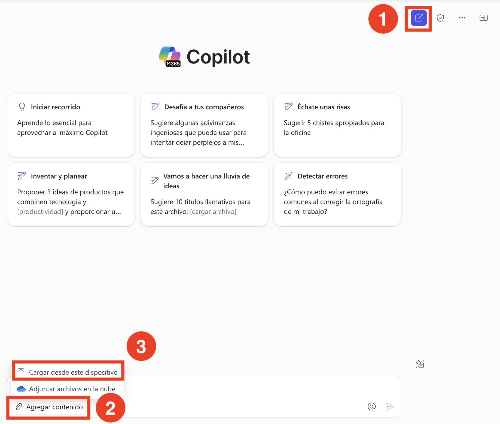

# Ejercicio 2: Construye un agente asistente de RRHH con Copilot Studio

### Duración estimada: 30 minutos

## Descripción general

Este laboratorio tiene como objetivo optimizar y mejorar el proceso de transición de empleados dentro de una organización. Los participantes aprenderán a usar Microsoft 365 Copilot para identificar candidatos internos adecuados, crear planes de transición personalizados y generar materiales de comunicación efectivos. También aprovecharán Copilot Studio para automatizar flujos de trabajo, desarrollar materiales de incorporación y capacitación, y establecer mecanismos de monitoreo del desempeño. Al utilizar estas herramientas impulsadas por IA, el laboratorio se enfoca en asegurar un proceso de transición fluido y eficiente, mejorando la movilidad interna y apoyando el éxito de los empleados en sus nuevos roles.

## Escenario

Tu empresa, Contoso Enterprises, busca contratar a un nuevo Analista de Datos y quiere optimizar todo el proceso de reclutamiento e incorporación usando Microsoft 365 Copilot. El departamento de RRHH busca filtrar candidatos rápidamente, desarrollar materiales de capacitación, recopilar retroalimentación y realizar evaluaciones de desempeño.

## Objetivo del laboratorio

- Tarea 1: Filtrar candidatos rápidamente
- Tarea 2: Desarrollar materiales de capacitación
- Tarea 3: Recopilar retroalimentación
- Tarea 4: Evaluaciones de desempeño
  
### Diagrama de arquitectura

  

### Tarea 1: Filtrar candidatos rápidamente

**Objetivo**: Evaluar rápidamente un gran número de postulaciones para el puesto de Analista de Datos.

   - Acción: El gerente de RRHH utiliza Microsoft 365 Copilot para analizar currículums y filtrar candidatos según criterios específicos como experiencia relevante, habilidades técnicas y formación académica. Copilot resalta a los mejores candidatos para su revisión.

1. Haz clic en **OneDrive (1)** en el panel izquierdo y luego en **My files (2)**.

   

2. Haz clic en **+ Agregar nuevo (1)** y selecciona **Cargar carpeta (2)**.

      

1. Navega a `C:\LabFiles\Day-1-Build-Agents-with-Copilot-Studio\Data`, haz clic en la carpeta `CV` y selecciona **Upload**.

     

1. Una vez más, haz clic en **+ Agregar nuevo** y selecciona **Cargar carpeta**.

1. Navega a `C:\LabFiles\Day-1-Build-Agents-with-Copilot-Studio\Data`, haz clic en el archivo `NominationList.xlsx` y haz clic en **Open**.

   

1. En la ventana de Copilot, haz clic en **Copilot chat** **(1)**, haz clic en el ícono **Add Content** **(2)** y selecciona **Upload from this device(3)**. 

   

1. En la ventana del explorador de archivos, navega a la carpeta `C:\LabFiles\Day-1-Build-Agents-with-Copilot-Studio\Data\CV` **(1)**, selecciona los **primeros 3** **(2)** archivos y haz clic en **Open** **(3)**.

   

1. En **Copilot chat**, una vez que los **3 archivos** se hayan subido correctamente, haz clic en el botón **Sent**.

   

1. En la ventana de Copilot, nuevamente haz clic en **Copilot chat** **(1)**, haz clic en el ícono **Add content** **(2)** y selecciona **Upload from this device**. 

   

1. En la ventana del explorador de archivos, navega a la carpeta `C:\LabFiles\Day-1-Build-Agents-with-Copilot-Studio\Data\CV` **(1)**, selecciona los **últimos 2** **(2)** archivos y haz clic en **Open** **(3)**.

   

1. En **Copilot chat**, una vez que los **2 archivos** se hayan subido correctamente, haz clic en el botón **Sent**.

   

1. En el cuadro de chat, proporciona el siguiente prompt y presiona el botón **Sent**:
  
    ```
    Microsoft 365 Copilot, please help me filter and shortlist resumes of Data Analyst candidates based on required qualifications such as experience in SQL, Python, and data visualization tools.
    ```

1. Después, proporciona el siguiente prompt y presiona el botón **Sent**

    ```
    Create a summary report of top Data Analyst candidates, including their skills, work experience, and educational background.
    ```

   

**Resultado**: El equipo de RRHH identifica eficientemente a los candidatos más calificados, ahorrando tiempo y asegurando un proceso de reclutamiento enfocado.
  
### Tarea 2:  Desarrollar materiales de capacitación

**Objetivo**: Preparar materiales de capacitación completos para el nuevo empleado.

  - Acción: El equipo de RRHH utiliza Copilot para crear documentos de capacitación personalizados, incluyendo guías específicas del puesto, políticas de la empresa y una visión general de las herramientas y tecnologías utilizadas. Copilot asegura que los materiales sean completos y adaptados al rol del nuevo empleado.

1. En el cuadro de chat, proporciona el siguiente prompt y presiona el botón **Sent**:

    ```
    Generate a comprehensive onboarding training plan for the new Data Analyst, including topics like company policies, data tools training, and team introductions.
    ```

    

2. Después, proporciona el siguiente prompt y presiona el botón **Sent**.

    ```
    Create an interactive training presentation covering data analysis best practices and key performance metrics.
    ```

    

    > **Nota**: Después de ejecutar este prompt, obtendrás una presentación de PowerPoint para descargar, que luego podrás editar o diseñar. Si el archivo no se descarga, intenta encontrar el hipervínculo con el título de la presentación como se muestra en la captura de pantalla.
    
    > **Nota**: Si la opción de descarga de la presentación de PowerPoint no aparece, vuelve a ejecutar el prompt anterior.

Resultado: El nuevo empleado recibe materiales de capacitación bien organizados, lo que le permite integrarse rápidamente y desempeñar sus funciones de manera efectiva.

### Tarea 3:  Recopilar retroalimentación

**Objetivo**: Recopilar retroalimentación de los nuevos empleados y entrevistadores para mejorar los procesos de reclutamiento e incorporación.

**Acción**: El equipo de RRHH utiliza Copilot para generar y distribuir encuestas de retroalimentación a los nuevos empleados y entrevistadores. Copilot recopila y analiza las respuestas, proporcionando información sobre los puntos fuertes y áreas de mejora del proceso.

1. En el cuadro de chat, proporciona el siguiente prompt y presiona el botón **Sent**:

    ```
    Create a feedback form for interviewers to evaluate Data Analyst candidates based on technical skills, problem-solving abilities, and cultural fit.
    ```

2. Después, proporciona el siguiente prompt y presiona el botón **Sent**.

    ```
    Send out a survey to new hires to gather feedback on their onboarding experience and identify areas for improvement.
    ```

Resultado: El departamento de RRHH obtiene retroalimentación valiosa, permitiéndole perfeccionar sus prácticas de reclutamiento e incorporación y asegurar una mejor experiencia para futuras contrataciones.

## Tarea 4:  Evaluaciones de desempeño

**Objetivo**: Realizar evaluaciones periódicas de desempeño para valorar el progreso y desarrollo del nuevo empleado.

**Acción**: El gerente de RRHH utiliza Copilot para crear plantillas de evaluación de desempeño y programar reuniones de revisión. Copilot ayuda a rastrear los logros del empleado, recopilar retroalimentación de colegas y compilar informes de desempeño.

1. En el cuadro de chat, proporciona el siguiente prompt y presiona el botón **Sent**:

    ```
    Set up a performance review schedule for the new Data Analyst, with quarterly reviews and goal-setting sessions.
    ```

2. Después, proporciona el siguiente prompt y presiona el botón **Sent**.
  
    ```
    Generate a template for performance review reports, including sections for achievements, areas of improvement, and future goals.
    ```

Resultado: El nuevo empleado recibe retroalimentación constructiva y apoyo, lo que contribuye a su crecimiento profesional y éxito a largo plazo en la empresa.

### Revisión

FutureTech Enterprises está en proceso de contratar a un nuevo Analista de Datos y busca optimizar el proceso de reclutamiento e incorporación usando Microsoft 365 Copilot. El departamento de RRHH busca lograr los siguientes objetivos:

- Filtrar candidatos rápidamente: Filtrar y seleccionar candidatos de manera eficiente según sus calificaciones y experiencia.
- Desarrollar materiales de capacitación: Crear materiales de onboarding y planes de capacitación completos para el nuevo Analista de Datos.
- Recopilar retroalimentación: Obtener retroalimentación de entrevistadores y nuevos empleados para mejorar el proceso de reclutamiento e incorporación.
- Realizar evaluaciones de desempeño: Establecer revisiones periódicas y sesiones de establecimiento de metas para monitorear el progreso del nuevo empleado.

Al aprovechar Microsoft 365 Copilot, FutureTech Enterprises busca mejorar la eficiencia y efectividad de todo el proceso, asegurando una experiencia fluida y sin contratiempos para todas las partes involucradas.

### ¡Has completado exitosamente el laboratorio!
