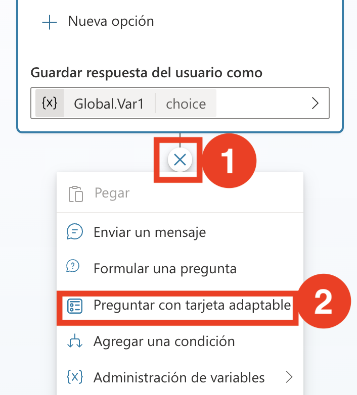
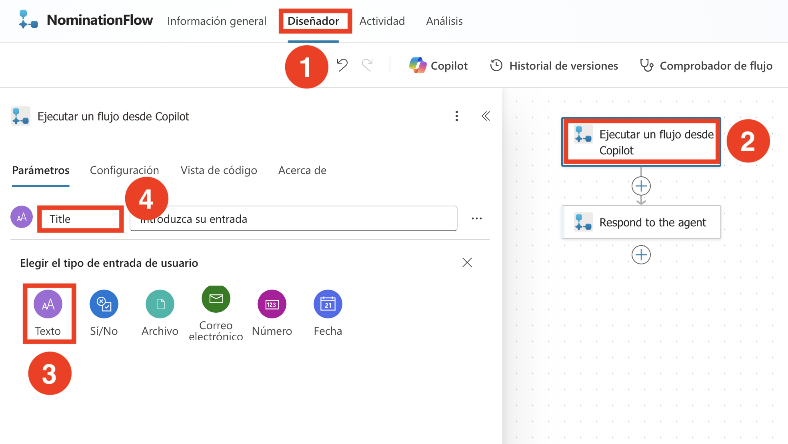
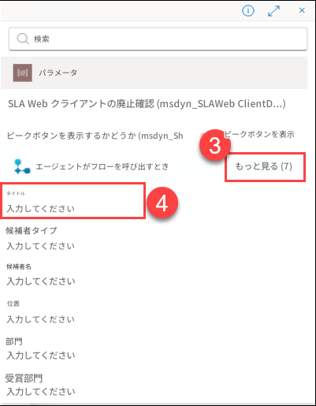
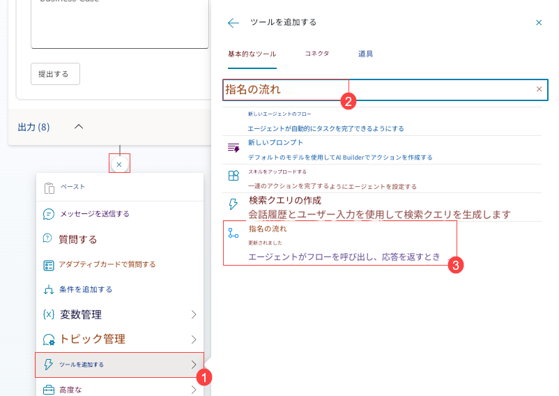

# 演習 3: HR エージェントにアクションを組み込む

### 推定所要時間: 60 分

### 概要

Microsoft Copilot Studio を使用して賞と認識を実装することで、従業員の貢献と業績をノミネートし認識するプロセスが合理化されます。

### シナリオ

会社 (Contoso Enterprises) は、ソフトウェア開発チームを拡大しています。HR 部門は Microsoft 365 Copilot を使用して採用プロセスを合理化し、候補者と採用チームの両方にとってスムーズで効率的な体験を確保することを目指しています。

### 目的

- ノミネーションを作成する。

### タスク 01: ノミネーションを作成する。

このタスクでは、Copilot Studio を使用して従業員がノミネーションフォームを提出するのを支援するエージェントを作成します。Microsoft 365 Copilot でノミネーションを作成する際には、ノミネーションが十分に文書化され、効果的であることを確保するために包括的な詳細を収集することが重要です。

1. Edge ブラウザーに新しいタブを追加し、[Microsoft Copilot Studio](https://copilotstudio.microsoft.com/)を開きます。 

2. 表示されるポップアップウィンドウで **無料トライアルを開始** をクリックします。

      

3. **Copilot Studio** で、左ペインから **+ 作成 (1)** を選択し、**+ 新しいエージェント (2)** をクリックします。

   

4. 新しいエージェントで、**構成にスキップ** を選択します。

    

5. 以下の詳細を入力し、**作成 (4)** ボタンをクリックします。

   - 名前: **ノミネーションエージェント (1)**.   （英語訳：「Nomination Agent」）
   - 説明: 説明ボックスに以下の説明を入力 **(2)**

       プロンプト:
    ```
       The Nomination Agent in Copilot Studio is designed to streamline the process of creating, managing, and reviewing nominations within Tech Innovators Inc. This agent helps HR teams and managers efficiently handle nominations for awards and recognitions. It allows users to create detailed nominations, capturing necessary nominee information, award categories, and business cases. The agent automatically generates comprehensive summaries for each nomination, facilitating quick and informed decision-making. It also streamlines the review and submission process, enabling easy access to candidate achievements and recognitions. By organizing and managing the list of nominations, the Nomination Manager ensures transparency and easy tracking, leading to a more efficient and effective nomination process.
    ```
    >**任意:** 日本語訳のプロンプトは:
    ```
    Copilot Studio のノミネーションエージェントは、Tech Innovators Inc. 内でノミネーションの作成、管理、およびレビューのプロセスを合理化するように設計されています。このエージェントは、HR チームとマネージャーが賞と認識のためのノミネーションを効率的に処理するのを支援します。ユーザーが詳細なノミネーションを作成し、必要な候補者情報、賞のカテゴリー、およびビジネスケースをキャプチャすることを可能にします。エージェントは各ノミネーションの包括的な要約を自動的に生成し、迅速かつ情報に基づいた意思決定を促進します。また、レビューおよび提出プロセスを合理化し、候補者の業績と認識への簡単なアクセスを可能にします。ノミネーションのリストを整理および管理することで、ノミネーションマネージャーは透明性と簡単な追跡を確保し、より効率的で効果的なノミネーションプロセスを実現します。
    ```
   - 指示: ノミネーションエージェントに以下の指示を提供してください **(3)**

    プロンプト:
    ```
        Create Nomination: Use the create Nomination function to initiate the nomination process. This function will prompt the user to enter necessary details such as the nominee's name, position, department, award category, and business case.
        Generate Nomination Summary: Call the generate Nomination Summary function to automatically create a concise summary of the nomination. This summary will include key candidate information, achievements, and contributions based on the input provided during the nomination creation.
        Review and Submit Nomination: Implement the review And Submit Nomination function to allow users to review the generated summary and all nomination details. Once reviewed, the function will enable users to submit the nomination for approval.
        View Recognition: Use the viewRecognition function to allow users to access and acknowledge the achievements and recognitions of candidates. This function will display a list of recognitions received by nominees.
        View Nominations: Implement the view Nominations function to provide users with an organized view of all submitted nominations. This function will ensure transparency and easy tracking of the nomination process, allowing users to monitor the status and progress of each nomination.
    ```
    >**任意:** 日本語訳のプロンプトは:
    ```
       ノミネーションを作成: ノミネーションプロセスを開始するために、ノミネーション作成機能を使用します。この機能は、ユーザーに候補者の名前、役職、部門、賞のカテゴリー、およびビジネスケースなどの必要な詳細を入力するよう促します。
       ノミネーション要約を生成: ノミネーション要約生成機能を呼び出して、ノミネーションの簡潔な要約を自動的に作成します。この要約には、ノミネーション作成時に提供された入力に基づいて、主要な候補者情報、業績、および貢献が含まれます。
       ノミネーションをレビューして提出: ノミネーションの詳細と生成された要約をユーザーがレビューできるようにするために、ノミネーションレビューおよび提出機能を実装します。レビューが完了したら、この機能はユーザーがノミネーションを承認のために提出できるようにします。
       認識を表示: 候補者の業績と認識をユーザーがアクセスして確認できるようにするために、認識表示機能を使用します。この機能は、候補者が受けた認識のリストを表示します。
       ノミネーションを表示: 提出されたすべてのノミネーションの整理されたビューをユーザーに提供するために、ノミネーション表示機能を実装します。この機能は、ノミネーションプロセスの透明性と簡単な追跡を確保し、ユーザーが各ノミネーションのステータスと進捗を監視できるようにします。
    


6. Copilot Studio で、上部までスクロールし、**トピック (1)** をクリックし、**すべて (2)** を選択して **会話開始 (3)** を選択します。

    

7. **会話開始** ワークフローで、トリガーノードの下にある **トリガーを変更 (1)** を選択し、トリガーを **イベント受信 (2)** に変更します。 

    

8. **メッセージ** ノードの下の領域をクリックし、メッセージを以下のように置き換えます:

    プロンプト:
    ```
    こんにちは、私はノミネーションエージェント、バーチャルアシスタントです。ノミネーションの提出、ノミネーション要約の生成、認識の表示、ノミネーションの表示をお手伝いします。他のアクションに進む前に、まずノミネーションを提出してください。
    ```
    >**任意:** 日本語訳のプロンプトは:
    ```
     


9. **メッセージ** ノードの下で **ノードを追加 (1)** をクリックし、**質問をする (2)** を選択します。

   

10. **質問をする** ノードで以下の詳細を入力し、**保存 (7)** をクリックします:
    - メッセージボックスに **ノミネーションを提出しますか (1)** を入力します。   （英語訳：「Do you want to submit a nomination?」）
    - **+ 新しいオプション (2)** を選択し **はい (3)** を追加し、再度 **+ 新しいオプション** を選択して **いいえ (4)** を追加します。
    - **Var1 (5)** をクリックし、ユーザーの応答を保存する場所として **グローバル（任意のトピックがアクセス可能） (6)** に変更します。
    
      

11. **質問する** ノードの下で、**ノードの追加** **(1)** をクリックし、**アダプティブ カードで質問する** **(2)** を選択します。

    

12. **アダプティブカードで質問する**ノードで省略記号**(...) (1)**をクリックし、**プロパティ(2)**を選択します。

      


13. **アダプティブ カードの編集** オプションをクリックします。

      


14. **カードペイロードエディター**内で、以下の**JSONスクリプト** **(1)**を置き換え、**保存(2)**をクリックしてから**閉じる**をクリックします。
   
       

     ```json
    {
      "type": "AdaptiveCard",
      "body": [
        {
          "type": "TextBlock",
          "size": "Medium",
          "weight": "Bolder",
          "text": "Nomination Submission"
        },
        {
          "type": "Input.Text",
          "id": "title",
          "placeholder": "Title (e.g., Mr., Ms., Dr.)",
          "label": "Title"
        },
        {
          "type": "Input.ChoiceSet",
          "id": "nomineeType",
          "style": "expanded",
          "label": "Nominee Type",
          "choices": [
            {
              "title": "Single Person",
              "value": "single"
            },
            {
              "title": "Multiple Persons",
              "value": "multiple"
            },
            {
              "title": "Team",
              "value": "team"
            }
          ]
        },
        {
          "type": "Input.Text",
          "id": "nomineeName",
          "placeholder": "Nominee Name(s) (for multiple persons, separate by commas)",
          "label": "Nominee Name(s)"
        },
        {
          "type": "Input.Text",
          "id": "position",
          "placeholder": "Position",
          "label": "Position"
        },
        {
          "type": "Input.Text",
          "id": "department",
          "placeholder": "Department",
          "label": "Department"
        },
        {
          "type": "Input.ChoiceSet",
          "id": "awardCategory",
          "style": "expanded",
          "choices": [
            {
              "title": "Award Category 1",
              "value": "category1"
            },
            {
              "title": "Award Category 2",
              "value": "category2"
            },
            {
              "title": "Award Category 3",
              "value": "category3"
            }
          ],
          "label": "Award Category"
        },
        {
          "type": "Input.Text",
          "id": "businessCase",
          "placeholder": "Business Case",
          "isMultiline": true,
          "label": "Business Case"
        }
      ],
      "actions": [
        {
          "type": "Action.Submit",
          "title": "Submit"
        }
      ],
      "version": "1.4"
    }
    ```

    
15. 適応カードで生成されたすべての変数がグローバルに設定されていることを確認し、**保存** を選択します。

    

    

16. **適応カードで質問する** ノードの下で、**ノードを追加 (1)** をクリックし、**アクションを追加 (2)** を選択し、**新しい New agent フロー (3)** を選択します。

    

17. エージェントフローの「デザイナー」タブで、「**下書きを保存**」をクリックします。

    


18. **フロー** (1) タブをクリックし、**エージェントフローの編集** (2) をクリックします。

    

19. **概要**(1)タブをクリックし、**編集** (2)をクリックします。

    

20. フロー名フィールドに**NominationFlow** (1)と入力し、**保存** (2)をクリックします。  

    

21. **デザイナー (1)** タブをクリックし、**エージェントがフローを呼び出したとき** **(2)** ノードをクリックします。**パラメーター** セッションの下で、**+ 入力の追加** をクリックします。**テキスト** **(3)** を選択します。テキスト ボックスに **タイトル** **(4)** を入力します。

    
    


22. 手順を繰り返し、**+ 入力を追加 (1)** をクリックし、**テキスト (2)** を選択し、以下の **パラメーター** を入力します:

    - NomineeType
    - NomineeName
    - Position
    - Department
    - AwardCategory
    - BusinessCase

23. すべてのパラメーターが追加されたら、**折りたたむ** をクリックします。

    

24. **エージェントがフローを呼び出すと** の下で **アクションを追加 (1)** をクリックし、**テーブルに行を追加 (2)** を検索し、**テーブルに行を追加 (3)** を選択します。

    


25. **サインイン**をクリックします。新しいブラウザタブがポップアップ表示されるので、既にログインしているアカウントを選択してください。

    


26. **アクセスを許可**をクリックします。


27. **テーブルに行を追加 (1)** を選択し、以下の詳細を入力します:

    - 場所: ドロップダウンから **OneDrive for Business (2)** を選択します。
    - ドキュメントライブラリ: ドロップダウンから **OneDrive (3)** を選択します。
    - ファイル: **/data/NominationList.xlsx (4)** を選択します。
        - **フォルダー (1)** アイコンをクリックし、 フォルダーに移動し、**NominationList.xlsx (2)** を選択します。

            
          
    - テーブル: ドロップダウンから **Table1 (5)** を選択します。

      

28. **高度なパラメーター** から、Title、NomineeType、NomineeName、Position、Department、AwardCategory、および BusinessCase を選択します。

    

29. **高度なパラメーター** の下で、タイトルテキストボックスに **/ (1)** と入力し、**動的コンテンツを挿入 (2)** を選択します。**エージェントがフローを呼び出すと** の横にある **詳細を表示 (3)** をクリックし、**Title (4)** を選択します。

    
    

    > **注意:** **エージェントがフローを呼び出すと** の下で選択していることを確認してください。

30. 前の手順と同様に、各フィールドに対して次の指示に従ってください。

      - 該当するテキストボックスに **/** と入力し、**動的コンテンツを挿入** を選択します。**Copilot からフローを実行** の横にある **詳細を表示** をクリックし、適切なオプションを選択します:
         - NomineeType
         - NomineeName
         - Position
         - Department
         - AwardCategory
         - BusinessCase
      
      - すべての更新が完了したら、**公開** をクリックして保存し、適用します。
   
           

31. **エージェント** (1)ページに戻り、**Nomination Agent** (2)を選択します。

    

32. **トピック**(1)タブをクリックし、**会話の開始**(2)を選択します。

    

33. **ツールの追加** セクションで、検索バーを使用して **NominationFlow** を見つけ、それを選択してノードに追加します。

    


34. **エージェントがフローを呼び出すと** セクションで、検索バーを使用して **ノミネーションフロー** を見つけ、それを選択してノードに追加します。

      

35. 各アクション変数を選択し、リスト内の変数とマージします。

    

36. **アクション** ノードの下で **ノードを追加 (1)** をクリックし、**メッセージを送信 (2)** を選択します。

    

37. 次に、**ノミネーションの提出に成功しました。** と入力し、**保存** を選択します。   （英語訳：「You have successfully submitted Nominations.」）

    

38. ノミネーションエージェントを使用してノミネーションを提出します。

このタスクでは、ノミネーションエージェントの作成を完了しました。

### レビュー

Microsoft Copilot Studio を使用して賞と認識を実装するこのラボを完了すると、従業員の業績をノミネートおよび認識するための構造化されたシステムを設定する実践的な経験が得られます。事前に構築された賞と認識エージェントを利用して、ユーザーがノミネーションの作成、要約、レビュー、および提出を行う方法を理解します。

以下のタスクを正常に完了しました:
- ノミネーションを作成する。
 
### ナビゲーションをクリックして次のラボに進みます。
