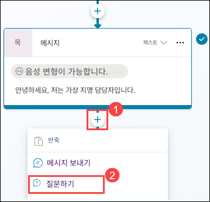
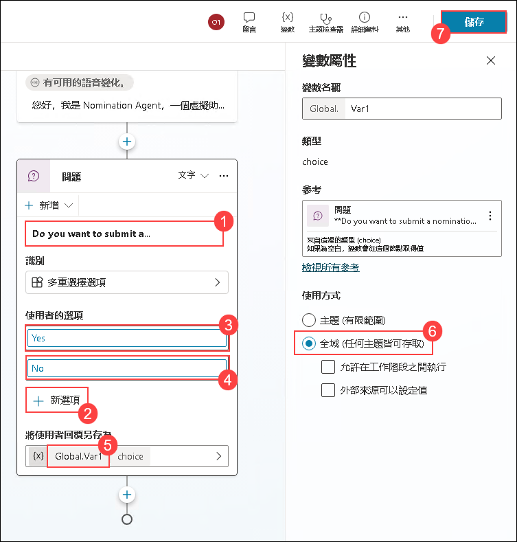

# 練習 3：在 HR Agent 中整合動作

### 預估時間：60 分鐘

## 實驗概覽

使用 Microsoft Copilot Studio 實驗獎勵與表揚功能，以簡化提名與表揚員工貢獻與成就的流程。

## 情境說明

您的公司 Contoso Enterprises 正在擴展軟體開發團隊。人資部門希望透過 Microsoft 365 Copilot 簡化招募流程，為候選人與招募團隊提供順暢且高效的體驗。

## 實驗目標

- 任務 1：建立提名

### 任務 1：建立提名

在此任務中，您將使用 Copilot Studio 建立一個協助員工提交提名表單的代理程式。在 Microsoft 365 Copilot 中建立提名時，收集完整資訊是確保提名具備良好文件與有效性的關鍵。

1. 在 Edge 瀏覽器中新增分頁並開啟 [Microsoft Copilot Studio](https://copilotstudio.microsoft.com/)。

2. 在跳出視窗中點選 **開始免費試用**。

    

3. 在 **Copilot Studio** 左側窗格中選擇 **+ 建立** **(1)**，然後點選 **+ 新增代理程式** **(2)**。

   

4. 在新代理程式畫面中，選擇 **跳到設定**。

    

5. 輸入以下資訊並點選 **建立** **(4)** 按鈕：

   - 名稱: **Nomination Agent** **(1)**. 
   - 描述: 在描述框中提供以下描述 **(2)**

       ```
       Copilot Studio 中的提名代理人旨在簡化 Tech Innovators Inc. 內部提名的建立、管理與審查流程。此代理人協助 HR 團隊與主管有效處理獎勵與表揚提名，它允許使用者建立詳細提名，收集被提名人資訊、獎項類別與商業理由。代理人會自動產生提名摘要，協助快速且明智的決策，並簡化審查與提交流程，讓使用者輕鬆存取候選人成就與表揚紀錄。透過組織與管理提名清單，提名管理員可確保透明度與追蹤便利性，提升提名流程效率與成效。
        ```
   - 指令說明: 向提名代理人提供以下指令 **(3)**

        ```
        建立提名：使用 createNomination 功能啟動提名流程，系統將提示使用者輸入被提名人姓名、職稱、部門、獎項類別與商業理由等必要資訊。
        產生提名摘要：使用 generateNominationSummary 功能自動建立提名摘要，摘要將根據輸入內容包含候選人資訊、成就與貢獻。
        審查與提交提名：使用 reviewAndSubmitNomination 功能讓使用者審查提名摘要與所有細節，審查後可提交提名以供審核。
        檢視表揚紀錄：使用 viewRecognition 功能讓使用者存取並確認候選人所獲表揚。
        檢視提名：使用 viewNominations 功能提供所有已提交提名的有組織檢視，確保透明度與追蹤便利性。
        ```

        

6. 在 Copilot Studio 中，捲動至頂部，點選 **主題** **(1)**，然後選擇 **所有** **(2)**，再點選 **交談開始** **(3)**。

    

7. 在 **交談開始** 工作流程中，點選 **變更觸發程序** **(1)**，並將觸發條件改為 **已收到事件** **(2)**。

    

8. 點選 **訊息** 節點下的區域，並將訊息替換為以下內容：

    ```
    您好，我是 Nomination Agent，一個虛擬助理。我在這裡幫助您提交提名、產生提名摘要、查看表揚紀錄與查看提名。在進行其他操作前，請先提交一份提名。
    ```

   

9. 在 **訊息** 節點下，點選 **新增節點** **(1)**，然後選擇 **提出問題** **(2)**。

   

10. 在 **問題** 節點中，輸入以下內容並點選 **儲存** **(7)**：
    - 在訊息框中輸入：**Do you want to submit a nomination?** **(1)**。
    - 點選 **+ 新選項** **(2)**，新增 **Yes** **(3)**，再點選 **+ 新選項** 並新增 **No** **(4)**。
    - 在 **將使用者回覆另存為** 點選 **Var1** **(5)**，在 **使用方式** 設為 **全域 (任何主題皆可存取)** **(6)**。
    
    
      

11. 在 **問題** 節點下，點選 **新增節點** **(1)**，然後選擇 **使用調適型卡片詢問** **(2)**。

    

12. 在新增的 **調適型卡片** 節點中，按一下右上角的 **... (1)** 並選擇 **屬性 (2)**。

    

13. 點選 **編輯調適型卡片** 選項。

    

14. 在 **卡片承載編輯器** 中，替換下面提供的 **JSON script** **(1)**，然後按一下 **Save (2)**，然後按一下 **Close**。

    

    ```json
    {
          "type": "AdaptiveCard",
          "body": [
            {
              "type": "TextBlock",
              "size": "Medium",
              "weight": "Bolder",
              "text": "Nomination Submission"
            },
            {
              "type": "Input.Text",
              "id": "title",
              "placeholder": "Title (e.g., Mr., Ms., Dr.)",
              "label": "Title"
            },
            {
              "type": "Input.ChoiceSet",
              "id": "nomineeType",
              "style": "expanded",
              "label": "Nominee Type",
              "choices": [
                {
                  "title": "Single Person",
                  "value": "single"
                },
                {
                  "title": "Multiple Persons",
                  "value": "multiple"
                },
                {
                  "title": "Team",
                  "value": "team"
                }
              ]
            },
            {
              "type": "Input.Text",
              "id": "nomineeName",
              "placeholder": "Nominee Name(s) (for multiple persons, separate by commas)",
              "label": "Nominee Name(s)"
            },
            {
              "type": "Input.Text",
              "id": "position",
              "placeholder": "Position",
              "label": "Position"
            },
            {
              "type": "Input.Text",
              "id": "department",
              "placeholder": "Department",
              "label": "Department"
            },
            {
              "type": "Input.ChoiceSet",
              "id": "awardCategory",
              "style": "expanded",
              "choices": [
                {
                  "title": "Award Category 1",
                  "value": "category1"
                },
                {
                  "title": "Award Category 2",
                  "value": "category2"
                },
                {
                  "title": "Award Category 3",
                  "value": "category3"
                }
              ],
              "label": "Award Category"
            },
            {
              "type": "Input.Text",
              "id": "businessCase",
              "placeholder": "Business Case",
              "isMultiline": true,
              "label": "Business Case"
            }
          ],
          "actions": [
            {
              "type": "Action.Submit",
              "title": "Submit"
            }
          ],
          "version": "1.4"
        }
    ```

15. 確保所有由自適應卡片產生的變數都設為 **全域 (任何主題皆可存取)**，然後點選 **儲存** **(2)**。    

    

    

16. 在 **調適型卡片** 節點下，點擊 **新增節點** **(1)**，然後選擇 **新增工具** **(2)**，最後選擇 **新代理商流程** **(3)**。

    

17. 在設計器標籤下的**代理程式流程**中，按一下 **儲存草稿**。

    

18. 在 **Copilot Studio** 左側窗格中選擇 **流程** **(1)** 選項卡，然後點選 **編輯代理程式流程** **(2)**。

    

19. 點選 **概觀** **(1)** 標籤，然後點選 **編輯** **(2)**。

    

20. 在流程名稱欄位中輸入**NominationFlow** **(1)**，然後點選 **儲存** **(2)**。

    

21. 點選 **設計工具** **(1)** 標籤，然後點選 **執行來自 Copilot 的流程** **(2)** 節點，在 **參數** 會話下點選 **+ 新增輸入**，選擇 **文字** **(3)**，在文字方塊中輸入 **Title** **(4)**。

    

22. 重複上述步驟，點選 **+ 新增輸入** ，選擇 **文字** ，並依序在文字方塊中輸入以下所有 **參數**：

    - NomineeType
    - NomineeName
    - Position
    - Department
    - AwardCategory
    - BusinessCase

23. 在所有參數新增完成後 **(1)**，點選 **摺叠** **(2)** 圖示。

    

24. 在 **執行來自 Copilot 的流程** 節點下方，點選 **新增動作** **(1)**，搜尋 **在表格中新增一列** **(2)**，並選擇該動作 **在表格中新增一列** **(3)**。

    

25. 點選 **登入**。將會彈出一個新的瀏覽器標籤。選擇您已登入的帳戶。

     

26. 在彈出的 **Confirmation required** 視窗中，點擊 **Allow Access**。

27. 在**在表格中新增一列** 中的 **參數** 會話下，填寫以下資訊：

    - 位置：從下拉選單中選擇 **OneDrive for Business** **(1)**。
    - 文件庫：選擇 **OneDrive** **(2)**。
    - 檔案：選擇 **/data/NominationList.xlsx** **(3)**。
        - 點選 **開啟資料夾** **(1)** 圖示，導航至 **data** 資料夾，並選擇 **NominationList.xlsx** **(2)**。

            

    - 資料表：從下拉選單中選擇 **Table1** **(4)**。

      

28. 在 **進階參數** 中，請選擇以下欄位：Title, NomineeType, NomineeName, Position, Department, AwardCategory, 和 BusinessCase。

    

29. 在 **進階參數** 中的 Title 欄位中，輸入 **/** **(1)**，然後選擇 **插入動態內容** **(2)**。在 **執行來自 Copilot 的流程** 區段中，點選 **查看更多** **(3)**，然後選擇 **Title** **(4)**。

    

    

    > **注意**：請確保您選擇的是 **執行來自 Copilot 的流程** 區段下的欄位。

30. 重複上述步驟，請依下列說明為每個欄位插入動態內容：

      - 在對應的文字框中輸入 **/**，選擇 **插入動態內容**。在 **執行來自 Copilot 的流程** 區段中，點選 **查看更多**，然後選擇對應的欄位：
         - NomineeType
         - NomineeName
         - Position
         - Department
         - AwardCategory
         - BusinessCase
      
      - 當您完成所有欄位設定後 **(1)**，點選 **發佈** **(2)** 以儲存並套用變更。
   
           

31. 返回 **代理程式** **(1)** 頁面，然後選擇 **Nomination Agent** **(2)**。

      

32. 點選 **主題** **(1)** 標籤並選擇 **交談開始** **(2)**。

    


33. 在 **調適型卡片** 節點下，點擊 **新增節點** ，然後選擇 **新增動作** **(2)**，在 **新增動作** 區段中，使用搜尋列尋找 **NominationFlow** **(2)**，然後選擇它  **(3)** 以新增至節點中。

    

34. 選擇每個動作變數，並將其與清單中的對應變數合併。

    

35. 在新增的 **動作 NominationFlow** 節點下，點選 **新增節點** **(1)**，然後選擇 **傳送訊息** **(2)**。

    

36. 然後在新增的 **訊息** 節點，輸入 **You have successfully submitted Nominations（1）**。然後選擇 **儲存 (2)**。

    

37. 使用 Nomination Agent 提交一份提名。

在此任務中，您已完成 NominationAgent 的建立。

### 回顧

完成本實驗課程後，您將具備使用 Microsoft Copilot Studio 實驗獎勵與表揚系統的實務經驗。在下一個實驗課程中，您將了解如何運用預建的獎勵與表揚代理程式，引導使用者建立、摘要、審查與提交提名。

成功完成以下任務：
- 建立提名。
 
### 恭喜！您已成功完成本次實驗課程！
### 前往下一個實驗課程，請點選導覽連結。
