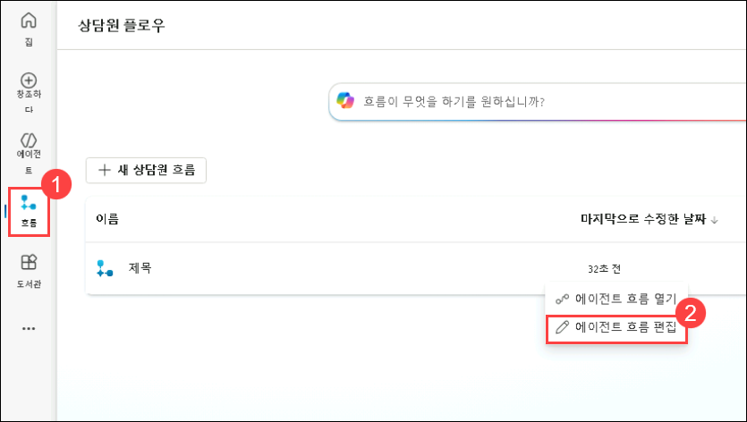

# 실습 3: HR 에이전트에 작업(Action) 통합하기

### 예상 소요 시간: 60분

## 개요

Microsoft Copilot Studio를 활용해 우수사원 포상 및 격려 제도를 구현하면, 직원의 공헌과 성과를 기반으로 후보자를 추천하고 포상하는 전 과정을 보다 간편하게 관리할 수 있습니다.

## 시나리오

귀하의 회사인 Contoso Enterprises는 소프트웨어 개발 팀의 확장을 추진하고 있으며, 인사부는 Microsoft 365 Copilot을 활용하여 채용 프로세스를 간소화하고자 합니다. 이를 통해 지원자와 채용 팀 모두에게 보다 원활하고 효율적인 경험을 제공하는 것을 목표로 하고 있습니다.

## 목표

- 추천서 작성

## 과제 1: 추천서 작성

이번 과제에서는 Copilot Studio를 활용하여 직원들이 손쉽게 추천서를 제출할 수 있도록 지원하는 에이전트를 생성합니다.
Microsoft 365 Copilot을 통해 추천서를 작성할 때에는, 체계적이고 설득력 있는 문서가 완성될 수 있도록 포괄적이고 구체적인 세부 정보를 수집하는 것이 중요합니다.

1. Edge 브라우저에서 새 탭을 열고 [Microsoft Copilot Studio](https://copilotstudio.microsoft.com/)를 엽니다.

1. 팝업 창에서 **무료 평가판 시작** 을 클릭합니다. 

      

1. Copilot Studio의 왼쪽 창에서 **+ 만들기** **(1)** 를 선택한 후, + 
**새 에이전트** **(2)** 를 클릭합니다.

   

1. New Agent 창에서, **구성** 를 선택합니다. 

1. 다음 세부 정보를 입력한 후 **만들다** 버튼을 **(4)** 클릭합니다. 
   - Name: **Nomination Agent** **(1)**. 
   - Description: 아래의 내용을 Description 창에 입력 합니다. **(2)**

       ```
       The Nomination Agent in Copilot Studio is designed to streamline the process of creating, managing, and reviewing nominations within Tech Innovators Inc. This agent helps HR teams and managers efficiently handle nominations for awards and recognitions. It allows users to create detailed nominations, capturing necessary nominee information, award categories, and business cases. The agent automatically generates comprehensive summaries for each nomination, facilitating quick and informed decision-making. It also streamlines the review and submission process, enabling easy access to candidate achievements and recognitions. By organizing and managing the list of nominations, the Nomination Manager ensures transparency and easy tracking, leading to a more efficient and effective nomination process.
        ```

        ```
        Copilot Studio의 추천 에이전트는 Contoso Enterprises 내에서 추천서를 생성하고 관리하며 검토하는 과정을 간소화하도록 설계되었습니다. 이 에이전트는 인사부와 관리자가 포상 및 격려 제도를 위한 추천서를 효율적으로 처리할 수 있도록 지원합니다. 사용자는 수상 부문, 추천 대상자의 정보, 비즈니스 근거 등을 포함한 상세한 추천서를 생성할 수 있으며, 에이전트는 각 추천 건에 대한 포괄적인 요약을 자동으로 생성하여 빠르고 정확한 의사결정을 돕습니다. 또한 검토 및 제출 과정을 간소화하여 후보자의 성과 및 기여여 내역에 손쉽게 접근할 수 있도록 합니다. 추천 목록을 체계적으로 구성하고 관리함으로써 추천 매니저는 투명성과 추적 용이성을 확보하며, 보다 효율적이고 효과적인 추천 프로세스를 가능하게 합니다.
        ```

   - Instructions: 아래 내용으로 Nomitation Agent를 설정합니다. **(3)**
        ```
        Create Nomination: Use the create Nomination function to initiate the nomination process. This function will prompt the user to enter necessary details such as the nominee's name, position, department, award category, and business case.
        Generate Nomination Summary: Call the generate Nomination Summary function to automatically create a concise summary of the nomination. This summary will include key candidate information, achievements, and contributions based on the input provided during the nomination creation.
        Review and Submit Nomination: Implement the review And Submit Nomination function to allow users to review the generated summary and all nomination details. Once reviewed, the function will enable users to submit the nomination for approval.
        View Recognition: Use the viewRecognition function to allow users to access and acknowledge the achievements and recognitions of candidates. This function will display a list of recognitions received by nominees.
        View Nominations: Implement the view Nominations function to provide users with an organized view of all submitted nominations. This function will ensure transparency and easy tracking of the nomination process, allowing users to monitor the status and progress of each nomination.
        ```

        ```
        Create Nomination: Create Nomination 기능을 사용하여 추천 프로세스를 시작합니다. 이 기능은 사용자에게 지명 대상자의 이름, 직위, 부서, 수상 부문, 비즈니스 근거와 같은 필수 정보를 입력하도록 안내합니다.
        Generate Nomination Summary: Generate Nomination Summary 기능을 호출하여 추천 내용을 간결하게 요약한 문서를 자동으로 생성합니다. 이 요약에는 추천 생성 시 입력한 정보를 바탕으로 후보자의 핵심 정보, 주요 성과 및 기여 내용이 포함됩니다.
        Review and Submit Nomination: Review and Submit Nomination 기능을 구현하여 사용자가 자동 생성된 요약 정보와 추천 세부 정보를 검토할 수 있도록 합니다. 검토가 완료되면, 이 기능을 통해 추천을 승인 요청으로 제출할 수 있습니다.
        View Recognition: View Recognition 기능을 사용하면 사용자가 후보자의 성과와 기여 내역에 접근하고 이를 확인할 수 있습니다. 이 기능은 지명 대상자가 받은 추천 항목의 목록을 표시합니다.
        View Nominations: View Nominations 기능을 구현하여 사용자가 제출된 모든 추천 건을 체계적으로 확인할 수 있도록 합니다. 이 기능은 추천 프로세스의 투명성과 추적 용이성을 보장하며, 각 추천의 상태와 진행 상황을 모니터링할 수 있게 합니다.
        ```

        

1. Copilot Studio에서 화면 상단으로 스크롤한 후, Topics **(1)** 을 클릭하고, All **(2)** 를 선택한 다음, Conversation Start **(3)** 을 선택합니다.

    

1. **Conversation Start** 워크플로우에서, Trigger node 아래의 **Change trigger** **(1)** 를 선택한 후, 트리거를 **Event received** **(2)** 으로 변경합니다.

    

1. **Message** 노드 아래 영역을 클릭한 후, 메시지를 아래와 같이 변경합니다.

    ```
    Hello, I'm Nomination Agent, a virtual assistant. I am here to help you submit a nomination, generate a Nomination Summary, view Recognition, and view Nomination. Before going for any other action, please submit a nomination.
    ```

    ```
    안녕하세요, 저는 Nomination Agent라는 가상 비서입니다. 추천서를 제출하고, 추천 요약 내용을 생성하며, 기여 내용과 추천 현황을 확인할 수 있도록 도와드리겠습니다. 다른 작업을 진행하시기 전에 먼저 추천서를 제출해 주세요.
    ```

   

1. **Message** 노드 아래에서, **Add Node** **(1)** 를 클릭한 후, **Ask a question** **(2)** 를 선택합니다.

   

1. **Ask a question** 노드에서 다음 정보를 입력한 후, **Save** **(7)** 을 클릭합니다.
    - **메시지 박스에 Do you want to submit a nomination? (추천서를 제출하시겠습니까?)** **(1)** 를 입력합니다.
    - **+ New Option** **(2)** 을 선택하고 **Yes** **(3)** 를 추가한 후, 다시 **+ New Option** 을 선택하고 **No** **(4)** 를 추가합니다.
    - Save user response as 아래에서서 **Var1** **(5)** 을 클릭하고, Usage를 **Global(any topic can access)** **(6)** 으로 변경합니다.

      

1. **Ask a question** 노드 아래에서 **Add Node** **(1)** 를 클릭한 후, **Ask with adaptive Card** **(2)** 를 선택합니다.

    

1. **적응형 카드 노드로 질문하기**에서 줄임표(...)(1)를 클릭하고 **속성(2)**을 선택합니다.

      

1. **적응형 카드 편집(Edit adaptive card)** 옵션을 클릭합니다.

      

1. **Adaptive Card** **(1)** 를 클릭한 후 **JSON script** **(2)** 아래를 다음 내용으로 교체 합니다. 

    

    ```json
    {
          "type": "AdaptiveCard",
          "body": [
            {
              "type": "TextBlock",
              "size": "Medium",
              "weight": "Bolder",
              "text": "Nomination Submission"
            },
            {
              "type": "Input.Text",
              "id": "title",
              "placeholder": "Title (e.g., Mr., Ms., Dr.)",
              "label": "Title"
            },
            {
              "type": "Input.ChoiceSet",
              "id": "nomineeType",
              "style": "expanded",
              "label": "Nominee Type",
              "choices": [
                {
                  "title": "Single Person",
                  "value": "single"
                },
                {
                  "title": "Multiple Persons",
                  "value": "multiple"
                },
                {
                  "title": "Team",
                  "value": "team"
                }
              ]
            },
            {
              "type": "Input.Text",
              "id": "nomineeName",
              "placeholder": "Nominee Name(s) (for multiple persons, separate by commas)",
              "label": "Nominee Name(s)"
            },
            {
              "type": "Input.Text",
              "id": "position",
              "placeholder": "Position",
              "label": "Position"
            },
            {
              "type": "Input.Text",
              "id": "department",
              "placeholder": "Department",
              "label": "Department"
            },
            {
              "type": "Input.ChoiceSet",
              "id": "awardCategory",
              "style": "expanded",
              "choices": [
                {
                  "title": "Award Category 1",
                  "value": "category1"
                },
                {
                  "title": "Award Category 2",
                  "value": "category2"
                },
                {
                  "title": "Award Category 3",
                  "value": "category3"
                }
              ],
              "label": "Award Category"
            },
            {
              "type": "Input.Text",
              "id": "businessCase",
              "placeholder": "Business Case",
              "isMultiline": true,
              "label": "Business Case"
            }
          ],
          "actions": [
            {
              "type": "Action.Submit",
              "title": "Submit"
            }
          ],
          "version": "1.4"
        }
    ```

    
1. Adaptive Card에서 생성된 모든 변수가 Global로 설정되어 있는지 확인한 후, **Save** 를 선택합니다.

    

1. **Ask with adaptive Card** 노드 아래에서 **Add Node** **(1)** 를 클릭한 후, **Add a tool** **(2)** 를 선택하고, **New Agent Flow** **(3)** 을 선택합니다. 이 작업은 **New Agent Flow** 으로 리디렉션됩니다.

    

1. '디자이너' 탭의 '에이전트 흐름'에서 **초안 저장**을 클릭하세요.
    
    

1. **흐름**(1) 탭을 클릭하고 **에이전트 흐름 편집**(2)을 클릭합니다.

    


1. **개요**(1) 탭을 클릭하고 **편집**(2)을 클릭합니다.

    

1. 흐름 이름 필드에 **NominationFlow**(1)를 입력하고 **저장**(2)을 클릭합니다.

    

1. **디자이너(1)** 탭을 클릭하고 **에이전트가 흐름을 호출할 때** **(2)** 노드를 클릭하고 **매개변수** 세션에서 **+ 입력 추가**를 클릭하고 **텍스트** **(3)**를 선택하고 텍스트 상자에 **제목** **(4)**을 입력합니다.

    

1. **+ Add an Input** **(1)** 을 클릭하고, **Text** **(2)** 를 선택한 후, 다음 매개변수 각각을 반복하여 추가하십시오.
    - NomineeType
    - NomineeName
    - Position
    - Department
    - AwardCategory
    - BusinessCase

1. 모든 매개변수를 추가하였다면, **Collapse** 를 클릭합니다.

    

1. **Run from a copilot** 아래에 있는 **Add action** **(1)** 을 클릭한 후, **Add a row into a table** **(2)** 을 검색하여 **테이블에 행 추가** **(3)** 을 선택합니다.

    

1. **로그인**을 클릭하세요. 새 브라우저 탭이 나타납니다. 이미 로그인한 계정을 선택하세요.

    
    > **참고:** "팝업 차단됨" 오류 메시지가 표시되면 허용을 클릭하고 프로세스를 다시 시도하세요.

1. **액세스 허용**을 클릭합니다.

1. **Add a row into a table** **(1)** 을 선택한 후, 다음 정보를 입력합니다.

    - Location: 드롭다운 리스트에서 **OneDrive for Business** **(2)** 선택.
    - Document Library: 드롭다운 리스트에서 **OneDrive** **(3)** 선택.
    - File: **/data/NominationList.xlsx** **(4)** 선택.
        - Click on the **folder** **(1)** icon and navigate to the **data** **(2)** folder, and select **NominationList.xlsx** **(3)**.
        - **폴더** **(1)** 아이콘을 클릭한 후, **data** **(2)** 폴더로 이동하여 **NominationList.xlsx** **(3)** 파일 선택.

            
          
    - Table: 드롭다운 리스트에서 **Table1** **(5)** 선택.

      

1. **Advanced Parameters** 에서 Title, NomineeType, NomineeName, Position, Department, AwardCategory, BusinessCase 를 선택합니다.

    

1. **Advanced parameters** 에서, Title 텍스트 박스에 **/** **(1)** 를 입력한 후, **Insert dynamic content** **(2)** 를 선택합니다. **Run a flow from Copilot** 옆에 있는 **See more** **(3)** 를 클릭한 다음, **Title** **(4)** 을 선택합니다.

    

    > **참고**: **Run a flow from Copilot** 항목 아래에서 선택하고 있는지 반드시 확인하세요.

1. 이전 단계와 동일하게 각 필드에 대해 아래 지침을 따라 진행합니다.

      - 각각의 텍스트 상자에 / 를 입력한 후, **Insert dynamic content** 를 선택합니다. **Run a flow from Copilot** 옆에 있는 **See more** 를 클릭한 다음, 해당 항목을 선택합니다.
         - NomineeType
         - NomineeName
         - Position
         - Department
         - AwardCategory
         - BusinessCase
      
      - 모든 작업을 완료하였다면, **Publish** 를 클릭하여 저장하고 적용합니다.
   
           

1. **에이전트** (1) 페이지로 돌아가서 **지명 에이전트** (2)를 선택하세요.

      

1. **주제**(1) 탭을 클릭하고 **대화 시작**(2)을 선택합니다.

      

1. **Add a tool** 아래 검색창을 사용하여 **NominationFlow** 를 찾은 후, 이를 선택하여 노드에 추가합니다.

      

1. 각 Action 변수를 선택한 후, 목록에 있는 변수와 병합합니다.

    

1. **Action** 노드 아래에서 **Add Node** **(1)** 를 클릭한 후, **Send a message** **(2)** 를 선택합니다.

    

1. **You have successfully submitted Nominations.** **(추천서를 성공적으로 제출하셨습니다)** 라고 입력한 후, **Save** 을 선택합니다.

    

1. Nomination Agent를 사용하여 추천서를 제출합니다.

이번 과제를 통해 NominationAgent 생성을 완료하였습니다.

## 복습

본 실습을 통해 Microsoft Copilot Studio를 활용하여 포상 및 격려 제도를 구현하는 방법을 살펴보았습니다. 이를 통해 직원의 성과를 추천하고 포상하는 전체 과정을 구성하는 실무적인 경험을 쌓을 수 있었습니다.
또한, 사전에 구축된 포상 및 격려(Awards and Recognition) 에이전트를 활용하여 추천서를 작성, 요약, 검토, 제출하는 전 과정을 안내하는 방법에 대해서도 이해할 수 있었을 것입니다.

다음 작업을 성공적으로 완료하였습니다:
- 추천서 작성

### 탐색 메뉴를 클릭하여 다음 실습으로 이동하세요.

