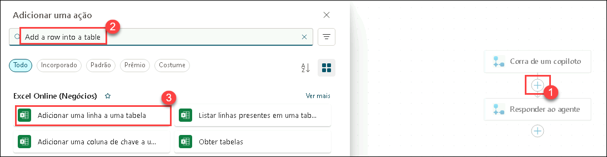

# Exercício 3: Incorporar ações no Agente de RH

### Duração Estimada: 60 minutos

### Visão Geral

Implementar prêmios e reconhecimentos usando o Microsoft Copilot Studio simplifica o processo de nomear e reconhecer funcionários por suas contribuições e conquistas.

### Cenário

Sua empresa, Contoso Enterprises, está expandindo sua equipe de desenvolvimento de software. O departamento de RH deseja usar o Microsoft 365 Copilot para otimizar o processo de recrutamento e garantir uma experiência tranquila e eficiente tanto para os candidatos quanto para a equipe de contratação.

### Objetivos

- Criar uma indicação.

### Tarefa 01: Criar uma indicação

Nesta tarefa, você criará um agente para ajudar os funcionários a enviarem formulários de indicação usando o Copilot Studio. Ao criar indicações no Microsoft 365 Copilot, é importante coletar detalhes completos para garantir que as indicações estejam bem documentadas e sejam eficazes.

1. Adicione uma nova aba no navegador Edge e abra o [Microsoft Copilot Studio](https://copilotstudio.microsoft.com/).

2. Na janela pop-up que aparecer, clique em **Iniciar avaliação gratuita**.

    

3. No **Copilot Studio**, no painel esquerdo, selecione **+ Criar** **(1)** e clique em **+ Novo agente** **(2)**.

    

4. Em Novo Agente, selecione **Pular para Configurar**.

    

5. Selecione a guia Configure, insira os seguintes detalhes para configurar o agente e clique no botão Create (4).
   - Nome: **Agente de Indicações** **(1)**.

   - Descrição: Cole a descrição abaixo no campo correspondente **(2)**

     ```
     O Agente de Indicações no Copilot Studio foi projetado para simplificar o processo de criação, gerenciamento e revisão de indicações dentro da Tech Innovators Inc. Esse agente ajuda equipes de RH e gestores a lidarem eficientemente com indicações para prêmios e reconhecimentos. Ele permite que os usuários criem indicações detalhadas, capturando informações necessárias do nomeado, categorias de prêmio e justificativas de negócios. O agente gera automaticamente resumos abrangentes para cada indicação, facilitando decisões rápidas e informadas. Ele também otimiza o processo de revisão e envio, permitindo fácil acesso às conquistas e reconhecimentos dos candidatos. Ao organizar e gerenciar a lista de indicações, o Agente de indicações garante transparência e fácil rastreio, levando a um processo de indicação mais eficiente e eficaz.
     ```

   - Instruções: Cole as instruções abaixo para o Agente de Indicações **(3)**

     ```
     Criar indicação: Use a função Criar indicação para iniciar o processo de indicação. Esta função solicitará ao usuário que insira detalhes como nome do nomeado, cargo, departamento, categoria do prêmio e justificativa.
     Gerar Resumo da indicação: Use a função Gerar Resumo da indicação para criar automaticamente um resumo conciso da indicação. Este resumo incluirá as principais informações, conquistas e contribuições com base nas entradas fornecidas.
     Revisar e Enviar indicação: Use a função Revisar e Enviar indicação para permitir que os usuários revisem o resumo gerado e todos os detalhes da indicação. Após a revisão, será possível submeter para aprovação.
     Ver Reconhecimentos: Use a função Ver Reconhecimentos para que os usuários acessem e reconheçam as conquistas dos candidatos. Esta função exibirá uma lista dos reconhecimentos recebidos pelos nomeados.
     Ver indicações: Use a função Ver indicações para fornecer uma visão organizada de todas as indicações enviadas. Esta função garante transparência e fácil rastreio do processo.
     ```

        

        

6. No Copilot Studio, vá até o topo, clique em **Tópicos** **(1)**, depois selecione **Todos** **(2)** e escolha **Início da Conversa** **(3)**.

    


7. No fluxo de **Início da Conversa**, clique em **Alterar gatilho** **(1)** no nó de gatilho, e altere para **Evento recebido** **(2)**.

    

8. Clique na área abaixo do nó **Mensagem** e substitua a mensagem por:

   ```
   Olá, eu sou o Agente de Indicações, um assistente virtual. Estou aqui para ajudá-lo a enviar uma indicação, gerar um Resumo de indicação, ver Reconhecimentos e indicações. Antes de realizar outras ações, por favor, envie uma indicação.
   ```

   

9. No nó **Mensagem**, clique em **Adicionar Nó** **(1)**, e escolha **Fazer uma pergunta** **(2)**.

   

10. No nó **Fazer uma pergunta**, insira os seguintes dados e clique em **Salvar** **(7)**:

    - Mensagem: **Você deseja enviar uma indicação?** **(1)**
    - Selecione **+ Nova Opção** **(2)** e adicione **Sim** **(3)**, depois **+ Nova Opção** e adicione **Não** **(4)**
    - Clique em **Var1** **(5)** e altere o Uso para **Global (qualquer tópico pode acessar)** **(6)**


      

      

11. Abaixo do nó **Fazer uma pergunta**, clique em **Adicionar Nó** **(1)**, depois escolha **Perguntar com Cartão Adaptável** **(2)**.

    

12. Clique no **Cartão Adaptável** **(1)** e substitua com o seguinte código **JSON** **(2)**:

  ```
  {
    "type": "AdaptiveCard",
    "body": [
      {
        "type": "TextBlock",
        "size": "Medium",
        "weight": "Bolder",
        "text": "Envio de indicação"
      },
      {
        "type": "Input.Text",
        "id": "title",
        "placeholder": "Título (ex.: Sr., Sra., Dr.)",
        "label": "Título"
      },
      {
        "type": "Input.ChoiceSet",
        "id": "nomineeType",
        "style": "expanded",
        "label": "Tipo de Nomeado",
        "choices": [
          { "title": "Pessoa Única", "value": "single" },
          { "title": "Múltiplas Pessoas", "value": "multiple" },
          { "title": "Equipe", "value": "team" }
        ]
      },
      {
        "type": "Input.Text",
        "id": "nomineeName",
        "placeholder": "Nome(s) do Nomeado(s)",
        "label": "Nome(s)"
      },
      {
        "type": "Input.Text",
        "id": "position",
        "placeholder": "Cargo",
        "label": "Cargo"
      },
      {
        "type": "Input.Text",
        "id": "department",
        "placeholder": "Departamento",
        "label": "Departamento"
      },
      {
        "type": "Input.ChoiceSet",
        "id": "awardCategory",
        "style": "expanded",
        "choices": [
          { "title": "Categoria de Prêmio 1", "value": "category1" },
          { "title": "Categoria de Prêmio 2", "value": "category2" },
          { "title": "Categoria de Prêmio 3", "value": "category3" }
        ],
        "label": "Categoria do Prêmio"
      },
      {
        "type": "Input.Text",
        "id": "businessCase",
        "placeholder": "Justificativa",
        "isMultiline": true,
        "label": "Justificativa"
      }
    ],
    "actions": [
      { "type": "Action.Submit", "title": "Enviar" }
    ],
    "version": "1.4"
  }
  ```

  
  

13. Certifique-se de que todas as variáveis geradas pelo cartão adaptável estão definidas como globais e clique em **Salvar**.

    

    

14. Abaixo do nó **Cartão Adaptável**, clique em **Adicionar Nó** **(1)**, depois selecione **Adicionar uma Ação** **(2)** e escolha **Novo PowerAutomate Flow** **(3)**. Ele será redirecionado para o **Ambiente da Plataforma Power**.

    

    

> **Nota**: Uma vez que você estiver no **Ambiente da Plataforma Power**, garanta que a opção do Novo designer esteja ativo; se não estiver, clique ative-o e no popup `Salvar o seu fluxo antes de trocar` clique no botão **Salvar e alterar**.

15. Renomeie o fluxo para **Fluxoindicação** clicando no nome no topo e pressionando **Enter** após renomear.

    

16. Clique em **Executar a partir de um copilot** **(1)**, na sessão de **Parâmetros** clique em **+ Adicionar um Input** **(2)**, selecione **Texto** **(3)**, adicione o **Título** **(4)** na caixa.

17. Repita as etapas clicando em **+ Adicionar um Input** **(1)**, selecione **Texto** **(2)**, entre com os seguintes **parâmetros**.

- NomineeType
- NomineeName
- Position
- Department
- AwardCategory
- BusinessCase

  

18. Clique em **Recolher** após adicionar todos os parâmetros.

19. Clique em **Adicionar uma ação** **(1)**, abaixo de **Executar a partir de um copilot**, procure por **Adicionar uma linha em uma tabela** **(2)**, e selecione **Adicionar uma linha em uma tabela** **(3)**.

    

20. Selecione** **Adicionar uma linha em uma tabela** **(1)** e preencha os seguintes detalhes:

    - Localização: No menu suspenso, selecione **OneDrive for Business** **(2)**
    - Biblioteca de Documentos: No menu suspenso, selecione **OneDrive** **(3)**.
    - Arquivo: Selecione **/data/NominationList.xlsx** **(4)**.
      - Clique no ícone de **pasta** **(1)**, navegue até a pasta **data** **(2)** e selecione **NominationList.xlsx** **(3)**.

    

    

    

  - Tabela: No menu suspenso, selecione **Table1** **(5)**.

    

21. Em **Parâmetros avançados**, selecione: **Title**, **NomineeType**, **NomineeName**, **Position**, **Department**, **AwardCategory** e **BusinessCase**.

    


22. Em **Parâmetros avançados**, na caixa de texto **Title**, digite **/** **(1)** e selecione **Inserir conteúdo dinâmico** **(2)**. Ao lado de **Executar um fluxo a partir do Copilot**, clique em **Ver mais** **(3)** e, em seguida, selecione **Title** **(4)**.

    

> **Nota**: Certifique-se de que está selecionando sob **Executar um fluxo a partir do Copilot**.

23. Assim como nos passos anteriores, siga estas instruções para cada campo:

- Na respectiva caixa de texto, digite **/** e selecione **Inserir conteúdo dinâmico**. Ao lado de **Executar um fluxo a partir do Copilot**, clique em **Ver mais** e selecione a opção apropriada:

  - **NomineeType**
  - **NomineeName**
  - **Position**
  - **Department**
  - **AwardCategory**
  - **BusinessCase**

- Após concluir todas as atualizações, clique em **Publicar** para salvá-las e aplicá-las.

  

24. Navegue até a página do **Microsoft Copilot Studio** e, na janela pop-up, clique em **Concluído** na seção **Salvar e Atualizar**.

25. Na seção **Adicionar uma ação**, use a barra de pesquisa para localizar **NominationFlow**, depois selecione para adicioná-lo ao nó.

    

26. Selecione cada variável da ação e combine com a variável correspondente da lista.

    


27. No nó de **Ação**, clique em **Adicionar nó** **(1)** e depois selecione **Enviar uma mensagem** **(2)**.

    


28. Em seguida, insira **Você enviou as indicações com sucesso.** e selecione **Salvar**.

    

29. Envie uma indicação utilizando o **Agente de Indicações**.

Nesta tarefa, você concluiu a criação do Agente de Indicações.

### Revisão

Após concluir este laboratório sobre a implementação de prêmios e reconhecimentos usando o Microsoft Copilot Studio, você terá adquirido experiência prática em configurar um sistema estruturado para nomear e reconhecer as conquistas dos funcionários. Você entenderá como utilizar o agente pré-configurado para guiar os usuários durante os processos de criação, resumo, revisão e envio de indicações.

Tarefas concluídas com sucesso:

- Criar indicação.

### Vá para o próximo laboratório clicando na navegação.
