# Ejercicio 3: Incorpora acciones en el agente de RRHH

### Duración estimada: 60 minutos

### Descripción general

Implementar premios y reconocimientos usando Microsoft Copilot Studio agiliza el proceso de nominar y reconocer a los empleados por sus contribuciones y logros.

### Escenario

Tu empresa, Contoso Enterprises, está ampliando su equipo de desarrollo de software. El departamento de RRHH busca usar Microsoft 365 Copilot para optimizar el proceso de reclutamiento y asegurar una experiencia fluida y eficiente tanto para los candidatos como para el equipo de contratación.

### Objetivos

- Crear una nominación.

### Tarea 01: Crear una nominación

En esta tarea, vas a crear un agente que ayude a los empleados a enviar formularios de nominación usando Copilot Studio. Al crear nominaciones en Microsoft 365 Copilot, es importante recopilar detalles completos para asegurar que las nominaciones estén bien documentadas y sean efectivas.

1. Abre una nueva pestaña en el navegador Edge y accede a [Microsoft Copilot Studio](https://copilotstudio.microsoft.com/).

2. En la ventana emergente que aparece, haz clic en **Start Free Trial**.

      

3. En **Copilot Studio**, desde el panel izquierdo selecciona **+ Create** **(1)** y haz clic en **+ New agent** **(2)**.

   

4. En el nuevo agente, selecciona **Skip to Configure**.

    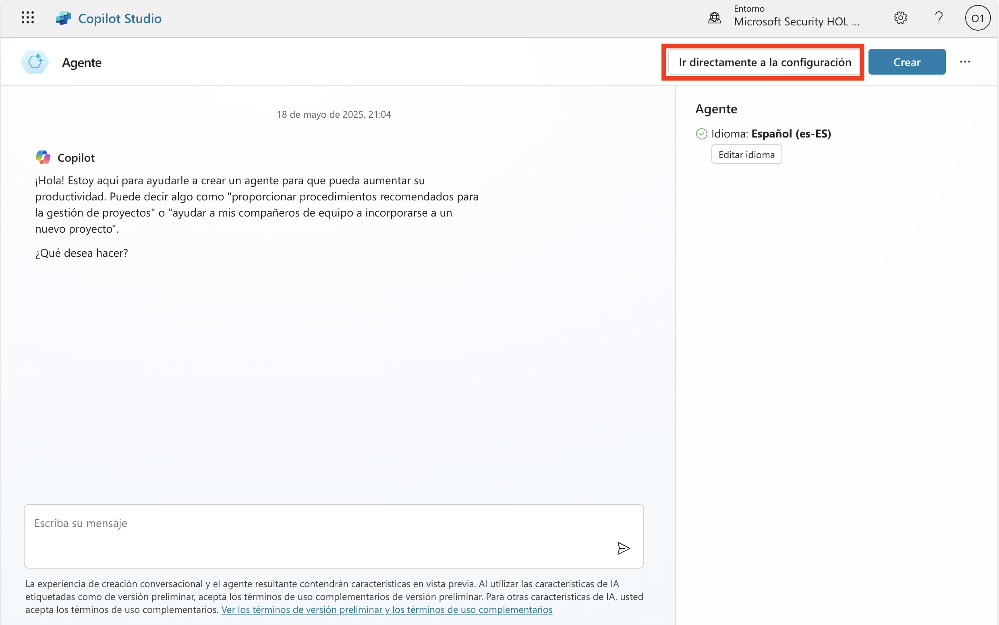

5. Seleccione la pestaña Configure, ingrese los siguientes detalles para configurar el agente y haga clic en el botón Create (4).

   - Name: **Nomination Agent**  **(1)**. 
   - Description: Proporciona la siguiente descripción en el cuadro de descripción **(2)**

       ```
       The Nomination Agent in Copilot Studio is designed to streamline the process of creating, managing, and reviewing nominations within Tech Innovators Inc. This agent helps HR teams and managers efficiently handle nominations for awards and recognitions. It allows users to create detailed nominations, capturing necessary nominee information, award categories, and business cases. The agent automatically generates comprehensive summaries for each nomination, facilitating quick and informed decision-making. It also streamlines the review and submission process, enabling easy access to candidate achievements and recognitions. By organizing and managing the list of nominations, the Nomination Manager ensures transparency and easy tracking, leading to a more efficient and effective nomination process.
        ```
   - Instructions: Proporciona las siguientes instrucciones al Nomination Agent **(3)**

        ```
        Create Nomination: Use the create Nomination function to initiate the nomination process. This function will prompt the user to enter necessary details such as the nominee's name, position, department, award category, and business case.
        Generate Nomination Summary: Call the generate Nomination Summary function to automatically create a concise summary of the nomination. This summary will include key candidate information, achievements, and contributions based on the input provided during the nomination creation.
        Review and Submit Nomination: Implement the review And Submit Nomination function to allow users to review the generated summary and all nomination details. Once reviewed, the function will enable users to submit the nomination for approval.
        View Recognition: Use the viewRecognition function to allow users to access and acknowledge the achievements and recognitions of candidates. This function will display a list of recognitions received by nominees.
        View Nominations: Implement the view Nominations function to provide users with an organized view of all submitted nominations. This function will ensure transparency and easy tracking of the nomination process, allowing users to monitor the status and progress of each nomination.
        ```
     

6. En Copilot Studio, desplázate hacia arriba, haz clic en **Topics** **(1)**, luego selecciona **All** **(2)** y selecciona **Conversation Start** **(3)**.

    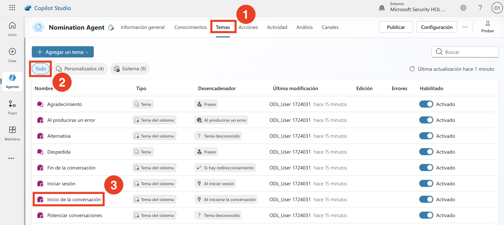

7. En el flujo **Conversation Start**, selecciona **Change trigger** **(1)** bajo el nodo Trigger, y cambia el trigger a **Event received** **(2)**.  

    

8. Haz clic en el área bajo el nodo **Message** y reemplaza el mensaje por el siguiente:

    ```
    Hello, I'm Nomination Agent, a virtual assistant. I am here to help you submit a nomination, generate a Nomination Summary, view Recognition, and view Nomination. Before going for any other action, please submit a nomination.
    ```

   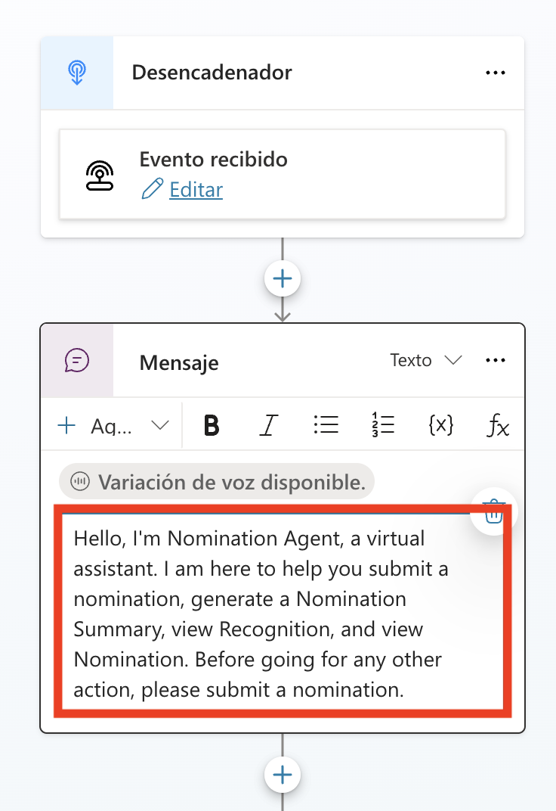

9. Bajo el nodo **Message**, haz clic en **Add Node** **(1)** y luego elige **Ask a question** **(2)**.

   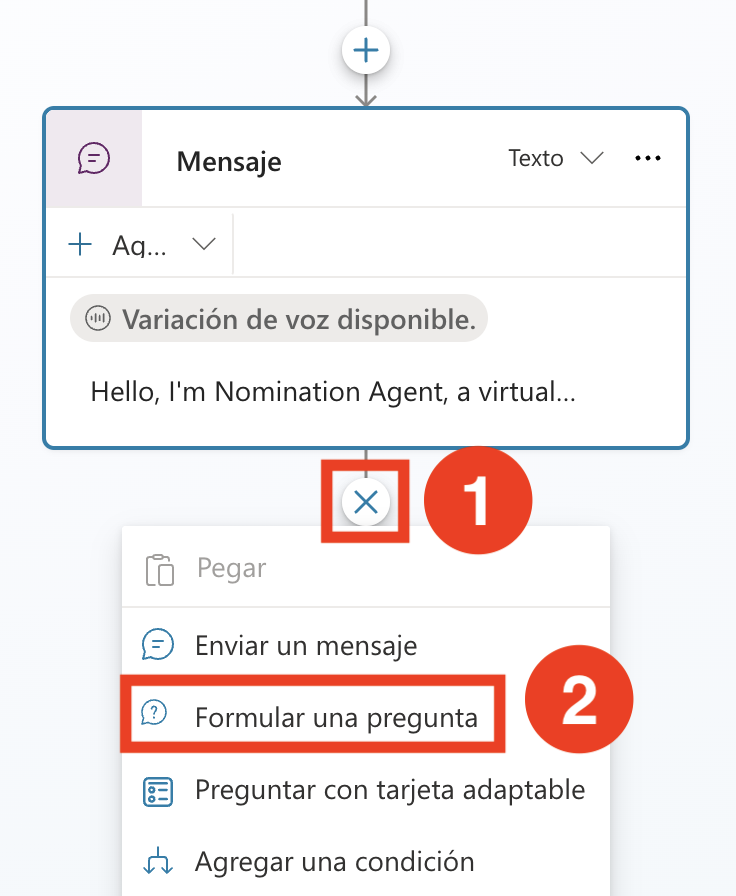

10. En el nodo **Ask a question**, ingresa los siguientes detalles y haz clic en **Save** **(7)**.
    - Escribe **Do you want to submit a nomination?**  **(1)** en el cuadro de mensaje,
    - Selecciona **+ New Option** **(2)**, agrega **Yes**  **(3)**, nuevamente selecciona **+ New Option** y agrega **No**  **(4)**.
    - Haz clic en **Var1** **(5)** bajo Save user response as y cambia el Usage a **Global(any topic can access)** **(6)**.
    
      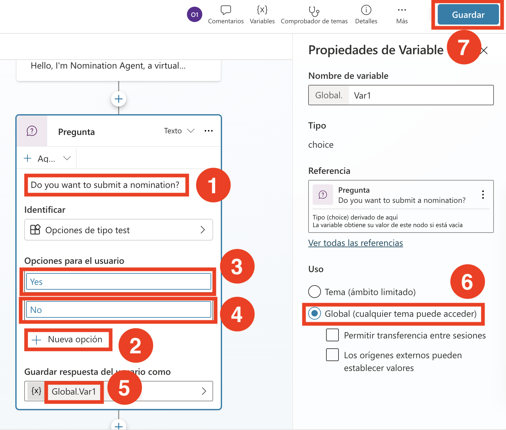

11. Bajo el nodo **Ask a question**, haz clic en **Add Node** **(1)**, luego elige **Ask with adaptive Card** **(2)**.

    

12. En el nodo **Ask with adaptive Card**, haz clic en los puntos suspensivos **(...) (1)** y selecciona **Properties(2)**. 

    

13. Haz clic en la opción **Edit adaptive card**.

    

14. Dentro del **Card payload editor**, reemplaza el siguiente **script JSON** **(1)** y haz clic en **Save (2)** y luego en **Close**.

    

```json
{
      "type": "AdaptiveCard",
      "body": [
        {
          "type": "TextBlock",
          "size": "Medium",
          "weight": "Bolder",
          "text": "Nomination Submission"
        },
        {
          "type": "Input.Text",
          "id": "title",
          "placeholder": "Title (e.g., Mr., Ms., Dr.)",
          "label": "Title"
        },
        {
          "type": "Input.ChoiceSet",
          "id": "nomineeType",
          "style": "expanded",
          "label": "Nominee Type",
          "choices": [
            {
              "title": "Single Person",
              "value": "single"
            },
            {
              "title": "Multiple Persons",
              "value": "multiple"
            },
            {
              "title": "Team",
              "value": "team"
            }
          ]
        },
        {
          "type": "Input.Text",
          "id": "nomineeName",
          "placeholder": "Nominee Name(s) (for multiple persons, separate by commas)",
          "label": "Nominee Name(s)"
        },
        {
          "type": "Input.Text",
          "id": "position",
          "placeholder": "Position",
          "label": "Position"
        },
        {
          "type": "Input.Text",
          "id": "department",
          "placeholder": "Department",
          "label": "Department"
        },
        {
          "type": "Input.ChoiceSet",
          "id": "awardCategory",
          "style": "expanded",
          "choices": [
            {
              "title": "Award Category 1",
              "value": "category1"
            },
            {
              "title": "Award Category 2",
              "value": "category2"
            },
            {
              "title": "Award Category 3",
              "value": "category3"
            }
          ],
          "label": "Award Category"
        },
        {
          "type": "Input.Text",
          "id": "businessCase",
          "placeholder": "Business Case",
          "isMultiline": true,
          "label": "Business Case"
        }
      ],
      "actions": [
        {
          "type": "Action.Submit",
          "title": "Submit"
        }
      ],
      "version": "1.4"
    }
```

13. Asegúrate de que todas las variables generadas por las adaptive cards estén configuradas como globales y selecciona **Save**.

    

    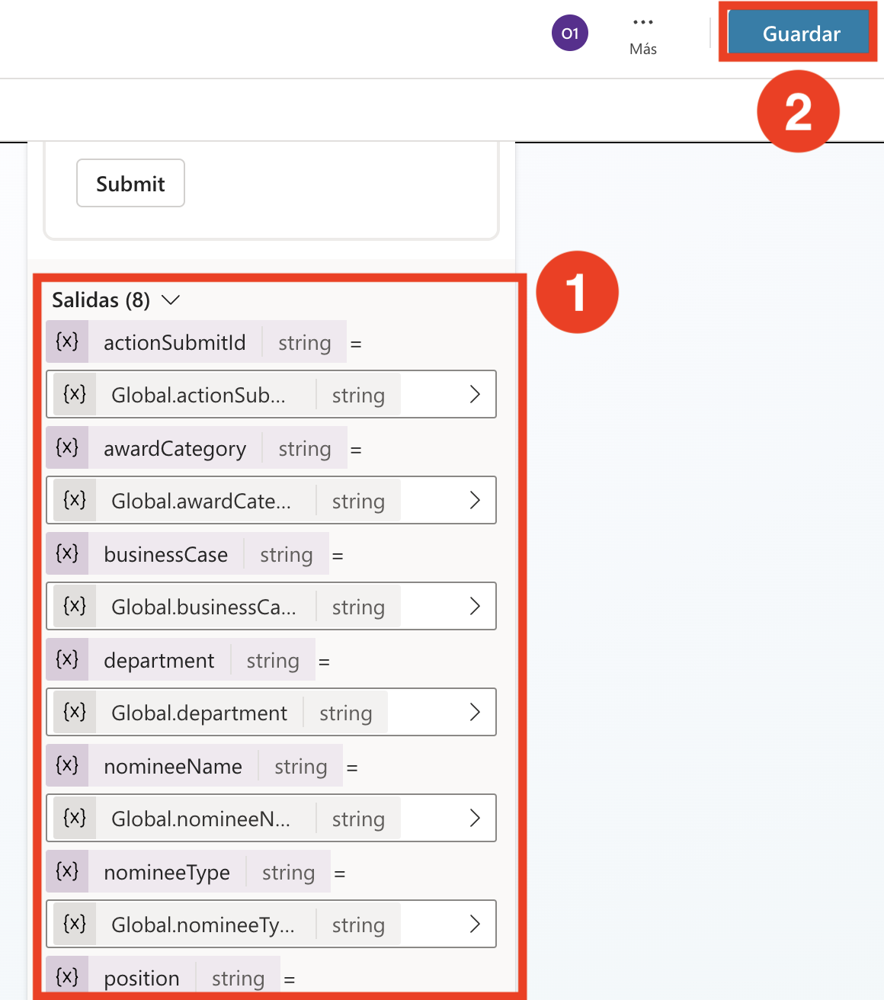

14. Bajo el nodo **Ask with adaptive Card**, haz clic en **Add Node** **(1)**, luego selecciona **Add an Action** **(2)** y luego elige **New Agent Flow**  **(3)**. 

    

15. En Agent flows bajo la pestaña Designer, haz clic en **Save draft**.

    

16. Haz clic en la pestaña **Flows**(1) y haz clic en **Edit agent flow** (2).

    

17. Haz clic en la pestaña **Overview**(1) y haz clic en **Edit** (2).

    

18. Ingresa **NominationFlow**(1) en el campo Flow name y haz clic en **Save**(2).  

    

19. Haz clic en la pestaña **Designer (1)** y haz clic en el nodo **When an agent calls the flow** **(2)**, en la sección **Parameters** haz clic en **+ Add an Input** , selecciona **Text** **(3)**, ingresa **Title** **(4)** en el cuadro de texto.

    

20. Repite los pasos haciendo clic en **+ Add an Input** **(1)**, selecciona **Text** **(2)** e ingresa los siguientes **Parameters**

    - NomineeType
    - NomineeName
    - Position
    - Department
    - AwardCategory
    - BusinessCase

21. Una vez agregados todos los parámetros, haz clic en **Collapse**.

    

22. Haz clic en **Add action** **(1)**, debajo de **When an agent calls the flow**, busca **Add a row into a table** **(2)** y selecciona **Add a row into a table** **(3)**.

    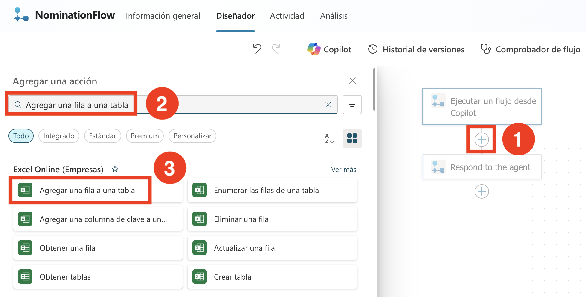

23. Haz clic en **Sign in**. Se abrirá una nueva pestaña del navegador. Selecciona la cuenta con la que ya has iniciado sesión.

    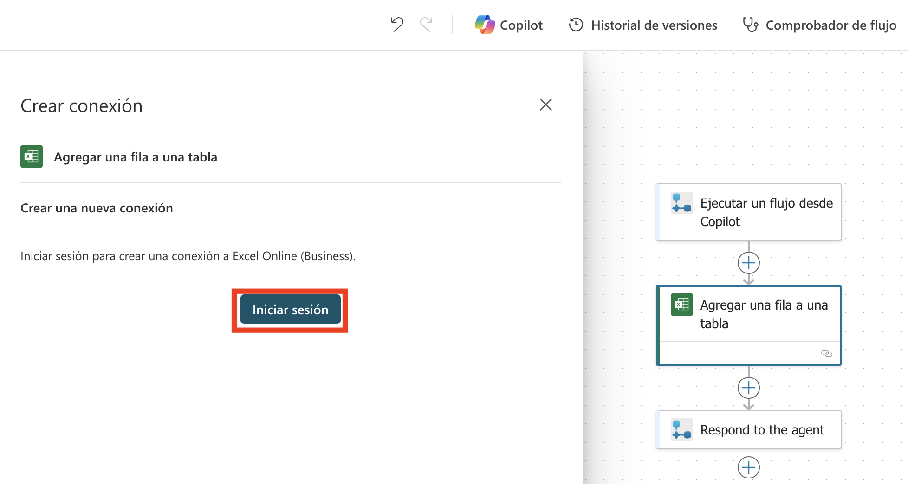

24. Haz clic en **Allow Access**.    

25. En la configuración de **Add a row into a table**, completa los siguientes datos: 

    - Location: En el menú desplegable selecciona **OneDrive for Business** **(1)**
    - Document Library: En el menú desplegable selecciona **OneDrive** **(2)**.
    - File: Selecciona **/data/NominationList.xlsx** **(3)**.
        - Haz clic en el ícono de **folder** **(1)**, navega a la carpeta **data** **(2)** y selecciona **NominationList.xlsx** **(3)**.

            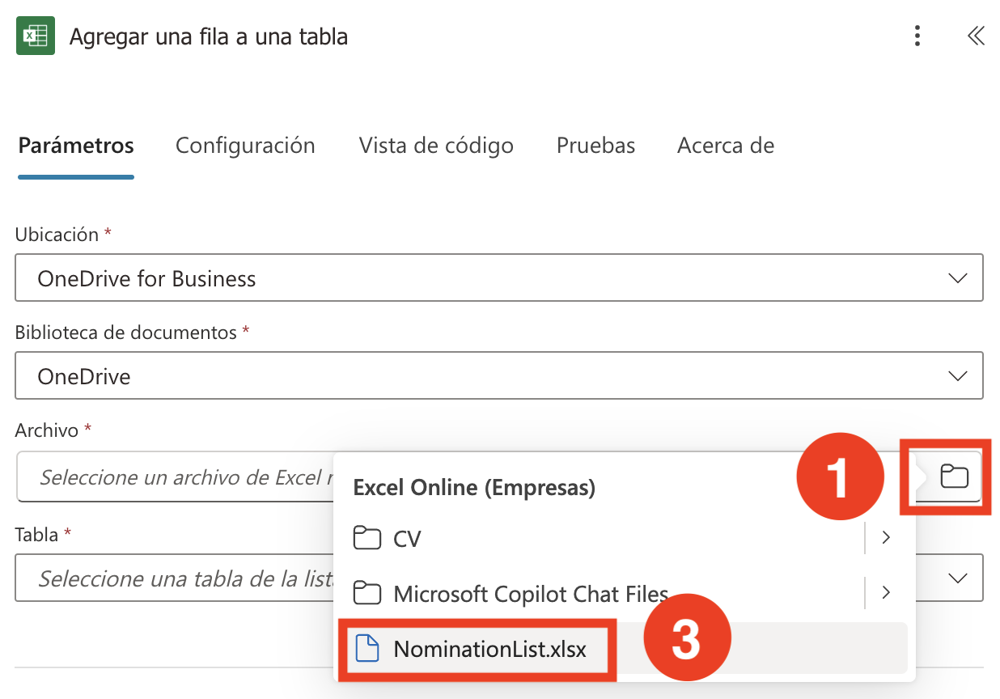
          
    - Table: En el menú desplegable selecciona **Table1** **(4)**.

    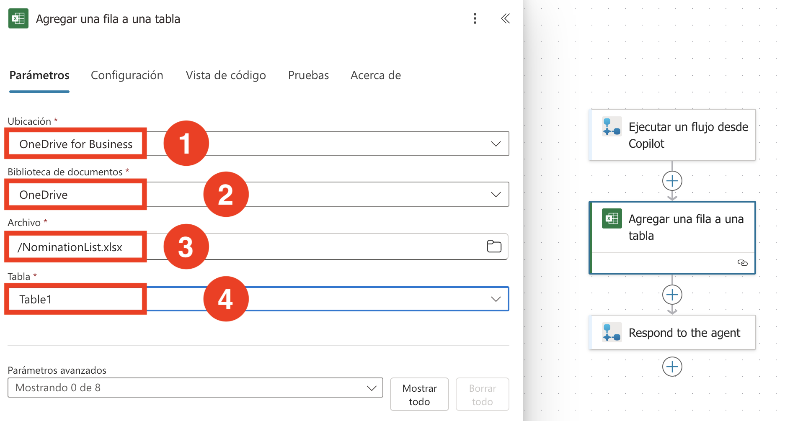

26. En **Advanced Parameters**, selecciona Title, NomineeType, NomineeName, Position, Department, AwardCategory y BusinessCase.

    

27. Bajo **Advanced parameters**, en el cuadro de texto Title, escribe **/** **(1)** y elige **Insert dynamic content** **(2)**. Junto a **Run a flow from Copilot**, haz clic en **See more** **(3)** y luego selecciona **Title** **(4)**.

    
    

    > **Nota**: Asegúrate de seleccionar bajo **When an agent calls the flow**

28. Igual que en los pasos anteriores, sigue estas instrucciones para cada campo:

      - En el cuadro de texto correspondiente, escribe **/** y elige **Insert dynamic content**. Junto a **Run a flow from Copilot**, haz clic en **See more** y selecciona la opción adecuada:
         - NomineeType
         - NomineeName
         - Position
         - Department
         - AwardCategory
         - BusinessCase
      
      - Una vez que hayas realizado todas las actualizaciones(1), haz clic en **Publish**(2) para guardar y aplicar los cambios.
   
           

29. Regresa a la página **Agents** (1) y selecciona el **Nomination Agent** (2).

    

30. Haz clic en la pestaña **Topics**(1) y selecciona **Conversation Start** (2).

    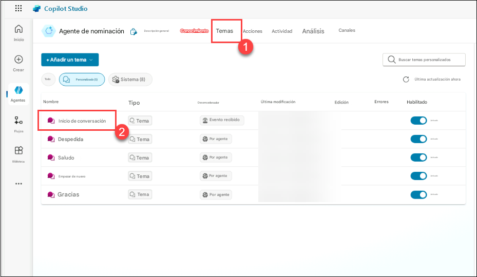

31. En la sección **Add an action**, usa la barra de búsqueda para encontrar **NominationFlow**, luego selecciónalo para agregarlo al nodo.

    

32. Selecciona cada variable de acción y asígnala a la variable correspondiente en la lista.

    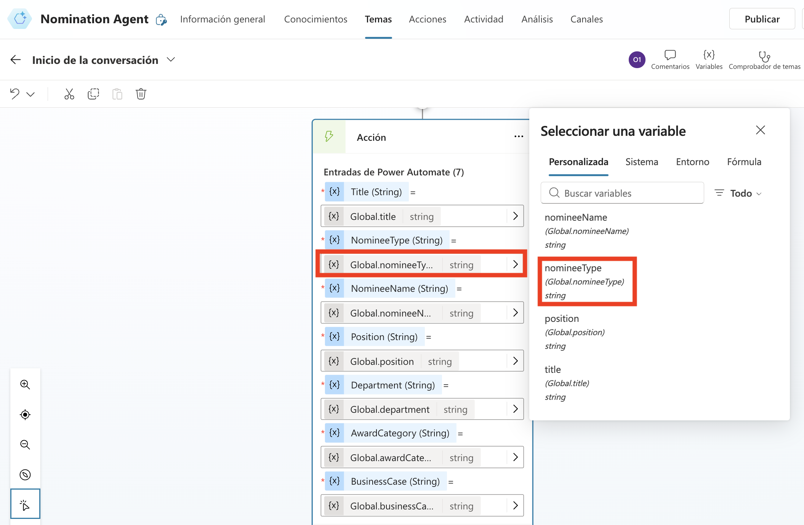

33. Bajo el nodo **Action**, haz clic en **Add Node** **(1)** y luego elige **Send a message** **(2)**.

    

34. Luego ingresa, **You have successfully submitted Nominations.** y selecciona **Save**.

    

35. Envía una nominación usando el Nomination Agent.

En esta tarea, has completado la creación del Nomination Agent.

### Revisión

Después de completar este laboratorio sobre la implementación de premios y reconocimientos usando Microsoft Copilot Studio, habrás adquirido experiencia práctica en la configuración de un sistema estructurado para nominar y reconocer los logros de los empleados. Comprenderás cómo utilizar el agente preconstruido de Awards and Recognition para guiar a los usuarios en la creación, resumen, revisión y envío de nominaciones.

Tareas completadas con éxito:
- Crear nominación.


