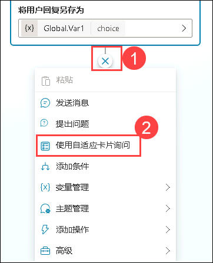
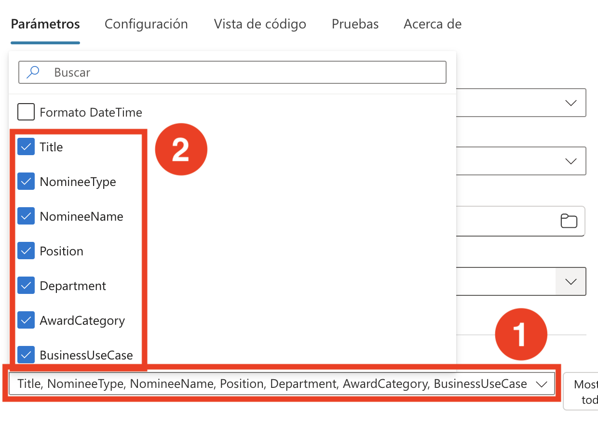
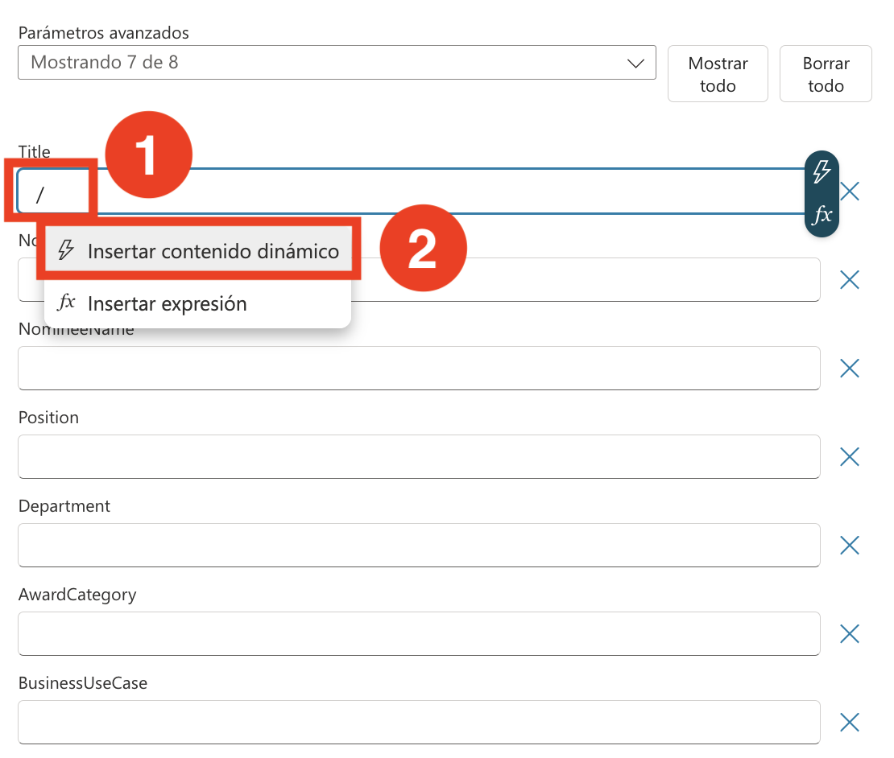
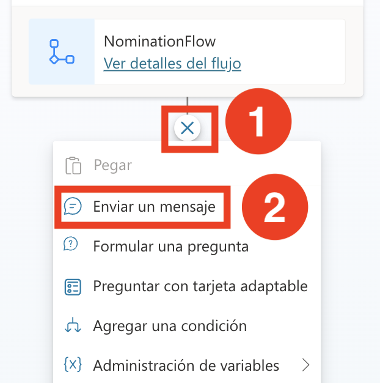

# 练习 3：在 HR 代理中集成操作

### 预计用时：60 分钟

### 概述

借助 Microsoft Copilot Studio，您可以轻松实施奖励与认可流程，简化员工提名及其成就表彰的步骤。

### 场景描述

您的公司 Contoso Enterprises 正在扩展其软件开发团队。人力资源部门计划使用 Microsoft 365 Copilot 来简化招聘流程，确保候选人和招聘团队都能获得流畅高效的体验。

### 实验目标

- 创建提名表单

### 任务 01：创建提名表单

本任务将指导您使用 Copilot Studio 创建一名代理，协助员工便捷提交提名申请。在 Microsoft 365 Copilot 中创建提名时，收集全面的详细信息非常重要，以确保提名记录完整且有效。

1. 在 Edge 浏览器中添加新标签页并打开 [Microsoft Copilot Studio](https://copilotstudio.microsoft.com/)。

2. 在弹出窗口中点击 **开始免费试用**。

      

3. 在 **Copilot Studio** 中，从左侧窗格中选择 **+ 创建** **(1)** 然后点击 **+ 新建代理** **(2)**。

   

4. 在新建代理界面，选择 **跳至配置**。

    

5. 选择 “Configure” 选项卡，输入以下详细信息以配置代理，然后单击 “Create” 按钮 （4）。

   - 名称：**提名代理** **(1)**
   - 描述：在描述框中提供以下描述 **(2)**

       **中文：**
       ```
       Copilot Studio 中的提名代理旨在简化 Tech Innovators Inc 内部创建、管理和审核提名的流程。人力资源团队和管理人员可通过该代理高效处理奖励和提名事务。它允许用户创建详细的提名，捕获必要的被提名人信息、奖项类别和业务案例。该代理自动为每个提名生成全面的摘要，便于快速且明智的决策。它还简化了审核和提交流程，使访问候选人的成就和认可变得更加容易。通过组织和管理提名列表，提名管理器确保透明度和轻松跟踪，从而实现更高效和有效的提名流程。
       ```

       **英文：**
       ```
       The Nomination Agent in Copilot Studio is designed to streamline the process of creating, managing, and reviewing nominations within Tech Innovators Inc. HR teams and managers can efficiently handle awards and nominations through this agent. It allows users to create detailed nominations, capturing necessary nominee information, award categories, and business cases. The agent automatically generates comprehensive summaries for each nomination, facilitating quick and informed decision-making. It also simplifies the review and submission process, making it easier to access candidate achievements and recognition. Through organizing and managing the nomination list, the nomination manager ensures transparency and easy tracking, enabling a more efficient and effective nomination process.
       ```
   - 指令：为提名代理提供以下指令 **(3)**

        **中文：**
        ```
        创建提名：使用创建提名功能启动提名流程。此功能将提示用户输入必要的详细信息，如被提名人姓名、职位、部门、奖项类别和业务案例。
        生成提名摘要：使用生成提名摘要 功能，系统将自动创建简明摘要。此摘要将根据提名创建过程中提供的输入，包括关键候选人信息、成就和贡献。
        审核并提交提名：实施审核并提交提名功能，允许用户查看生成的摘要和所有提名详细信息。审核后，该功能将使用户能够提交提名以供批准。
        查看认可：使用查看认可功能，允许用户访问和确认候选人的成就和认可。此功能将显示被提名人获得的认可列表。
        查看提名：实施查看提名功能，为用户提供所有已提交提名的组织视图。此功能将确保提名流程的透明度和易于跟踪，允许用户监控每个提名的状态和进度。
        ```

        **英文：**
        ```
        Create Nomination: Use the Create Nomination feature to initiate the nomination process. This feature will prompt users for necessary details such as nominee name, position, department, award category, and business case.
        Generate Nomination Summary: Use the Generate Nomination Summary feature to automatically create concise summaries. This summary will include key candidate information, achievements, and contributions based on inputs provided during the nomination creation process.
        Review and Submit Nomination: Implement the Review and Submit Nomination feature, allowing users to review generated summaries and all nomination details. After review, this feature will enable users to submit nominations for approval.
        View Recognition: Use the View Recognition feature to allow users to access and confirm candidate achievements and recognition. This feature will display a list of recognitions received by the nominee.
        View Nominations: Implement the View Nominations feature to provide users with an organized view of all submitted nominations. This feature will ensure transparency and easy tracking of the nomination process, allowing users to monitor the status and progress of each nomination.
        ```

        

        

6. 在 Copilot Studio 中，滚动到顶部，点击 **主题** **(1)**，然后选择 **全部** **(2)** 并选择 **会话开始** **(3)**。

    

7. 在 **会话开始** 工作流程中，在触发器节点下选择 **更改触发器** **(1)**，并将触发器更改为 **接收到事件** **(2)**。

    

8. 点击 **消息** 节点下方的区域，并替换为以下消息：

    **中文：**
    ```
    您好，我是提名代理，一个虚拟助手。我在这里帮助您提交提名、生成提名摘要、查看认可和查看提名。在执行任何其他操作之前，请提交提名。
    ```

    **英文：**
    ```
    Hello, I'm Nomination Agent, a virtual assistant. I am here to help you submit a nomination, generate a Nomination Summary, view Recognition, and view Nomination. Before going for any other action, please submit a nomination.
    ```

   

9. 在 **消息** 节点下，点击 **添加节点** **(1)**，然后选择 **提问** **(2)**。

   

10. 在 **提问** 节点中，输入以下详细信息，然后点击 **保存** **(7)**。
    
    - 在消息框中输入 **您想提交提名吗？** **(1)**，
    
    - 选择 **+ 新选项** **(2)** 添加 **是** **(3)** 再次选择 **+ 新选项** 并添加 **否** **(4)**。
    
    - 点击 **将用户响应保存为** 下的 **Var1** **(5)** 并将用法更改为 **全局（任何主题都可访问）** **(6)**。
    
      

11.  在”Condition ”节点“是”下，单击“添加节点”（1），然后选择“ Ask with adaptive Card (2)。

    

1. 在 **“使用自适应卡片提问”** 节点中，点击省略号 **（...）(1)**，然后选择 **“属性”(2)**。

   

1. 点击 **编辑自适应卡片** 选项。

   

12. 点击 **自适应卡片** **(1)** 并替换为以下 **JSON 脚本** **(2)**。

    ```
    {
      "type": "AdaptiveCard",
      "body": [
        {
          "type": "TextBlock",
          "size": "Medium",
          "weight": "Bolder",
          "text": "Nomination Submission"
        },
        {
          "type": "Input.Text",
          "id": "title",
          "placeholder": "Title (e.g., Mr., Ms., Dr.)",
          "label": "Title"
        },
        {
          "type": "Input.ChoiceSet",
          "id": "nomineeType",
          "style": "expanded",
          "label": "Nominee Type",
          "choices": [
            {
              "title": "Single Person",
              "value": "single"
            },
            {
              "title": "Multiple Persons",
              "value": "multiple"
            },
            {
              "title": "Team",
              "value": "team"
            }
          ]
        },
        {
          "type": "Input.Text",
          "id": "nomineeName",
          "placeholder": "Nominee Name(s) (for multiple persons, separate by commas)",
          "label": "Nominee Name(s)"
        },
        {
          "type": "Input.Text",
          "id": "position",
          "placeholder": "Position",
          "label": "Position"
        },
        {
          "type": "Input.Text",
          "id": "department",
          "placeholder": "Department",
          "label": "Department"
        },
        {
          "type": "Input.ChoiceSet",
          "id": "awardCategory",
          "style": "expanded",
          "choices": [
            {
              "title": "Award Category 1",
              "value": "category1"
            },
            {
              "title": "Award Category 2",
              "value": "category2"
            },
            {
              "title": "Award Category 3",
              "value": "category3"
            }
          ],
          "label": "Award Category"
        },
        {
          "type": "Input.Text",
          "id": "businessCase",
          "placeholder": "Business Case",
          "isMultiline": true,
          "label": "Business Case"
        }
      ],
      "actions": [
        {
          "type": "Action.Submit",
          "title": "Submit"
        }
      ],
      "version": "1.4"
    }
    ```
    
    
13. 请将自适应卡片中生成的所有变量设置为"全局变量"，以便后续流程调用，并选择 **保存**。

    

    

14. 在“Ask with adaptive Card”节点下，单击“ Add Node”，然后选择“Add a tool,”，然后选择“ New Agent Flow. ”。

    

1. 在 **设计器** 选项卡下的 **代理流程** 中，点击 **保存草稿**。

    

1. 点击 **概览 (1)** 选项卡，然后点击 **编辑 (2)**。

   

1. 在流程名称字段中输入「提名流程 **(1)**，然后点击「保存 **(2)**。

   

16. 点击 **从 Copilot 运行** **(1)** 节点，在 **参数** 会话下点击 **+ 添加输入** **(2)**，选择 **文本** **(3)**，在文本框中输入 **Title** **(4)**。

    

17. 重复步骤点击 **+ 添加输入** **(1)**，选择 **文本** **(2)**，输入以下 **参数**

    - NomineeType
    - NomineeName
    - Position
    - Department
    - AwardCategory
    - BusinessCase

18. 添加完所有参数后，点击 **折叠**。

    

19. 在 **从 Copilot 运行** 下方点击 **添加操作** **(1)**，搜索 **向表中添加行** **(2)**，并选择 **向表中添加行** **(3)**。

    

20. 选择 **向表中添加行** **(1)** 并填写以下详细信息：

    - 位置：从下拉菜单选择 **OneDrive for Business** **(2)**
    - 文档库：从下拉菜单选择 **OneDrive** **(3)**
    - 文件：选择 **/data/NominationList.xlsx** **(4)**
        - 点击 **文件夹** **(1)** 图标并导航到 **data** **(2)** 文件夹，选择 **NominationList.xlsx** **(3)**

            
          
    - 表格：从下拉菜单选择 **Table1** **(5)**

      

21. 从 **高级参数** 中，请选择 Title、NomineeType、NomineeName、Position、Department、AwardCategory 和 BusinessCase。

    

22. 在 **高级参数** 下，在 Title 文本框中，输入 **/** **(1)** 并选择 **插入动态内容** **(2)**。在 **从 Copilot 运行流程** 旁边，点击 **查看更多** **(3)** 然后选择 **Title** **(4)**。

    

    > **注意**：确保您选择的是 **从 Copilot 运行流程** 下的选项

23. 按照前面的步骤，为每个字段执行以下操作：

      - 在相应的文本框中，输入 **/** 并选择 **插入动态内容**。在 **从 Copilot 运行流程** 旁边，点击 **查看更多** 并选择相应选项：
         - NomineeType
         - NomineeName
         - Position
         - Department
         - AwardCategory
         - BusinessCase
      
      - 完成所有更新后，点击 **发布** 保存并应用更改。
   
           

23. 导航到 **Microsoft Copilot Studio** 页面，在弹出窗口中，在 **保存并刷新** 部分下点击 **完成**。

      

24. 在 **添加操作** 部分，使用搜索栏查找 **NominationFlow**，然后选择它添加到节点。

      

25. 选择每个操作变量并将其与列表中的变量合并。

    

26. 在 **操作** 节点下，点击 **添加节点** **(1)**，然后选择 **发送消息** **(2)**。

    

27. 然后输入 **您已成功提交提名。** 然后选择 **保存**。

    

28. 使用提名代理提交提名。

在此任务中，您已完成提名代理的创建。

### 实验总结

完成此实验后，您将对使用 Microsoft Copilot Studio 建立结构化系统进行提名和认可员工成就有了实际经验。您将了解如何利用预构建的奖励和认可代理指导用户创建、总结、审核和提交提名。

成功完成以下任务：
- 创建提名表单
 
### 点击导航进入下一个实验。
