# 演習 4: Microsoft Copilot Studio で HR 活動の自律機能を有効にする

### 推定所要時間: 60 分

### 概要

事前構築された賞と認識エージェントは、ユーザーがノミネーションを作成し、要約を生成し、ノミネーションをレビューして提出するのをガイドします。

### 目標

- ノミネーションの要約を生成する。

### タスク 01: ノミネーションの要約を生成する。

ノミネーションの要約を生成するために、ノミネーションエージェントにトピックを追加します。

1. **ノミネーションエージェント**で、**トピック (1)** をクリックし、**+ トピックを追加 (2)** ドロップダウンをクリックして、**空白から (3)** を選択します。

   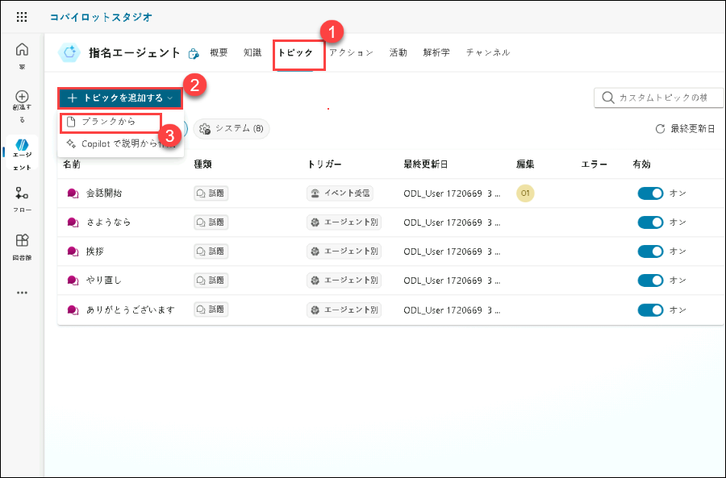

2. ワークフローの名前を **ノミネーション要約の生成** に変更します。  （英語訳：「Generate Nomination Summary」）

   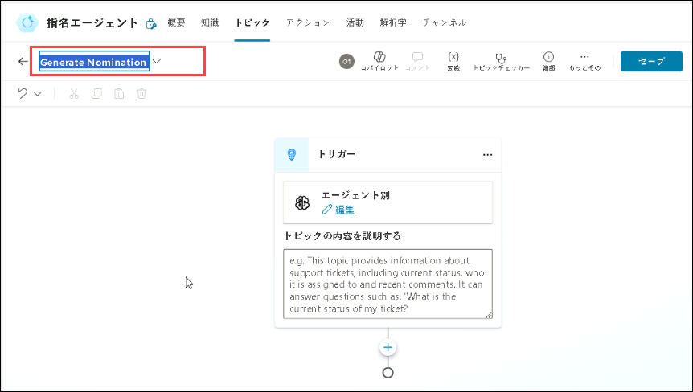


3. **トリガー** ノードの下で、**ノードを追加 (1)** をクリックし、**メッセージを送信 (2)** ノードを選択します。

    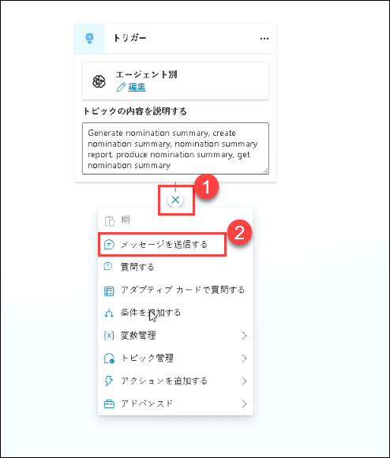

4. **メッセージ** ノードの下の領域をクリックし、以下のメッセージに置き換えます。

   プロンプト:
   ```
   I am here to generate a nomination summary from the SharePoint list named 'Nomination List'.
   ```
    >**任意:** 日本語訳のプロンプトは:
   ```
   SharePoint リスト「ノミネーションリスト」からノミネーションの要約を生成します。
   ```

   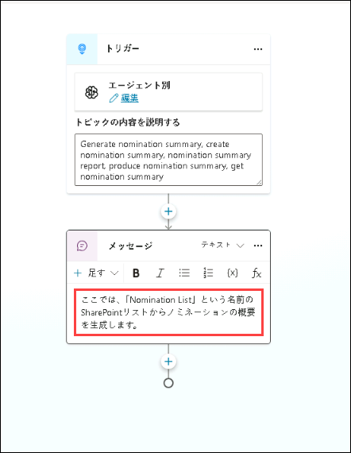

5. **メッセージを送信** ノードの下で、**ノードを追加 (1)** をクリックし、**質問を追加 (2)** ノードを選択します。

   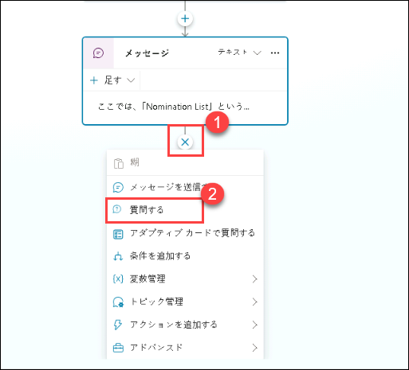

6. **質問を追加** ノードで、以下の詳細を入力し、**保存 (7)** をクリックします。
    - メッセージボックスに **ノミネーションの要約を生成しますか？ (1)** を入力します。   （英語訳：「Do you want to generate a nomination summary?」）
    - **+ 新しいオプション (2)** を選択し、**はい (3)** を追加し、再度 **+ 新しいオプション** を選択して **いいえ (4)** を追加します。
    - **ユーザーの応答を保存する** の下で **Var1 (5)** をクリックします。
       - 変数名を **isConfirmed (6)** に更新し、使用を **グローバル（任意のトピックがアクセス可能） (7)** に変更します。
    
     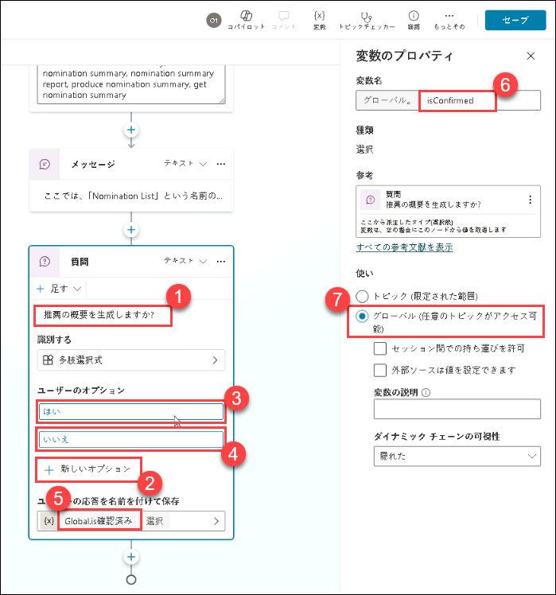

7. **質問を追加** ノードの下で、**ノードを追加 (1)** をクリックし、**条件を追加 (2)** ノードを選択します。

   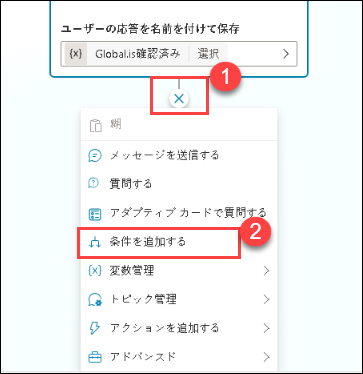

8. **条件** ノードで、**変数を選択 (1)** をクリックします。カスタム検索バーに **isConfirmed (2)** を入力し、**isConfirmed (3)** を選択します。**値を入力または選択** ドロップダウンから **はい (4)** を選択します。

   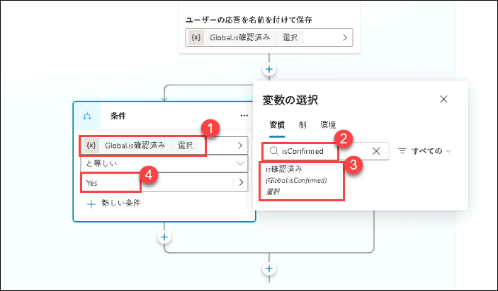  

9. **条件** ノードの下で、**ノードを追加 (1)** をクリックし、**変数管理 (2)** をクリックして **変数値を設定 (3)** を選択します。

   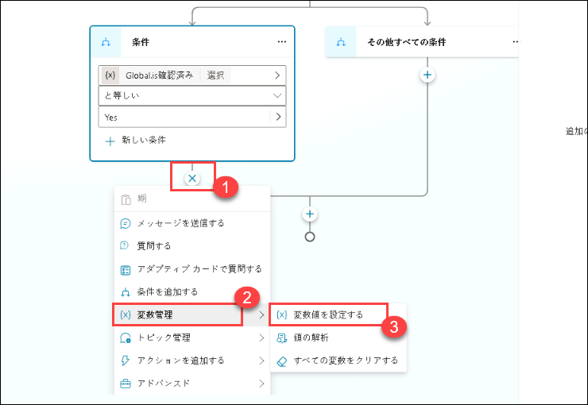 

10. **変数値を設定** ノードで、**変数を設定** の下の **変数を選択 (1)** をクリックし、**新しい変数を作成 (2)** を選択します。

    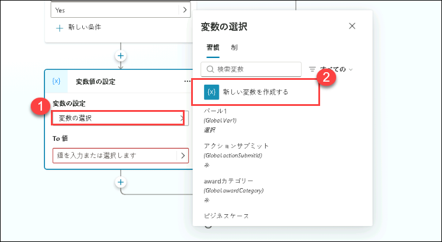

11. **新しく作成された変数 (1)** をクリックし、変数名を **summaryvar (2)** に入力し、**グローバル (3)** に設定して、**保存 (3)** をクリックします。 

    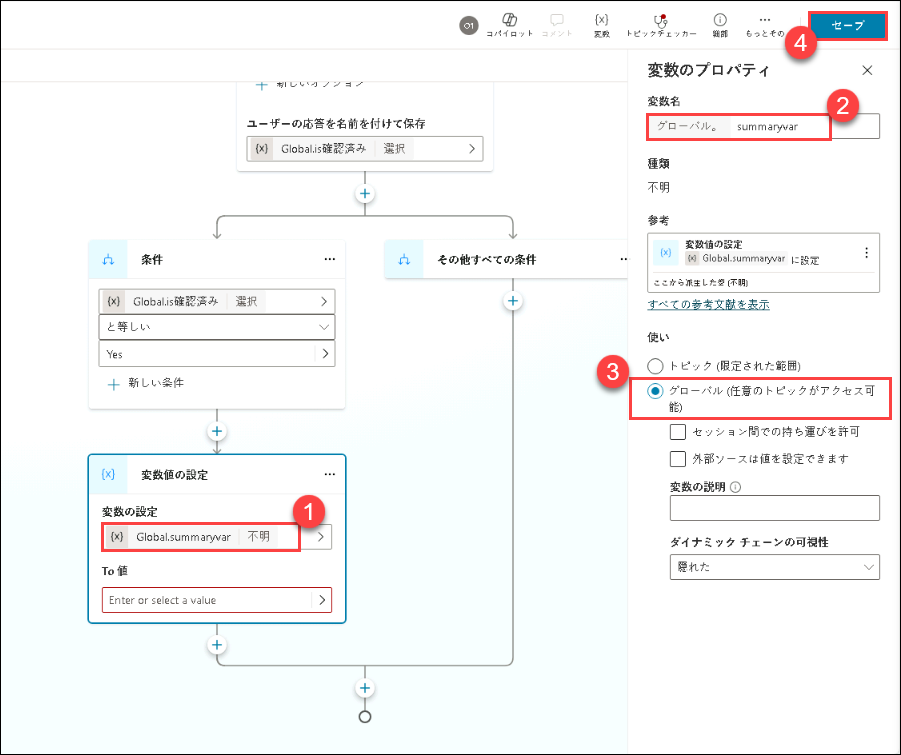

    > 注: **エラーがあるトピックを保存しますか？** というポップアップが表示された場合は、**保存** ボタンをクリックして続行します。

12. **変数値の設定**ノードで、**宛先値**の値を**はい** (1)**に設定します。次に、**変数値の設定**ノードの下にある**ノードの追加** (2)**をクリックします。**ツールの追加** (3)**を選択し、**新しいエージェントフロー** (4)**を選択します。**終了**ボタンをクリックして、**エージェントフロー**に移動します。

    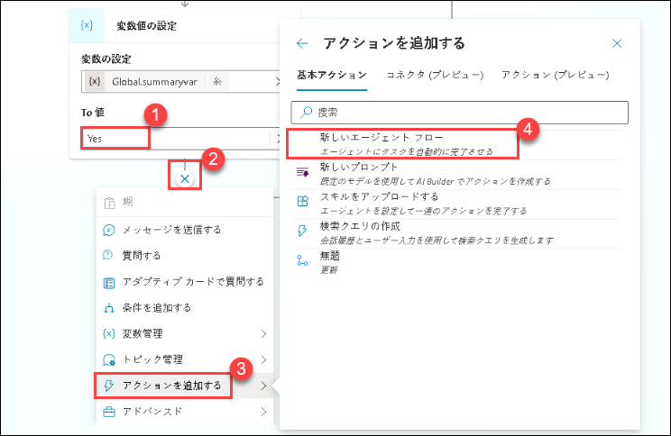

13. エージェントフローの「デザイナー」タブで、「**下書きを保存**」をクリックします。

    

14. **概要** (1) タブをクリックし、**編集** (2) をクリックします。

    

15. フロー名フィールドに**SummaryFlow** (1)と入力し、**保存** (2)をクリックします。

    


16. **デザイナー** (1) タブをクリックし、**エージェントがフローを呼び出したとき** (2) ノードをクリックします。**パラメーター** の下の **+ 入力の追加** をクリックします。**テキスト** **(3)** を選択します。テキストボックスに **入力** **(4)** を入力します。パラメーターが追加されたら、**折りたたむ** **(5)** をクリックします。

      

17. **アクションの追加** **(1)** をクリックします。**エージェントがフローに電話をかけたとき** の下にある **テーブルに存在する行をリストする** **(2)** を検索し、**テーブルに存在する行をリストする** **(3)** を選択します。

    

    
19. **表内に存在する行を一覧表示 (1)** を選択し、以下の詳細を入力します: 

    - 場所: ドロップダウンから **OneDrive for Business (2)** を選択します。
    - ドキュメントライブラリ: ドロップダウンから **OneDrive (3)** を選択します。
    - ファイル: **/data/NominationList.xlsx (4)** を選択します。
        - **フォルダー (1)** アイコンをクリックし、**data (2)** フォルダーに移動して、**NominationList.xlsx (3)** を選択します。

            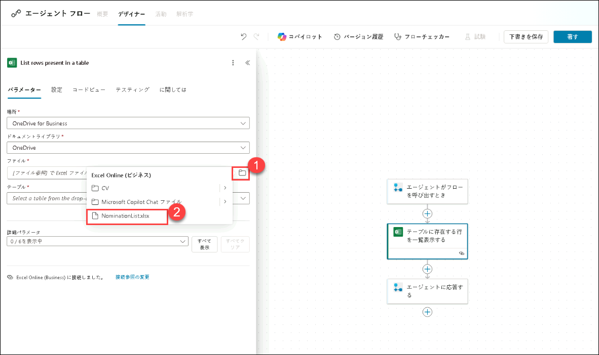
          
    - テーブル: ドロップダウンから **Table1 (5)** を選択し、**折りたたむ (6)** をクリックします。 

      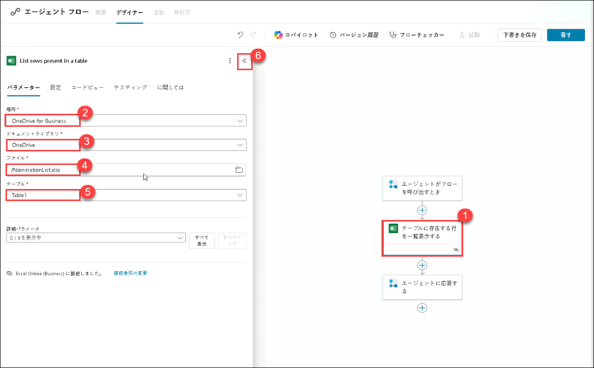

20. **表内に存在する行を一覧表示** ステップの下で **アクションを追加 (1)** をクリックします。検索バーに **選択 (2)** と入力し、**データ操作** の下で **選択 (3)** を選択します。

    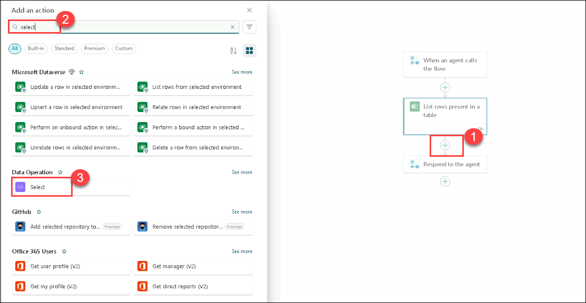

21. **From** の下のタイトルテキストボックスに **/ (1)** と入力し、**動的コンテンツを挿入する (2)** を選択します。その後、**表内に存在する行を一覧表示** セクションから **body/value (3)** を選択します。
    
    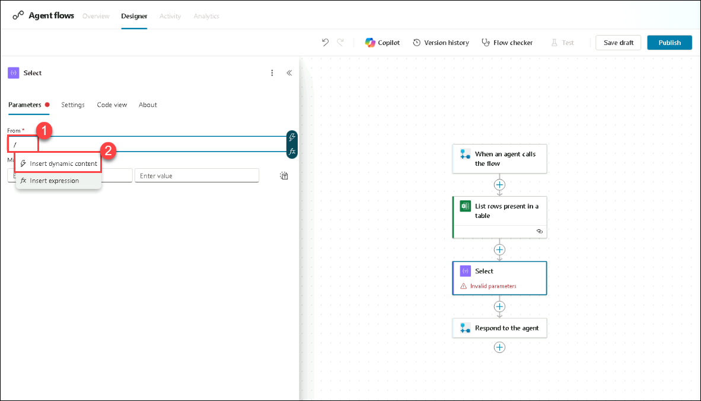
    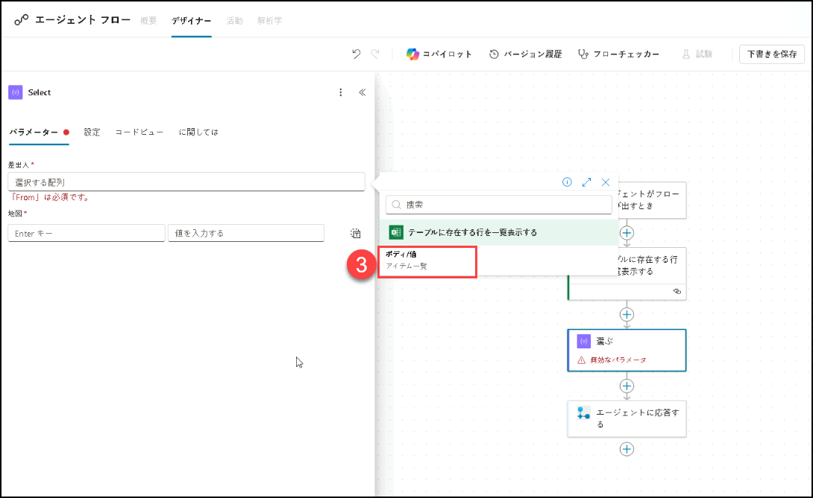

22. **Map** の下の **キーを入力します** テキストボックスに **Nominee Type (1)** と入力します。**値を入力します** テキストボックスに **/ (2)** と入力し、**動的コンテンツを挿入する (3)** を選択します。動的コンテンツセクションで、**表内に存在する行を一覧表示** の横にある **表示数を増やす (4)** をクリックし、**NomineeType (5)** を選択します。

    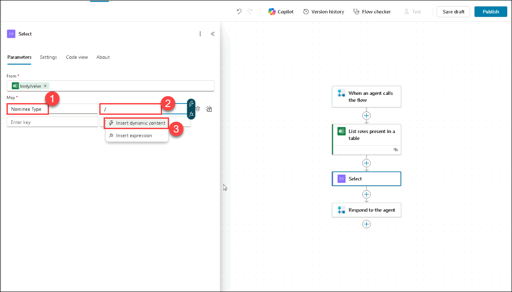
    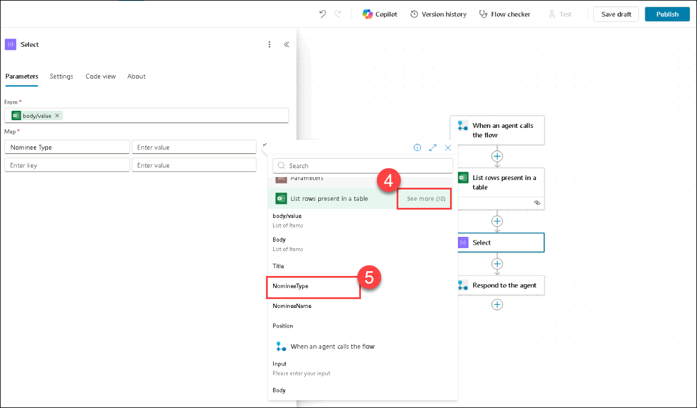

23. 次に、以下の表から残りのキーと値のペアを追加するために同じ手順に従います:

     | **Key**           | **How to get the Value** |
     |-------------------|--------------------------|
     | Nominee Name      | **表内に存在する行を一覧表示** から **NomineeName** を選択します。 |
     | Position          | **表内に存在する行を一覧表示** から **Position** を選択します。 |
     | Department        | **表内に存在する行を一覧表示** から **Department** を選択します。 |
     | Award Category    | **表内に存在する行を一覧表示** から **AwardCategory** を選択します。 |
     | Business Case     | **表内に存在する行を一覧表示** から **BusinessCase** を選択します。 |
   
     すべてのマッピングを追加すると、**選択** アクションのパラメーターに、適切な動的コンテンツ値を持つ必要なフィールドがすべて含まれます。

      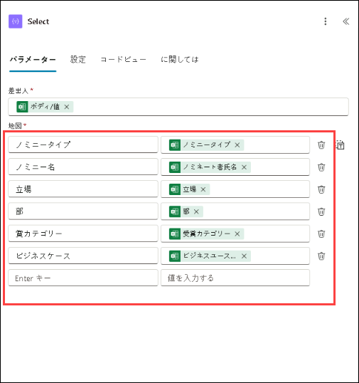

24. **選択** ステップの下で **アクションを追加 (1)** をクリックします。検索バーに **HTML テーブルの作成 (2)** と入力し、**データ操作** の下で **HTML テーブルの作成 (3)** を選択します。

    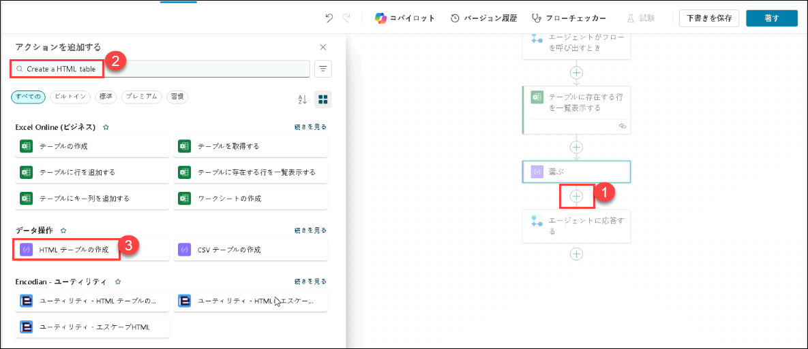

25. **HTML テーブルの作成** で、**From** の下の **Array to create table from** テキストボックスに **/ (2)** と入力し、**動的コンテンツを挿入する (3)** を選択します。動的コンテンツセクションで、**選択** の下の **Output (4)** を選択します。

    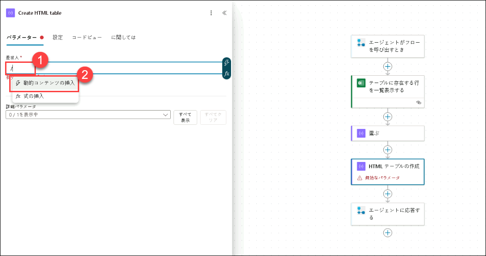
    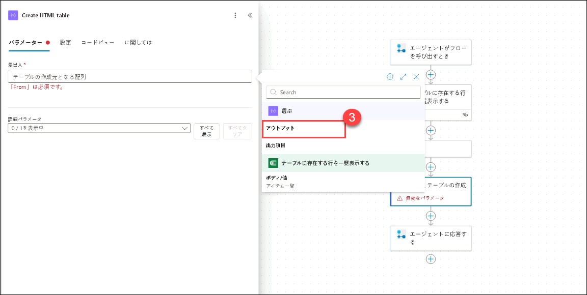

26. **選択** ステップの下で **HTML テーブルの作成 (1)** をクリックします。検索バーに **メールの送信 (V2) (2)** と入力し、**Office 365 Outlook** の下で **メールの送信 (V2) (3)** を選択します。

    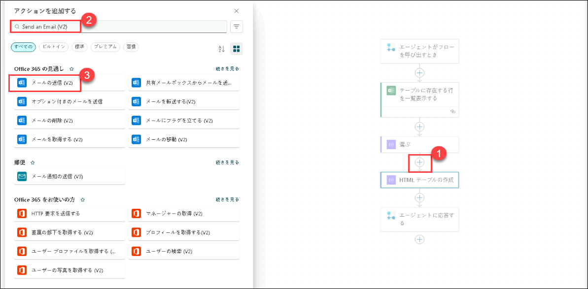


27. **サインイン**をクリックします。新しいブラウザタブがポップアップ表示されるので、既にログインしているアカウントを選択してください。

    

28. **アクセスを許可**をクリックします。 

    


29. **メールの送信 (V2)** アクションの詳細を以下のように入力します。

    | Paremeters | Values | 
    |----------|----------|
    | 宛先      | 現在のユーザーのメールアドレスを選択します。 AzureAdUserEmail. **(1)** | 
    | 件名      | ノミネーション要約 **(2)** | 
    | 本文      | 以下をコピーして貼り付けます。  **(3)**|

     プロンプト:
     ```
     Hello User, 

     Please find the Nomination summary here:

     //add output from create HTML table trigger

     Thanks & Regards
     Nomination Agent
     ```
    >**任意:** 日本語訳のプロンプトは:
     ```
     こんにちはユーザーさん、

     ノミネーションの要約はこちらにあります：

     //HTML テーブルの作成 トリガーからの出力を追加

     よろしくお願いします。
     ノミネーションエージェント
     ```
               
   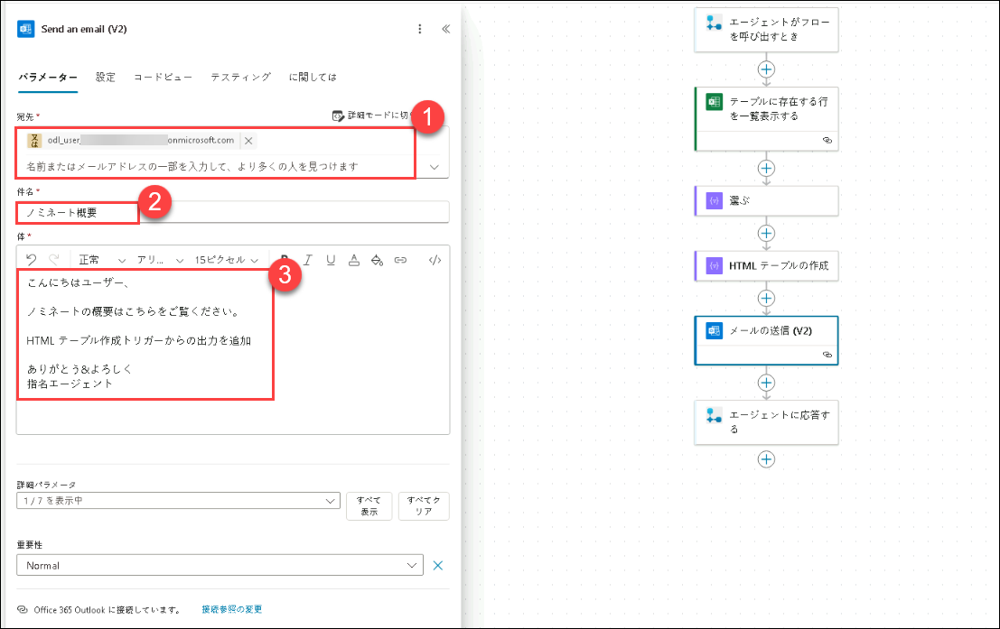

30. **メールの送信 (V2)** アクションの **本文** セクションで、**//HTML テーブルの作成 トリガーからの出力を追加** を **/ (1)** に置き換え、**動的コンテンツを挿入する** (2) を選択します。リストから **HTML テーブルの作成** の下の **Output (3)** を選択します。

    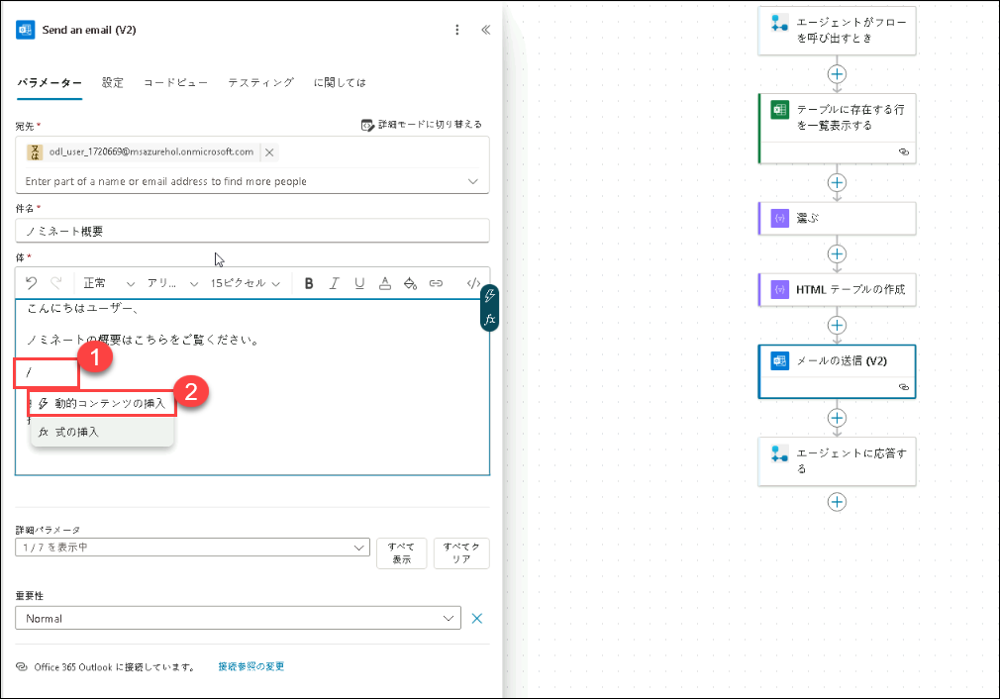
    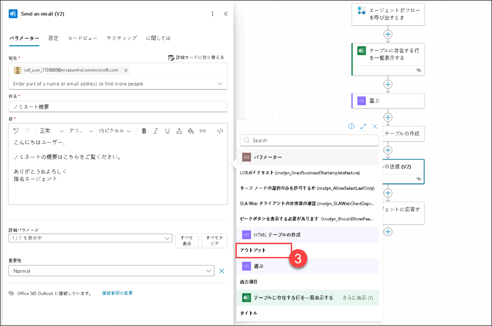

31. **HTML テーブルの作成** の **Output** を **メールの送信 (V2)** の **本文** セクションに挿入したら、最終的なメール本文が提供されたスクリーンショットに示されているものと一致することを確認します（フォーマット、スペース、動的コンテンツの配置が正確に一致することを確認してください）。メール本文を確認した後、**公開** ボタンをクリックして変更を保存および適用します。

    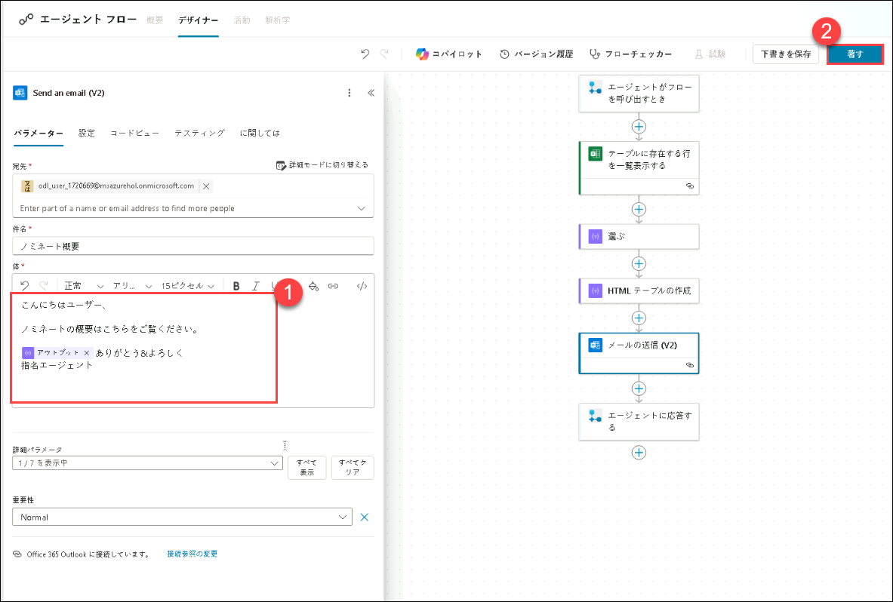

     に戻り、ポップアップウィンドウで **保存して更新** セクションの下の **完了** をクリックします。

      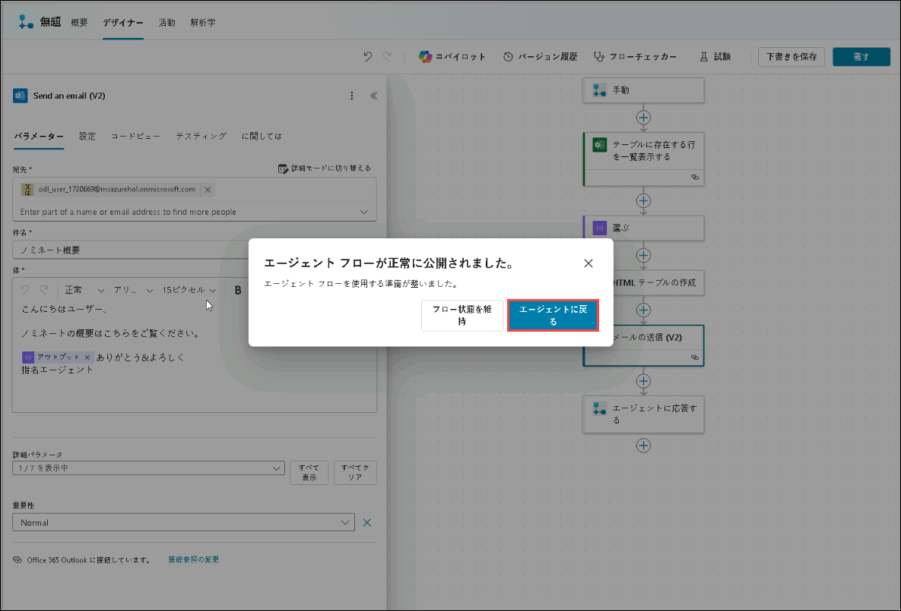

32. **エージェント** (1)ページに戻り、**指名エージェント** (2)を選択します。

    

33. **トピック**(1)タブをクリックし、**ノミネーションサマリーの生成** (2)を選択します。

    

34. **ツールの追加** セクションで、検索バーを使用して **SummaryFlow** を見つけます。次に、それを選択してノードに追加します。

    


35. **アクション** ノードで、Power Automate 入力のアクションノードに **summaryvar** 変数を選択します。

    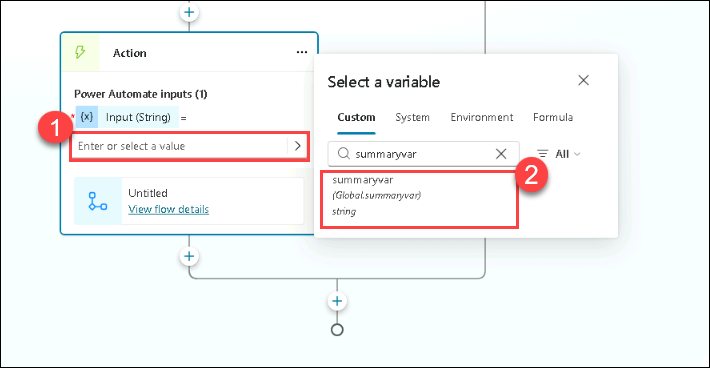

36. **アクション** ノードの下で、**ノードを追加 (1)** をクリックし、**メッセージを送信 (2)** を選択します。

    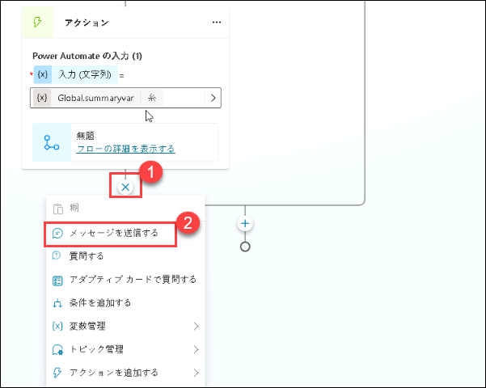

37. **メッセージを送信** ノードで、以下のメッセージを入力します。

      プロンプト:
      ```
      Nomination Agent successfully sent the summary of the nomination to your email. Please check your email.
      ```
      >**任意:** 日本語訳のプロンプトは:
      ```
      ノミネーションエージェントがノミネーションの要約をメールで送信しました。メールを確認してください。
      ```

      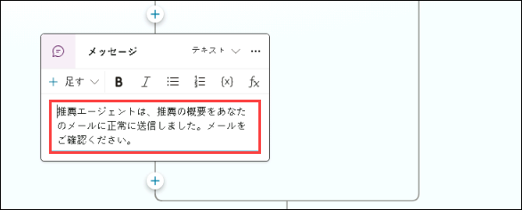

39. **アクション** ノードの下で、**ノードを追加 (1)** をクリックし、**メッセージを送信 (2)** を選択します。

    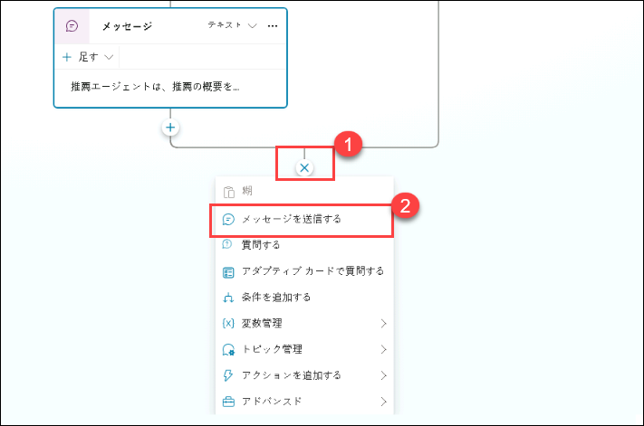

40. **メッセージを送信** ノードで、以下のメッセージを貼り付けるか入力します。**保存** ボタンをクリックします。

    プロンプト:
    ```
    Thanks & Regards
    Nomination Agent
    ```
    >**任意:** 日本語訳のプロンプトは:
    ```
    よろしくお願いします。
    ノミネーションエージェント
    ```

    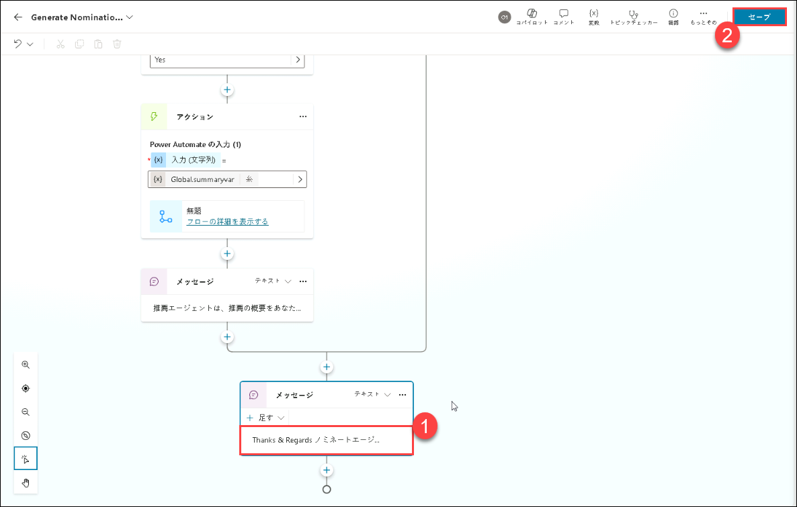
   
41. テストチャットボックスに **ノミネーション要約の生成** を入力してトピックをテストします。エージェントがノミネーションの要約を生成するかどうかを尋ねます。**はい** を選択します。

42. 「ノミネーションエージェントがノミネーションの要約をメールで送信しました。メールを確認してください。」というメッセージが表示されます。現在のユーザーのメールを確認します。エージェントからのメールが表示されます。
   
   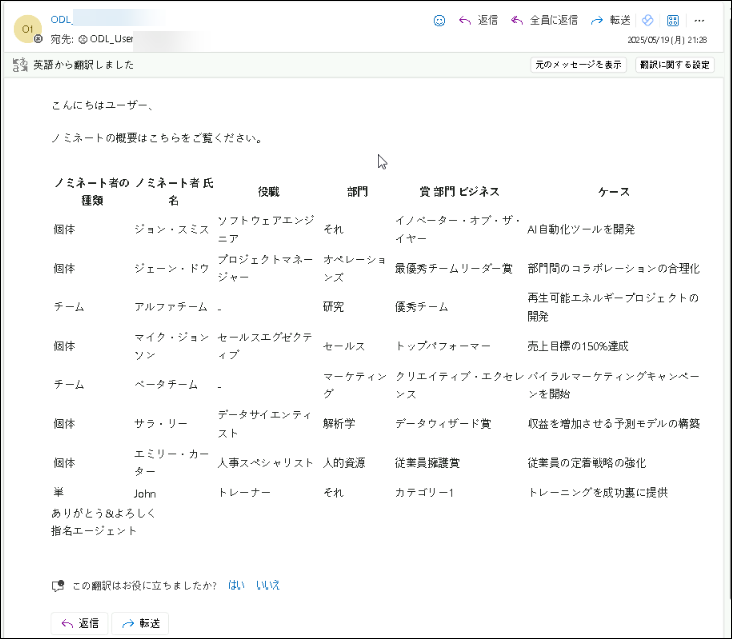

### レビュー

ノミネーションと認識を管理および表示できるようになり、従業員のエンゲージメントとモチベーションを向上させます。このラボでは、Microsoft Copilot Studio の機能を活用して、組織内での貢献を効率的に認識し、祝うためのツールを提供します。

以下のタスクを正常に完了しました:
- ノミネーションの要約を生成する。

