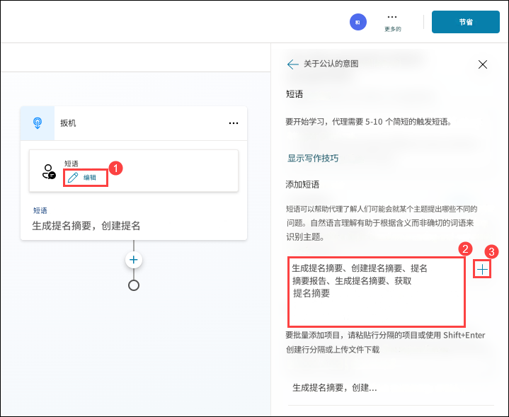

# 练习 4：在 Microsoft Copilot Studio 中启用人力资源活动的自主能力

### 预计用时：60 分钟

### 概述

系统预置的"奖励与认可"代理可引导用户完成提名创建、摘要生成以及提名审核与提交的全流程。

### 目标

- 生成提名摘要

### 任务 01：生成提名摘要

要生成提名摘要，我们将在提名代理中添加一个主题。

1. 在 **提名代理** 中，点击 **主题** **(1)**，然后点击 **+ 添加主题** **(2)** 下拉菜单并选择 **从空白开始** **(3)**。

   

2. 将工作流重命名为 **生成提名摘要**。

   

3. 在 **短语** 节点中，点击 **编辑** **(1)**，在 **文本框** **(2)** 中输入以下文本，然后点击 **+ 图标** **(3)** 添加。

   **中文：**
   ```
   生成提名摘要, 创建提名摘要, 提名摘要报告, 生成摘要, 获取提名摘要
   ```

   **英文：**
   ```
   Generate nomination summary, create nomination summary, nomination summary report, produce nomination summary, get nomination summary
   ```

   

4. 在 **触发器** 节点下，点击 **添加节点** **(1)**，然后选择 **发送消息** **(2)** 节点。

   

5. 点击 **消息** 节点下方的区域，并替换为以下消息：

   **中文：**
   ```
   我可以从名为"提名列表"的 SharePoint 列表中生成提名摘要。
   ```

   **英文：**
   ```
   I am here to generate a nomination summary from the SharePoint list named 'Nomination List'.
   ```

   

6. 在 **发送消息** 节点下，点击 **添加节点** **(1)**，然后选择 **添加问题** **(2)** 节点。

   

7. 在 **提问** 节点中输入以下详细信息，然后点击 **保存** **(7)**：

   **中文：**
   ```
   您想生成提名摘要吗？
   ```

   **英文：**
   ```
   Do you want to generate a nomination summary?
   ```

   - 选择 **+ 新选项** **(2)** 添加 **是** **(3)** 再次选择 **+ 新选项** 并添加 **否** **(4)**。
   - 点击 **将用户响应保存为** 下的 **Var1** **(5)**。
   - 将变量名更新为 **isConfirmed** **(6)** 并将用法更改为 **全局（任何主题都可访问）** **(7)**。

   

10. 在 **条件** 节点下，点击 **添加节点** **(1)**，点击 **变量管理** **(2)** 并选择 **设置变量值** **(3)**。

      

11. 在 **设置变量值** 节点中，点击 **设置变量** 下的 **选择变量** **(1)**，然后选择 **创建新变量** **(2)**。

    

12. 点击 **新创建的变量** **(1)**，输入变量名称为 **summaryvar** **(2)**，将其设置为 **全局** **(3)**，然后点击 **保存** **(3)**。 

    

    > **注意**：如果出现弹窗提示 **保存带有错误的主题？**，点击 **保存** 按钮继续。

13. 在 **设置变量值** 节点中，在 **值** 下将值设置为 **Yes** **(1)**。然后，点击 **设置变量值** 节点下方的 **添加节点** **(2)**，选择 **添加操作** **(3)**，并选择 **新建 Power Automate 流** **(4)**。这将重定向到 **Power Platform 环境**。

    

    > **注意**：一旦进入 **Power Platform 环境**，确保启用了新设计器切换；如果没有，点击 **切换** 并在弹出的 `保存您的流后再切换` 中点击 **保存并切换**

       

       
    
14. 将 Power Automate 流重命名为 **SummaryFlow**。点击顶部的流名称，输入 **SummaryFlow**，并按 **Enter** 保存新名称。

       

15. 点击 **从 Copilot 运行** **(1)** 节点，在 **参数** 会话下点击 **+ 添加输入** **(2)**，选择 **文本** **(3)**，在文本框中输入 **Input** **(4)**。添加完参数后，点击 **折叠** **(5)**。

      

16. 点击 **从 Copilot 运行** 下方的 **添加操作** **(1)**，搜索 **列出表中的行** **(2)**，并选择 **列出表中的行** **(3)**。

    

17. 选择 **列出表中的行** **(1)** 并填写以下详细信息：

    - 位置 **(Location)**：从下拉菜单选择 **OneDrive for Business** **(2)**
    - 文档库 **(Document Library)**：从下拉菜单选择 **OneDrive** **(3)**
    - 文件 **(File)**：选择 **/data/NominationList.xlsx** **(4)**
        - 点击 **文件夹** **(1)** 图标并导航到 **data** **(2)** 文件夹，选择 **NominationList.xlsx** **(3)**

            
          
    - 表格 **(Table)**：从下拉菜单选择 **Table1** **(5)** 并点击 **折叠** **(6)**

      

18. 点击 **列出表中的行** 步骤下方的 **添加操作** **(1)**。在搜索栏中，输入 **select** **(2)**，然后在 **数据操作** 下选择 **Select** **(3)**。

    

19. 在 **From** 下，在标题文本框中，输入 **/** **(1)** 并选择 **插入动态内容** **(2)**。然后，从 **列出表中的行** 部分选择 **body/value** **(3)**。
    
    

20. 在 **Map** 下，在 **输入键** 文本框中，输入 **Nominee Type** **(1)**。在 **输入值** 文本框中，输入 **/** **(2)** 并选择 **插入动态内容** **(3)**。在动态内容部分，点击 **列出表中的行** 旁边的 **查看更多** **(4)**，然后选择 **NomineeType** **(5)**。

    

21. 现在，按照相同的步骤添加下表中的其余键值对：

     | **键**      | **如何获取值** |
     |-------------------|--------------------------|
     | Nominee Name      | 从 **列出表中的行** 中选择 **NomineeName** |
     | Position          | 从 **列出表中的行** 中选择 **Position** |
     | Department        | 从 **列出表中的行** 中选择 **Department** |
     | Award Category    | 从 **列出表中的行** 中选择 **AwardCategory** |
     | Business Case     | 从 **列出表中的行** 中选择 **BusinessCase** |
   
     添加完所有这些映射后，您的 **Select** 操作参数将包含所有必要字段及其相应的动态内容值。

      

22. 点击 **Select** 步骤下方的 **添加操作** **(1)**。在搜索栏中，输入 **创建 HTML 表格** **(2)**，然后在 **数据操作** 下选择 **创建 HTML 表格** **(3)**。

    

23. 在 **创建 HTML 表格** 中，在 **From** 下的 **要从中创建表格的数组** 文本框中，输入 **/** **(2)** 并选择 **插入动态内容** **(3)**。在动态内容部分，选择 **Select** 下的 **Output** **(4)**。

    

24. 点击 **Select** 步骤下方的 **创建 HTML 表格** **(1)**。在搜索栏中，输入 **发送电子邮件** **(2)**，然后在 **Office 365 Outlook** 下选择 **发送电子邮件** **(3)**。

    

25. 填写 **发送电子邮件** 操作的以下详细信息。

    | 参数 | 值 | 
    |----------|----------|
    | 收件人 | 选择当前用户电子邮件地址 AzureAdUserEmail **(1)** | 
    | 主题 | 提名摘要 **(2)** | 
    | 正文 | 复制并粘贴以下内容 **(3)** |


    **中文：**

        您好， 

        请在此查看提名摘要：

        //添加来自创建 HTML 表格触发器的输出

        谢谢 & 致以问候
        提名代理

    **英文：**
    
        Hello User, 

        Please find the Nomination summary here:

        //add output from create HTML table trigger

        Thanks & Regards
        Nomination Agent
                
    

26. 在 **发送电子邮件** 操作的 **正文** 部分，将 **//添加来自创建 HTML 表格触发器的输出** 替换为 **/** **(1)**，然后选择 **插入动态内容** **(2)**。从列表中，选择 **创建 HTML 表格** 下的 **Output** **(3)**。

    

27. 将 **创建 HTML 表格** 的 **Output** 插入到 **发送电子邮件** 的 **正文** 部分后，您的最终电子邮件正文应与提供的屏幕截图中显示的一致（确保格式、间距和动态内容放置完全匹配）。验证电子邮件正文后，点击 **发布** 按钮保存并应用更改。

    

28. 返回 **Microsoft Copilot Studio**，在弹出窗口中，点击 **保存并刷新** 部分下的 **完成**。

      

29. 在 **添加操作** 部分，使用搜索栏查找 **SummaryFlow**，然后选择它添加到节点。

    

30. 在 **操作** 节点中，为 Power Automate 输入选择 **summaryvar** 变量。

    

31. 在 **操作** 节点下，点击 **添加节点** **(1)**，然后选择 **发送消息** **(2)**。

    

32. 在 **发送消息** 节点中，输入以下消息：

    **中文：**
    ```
    提名代理已成功将提名摘要发送至您的邮箱，请及时查收。

    谢谢 & 致以问候
    提名代理
    ```

    **英文：**
    ```
    Nomination Agent successfully sent the summary of the nomination to your email. Please check your email.

    Thanks & Regards
    Nomination Agent

    ```
    
    
34. 在 **操作** 节点下，点击 **添加节点** **(1)**，然后选择 **发送消息** **(2)**。

    
   
    

35. 在代理界面中，单击测试 （1）。如果出现提示，询问“Do you want to submit a Nomination? 选择否 （2）。

    

37. 在测试部分，  输入  Generate Nomination summary （1） 在测试聊天框中，然后单击发送 （1） 按钮。

    

38. 然后，代理将询问您是否要生成提名摘要。选择Yes.

    

    注意： 如果看到“Connect to continue for Office 365 Outlook and Excel Online (Business),”，请按照上述步骤作，刷新聊天，然后从步骤 35 到步骤 37 继续;如果没有，请直接转到步骤 38。

    o	如果提示“Connect to continue for Office 365 Outlook and Excel Online (Business),，请单击“允许”。

       
    
    o	如果仍然无法连接，请单击“ Open Connection Manager,”，这会将您重定向到“ Manage your connections”。
    
       
    
    o	在“Manage your connections”部分中，单击“将连接连接到 NominationFlow”。

       
    
    o	在“ Create or pick connections”的弹出窗口中，看到“Connection succeeded”后，单击“Submit。

       

      **注意**：在回复“Generate Nomination Summary”时选择“是”后，如果确认消息“提名代理已成功将提名摘要发送到您的电子邮件。请检查您的电子邮件“没有  出现，而是显示” Nomination Submission Form “，请点击表格底部的”提交“继续。如果提交后出现错误消息，可以安全地忽略它。请在聊天中重新输入“Generate Nomination Summary”以启动预期作。然后，您应该会看到确认消息，表明提名摘要已成功发送。
    
     
    
40. 在 Microsoft Edge 浏览器中添加一个新选项卡，然后导航到 https://outlook.com 以转到 Outlook 主页。单击登录。

     
    
41. 在“登录 Microsoft Azure”选项卡上，您将看到一个登录屏幕。输入email/username （1） 从“资源”选项卡中，然后单击“下一步”（2）。
现在输入 TAP/密码 （1） 并单击 登录 （2）。

    
    
42. 如果您看到弹出窗口“ Stay Signed in？，单击“否”。

   
   
   注意: 登录后，如果您看到标题为Copilot everywhere you need it, 只需关闭窗口即可继续。
   
43. 检查当前用户的电子邮件。您将看到来自代理的电子邮件

   

### 总结回顾

您将能够管理和查看提名和认可，提高员工参与度和积极性。本实验为您提供了高效确认和庆祝组织内贡献的工具，利用 Microsoft Copilot Studio 的功能。

成功完成以下任务：
- 生成提名摘要
