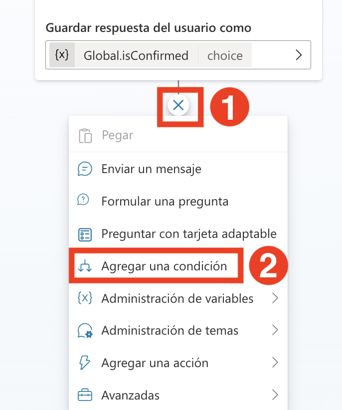
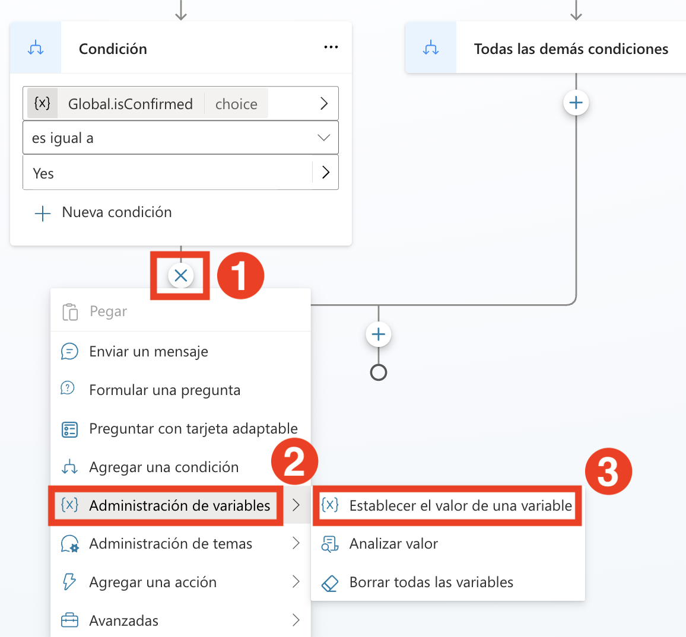
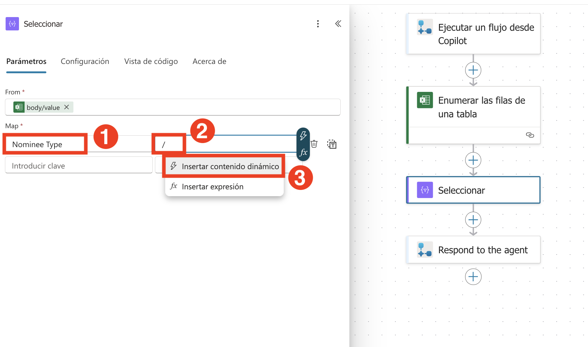
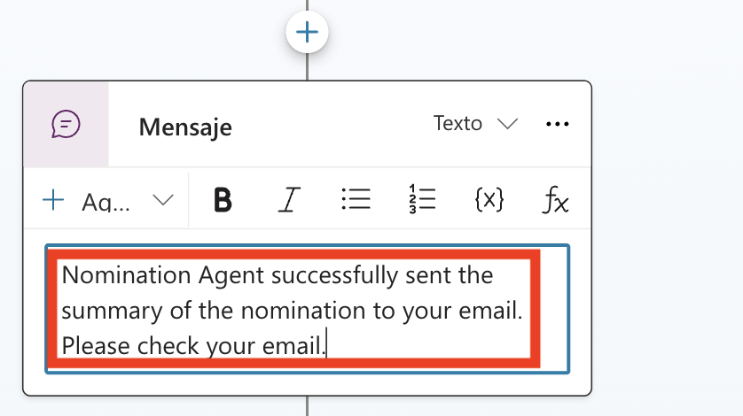

# Ejercicio 4: Habilitar capacidades autónomas en Microsoft Copilot Studio para actividades de RRHH

### Duración estimada: 60 minutos

### Descripción general

El agente preconstruido de Premios y Reconocimientos guía a los usuarios en la creación de nominaciones, generación de resúmenes y revisión y envío de nominaciones.

### Objetivos

- Generar un resumen de nominación.

### Tarea 01: Generar un resumen de nominación

Para generar un resumen de nominación, vamos a agregar un tema en nuestro Nomination Agent.

1. En el **Nomination Agent**, haz clic en **Topics** **(1)**, luego haz clic en el menú desplegable **+ Add a topic** **(2)** y selecciona **From blank** **(3)**.

   

2. Renombra el tema como **Generate Nomination Summary**.

   

3. Bajo el nodo **Trigger**, haz clic en **Add Node** **(1)** y luego elige el nodo **Send a message** **(2)**.

   

   

4. Haz clic en el área bajo el nodo **Message** y reemplaza el mensaje por el siguiente:

   ```
   Estoy aquí para generar un resumen de nominación desde la lista de SharePoint llamada 'Nomination List'.
   ```

      

5. Bajo el nodo **Send a message**, haz clic en **Add Node** **(1)** y luego elige el nodo **Ask a Question** **(2)**.

   

6. En el nodo **Ask a question** ingresa los siguientes detalles y haz clic en **Save** **(7)**.
    - Escribe **Do you want to generate a nomination summary?**  **(1)** en el cuadro de mensaje,
    - Selecciona **+ New Option** **(2)**, agrega **Yes**  **(3)**, nuevamente selecciona **+ New Option** y agrega **No**  **(4)**.
    - Haz clic en **Var1** **(5)** bajo **Save user response as**.
       - Actualiza el nombre de la variable a **isConfirmed** **(6)** y cambia el Usage a **Global(any topic can access)** **(7)**.
    
      

      

7. Bajo el nodo **Add a Question**, haz clic en **Add Node** **(1)** y luego elige el nodo **Add a condition** **(2)**.

   

8. En el nodo **Condition**, haz clic en **Select a variable** **(1)**. En la barra de búsqueda personalizada, escribe **isConfirmed** **(2)**, luego selecciona **isConfirmed** **(3)**. En el menú desplegable **Enter or select a value**, elige **yes** **(4)**.

     

9. Bajo el nodo **Condition**, haz clic en **Add Node** **(1)**, haz clic en **Variable managemant** **(2)** y selecciona **Set a variable value** **(3)**.

      

10. En el nodo **Set variable value**, haz clic en **Select a variable** **(1)** bajo **Set variable**, y luego elige **Create a new variable** **(2)**.

    

11. Haz clic en la **nueva variable creada** **(1)**, ingresa el nombre de la variable como **summaryvar** **(2)**, configúrala como **Global** **(3)** y luego haz clic en **Save** **(3)**. 

    

    

    > **Nota**: Si aparece una ventana emergente diciendo **Save topic with errors?**, haz clic en el botón **Save** para continuar.

12. En el nodo **Set variable value**, establece el valor en **Yes** **(1)** bajo **To value**. Luego, haz clic en **Add node** **(2)** debajo del nodo **Set variable value**, selecciona **Add an action** **(3)** y elige **New Agent Flow** **(4)**. Haz clic en el botón **Leave** para navegar a **Agent flows**. 

    

13. En Agent flows bajo la pestaña Designer, haz clic en **Save draft**.

    

14. Haz clic en la pestaña **Overview**(1) y haz clic en **Edit** (2).

    

15. Ingresa **SummaryFlow**(1) en el campo Flow name y haz clic en **Save**(2).

    

16. Haz clic en la pestaña **Designer** (1) y haz clic en el nodo **When an agent calls the flow** (2), bajo **Parameters**. Haz clic en **+ Add an Input**, selecciona **Text** **(3)**, ingresa el **Input** **(4)** en el cuadro de texto. Una vez agregados los parámetros, haz clic en **Collapse** **(5)**.

      

17. Haz clic en **Add action** **(1)**, debajo de **When an agent calls the flow**, busca **List rows present in the table** **(2)** y selecciona **List rows present in the table** **(3)**.

    

18. Selecciona **List rows present in the table** y completa los siguientes datos: 

    - Location: En el menú desplegable selecciona **OneDrive for Business** **(1)**
    - Document Library: En el menú desplegable selecciona **OneDrive** **(2)**.
    - File: Selecciona **/data/NominationList.xlsx** **(3)**.
        - Haz clic en el ícono de **folder** **(1)**, navega a la carpeta **data** **(2)** y selecciona **NominationList.xlsx** **(3)**.

            
          
    - Table: En el menú desplegable selecciona **Table1** **(4)** y haz clic en **Collapse** **(5)**. 

      

19. Haz clic en **Add an action** **(1)** debajo del paso **List rows present in the table**. En la barra de búsqueda, escribe **select** **(2)** y luego elige **Select** **(3)** bajo **Data Operation**.

    

20. Bajo **From**, en el cuadro de texto Title, escribe **/** **(1)** y elige **Insert dynamic content** **(2)**. Luego, selecciona **body/value** **(3)** de la sección **List rows present in the table**.
    
    
    

21. Bajo **Map**, en el cuadro de texto **Enter key**, escribe **Nominee Type** **(1)**. En el cuadro de texto **Enter value**, escribe **/** **(2)** y elige **Insert dynamic content** **(3)**. En la sección de contenido dinámico, haz clic en **See more** **(4)** junto a **List rows present in a table** y luego selecciona **NomineeType** **(5)**.

    

    


22. Ahora, sigue los mismos pasos para agregar los pares clave-valor restantes de la siguiente tabla:

     | **Key**           | **Cómo obtener el valor** |
     |-------------------|--------------------------|
     | Nominee Name      | Selecciona **NomineeName** de **List rows present in a table** |
     | Position          | Selecciona **Position** de **List rows present in a table** |
     | Department        | Selecciona **Department** de **List rows present in a table** |
     | Award Category    | Selecciona **AwardCategory** de **List rows present in a table** |
     | BusinessUseCase   | Selecciona **BusinessCase** de **List rows present in a table** |
   
     Una vez que hayas agregado todos estos mapeos, los parámetros de tu acción **Select** incluirán todos los campos necesarios con los valores de contenido dinámico apropiados.

      

23. Haz clic en **Add an action** **(1)** debajo del paso **Select**. En la barra de búsqueda, escribe **Create a HTML table** **(2)** y luego elige **Create a HTML table** **(3)** bajo **Data Operation**.

    

24. En **Create a HTML table**, en el cuadro de texto **Array to create table from** bajo **From**, escribe **/** **(2)** y elige **Insert dynamic content** **(3)**. En la sección de contenido dinámico, selecciona **Output** **(4)** bajo **Select**.

    

    


25. Haz clic en **Create a HTML table** **(1)**. En la barra de búsqueda, escribe **Send an Email (V2)** **(2)**, y luego selecciona **Send an Email (V2)** **(3)** en **Office 365 Outlook**.

    

26. Haz clic en **Sign in**. Se abrirá una nueva pestaña del navegador. Selecciona la cuenta con la que ya has iniciado sesión.

    

27. Haz clic en **Allow Access**.  

    

28. Completa los siguientes datos para la acción **Send an Email (V2)**.

    | Parámetro | Valor | 
    |----------|----------|
    | To       | Selecciona la dirección de correo electrónico del usuario actual AzureAdUserEmail. **(1)** | 
    | Subject  | Nomination Summary **(2)** | 
    | Body     | Copia y pega lo siguiente  **(3)**|

     ```
     Hola Usuario, 

     Por favor, encuentra aquí el resumen de nominaciones:

     //agrega la salida del trigger create HTML table

     Saludos cordiales
     Nomination Agent
     ```
               
      

29. En la sección **Body** de la acción **Send an Email (V2)**, reemplaza **//agrega la salida del trigger create HTML table** por **/** **(1)**, luego elige **Insert dynamic content** **(2)**. De la lista, selecciona **Output** **(3)** bajo **Create HTML table**. 

    

    


30. Una vez que hayas insertado la **Output** de **Create HTML table** en la sección **Body** de **Send an Email (V2)**, el cuerpo final del correo debe coincidir con el mostrado en la captura de pantalla proporcionada (asegúrate de que el formato, los espacios y la ubicación del contenido dinámico coincidan exactamente). Después de verificar el cuerpo del correo, haz clic en el botón **Publish** para guardar y aplicar los cambios.

    

31. Regresa a la página **Agents** (1) y selecciona el **Nomination Agent** (2).

    

32. Haz clic en la pestaña **Topics**(1) y selecciona **Generate Nomination Summary** (2).

    

33. En la sección **Add a tool**, utiliza la barra de búsqueda para encontrar **SummaryFlow**, y luego selecciónalo para añadirlo al nodo.

    

34. En el nodo **Action**, selecciona la variable **summaryvar** en el nodo de acción para la entrada de Power Automate.

    

    


35. Bajo el nodo **Action**, haz clic en **Add Node** **(1)** y luego elige **Send a message** **(2)**.

    

36. En el nodo **Send a message**, ingresa el siguiente mensaje.

      ```
      Nomination Agent envió correctamente el resumen de la nominación a tu correo electrónico. Por favor, revisa tu correo.
      ```

       

37. Bajo el nodo **Action**, haz clic en **Add Node** **(1)** y luego elige **Send a message** **(2)**.

    

38. En el nodo **Send a message**, pega o escribe el siguiente mensaje. Haz clic en el botón **Save**.

    ```
    Saludos cordiales
    Nomination Agent
    ```

    
   
39. Prueba tu tema escribiendo **Generate Nomination summary** en el cuadro de chat de prueba. El agente te preguntará si deseas generar un resumen de nominación. Selecciona **Yes**.

40. Recibirás un mensaje que indica "Nomination Agent envió correctamente el resumen de la nominación a tu correo electrónico. Por favor, revisa tu correo." Revisa el correo del usuario actual. Verás el correo del agente.
   
    

### Revisión

Podrás gestionar y visualizar nominaciones y reconocimientos, mejorando el compromiso y la motivación de los empleados. Este laboratorio te brinda las herramientas para reconocer y celebrar eficientemente las contribuciones dentro de tu organización, aprovechando las capacidades de Microsoft Copilot Studio.

Tareas completadas con éxito:
- Generar un resumen de nominación.

