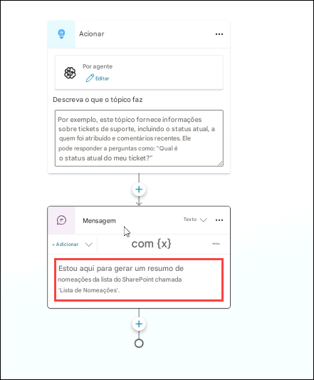

# Exercício 4: Habilitando Capacidades Autônomas no Microsoft Copilot Studio para Atividades de RH

### Duração Estimada: 60 minutos

### Visão Geral

O agente pré-construído de Prêmios e Reconhecimento orienta os usuários na criação de indicações, geração de resumos e revisão/envio das indicações.

### Objetivos

- Gerar um resumo da indicação.

### Tarefa 01: Gerar um resumo da indicação

Para gerar um resumo da indicação, vamos adicionar um tópico no nosso Agente de indicação.

1. No **Agente de indicação**, clique em **Tópicos** **(1)**, depois clique em **+ Adicionar um tópico** **(2)** e selecione **Do zero** **(3)**.

   


2. Renomeie o fluxo de trabalho para **Gerar Resumo da indicação**.

   

3. Sob o nó **Gatilho**, clique em **Adicionar Nó** **(1)** e escolha **Enviar uma mensagem** **(2)**.

   

4. Clique na área sob o nó **Mensagem** e substitua a mensagem por:

   ```
   Estou aqui para gerar um resumo da indicação a partir da lista do SharePoint chamada 'Nomination List'.
   ```
   
      

6. Sob o nó **Enviar uma mensagem**, clique em **Adicionar Nó** **(1)** e selecione **Adicionar uma pergunta** **(2)**.

       

7. No nó **Fazer uma pergunta**, insira os seguintes detalhes e clique em **Salvar** **(7)**:

   - Mensagem: **Você deseja gerar um resumo da indicação?** **(1)**
   - Clique em **+ Nova opção** **(2)** e adicione **Sim** **(3)**; depois clique novamente em **+ Nova opção** e adicione **Não** **(4)**
   - Clique em **Var1** **(5)** em **Salvar resposta do usuário como**
        - Atualize o nome da variável para **isConfirmed** **(6)** e altere o Uso para **Global (qualquer tópico pode acessar)** **(7)**
    
      

         

8. Sob o nó **Adicionar uma pergunta**, clique em **Adicionar Nó** **(1)** e selecione **Adicionar uma condição** **(2)**.

   

9. No nó **Condição**, clique em **Selecionar uma variável** **(1)**. Na barra de busca, digite isConfirmed **(2)**, selecione **isConfirmed** **(3)** e, no menu suspenso **Inserir ou selecionar um valor**, escolha **sim** **(4)**.

     

10. No nó **Condição**, clique em **Adicionar Nó** **(1)**, vá em **Gerenciamento de variáveis** **(2)** e selecione **Definir um valor de variável** **(3)**.

      

11. No nó **Definir valor da variável**, clique em **Selecionar uma variável** **(1)** e escolha **Criar uma nova variável** **(2)**.

    

12. Clique na **nova variável criada** **(1)**, insira o nome como **summaryvar** **(2)**, defina como **Global** **(3)** e clique em **Salvar** **(3)**.

    

    > **Nota**: Se aparecer um pop-up com **Salvar tópico com erros?**, clique em **Salvar** para continuar.

13. No nó **Definir valor da variável**, defina o valor como **Sim** **(1)**. Em seguida, clique em **Adicionar nó** **(2)**, selecione **Adicionar uma ação** **(3)** e escolha **Novo Fluxo Power Automate** **(4)**. Você será redirecionado para o **ambiente Power Platform**.

    

        

    > **Nota**: No ambiente **Power Platform**, certifique-se de que a opção "Novo designer" esteja ativada. Se não estiver, clique na chave e, no pop-up "Salvar seu fluxo antes de alternar", clique em **Salvar e alternar**.

           

14. Renomeie o fluxo Power Automate para **SummaryFlow**. Para isso, clique no nome no topo, digite **SummaryFlow** e pressione **Enter**.

       

15. Clique no nó **Executar de um copilot** **(1)**, na seção **Parâmetros**, clique em **+ Adicionar uma entrada** **(2)**, selecione **Texto** **(3)**, digite **Input** **(4)** e depois clique em **Recolher** **(5)**.

      

16. Clique em **Adicionar ação** **(1)** abaixo de **Executar de um copilot**, procure por **Listar linhas presentes na tabela** **(2)** e selecione **Listar linhas presentes na tabela** **(3)**.

    

17. Selecione **Listar linhas presentes na tabela** **(1)** e preencha os seguintes detalhes:

    - Localização: **OneDrive for Business** **(2)**
    - Biblioteca de documentos: **OneDrive** **(3)**
    - Arquivo: selecione **/data/NominationList.xlsx** **(4)** 
        - Clique em **pasta** **(1)** e navegue até a pasta **data** **(2)**, e selecione **NominationList.xlsx** **(3)**
    -   - Tabela: Na drop-down, selecione **Table1** **(5)**, depois clique em **Recolher** **(6)**

            


18. Abaixo da etapa **Listar linhas presentes na tabela**, clique em **Adicionar uma ação** **(1)**, digite **selecionar** **(2)** e escolha **Selecionar** **(3)** em **Operação de dados**.

    

19. Em **De**, digite **/** **(1)**, clique em **Inserir conteúdo dinâmico** **(2)** e selecione **body/value** **(3)** a partir da seção de **Listar linhas presentes na tabela**.
    
    


20. Em **Mapeamento**, em **Inserir chave** digite **Nominee Type** **(1)**. Na caixa de texto **Inserir valor** **(2)** insira **/** **(2)** e selecione **Insert dynamic content** **(3)**. Na seção de conteúdo dinâmico, próximo ao **Listar linhas presentes na tabela**, clique em **Visualizar mais** **(4)**, por fim, selecione **NomineeType** **(5)**.

    

        

    

    
  
21. Agora, repita os passos para adicionar os restantes pares de chave-valor da seguinte tabela:

| **Chave**           | **Como obter o valor** |
| ------------------- | ----------------------------- |
| NomineeName         | Selecione **NomineeName** de **Listar linhas presentes na tabela** |
| Position            | Selecione **Position** de **Listar linhas presentes na tabela** |
| Departament         | Selecione **Department** de **Listar linhas presentes na tabela** |
| Award Category      | Selecione **AwardCategory** de **Listar linhas presentes na tabela** |
| Business Case       | Selecione **BusinessCase** de **Listar linhas presentes na tabela** |

Uma vez que você tenha adicionado todos esses mapeamentos, sua ação de **Selecionar** os parâmetros irá incluir todos os campos necessários com os valores de conteúdo dinâmico apropriado.


22. Clique em **Adicionar uma ação** **(1)** abaixo de **Selecionar**, digite **Criar uma tabela HTML** **(2)** e selecione a opção **Criar uma tabela HTML** **(3)**.

    

23. Em **Criar uma tabela HTML**, no campo **De**, insira **/** **(2)**, clique em **Inserir conteúdo dinâmico** **(3)** e selecione **Output** **(4)**.

    

24. Clique em **Criar uma tabela HTML** **(1)** abaixo, digite **Enviar um e-mail (V2)** **(2)** e selecione a opção **Enviar um e-mail (V2)** **(3)**.

    

    

25. Preencha os campos da ação **Send an Email (V2)**:

| Parâmetro | Valor                               |
| --------- | ----------------------------------- |
| Para      | Selecione o endereço de e-mail do usuário atual AzureAdUserEmail. **(1)**|
| Assunto   | Resumo da indicação            **(2)** |
| Corpo     | Copie e cole o texto abaixo:   **(3)**|
    
```
Olá Usuário,
Segue o resumo da indicação:
//adicionar saída da tabela HTML
Atenciosamente,  
Agente de indicação
```
    

   
      
26. Na sessão **Corpo**, substitua **//adicionar saída da tabela HTML** por **/** **(1)**, clique em **Inserir conteúdo dinâmico** **(2)** e selecione **Output** **(3)** de **Criar tabela HTML**.

    


27. Depois de inserir a **Saída** do **Criar tabela HTML** na seção **Corpo** da **Enviar um email (V2)**, o corpo final do seu email deve corresponder exatamente ao mostrado na captura de tela fornecida (certifique-se de que a formatação, os espaçamentos e a posição dos conteúdos dinâmicos estejam exatamente iguais). Após verificar o corpo do email, clique no botão **Publicar** para salvar e aplicar as alterações.

    

        

28. Volte para o **Microsoft Copilot Studio** e, clique **Salvar**.

29. Em **Adicionar uma ação**, procure por **SummaryFlow** e adicione ao nó.

    

30. No nó de **Ação**, selecione a variável **summaryvar** como entrada para o Power Automate.

    

31. Sob o nó de **Ação**, clique em **Adicionar Nó** **(1)** e selecione **Enviar uma mensagem** **(2)**.

    


32. No nó **Enviar uma mensagem**, insira:

    ```
    O Agente de indicação enviou com sucesso o resumo da indicação para seu e-mail. Verifique seu e-mail.
    ```

       


33. Clique em **Adicionar Nó** **(1)** novamente e selecione **Enviar uma mensagem** **(2)**.


    

34. No nó **Enviar uma mensagem**, cole ou digite a seguinte mensagem. Clique no botão **Salvar**.

    ```
    Atenciosamente,  
    Agente de indicação
    ```

    

35. Teste seu tópico digitando **Gerar resumo da indicação** na caixa de teste. O agente perguntará se você deseja gerar o resumo. Selecione **Sim**.

36. Você verá a mensagem: "O Agente de indicação enviou com sucesso o resumo da indicação para seu e-mail." Verifique sua caixa de entrada.
   
    


### Revisão

Você poderá gerenciar e visualizar indicações e reconhecimentos, promovendo o engajamento e a motivação dos colaboradores. Este laboratório fornece as ferramentas necessárias para reconhecer e celebrar contribuições de forma eficiente dentro da sua organização, aproveitando os recursos do Microsoft Copilot Studio.

Tarefas concluídas com sucesso:

- Gerar um resumo de indicação.

