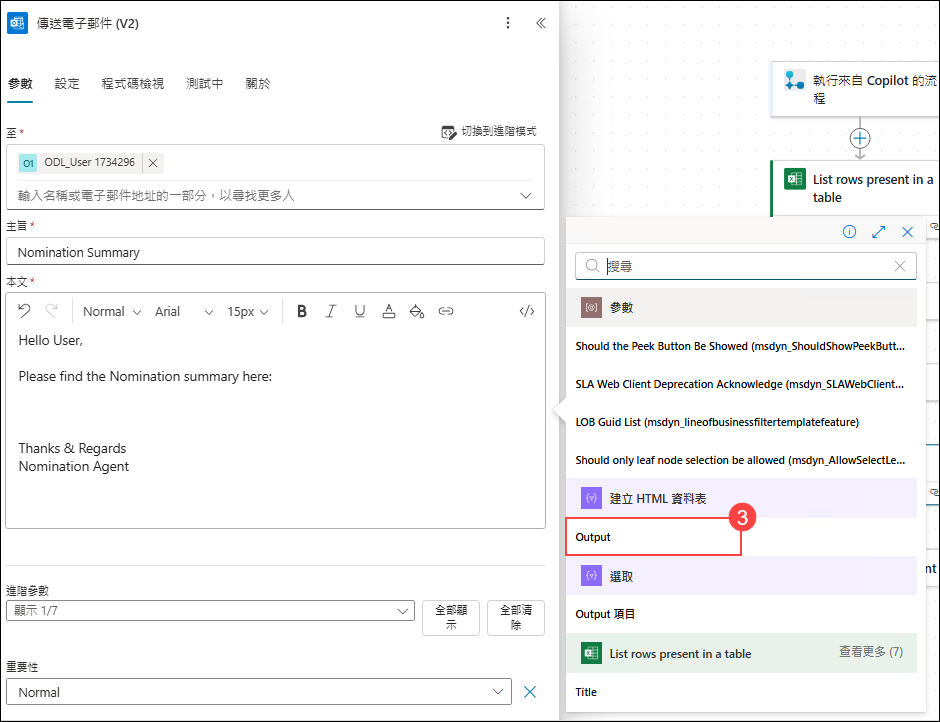
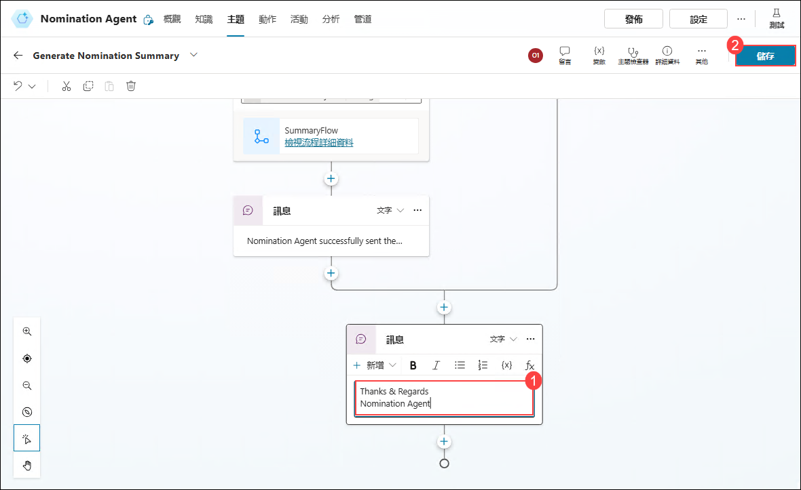

# 練習 4：在 Microsoft Copilot Studio 中啟用 HR 活動的自主功能

### 預估時間：60 分鐘

## 實驗概覽

預建的「獎勵與表揚代理程式」可引導使用者建立提名、產生摘要，以及審查與提交提名。

## 實驗目標

- 任務 1：產生提名摘要

### 任務 1：產生提名摘要

要產生提名摘要，我們將在提名代理程式中新增一個主題。

1. 在 **Nomination Agent** 中，點選 **主題** **(1)** 標籤，然後點選 **+ 新增主題** **(2)** ，下拉選單，選擇 **從空白內容開始** **(3)**。

   

2. 將工作流程重新命名為 **Generate Nomination Summary**。

   

3. 在 **觸發程序** 節點下，點選 **新增節點** **(1)**，然後選擇 **傳送訊息** **(2)** 。

   

   

4. 點選新增的 **訊息** 節點下的區域，並將訊息替換為以下內容：

   ```
   I am here to generate a nomination summary from the SharePoint list named 'Nomination List'.
   ```

      

5. 在 **訊息** 節點下，點選 **新增節點** **(1)**，然後選擇 **提出問題** **(2)** 。

   

6. 在新增的 **問題** 節點中，輸入以下內容並點選 **儲存**：
    - 在訊息框中輸入：**Do you want to generate a nomination summary?**  **(1)**。
    - 點選 **+ 新選項** **(2)**，新增 **Yes**  **(3)**。再點選 **+ 新選項** **(2)** ，新增 **No**  **(4)**。
    - 在 **將使用者回覆另存為** 點選 **Var1** **(5)**：
       - 將變數名稱更新為 **isConfirmed** **(6)**，並將使用範圍設為 **全域 (任何主題皆可存取)** **(7)**。
    
      

7. 在 **問題** 節點下，點選 **新增節點** **(1)**，然後選擇 **新增條件** **(2)** 。

   

8. 在新增的 **條件** 節點中，點選 **選取變數** **(1)**。在 **自訂** 的搜尋欄中，輸入 **isConfirmed** **(2)**，選擇變數 **isConfirmed** **(3)**。然後在 **條件** 節點中的 **等於** 下方，點選 **輸入或選取值**，在下拉選單中選擇 **yes** **(4)** 值。

     

9. 在 **條件** 節點下，點選 **新增節點** **(1)**，選擇 **變數管理** **(2)**， 點選 **設定變數值** **(3)**。

      

10. 在新增的 **設定變數值** 節點中的 **設定變數** 下，選擇 **選取變數** **(1)**，然後選擇 **建立新變數** **(2)**。

    

11. 點選新增的變數  **Var1** **(1)**，命名新變數為 **summaryvar** **(2)**，改它設為 **全域 (任何主題皆可存取)** **(3)**，然後點選 **儲存** **(4)**。

    

    > **注意**: 若出現彈出視窗顯示 **Save topic with errors?** 的提示，請點選 **Save** 按鈕以繼續。

12. 在 **設定變數值** 節點的 **目標值** 下，將變數值設定為 **Yes** **(1)**。 然後，在 **設定變數值** 節點下，點選 **新增節點** **(2)**，選擇 ****新增工具**** **(3)**，然後點選 **新代理程式流程** **(4)**。在彈出的 **要離開此頁面嗎?**視窗中，點選 **離開** 按鈕，導覽至 **代理程式流程**。

    

13. 在設計器標籤下的 **代理程式流程** 中，按一下 **儲存草稿**。

       

14. 點選 **概覽** **(1)** 標籤，然後點選 **編輯** **(2)**。

    

15. 在 **流程名稱** 欄位中輸入 **SummaryFlow** **(1)**，然後點選 **儲存** **(2)**。

    

16. 點選 **設計工具** **(1)** 標籤，然後點選 **執行來自 Copilot 的流程** **(2)** 節點，在 **參數** 會話下點選 **+ 新增輸入**，選擇 **文字** **(3)**，在文字方塊中輸入 **Input** **(4)**，然後點選 **摺疊** **(5)** 圖示。

      

17. 在 ****執行來自 Copilot 的流程**** 下方，點擊 **新增動作** **(1)**。在 **新增動作** 中，搜尋 **列出表格中的列** **(2)**，然後選擇 **列出表格中的列** **(3)**。

    

18. 選擇 **列出表格中的列** 中的 **參數** 會話下，填寫以下資訊：

    - Location: 從下拉選單中選擇 **OneDrive for Business** **(1)** 。
    - Document Library: 從下拉選單中選擇 **OneDrive** **(2)**。
    - File: 選擇 **/data/NominationList.xlsx** **(3)**。
        - 點選 **開啟資料夾** **(1)** 圖示，導航至 **data** 資料夾，並選擇 **NominationList.xlsx** **(2)**。

            
          
    - Table: 從下拉選單中選擇 **Table1** **(4)** ，然後點擊 **摺叠** **(5)** 圖示。

      

19. 在 **列出表格中的列** 動作節點下方，點擊 **新增動作** **(1)**。在 **新增動作** 中，搜尋 **選取** **(2)**，然後在 **資料作業** 下，選擇 **選取** **(3)**。

    

20. 在 **From** 區域下的文字框中輸入 **/** **(1)**，並選擇 **插入動態內容** **(2)** 。然後在 **列出表格中的列** 部分中選擇 **body/value** **(3)**。
    
    

        

21. 在 **對應** 區域下，於 **輸入金鑰** 文字框中輸入 **Nominee Type** **(1)**。在 **輸入值** 文字框中輸入 **/** **(2)** ，然後選擇 **插入動態內容** **(3)**。在動態內容部分，位於 **列出表格中的列** 旁點擊 **查看更多** **(4)**（位於 列出表格中的列 旁），接著選擇 **NomineeType** **(5)**。

    

    

22. 現在，請依照相同的步驟，從下表中新增其餘的鍵值對：

     | **金鑰**           | **輸入值** |
     |-------------------|--------------------------|
     | Nominee Name      | 從 **列出表格中的列** 中選擇 **NomineeName**|
     | Position          | 從 **列出表格中的列** 中選擇 **Position**  |
     | Department        | 從 **列出表格中的列** 中選擇 **Department**  |
     | Award Category    | 從 **列出表格中的列** 中選擇 **AwardCategory**  |
     | BusinessUseCase   | 從 **列出表格中的列** 中選擇 **BusinessUseCase** |
   
     當您完成所有這些對應設定後，您的 **選取** 動作的參數，將包含所有必要欄位，並具備正確的動態內容值。     

      

23. 在 **選取** 動作節點下方，點選 **新增動作** **(1)**。在搜尋欄中輸入 **建立 HTML 資料表** **(2)**，然後在 **資料作業** 下，選擇 **建立 HTML 資料表** **(3)**。

    

24. 在 **建立 HTML 資料表** 動作中，於 **From** 區塊下的 **Array to create table from** 文字框中輸入 **/** **(1)**，然後選擇 **插入動態內容** **(2)**。在動態內容區塊中，從 **選取** 步驟中選擇 **Output** **(3)**。

    

    

25. 在 **建立 HTML 資料表** 動作節點下方，點選 **新增動作** **(1)**。在搜索欄中輸入 **傳送電子郵件 (V2)** **(2)**, 然後在 **Office 365 Outlook** 下，選擇 **傳送電子郵件 (V2)** **(3)**。

    

26. 點擊 **登入**。將會彈出一個新的瀏覽器標籤頁。選擇您已登入的帳戶。

    

27. 點擊 **Allow access**。

    

28. 在 **傳送電子郵件 (V2)** 動作下，請填寫以下的參數。

    | 參數 | 參數值 | 
    |----------|----------|
    | 至        | 選擇現在的用戶電郵地址 AzureAdUserEmail. **(1)** | 
    | 主旨      | Nomination Summary **(2)** | 
    | 本文      | 請複製並貼上以下內容：  **(3)**|

     ```
     Hello User, 

     Please find the Nomination summary here:

     //add output from create HTML table trigger

     Thanks & Regards
     Nomination Agent
     ```
               
      

29. 在 **傳送電子郵件 (V2)** 動作的 **本文** 區段中，將 **//add output from create HTML table trigger** 替換為 **/** **(1)**，然後選擇 **插入動態內容** **(2)**。在清單中，從 **建立 HTML 資料表** 項目下選擇 **Output** **(3)**。

    

    

30. 當您將 **建立 HTML 資料表** 的 **Output** 插入至 **傳送電子郵件 (V2)** 的 **本文** 區段後，最終的電子郵件內容應與提供的螢幕截圖完全一致（請確保格式、間距與動態內容的位置完全相符）。確認電子郵件內容無誤後，請點選 **發佈** 按鈕以儲存並套用變更。

    

31. 返回 **代理程式** **(1)** 頁面，然後選擇 **Nomination Agent (2)**。

    

32. 選擇 **主題 (1)** 標籤，然後選擇 **Generate Nomination Summary (2)**。

    

33. 在 **設定變數值** 節點下，點擊 **新增節點** **(1)**，然後選擇 **新增動作** **(2)**，在 **新增動作** 區段中，使用搜尋列尋找 **NominaSummaryFlowtionFlow** **(3)**，然後選擇它  **(3)** 以新增至節點中。

    

34. 在 **動作** 節點中，選取 **summaryvar** **(2)**變數，作為 Power Automate 的輸入值 **(1)**。

    

35. 在 **動作** 節點下，點選 **新增節點** **(1)**，然後選擇 **傳送訊息** **(2)**。

    

36. 在 **訊息** 節點中，輸入 **以下訊息**。

      ```
      Nomination Agent successfully sent the summary of the nomination to your email. Please check your email.
      ```

       

37. 在 **條件** 與 **所有其他條件** 2個節點會合點下，點選 **新增節點** **(1)**，然後選擇 **傳送訊息** **(2)**。

    

38. 在 **訊息** 節點中，貼上或輸入以下訊息 **(1)**。然後點選 **儲存** **(2)**按鈕。

    ```
    Thanks & Regards
    Nomination Agent
    ```

    
   
39. 在右方的 **測試你的代理程式** 中，輸入 **Generate Nomination summary** 來測試您的主題。接著代理人會詢問您是否要產生提名摘要。請選擇 **Yes**。   

40. 您將會收到一則訊息，顯示：「提名代理人已成功將提名摘要寄送至您的電子郵件。請查收您的電子郵件。」請檢查目前使用者的電子郵件，您將會看到來自代理人的郵件。
   
    

### 回顧

您將能夠管理與檢視提名與表揚，有效提升員工的參與度與工作動機。本實驗將提供您所需的工具，讓您能夠善用 Microsoft Copilot Studio 的功能，有效率地在組織內表揚與慶祝貢獻。

已成功完成以下任務：
- 產生提名摘要。

### 恭喜！您已成功完成本次實驗課程！
### 前往下一個實驗課程，請點選導覽連結。
