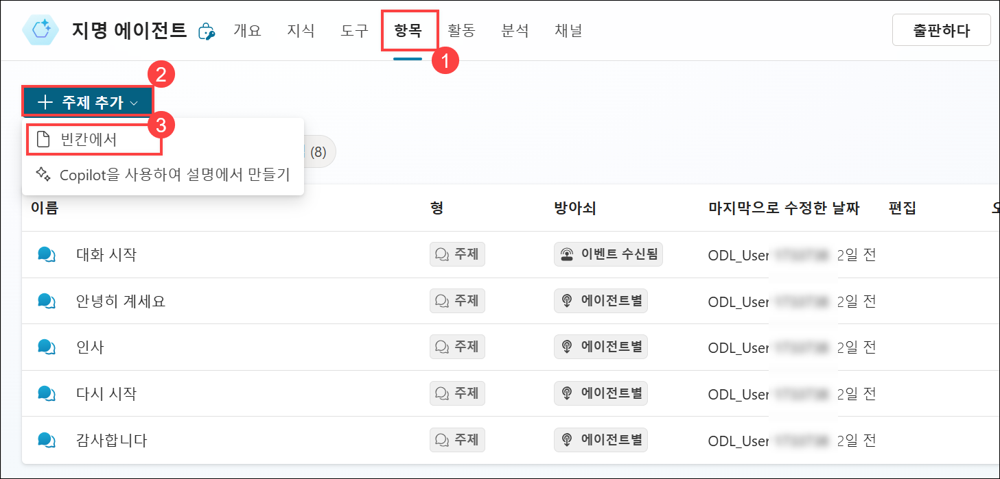
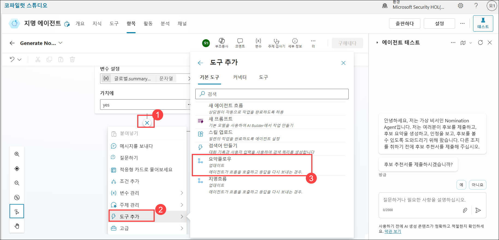
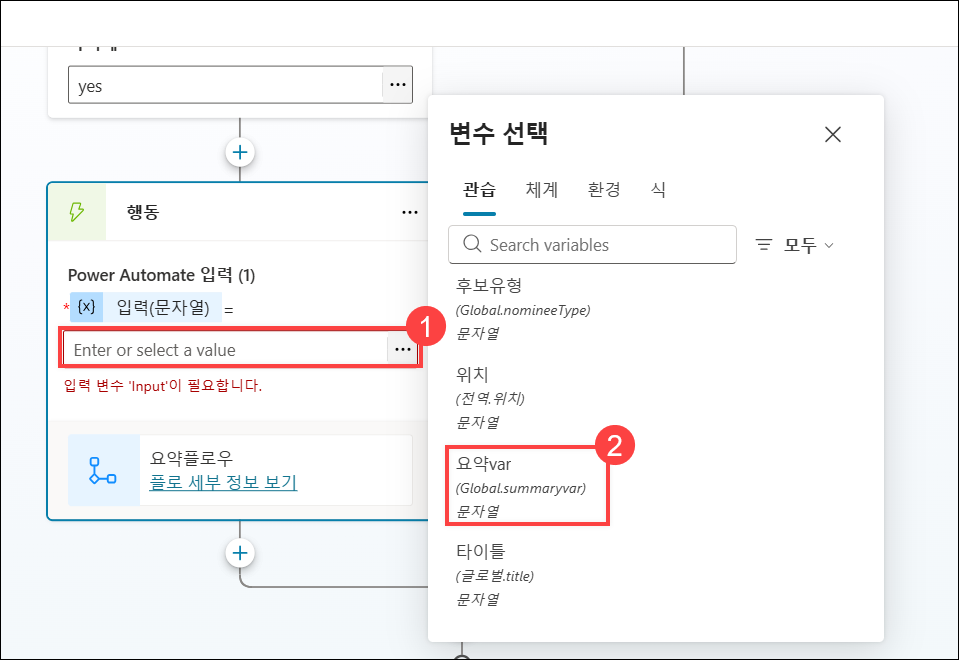

# 실습 4: HR 작업 수행을 위해 Microsoft Copilot Studio의 자율 기능 활성화하기

### 예상 소요 시간: 60분

## 개요

이전 단계에서 구축한 포상 및 격려 에이전트는 직원들이 추천서를 작성하고, 요약을 생성하며, 내용을 검토하고 제출하는 전 과정을 효과적으로 안내할 수 있도록 지원합니다.

## 목표

- 추천 요약 생성

## 과제 1: 추천 요약 생성

추천 요약을 생성하기 위해서, 추천 에이전트(Nomination Agent)를 토픽(topic)에 추가합니다.

1. **Nomination Agent**에서 **Topics** **(1)** 을 클릭한 다음, **+ Add a topic** **(2)** 클릭 후, 드롭다운 리스트에서 **From blank** **(3)** 을 선택합니다.

   

1. 워크플로우의 이름을 **Generate Nomination Summary** 로 변경합니다. 

   

1. **Trigger** 노드 아래에서 **Add Node** **(1)** 를 클릭한 다음, **Send a message** **(2)** 를 선택합니다.

   
   

1. **Message** 노드 아래 영역을 클릭한 후, 아래의 메시지로 내용을 교체합니다.

   ```
   I am here to generate a nomination summary from the SharePoint list named 'Nomination List'.
   ```

   ```
   나는 여기서 SharePoint 리스트에 있는 'Nomination List'를 이용하여 추천 요약을 생성합니다. 
   ```

      

1. **Send a message** 노드 아래에서 **Add Node** **(1)** 를 클릭한 후, **Ask a Question** **(2)** 노드를 선택합니다.

   

1. **Ask a question** 노드에 아래의 세부 정보를 입력한 후, Save **(8)** 를 클릭합니다.
    - 메시지 박스에 Do you want to generate a nomination summary? (추천 요약 정보를 생성하고 싶습니까?) **(1)** 을 입력합니다. 
    - **+ New Option** **(2)** 을 선택하여 **Yes** **(3)** 를 추가하고, 다시 **+ New Option**을 선택하여 **No** **(4)** 를 추가합니다.
    - **Save user response as** 아래의 **Var1** **(5)** 을 클릭합니다.
    - 변수 이름을 **isConfirmed** **(6)** 로 변경하고, 사용 범위를 **Global(모든 토픽에서 접근 가능)** **(7)** 으로 설정합니다.
    
      
      

1. **Add a Question** 노드 아래에서 **Add Node** **(1)** 를 클릭한 후, **Add a condition** **(2)** 노드를 선택합니다.

   

1. **Condition** 노드에서 **Select a variable** **(1)** 을 클릭합니다. 사용자 정의 검색창에 **isConfirmed** **(2)** 를 입력한 후, **isConfirmed** **(3)** 를 선택합니다.
**Enter or select a value** 드롭다운에서 **yes** **(4)** 를 선택합니다.

     
   

1. **Condition** 노드 아래에서 **Add Node**  를 클릭한 후, **Variable management** **(1)** 를 클릭하고 **Set a variable value** **(2)** 를 선택합니다.

     

1. **Set variable value** 노드에서 **Set variable** 아래의 **Select a variable** **(1)** 을 클릭하고, **Create a new variable** **(2)** 를 선택합니다.

    

1. 새로 생성된 변수 **(1)** 을 클릭한 후, 변수 이름을 **summaryvar** **(2)** 로 입력하고, 사용 범위를 **Global(any topic can access)** **(3)** 로 설정한 다음 **Save** **(4)** 를 클릭합니다.

    

    > **참고**: **Save topic with errors?** 라는 팝업이 표시되면, **Save** 버튼을 클릭하여 계속 진행 합니다. 

1. **Set variable value** 노드에서 **To value** 아래 값을 **Yes (1)** 로 설정합니다.
그런 다음, **Set variable value** 노드 아래의 **Add node (2)** 를 클릭하고, **Add a tool (3)** 을 선택한 후, **New Agent Flow (4)** 를 선택합니다.
이제 이 작업은 **Agent flows** 로 리디렉션됩니다.

    

    
1. 에이전트 흐름'의 '디자이너' 탭에서 **초안 저장**을 클릭하세요.

    

1. **Overview (1)** 탭을 클릭한 다음, **Edit (2)** 를 클릭하세요.

    

1. **Flow name** 필드에 **SummaryFlow (1)** 를 입력하고, **Save (2)** 를 클릭하세요.

    

1. **Designer (1)** 탭을 클릭하고, **When an agent calls the flow (2)** 노드를 클릭한 후, Parameters 아래에서 **+ Add an Input (3)** 을 클릭하고, **Text (4)** 를 선택한 다음, 텍스트 상자에 **Input (5)** 을 입력하세요. 파라미터가 추가되면 **Collapse (6)** 를 클릭합니다.

      
    
    

1. **Run from a copilot** 아래에서 **Add action** **(1)** 을 클릭하고, **List rows present in the table** **(2)** 를 검색한 후, **List rows present in the table** **(3)** 를 선택합니다.

    

1. **List rows present in the table** 을 선택한 후, 다음 세부 정보를 입력합니다:

    - Location: 드롭다운에서 **OneDrive for Business** **(1)** 선택.
    - Document Library: 드롭다운에서 **OneDrive** **(2)** 선택.
    - File: **NominationList.xlsx** **(4)** 선택.
        - 폴더 **아이콘 (3)** 을 클릭하고 **NominationList.xlsx** 파일을 선택하세요.


            
          
    - Table: 드롭다운에서 **Table1** **(5)** 선택 후, **Collapse** **(6)** 클릭.

      

1. **List rows present in the table** 아래에서 **Add an action** **(1)** 을 클릭합니다. 검색창에 **select** **(2)** 를 입력한 후, **Data Operation** 아래에서 **Select** **(3)** 를 선택합니다.

    

1. **From** 아래 텍스트 박스에 **/** **(1)** 를 입력하고 **Insert dynamic content** **(2)** 를 선택합니다. 그런 다음, **List rows present in the table** 섹션에서 **body/value** **(3)** 를 선택합니다.
    
    
    

1. **Map** 항목에서 **Enter key** 텍스트 박스에 **Nominee Type** **(1)** 을 입력합니다. **Enter value** 텍스트 박스에 **/** **(2)** 를 입력하고 **Insert dynamic content** **(3)** 를 선택합니다. 동적 콘텐츠 섹션에서 **List rows present in a table** 옆의 **See more** **(4)** 를 클릭한 후, **NomineeType** **(5)** 을 선택합니다.

    
    
    

1. 이제 아래 표에 있는 나머지 키-값 쌍들도 동일한 절차를 따라 추가합니다:


     | **Key**           | **How to get the Value** |
     |-------------------|--------------------------|
     | Nominee Name      |  **List rows present in a table**에서 **NomineeName** 선택  |
     | Position          |  **List rows present in a table**에서 **Position** 선택  |
     | Department        |  **List rows present in a table**에서 **Department** 선택  |
     | Award Category    |  **List rows present in a table**에서 **AwardCategory** 선택  |
     | Business Case     |  **List rows present in a table**에서 **BusinessUseCase** 선택  |
   
     Once you’ve added all these mappings, your **Select** action parameters will include all the necessary fields with the appropriate dynamic content values.

     

1. **Select** 단계 아래에서 **Add an action** **(1)** 을 클릭합니다.
검색창에 **Create a HTML table** **(2)** 를 입력한 후, **Data Operation** 아래에서 **Create a HTML table** **(3)** 를 선택합니다.

     

1. **Create a HTML table** 단계에서, **From** 아래의 **Array to create table from** 텍스트 박스에 **/** **(2)** 를 입력하고 **Insert dynamic content** **(3)** 를 선택합니다.
동적 콘텐츠 섹션에서 **Select** 아래의 **Output** **(4)** 을 선택합니다.

    

    

1. 아래 **HTML 테이블 만들기** **(1)** 를 클릭하세요. 검색창에 **이메일 보내기(V2)** **(2)** 를 입력한 후 **Office 365 Outlook**에서 **이메일 보내기(V2)** **(3)** 를 선택하세요.

    

1. **사인인** 을 클릭하세요. 새 브라우저 탭이 팝업됩니다. 이미 사인인한 계정을 선택하세요

     

1. **액세스 허용**을 클릭합니다.

    

1. **Send an Email (V2)** 작업에 대해 다음 세부 정보를 입력합니다

    | Paremeters | Values | 
    |----------|----------|
    | To       | 현재 사용자의 이메일 주소를 선택 AzureAdUserEmail. **(1)** | 
    | Subject  | Nomination Summary **(2)** | 
    | Body     | 다음 내용을 복사  **(3)** |

     ```
     Hello User, 

     Please find the Nomination summary here:

     //add output from create HTML table trigger

     Thanks & Regards
     Nomination Agent
     ```

     ```
     안녕하세요 사용자님,
     다음은 추천 요약 내용입니다.

     //add output from create HTML table trigger

     감사합니다.
     추천 에이전트 드림
     ```
               
     

1. **Send an Email (V2)** 작업의 **Body** 섹션에서 **//add output from create HTML table trigger** 를 **/** **(1)** 로 교체한 후, **Insert dynamic content** **(2)** 를 선택합니다. 목록에서 **Create HTML table (3)** 아래의 **Output** **(4)** 을 선택합니다.

    

    

1. **Create HTML table** 의 **Output** 을 **Send an Email (V2)** 의 **Body** 섹션에 삽입한 후, 최종 이메일 본문이 제공된 스크린샷과 동일한지 확인합니다 (형식, 공백, 동적 콘텐츠 위치가 정확히 일치해야 합니다). 이메일 본문을 확인한 뒤, 변경 사항을 저장하고 적용하기 위해서 **Publish (2)** 버튼을 클릭합니다.

    

1. **에이전트 (1)** 페이지로 돌아가서 **지명 에이전트 (2)** 를 선택하세요.

    

1. **주제 (1)** 탭을 클릭하고 **후보 요약 생성 (2)** 을 선택하세요.

    


1. **Add a tool (2)** 섹션에서 검색창을 사용하여 **SummaryFlow (3)** 를 찾은 다음, 이를 선택하여 노드에 추가합니다.

    

1. **Action (1)** 노드에서 Power Automate 입력값으로 사용할 **summaryvar (2)** 변수를 해당 액션 노드에서 선택합니다.

    

1. **Action** 노드 아래에서 **Add Node** **(1)** 를 클릭한 후, **Send a message** **(2)** 를 선택합니다.

    

1. **Send a message** 노드에 **아래 메시지를** 를 입력합니다.

      ```
      Nomination Agent successfully sent the summary of the nomination to your email. Please check your email.
      ```
      
      ```
      Nomination Agent가 추천 요약을 귀하의 이메일로 성공적으로 전송했습니다. 이메일을 확인해 주세요.
      ```

     

1. **Action** 노드 아래에서 **Add Node** **(1)** 를 클릭한 후, **Send a message** **(2)** 를 선택합니다.

    

1. **Send a message (1)** 노드에 아래 메시지를 붙여넣거나 입력합니다. 그런 다음 **Save (2)** 버튼을 클릭합니다.

    ```
    Thanks & Regards
    Nomination Agent
    ```

    ```
    감사합니다.
    추천 에이전트
    ```

    
   
1. 테스트 채팅 상자에 **Generate Nomination summary** 를 입력하여 토픽을 테스트합니다.
그러면 에이전트가 추천 요약을 생성할지 여부를 묻습니다. **Yes** 를 선택합니다.

1. "Nomination Agent successfully sent the nomination summary to your email. Please check your email."(Nomination Agent가 추천 요약을 귀하의 이메일로 성공적으로 전송했습니다. 이메일을 확인해 주세요.)라는 메시지가 표시됩니다. 이메일을 확인해 보면 예상대로 에이전트로부터 이메일이 도착해 있을 것입니다. 
   
   


## 복습

Microsoft Copilot Studio의 기능을 활용하면 추천 및 포상 내역을 효과적으로 관리하고 조회할 수 있어, 직원의 참여도와 동기 부여를 높일 수 있습니다.
이번 실습을 통해 조직 내 구성원의 기여를 효율적으로 인정하고 축하할 수 있는 실질적인 도구를 습득할 수 있었습니다.

다음 작업을 성공적으로 완료했습니다:
- 추천 요약 생성(Generate a nomination summary)
