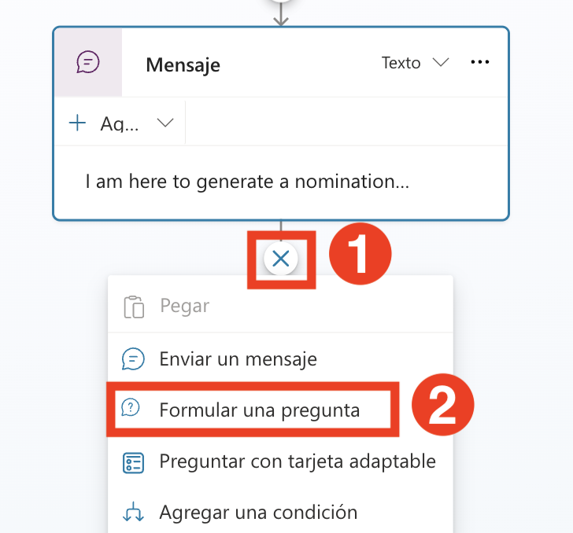
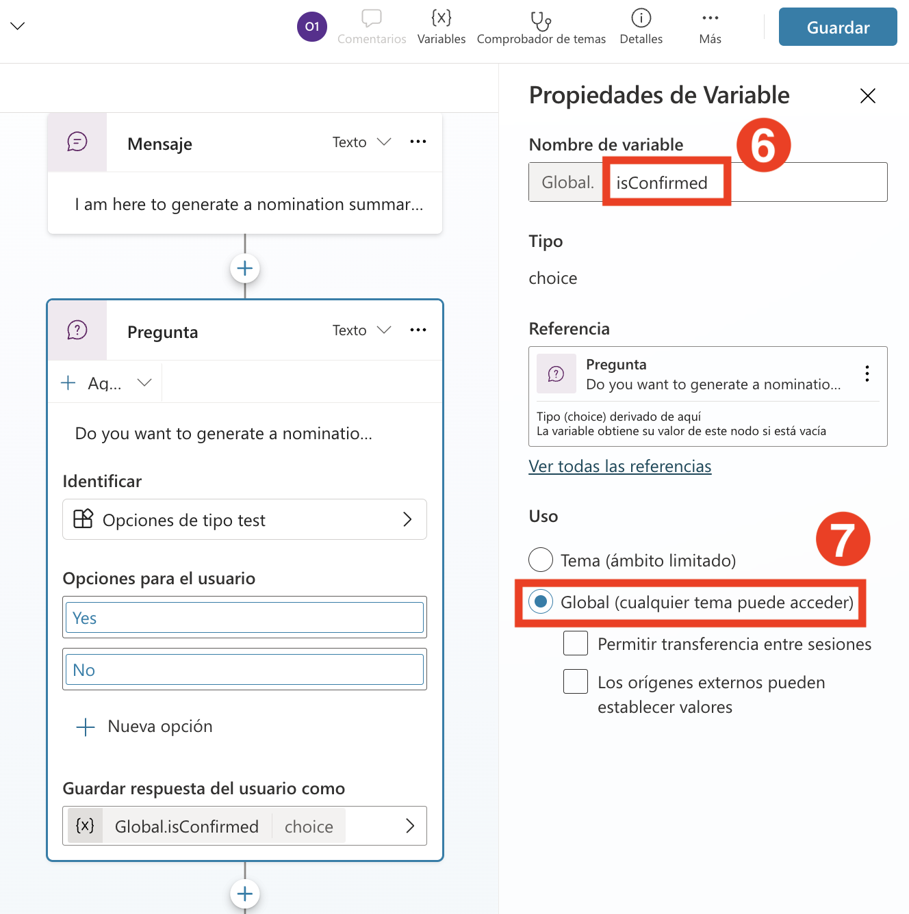
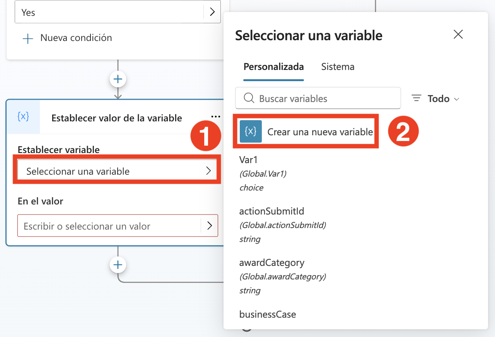
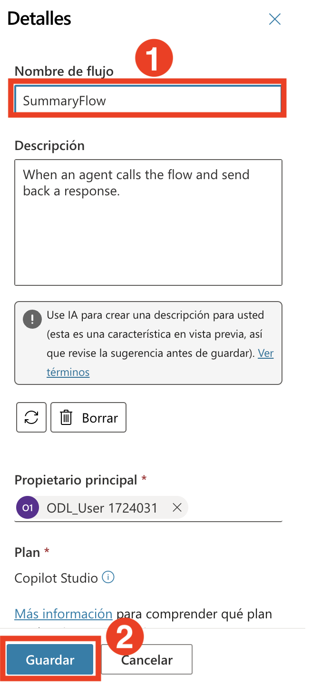

# Ejercicio 4: Habilitar capacidades autónomas en Microsoft Copilot Studio para actividades de RRHH

### Duración estimada: 60 minutos

### Descripción general

El agente preconstruido de Premios y Reconocimientos guía a los usuarios en la creación de nominaciones, generación de resúmenes y revisión y envío de nominaciones.

### Objetivos

- Generar un resumen de nominación.

### Tarea 01: Generar un resumen de nominación

Para generar un resumen de nominación, vamos a agregar un tema en nuestro Nomination Agent.

1. En el **Nomination Agent**, haz clic en **Topics** **(1)**, luego haz clic en el menú desplegable **+ Add a topic** **(2)** y selecciona **From blank** **(3)**.

   

2. Renombra el tema como **Generate Nomination Summary**.

   

3. Bajo el nodo **Trigger**, haz clic en **Add Node** **(1)** y luego elige el nodo **Send a message** **(2)**.

   

   

4. Haz clic en el área bajo el nodo **Message** y reemplaza el mensaje por el siguiente:

   ```
   Estoy aquí para generar un resumen de nominación desde la lista de SharePoint llamada 'Nomination List'.
   ```

      

5. Bajo el nodo **Send a message**, haz clic en **Add Node** **(1)** y luego elige el nodo **Ask a Question** **(2)**.

   

6. En el nodo **Ask a question** ingresa los siguientes detalles y haz clic en **Save** **(7)**.
    - Escribe **Do you want to generate a nomination summary?**  **(1)** en el cuadro de mensaje,
    - Selecciona **+ New Option** **(2)**, agrega **Yes**  **(3)**, nuevamente selecciona **+ New Option** y agrega **No**  **(4)**.
    - Haz clic en **Var1** **(5)** bajo **Save user response as**.
       - Actualiza el nombre de la variable a **isConfirmed** **(6)** y cambia el Usage a **Global(any topic can access)** **(7)**.
    
      

      

9. Bajo el nodo **Condition**, haz clic en **Add Node** **(1)**, haz clic en **Variable managemant** **(2)** y selecciona **Set a variable value** **(3)**.

      

10. En el nodo **Set variable value**, haz clic en **Select a variable** **(1)** bajo **Set variable**, y luego elige **Create a new variable** **(2)**.

    

11. Haga clic en  **newly created variable (1)**, ingrese el nombre de la variable como **summaryvar (2)**, configúrela como **Global (3)**, establezca el valor en **Yes** en el campo **To value** y luego haga clic en **Save (3)**.

    

    

    > **Nota**: Si aparece una ventana emergente diciendo **Save topic with errors?**, haz clic en el botón **Save** para continuar.

12. Haga clic en **Add node (2)** debajo del nodo **Set variable value**, seleccione **Add a tool (3)** y elija **New Agent Flow (4)**.

    

13. En Agent flows bajo la pestaña Designer, haz clic en **Save draft**.

    

14. Haz clic en la pestaña **Overview**(1) y haz clic en **Edit** (2).

    

15. Ingresa **SummaryFlow**(1) en el campo Flow name y haz clic en **Save**(2).

    

16. Haz clic en la pestaña **Designer** (1) y haz clic en el nodo **When an agent calls the flow** (2), bajo **Parameters**. Haz clic en **+ Add an Input**, selecciona **Text** **(3)**, ingresa el **Input** **(4)** en el cuadro de texto. Una vez agregados los parámetros, haz clic en **Collapse** **(5)**.

      

17. Haz clic en **Add action** **(1)**, debajo de **When an agent calls the flow**, busca **List rows present in the table** **(2)** y selecciona **List rows present in the table** **(3)**.

    

18. Selecciona **List rows present in the table** y completa los siguientes datos: 

    - Location: En el menú desplegable selecciona **OneDrive for Business** **(1)**
    - Document Library: En el menú desplegable selecciona **OneDrive** **(2)**.
    - File: Selecciona **/data/NominationList.xlsx** **(3)**.
        - Haz clic en el ícono de **folder** **(1)**, navega a la carpeta **data** **(2)** y selecciona **NominationList.xlsx** **(3)**.

            
          
    - Table: En el menú desplegable selecciona **Table1** **(4)** y haz clic en **Collapse** **(5)**. 

      

19. Haz clic en **Add an action** **(1)** debajo del paso **List rows present in the table**. En la barra de búsqueda, escribe **select** **(2)** y luego elige **Select** **(3)** bajo **Data Operation**.

    

20. Bajo **From**, en el cuadro de texto Title, escribe **/** **(1)** y elige **Insert dynamic content** **(2)**. Luego, selecciona **body/value** **(3)** de la sección **List rows present in the table**.
    
    
    

21. Bajo **Map**, en el cuadro de texto **Enter key**, escribe **Nominee Type** **(1)**. En el cuadro de texto **Enter value**, escribe **/** **(2)** y elige **Insert dynamic content** **(3)**. En la sección de contenido dinámico, haz clic en **See more** **(4)** junto a **List rows present in a table** y luego selecciona **NomineeType** **(5)**.

    

    


22. Ahora, sigue los mismos pasos para agregar los pares clave-valor restantes de la siguiente tabla:

     | **Key**           | **Cómo obtener el valor** |
     |-------------------|--------------------------|
     | Nominee Name      | Selecciona **NomineeName** de **List rows present in a table** |
     | Position          | Selecciona **Position** de **List rows present in a table** |
     | Department        | Selecciona **Department** de **List rows present in a table** |
     | Award Category    | Selecciona **AwardCategory** de **List rows present in a table** |
     | BusinessUseCase   | Selecciona **BusinessCase** de **List rows present in a table** |
   
     Una vez que hayas agregado todos estos mapeos, los parámetros de tu acción **Select** incluirán todos los campos necesarios con los valores de contenido dinámico apropiados.

      

23. Haz clic en **Add an action** **(1)** debajo del paso **Select**. En la barra de búsqueda, escribe **Create a HTML table** **(2)** y luego elige **Create a HTML table** **(3)** bajo **Data Operation**.

    

24. En **Create a HTML table**, en el cuadro de texto **Array to create table from** bajo **From**, escribe **/** **(2)** y elige **Insert dynamic content** **(3)**. En la sección de contenido dinámico, selecciona **Output** **(4)** bajo **Select**.

    

    


25. Haz clic en **Create a HTML table** **(1)**. En la barra de búsqueda, escribe **Send an Email (V2)** **(2)**, y luego selecciona **Send an Email (V2)** **(3)** en **Office 365 Outlook**.

    

26. Haz clic en **Sign in**. Se abrirá una nueva pestaña del navegador. Selecciona la cuenta con la que ya has iniciado sesión.

    

27. Haz clic en **Allow Access**.  

    

28. Completa los siguientes datos para la acción **Send an Email (V2)**.

    | Parámetro | Valor | 
    |----------|----------|
    | To       | Selecciona la dirección de correo electrónico del usuario actual AzureAdUserEmail. **(1)** | 
    | Subject  | Nomination Summary **(2)** | 
    | Body     | Copia y pega lo siguiente  **(3)**|

     ```
     Hola Usuario, 

     Por favor, encuentra aquí el resumen de nominaciones:

     //agrega la salida del trigger create HTML table

     Saludos cordiales
     Nomination Agent
     ```
               
      

29. En la sección **Body** de la acción **Send an Email (V2)**, reemplaza **//agrega la salida del trigger create HTML table** por **/** **(1)**, luego elige **Insert dynamic content** **(2)**. De la lista, selecciona **Output** **(3)** bajo **Create HTML table**. 

    

    


30. Una vez que hayas insertado la **Output** de **Create HTML table** en la sección **Body** de **Send an Email (V2)**, el cuerpo final del correo debe coincidir con el mostrado en la captura de pantalla proporcionada (asegúrate de que el formato, los espacios y la ubicación del contenido dinámico coincidan exactamente). Después de verificar el cuerpo del correo, haz clic en el botón **Publish** para guardar y aplicar los cambios.

    

31. Regresa a la página **Agents** (1) y selecciona el **Nomination Agent** (2).

    

32. Haz clic en la pestaña **Topics**(1) y selecciona **Generate Nomination Summary** (2).

    

33. En la sección **Add a tool**, utiliza la barra de búsqueda para encontrar **SummaryFlow**, y luego selecciónalo para añadirlo al nodo.

    

34. En el nodo **Action**, selecciona la variable **summaryvar** en el nodo de acción para la entrada de Power Automate.

    

    


35. Bajo el nodo **Action**, haz clic en **Add Node** **(1)** y luego elige **Send a message** **(2)**.

    

36. En el nodo **Send a message**, ingrese el siguiente mensaje y seleccione **Save**.

      ```
      Nomination Agent envió correctamente el resumen de la nominación a tu correo electrónico. Por favor, revisa tu correo.

    Saludos cordiales
    Nomination Agent
      ```

       
   
37. En Agent interface, haga clic en Test (1). Si aparece un mensaje con la pregunta “Do you want to submit a Nomination?”, seleccione No (2).

       
    
38. En la sección Test, escriba Generate Nomination summary (1) en el cuadro de chat de prueba y haga clic en el botón Send (1).

       

39. Luego, el Agente preguntará si desea generar un resumen de nominación. Seleccione Yes.

       

      **Nota:** Si aparece el mensaje **Connect to continue for Office 365 Outlook and Excel Online (Business)**, siga los pasos anteriores, actualice el chat y continúe desde el paso 35 al 37; de lo contrario, avance directamente al paso 38.
            o	Si se muestra el mensaje **Connect to continue for Office 365 Outlook and Excel Online (Business)**, haga clic en **Allow**.

       
    
            o	Si aún no es posible establecer la conexión, haga clic en **Open Connection Manager**, lo que redirigirá a **Manage your connections**.

       
    
            o	En la sección **Manage your connections**, haga clic en **Connect** para conectarse a **NominationFlow**.

       
    
            o	En la ventana emergente **Create or pick connections**, una vez que aparezca el mensaje **Connection succeeded**, haga clic en **Submit**.

       
    
            **Nota:** Después de seleccionar **"Yes"** en respuesta a "**Generate Nomination Summary**", si no aparece el mensaje de confirmación “Nomination Agent successfully sent the nomination summary to your email. Please check your email” y, en su lugar, se muestra el "**Nomination Submission Form**", proceda haciendo clic en "Submit" en la parte inferior del formulario.
            Si aparece un mensaje de error después del envío, puede ignorarse sin inconvenientes. Vuelva a escribir "**Generate Nomination Summary**" en el chat para iniciar la acción prevista.
            Debería visualizar entonces el mensaje de confirmación indicando que **Nomination Summary has been sent successfully**.
    
    

40. Abra una nueva pestaña en su navegador Microsoft Edge y navegue a https://outlook.com para acceder a la página principal de **Outlook**. Haga clic en **sign in**.

     
    
41. En la pestaña **Sign into Microsoft Azure**, aparecerá la pantalla de inicio de sesión. Ingrese el **email/username** (1) desde la pestaña **Resources** y luego haga clic en **Next** (2).

     
    
42. A continuación, ingrese la **TAP/password** (1) y haga clic en **Sign in** (2).

     
    
43. Si aparece la ventana emergente **Stay Signed in?**, seleccione **No**.

   
   
   **Nota:** Después de iniciar sesión, si aparece una ventana emergente con el título **Copilot everywhere you need it**, ciérrela para continuar.

   
   
44. Revise el correo electrónico del usuario actual. Deberá ver el mensaje enviado por el agente.

   
   
### Revisión

Podrás gestionar y visualizar nominaciones y reconocimientos, mejorando el compromiso y la motivación de los empleados. Este laboratorio te brinda las herramientas para reconocer y celebrar eficientemente las contribuciones dentro de tu organización, aprovechando las capacidades de Microsoft Copilot Studio.

Tareas completadas con éxito:
- Generar un resumen de nominación.

