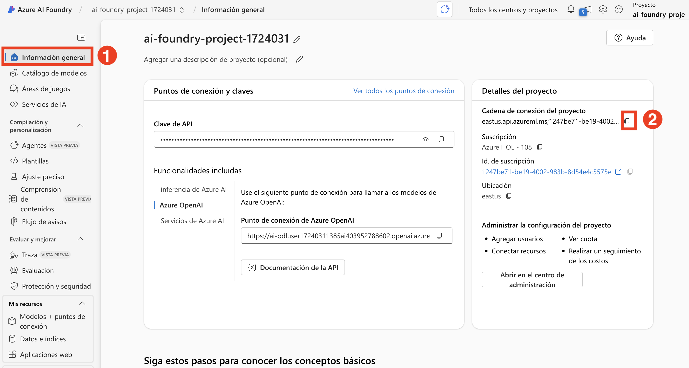
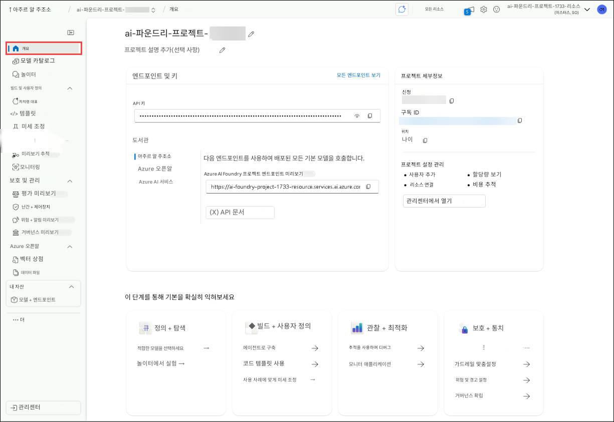

# Exercício 1: Configurar Projeto de IA e realizar Chat Completion a partir do VS Code
## Duração estimada: 120 minutos
## Cenário do laboratório

Neste laboratório prático, você configurará o ambiente necessário para construir Agentes de IA. Você começará configurando um Projeto de IA no Azure AI Foundry, seguido pelo deploy de um Modelo de Linguagem Extensa (LLM) e modelos de embedding. Em seguida, estabelecerá a conexão entre o Visual Studio Code e o Projeto de IA. Por fim, realizará uma chamada simples de chat completion para validar a configuração.

## Objetivos do laboratório

Neste laboratório, você realizará:

- Tarefa 1: Configuração do Projeto de IA no Azure AI Foundry
- Tarefa 2: Deploy de um LLM e modelos de embedding
- Tarefa 3: Instalar dependências, criar um ambiente virtual e um arquivo de variáveis de ambiente

## Tarefa 1: Configurar o Projeto de IA no Azure AI Foundry

Nesta tarefa, você irá criar e configurar um Projeto de IA dentro do Azure AI Foundry. Isso envolve configurar os recursos necessários, definir os parâmetros do projeto e garantir que o ambiente esteja pronto para o deploy de modelos de IA. Ao final desta tarefa, você terá um Projeto de IA totalmente inicializado, servindo como base para o desenvolvimento e experimentação futuros.

1. Na página do portal do Azure, na caixa de pesquisa de recursos na parte superior do portal, insira Azure AI Foundry (1) e selecione Azure AI Foundry (2) em Serviços.

    

3. No painel de navegação esquerdo do AI Foundry, selecione **AI Hubs (1)**. Na página AI Hubs, clique em **Criar (2)** e selecione **Hub (3)** no menu suspenso.

    

4. No painel **Criar um hub de IA do Azure**, insira os seguintes detalhes:

    *   Assinatura: **Deixe a assinatura padrão (1)**
    *   Grupo de recursos: **AgenticAI (2)**
    *   Região: **Region (3)**
    *   Nome: **ai-foundry-hub-{suffix} (4)**
    *   Conectar serviços de IA, incluindo OpenAI: Clique em **Criar Novo (7)**.
    *   Conectar serviços de IA, incluindo OpenAI: Forneça um nome **my-ai-service-{suffix}**.
    *   Clique em **Salvar**, Clique na guia **Revisar + Criar (8)**, .

      

5. Seguido de **Criar**.

   

6. Aguarde a conclusão da implantação e clique em **Ir para o recurso**.

   

8. Role para baixo e clique em **+ Novo projeto** na Visão geral do Hub.

   

    
9. Forneça o nome do projeto como **ai-foundry-project-{suffix}** e clique em **Criar (2)**.

    

10. Depois que o projeto for criado, role para baixo e copie a **Project connection string** e cole-a no Bloco de Notas ou em um local seguro, pois ela será necessária para as próximas tarefas.

      

      

      


## Tarefa 2: Implantando um LLM e modelos de embedding

Nesta tarefa, você implantará um modelo de linguagem grande (LLM) e um modelo de embedding dentro do seu projeto do Azure AI Foundry. Esses modelos serão usados em aplicações orientadas por IA e em buscas vetoriais nos próximos laboratórios.

1.  No seu **projeto do AI Foundry**, vá até a seção **Meus ativos (1)** e selecione **Modelos + endpoints (2)**. Clique em **Implantar modelo (3)** e escolha **Implantar modelo base (4)** para continuar.

    

2.  Na janela **Selecionar um modelo**, pesquise por **gpt-4o (1)**, selecione **gpt-4o (2)** e clique em **Confirmar (3)**.

    

3.  Na janela **Implantar modelo gpt-4o (1)**, selecione o padrão global(2), selecione **Personalizar (3)**.

    *   Altere a **Versão do modelo para 2024-08-06 (4)**
    *   Altere o limite de **Tokens por Minuto para 200K (5)**
    *   Clique em **Implantar (6)**

        

        

6.  Na página **Azure AI services | Azure OpenAI**, clique em **+ Criar** para criar um recurso Azure OpenAI.

    

    

7.  Na página **Criar Azure OpenAI**, forneça as configurações abaixo e clique em **Próximo (6)**:

    | Configuração      | Valor                                                                              |
    | ----------------- | ---------------------------------------------------------------------------------- |
    | Assinatura        | mantenha a subscrição padrão **(1)**                                               |
    | Grupo de recursos | **AgenticAI (2)**                                                                  |
    | Região            | **East US (3)**                                                                    |
    | Nome              | **my-openai-service{suffix}(4)** |
    | Plano de preços   | **Standard S0 (5)**                                                                |

    

    

8.  Clique em **Próximo** duas vezes.

9.  Na página **Revisar + criar**, clique em **Criar**.

    

10. Aguarde até que a implantação seja concluída e clique em **Ir para o recurso**.

    

12. Na página do recurso **my-openai-service{suffix}**, selecione **Ir para o portal do Azure AI Foundry**.

    

13. No seu projeto AI Foundry, vá até a seção **Recursos compartilhados**, selecione **Implantações (1)**. Clique em **Implantar modelo (2)** e escolha **Implantar modelo base (3)**.

    

    > **Nota**: O assistente de importação e vetorização do Azure AI Search, que será usado nos próximos laboratórios, ainda não oferece suporte a modelos de embedding de texto dentro do seu projeto AI Foundry. Por isso, é necessário criar um serviço Azure OpenAI e implantar um modelo de embedding lá. Usaremos esse modelo posteriormente ao criar nosso índice vetorial.

14. Na janela **Selecionar um modelo**, pesquise por **text-embedding-3-large (1)**, selecione **text-embedding-3-large (2)** e clique em **Confirmar (3)**.

    

15. Na janela **Implantar modelo text-embedding-3-large**:

    * Tipo de implantação: selecione **Padrão (1)**

        

    * Limite de Tokens por Minuto: **120K (1)**
    * Clique em **Implantar (2)**

      
      
      

17. Clique em **Implantações (1)**, onde você verá o modelo **text-embedding-3-large (2)** implantado.
    

## Tarefa 3: Instalar dependências, criar um ambiente virtual e criar um arquivo de variáveis de ambiente

Nesta tarefa, você instalará as dependências necessárias, configurará um ambiente virtual e criará um arquivo de variáveis de ambiente. Isso garante um ambiente de desenvolvimento controlado e seguro para gerenciar configurações do projeto de IA.

1.  Na sua **VM do laboratório**, abra o **Visual Studio Code**.

2.  Clique em **Arquivo (1)**, depois em **Abrir Pasta**.

    

3.  Navegue até `C:\LabFiles\Day-2-Azure-AI-Agents` **(1)**, selecione a pasta **azure-ai-agents-labs (2)** e clique em **Selecionar Pasta (3)**.

    

4.  Clique em **Sim, confio nos autores**.

    

5.  Clique nos **três pontos (...) (1)**, depois em **Terminal (1)** e em **Novo Terminal (3)**.

    

6.  Certifique-se de estar no diretório do projeto **azure-ai-agents-labs**. Execute os comandos PowerShell abaixo para criar e ativar o ambiente virtual:

    ```powershell
    python -m venv venv
    venv/Scripts/activate
    ```

    

7.  Execute o comando abaixo para instalar os pacotes necessários:

    ```powershell
    pip install -r requirements.txt
    ```

    

8.  Execute o comando abaixo para instalar ou atualizar o pip para a versão mais recente:

    ```powershell
    python.exe -m pip install --upgrade pip
    ```

    

9.  Execute o comando abaixo para fazer login na sua conta Azure:

    ```powershell
    az login
    ```

10. Selecione o usuário AzureAdUserEmail para autorizar.

    

11. Após a autorização, volte ao Visual Studio Code.

    

12. Abra o arquivo **Sample.env** e preencha as variáveis de ambiente necessárias.

    

    *   Recupere os valores do seu **projeto Azure AI Foundry**.
    *   Vá até a página **Visão Geral (1)** do **ai-foundry-project-{suffix}** e copie a **Project connection string (2)** para um bloco de notas.

    

    *   Acesse o modelo **gpt-4o**, copie da lateral direita o **Endpoint** (URI de destino) e a **Chave (Key)** e cole no bloco de notas.

    

    Navegue até o modelo **gpt-4o(2)** em **Modelos + endpoints(1)** em Meus ativos, copie em **Endpoint** no painel direito, copie e cole o **URI de destino (1)** e a **Chave (2)** em um bloco de notas

    

13. No arquivo **Sample.env**, preencha:

    *   `AIPROJECT_CONNECTION_STRING`: o valor da **Project connection string**
    *   `CHAT_MODEL_ENDPOINT`: o **Target URI** do modelo **gpt-4o**
    *   `CHAT_MODEL_API_KEY`: a **Key** do modelo **gpt-4o**
    *   `CHAT_MODEL`: **gpt-4o**

    

14. Salve o arquivo **Sample.env**.

15. Execute o comando abaixo para criar o arquivo **.env**:

    ```powershell
    cp sample.env .env
    ```

    

16. Depois, abra o arquivo **Lab 1 - Project Setup.ipynb**. Esse notebook orienta a configuração de um projeto de IA no Azure AI Foundry, a implantação dos modelos LLM e de embedding, e a conexão com o VS Code. Inclui também uma chamada simples à API de conclusão de chat para validar a configuração. Executar este notebook garante que seu ambiente está corretamente configurado para desenvolver aplicações com inteligência artificial.

    

17. Selecione a opção **Selecionar kernel (1)** no canto superior direito e clique em **Instalar/ativar extensões selecionadas (python+jupyter) (2)**.

    

18. Escolha **Ambientes Python** para garantir que o Jupyter Notebook use o interpretador Python correto e com as corretas dependências instaladas.

    

19. Selecione **venv (Python)** na lista, pois é provavelmente o necessário para compatibilidade com o SDK do Azure AI Foundry.

    

20. Execute a primeira célula para importar as bibliotecas Python necessárias para trabalhar com os serviços do Azure AI.

    

21. Execute a próxima célula para recuperar a string de conexão do projeto e o nome do modelo a partir das variáveis de ambiente. Esses valores são necessários para interagir com o Modelo de Linguagem de Grande Escala (LLM) de forma segura, sem codificar informações sensíveis diretamente no código.

    

22. Execute a célula seguinte para se conectar ao seu projeto Azure AI Foundry usando a string de conexão. Isso estabelece uma conexão segura com o `AIProjectClient`, permitindo interações com os recursos do seu projeto.

    

23. Execute a próxima célula para interagir com o modelo GPT-4o. O código inicializa um cliente de chat, envia uma solicitação para contar uma piada sobre um ursinho de pelúcia, e exibe a resposta.

    

## Revisão

Neste laboratório, você realizou as seguintes atividades:

*   Configurou um projeto de IA no Azure AI Foundry.
*   Implantou um LLM e modelos de embedding.
*   Estabeleceu conexão entre o VS Code e o projeto de IA.
*   Executou uma chamada simples de Chat Completion.

### Você concluiu com sucesso o laboratório. Clique em **Próximo** para continuar com o próximo.

