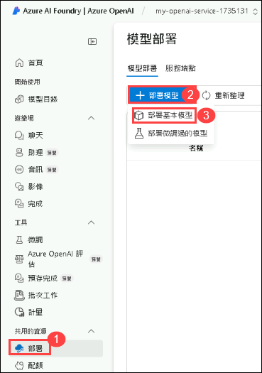
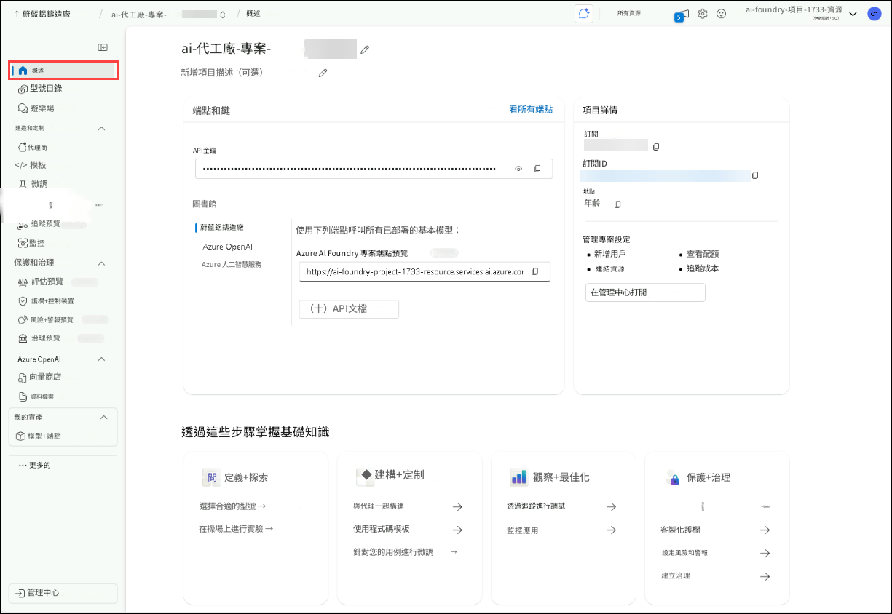

# 練習 1：設定 AI 專案並從 VS Code 執行聊天補全
## 預估時長：120 分鐘
## 實驗情境 

在這個實驗課程中，你將建立開發 AI 代理所需的環境。你會從 Azure AI Foundry 中設定一個 AI 專案開始，接著部署大型語言模型（LLM）與嵌入模型。之後，你將從 Visual Studio Code 建立與 AI 專案的連線。最後，你會執行一次簡單的聊天補全呼叫，以驗證整體設定是否成功。

## 實驗目標

在本次實驗中，你將完成以下任務：

- 任務 1：在 Azure AI Foundry 中設定 AI 專案
- 任務 2：部署 LLM 與嵌入模型
- 任務 3：安裝相依套件、建立虛擬環境，並建立環境變數檔案

### 任務 1：在 Azure AI Foundry 中設定 AI 專案

在這個任務中，你將在 Azure AI Foundry 中建立並設定一個 AI 專案。這包括建立必要的資源、定義專案參數，並確保環境已準備好可用於部署 AI 模型。完成此任務後，你將擁有一個完整初始化的 AI 專案，作為後續開發與實驗的基礎。

1. 在 Azure 入口網站頁面頂部的「搜尋資源」框中，輸入 Azure AI Foundry (1)，然後在「服務」下選擇 Azure AI Foundry (2)。

   


2. 在 AI Foundry 的左側導航窗格中，選擇 AI Hubs (1)。在 AI Hubs 頁面上，點擊 創建 (2)，並從下拉選單中選擇 Hub (3)。

    

3. 在 創建 Azure AI 中心 窗格中輸入以下詳細信息：

   - 訂用帳戶 : **保留預設訂閱**
   - 資源群組 :  **AgenticAI** **(1)**
   - 區域 : **Region** **(2)**
   - 名稱 : **ai-foundry-hub-{suffix}** **(3)** 
      
      

   - 連線 AI 服務，包括 OpenAI : 點擊 **新建** **(1)**。
   - 建立新的Azure AI 服務 : 填上 **my-ai-service-{suffix}** **(2)**。
   - 點擊 **儲存** **(3)**，然後點擊 **下一步：儲存體** **(4)**。

      
   
4. 點擊 **檢閱 + 建立** 標籤，然後點擊 **建立**。

   

   
  
5. 等待部署完成，然後點擊 **前往資源**。

   

6. 在概覽窗格中，點擊 **啟動 Azure AI Foundry** . 這將導航至 Azure AI Foundry 入口網站。

   

7. 向下滾動並在中心概覽中點擊 **+ 新建專案**。

   

8. 提供專案名稱為 **ai-foundry-project-{suffix}** **(1)**，然後點擊 **建立** **(2)**.

   

9. 專案創建完成後，向下滾動並複製 **專案連線字串**，然後將其貼到記事本或安全位置，因為後續任務需要使用。

   
   

### 任務 2：部署 LLM 與嵌入模型

在此任務中，你將在你的 AI Foundry project 中部署一個大型語言模型（LLM）與一個嵌入模型。這些模型將用於後續實驗課程中的 AI 應用程式與向量式搜尋功能。

1. 在你的 AI Foundry 項目 **ai-foundry-project-{suffix}** 中，前往 **我的資產** **(1)** 區段，然後選擇 **模型 + 端點** **(2)**。點選 **部署模型** **(3)**，接著選擇 **部署基本模型** **(4)** 以繼續操作。

   

2. 在 **選取模型** 視窗中，搜尋 **gpt-4o** **(1)**，選取 **gpt-4o** **(2)**，然後點選 **確認** **(3)**。

   

3. 在 **部署 gpt-4o** 視窗中，於 **部署詳細資料** 區段中，選擇 **自訂**。

   

   - 將 **模型版本** 更改為 **2024-08-06** **(1)**。
   - 點選 **提交變更** **(2)**。

      

4. 點選 **模型 + 端點** **(1)**，你將會看到已部署的 **gpt-4o** **(2)** 模型。

   

5. 返回 **Azure Portal**，搜尋 **Open AI** **(1)**，然後選取 **Azure Open AI** **(2)** 資源。

   

6. 在 **AI Foundry | Azure OpenAI** 頁面中，選擇 **+ 建立** 以建立 Azure OpenAI 資源。

   

7. 在 **建立 Azure OpenAI** 頁面中，請輸入以下設定，然後點選 **下一頁** **(6)**。

   | 設定 | 值 | 
   | --- | --- |
   | 訂用帳戶 | **保留預設訂閱** **(1)** |
   | 資源群組 | **AgenticAI (2)** |
   | 區域 | **East US (3)** |
   | 名稱 | **my-openai-service-{suffix}** **(4)** |
   | 定價層 | **Standard S0 (5)** |

    

8. 連續點選兩次 **下一頁**。

9. 在 **檢閱 + 提交** 頁面中，點選 **建立**。
 
    

10. 等待部署成功後，選取 **前往資源**。

    

11. 請搜尋 **my-openai-service-{suffix} (1)** ，然後選取 **my-openai-service-{suffix}(2)**。

    

12. 在 **my-openai-service-{suffix}** 資源頁面中，請選取 **前往 Azure AI Foundry 門戶**。

    

13. 在你的 AI Foundry 專案中，於 **共用的資源** 區段，然後選取 **部署** **(1)**。接著點選 **部署模型** **(2)**，並選擇 **部署基本模型** **(3)** 以繼續操作。

    

    >**Note**：在 Azure AI Search 中的匯入與向量化精靈（import and vectorize wizard），將會在後續的實驗中使用，但目前尚未支援你 AI Foundry 專案中的文字嵌入模型。因此，我們需要建立一個 Azure OpenAI 服務，並在其中部署一個文字嵌入模型。我們稍後在建立向量索引時，將會使用這個文字嵌入模型。

14. 在 **選取模型** 視窗中，請搜尋 **text-embedding-3-large** **(1)**，然後選取 **text-embedding-3-large** **(2)** ，接著點選 **確認** **(3)**。

    

15. 在 **部署 text-embedding-3-large** 視窗中，選取以下設定：：

   - 部署類型：請選擇 **全域標準** **(1)**。
   - 每分鐘權杖數速率限制：設定為**120K** **(2)**。
   - 然後點選 **部署** **(3)** 以部署模型。

     

1. 點選 **部署** **(1)**，你將會看到已部署的 **text-embedding-3-large** **(2)** 模型。

   


### 任務 3：安裝相依套件、建立虛擬環境，以及建立環境變數檔案

在這個任務中，你將安裝所需的相依套件、設定虛擬環境，並建立一個環境變數檔案。這樣可以確保一個受控的開發環境，並安全地管理你的 AI 專案的設定資訊。

1. 在你的 **Lab VM** 上啟動 **Visual Studio Code**。

2. 點選 **File** **(1)**，然後選擇 **Open Folder**.

    

3. 導覽至 `C:\實驗室文件\` **(1)**，選取 **azure-ai-agents-labs** **(2)** 資料夾，然後點選 **選擇資料夾** **(3)**。

     

4. 點選 **Yes, I trust the authors**。

   

5. 點選 **...** **(1)**，選取 **Terminal** **(2)**，然後點選 **New Terminal** **(3)**。

   

6. 請確認你目前位於 **azure-ai-agents-labs** 專案目錄中。執行以下 PowerShell 指令來建立並啟用你的虛擬環境：

   ```powershell
   python -m venv venv
   venv/Scripts/activate
   ```

   

7. 執行以下 PowerShell 指令。這將安裝所有所需的套件：

   ```powershell
   pip install -r requirements.txt
   ```
   

8. 執行以下 PowerShell 指令，以安裝或升級 pip 至最新版本：

   ```powershell
   python.exe -m pip install --upgrade pip
   ```

   

9. 執行以下指令以登入你的 Azure 帳戶：

   ```
   az login
   ```

10. 選取 AzureAdUserEmail 使用者帳戶以進行授權。

    

11. 授權完成後，請返回 Visual Studio Code。

   

12. 開啟 **Sample.env** 檔案，並填入必要的環境變數。

   

   - 從你的 **Azure AI Foundry 專案** 中擷取所需的值。
   - 前往 **ai-foundry-project-{suffix}** 的 **概述** **(1)** 頁面，然後將 **專案連接字串** **(2)** 複製並貼到記事本中。

     

   - 前往 **gpt-4o** 模型，從右側窗格中複製 **端點** 下的內容，並將  **目標 URI** **(1)** 和 **鑰匙** **(2)** 複製並貼到記事本中。

     

13. 在 **Sample.env** 檔案中：

   - `AIPROJECT_CONNECTION_STRING`：填入你在前一步驟中複製的 **專案連接字串** 值。
   - `CHAT_MODEL_ENDPOINT`：填入你在前一步驟中複製的 **gpt-4o** 模型的 **目標 URI**值。
   - `CHAT_MODEL_API_KEY`：填入你在前一步驟中複製的  **gpt-4o** 模型的 **鑰匙** 值。
   - `CHAT_MODEL`: **gpt-4o**

     

14. 儲存對 **Sample.env** 檔案的變更。

15. 執行以下 PowerShell 指令。這將建立你的 **.env** 檔案：

   ```powershell
   cp sample.env .env
   ```

      

16. 稍後開啟 **Lab 1 - Project Setup.ipynb** 檔案。 The **Lab 1 - Project Setup.ipynb** 筆記本將引導你完成在 Azure AI Foundry 中建立 AI 專案的設定流程，包括部署 LLM 和嵌入模型，以及設定 VS Code 的連線功能。它也包含一個簡單的聊天補全 API 呼叫，用來驗證設定是否正確。執行這個筆記本可以確保你的環境已正確配置，適合開發 AI 驅動的應用程式。

   

17. 點選右上角的 **Select kernel (1)** 設定，然後選擇 **Install/enable selected extensions (python+jupyter) (2)**。

   

18. 選取 **Python Environments** ，以確保 Jupyter Notebook 使用正確的 Python 直譯器，並已安裝所需的相依套件。

   

19. 從清單中選取 **venv (Python)** ，因為這個版本很可能是與 Azure AI Foundry SDK 及其他相依套件相容所需的版本。

   

20. 執行第一個儲存格，以匯入使用 Azure AI 服務所需的 Python 函式庫。 

   

21. 執行以下儲存格，以從環境變數中擷取專案連線字串與模型名稱。這些值是與大型語言模型（LLM）互動所需的，能夠在不硬編碼敏感資訊的情況下，安全地進行操作。

   

22. 執行以下儲存格，使用連線字串連接到你的 Azure AI Foundry 專案。這將透過 AIProjectClient 建立一個安全的連線，使你能夠與專案資源互動。

   

23. 執行以下儲存格，使用你的 Azure AI Foundry 專案與 GPT-4o 模型互動。這段程式碼會初始化一個聊天用戶端，發送一個請求，要求講一個關於泰迪熊的笑話，並印出回應。最後，查看聊天模型所提供的輸出結果。

   

## 回顧

在本次實驗中，你已完成以下事項：
- 在 Azure AI Foundry 中建立 AI 專案。
- 部署大型語言模型（LLM）與嵌入模型。
- 建立從 VS Code 到 AI 專案的連線。
- 執行了一次簡單的 Chat Completion 呼叫。

### 恭喜！您已成功完成本次實驗課程！
### 請點選導覽連結，以繼續進行下一個實驗課程。


