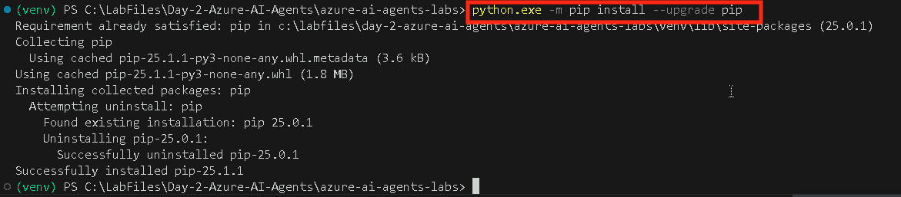
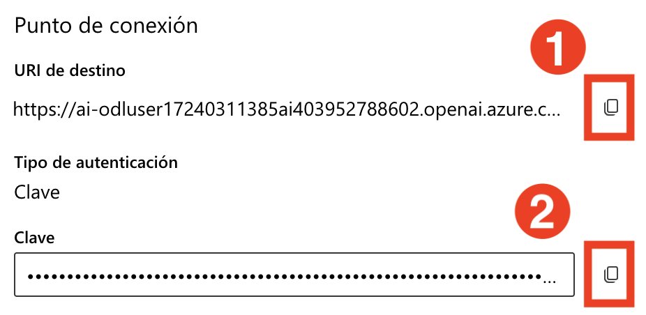

# 演習 1: AI プロジェクトのセットアップと VS Code からのチャット完了の実行
## 推定所要時間: 120 分
## ラボシナリオ

このハンズオンラボでは、AI エージェントを構築するための必要な環境をセットアップします。まず、Azure AI Foundry で AI プロジェクトを構成し、次に Large Language Model (LLM) と埋め込みモデルをデプロイします。次に、Visual Studio Code から AI プロジェクトへの接続を確立します。最後に、セットアップを検証するためにシンプルなチャット完了コールを実行します。

## ラボの目標

このラボでは、次のことを行います:

- タスク 1: Azure AI Foundry で AI プロジェクトをセットアップする
- タスク 2: LLM と埋め込みモデルをデプロイする
- タスク 3: 依存関係をインストールし、仮想環境を作成し、環境変数ファイルを作成する

## タスク 1: Azure AI Foundry で AI プロジェクトをセットアップする

このタスクでは、Azure AI Foundry 内で AI プロジェクトを作成および構成します。これには、必要なリソースのセットアップ、プロジェクトパラメータの定義、および AI モデルをデプロイするための環境の準備が含まれます。このタスクの終わりまでに、さらなる開発と実験の基盤となる完全に初期化された AI プロジェクトを持つことができます。

1. Azure Portal ページで、ポータルの上部にある [リソースの検索] ボックスに「Azure AI Foundry (1)」と入力し、[サービス] の下にある [Azure AI Foundry (2)] を選択します。

   


2. AI Foundryの左側のナビゲーションペインで、**AI Hubs (1)**を選択します。AI Hubsページで、**Create (2)**をクリックし、ドロップダウンから**Hub (3)**を選択します。

    

3. **Azure AI ハブの作成** ペインで、次の詳細を入力します。
   - サブスクリプション : **デフォルトのサブスクリプションのままにする**
   - リソースグループ :  **AgenticAI** (1)
   - 地域 : **Region** (2)
   - 名前 : **ai-foundry-hub-{suffix}** (3) 
      
      

   - OpenAIを含むAIサービスに接続 : **新規作成 (1)** をクリックします。
   - OpenAIを含むAIサービスに接続 : 名前を入力してください **my-ai-service-Deployment ID(2)**.  
   - **保存 (3)** をクリックします。, **次へ:ストレージ (4)**

      
   
4. **[確認 + 作成]** タブをクリックし、続いて **[作成]** をクリックします。

   

   
  
5. デプロイが完了するまで待ってから、[**リソースに移動**] をクリックします。

   

6. 「概要」ペインで、「**Azure AI Foundry を起動**」をクリックします。Azure AI Foundry ポータルに移動します。

   

7. 下にスクロールして、ハブの概要で **+ 新しいプロジェクト** をクリックします。

   

8. プロジェクト名を次のように入力します **ai-foundry-project-{suffix},** 次に**作成 (2)**をクリックします。

   

9. プロジェクトが作成されたら、下にスクロールして **プロジェクト接続文字列** をコピーします。次に、メモ帳または安全な場所に貼り付けます。今後のタスクで必要になります。

   

## タスク 2: LLM と埋め込みモデルのデプロイ

このタスクでは、Azure AI Foundry プロジェクト内に大規模言語モデル (LLM) と埋め込みモデルをデプロイします。これらのモデルは、今後のラボで AI 駆動のアプリケーションおよびベクトルベースの検索機能に使用されます。

1. **AI Foundry プロジェクト**で、**アセット (1)** セクションに移動し、**モデルとエンドポイント (2)** を選択します。**モデルのデプロイ (3)** をクリックし、**ベースモデルのデプロイ (4)** を選択して続行します。

   

2. **モデルの選択** ウィンドウで、**gpt-4o (1)** を検索し、**gpt-4o (2)** を選択して **確認 (3)** を選択します。

   

3. **モデル gpt-4o のデプロイ** ウィンドウで、**カスタマイズ** を選択します。

   

   - **モデルバージョンを 2024-08-06 (1)** に変更します。
   - トークン毎分レート制限を **200K (2)** に変更します。
   - **デプロイ (3)** をクリックします。

        

4. **Model + Endpoints (1)** をクリックすると、デプロイされた **gpt-4o (2)** モデルが表示されます。

   

5. **Azure ポータル** に戻り、**Open AI (1)** を検索して **Azure Open AI (2)** リソースを選択します。

   

6. **Azure AI サービス | Azure OpenAI** ページで、**+ 作成** を選択して Azure OpenAI リソースを作成します。

   

7. **Azure OpenAI の作成** ページで、以下の設定を提供し、**次へ (6)** をクリックします。

   | 設定 | 値 | 
   | --- | --- |
   | サブスクリプション | デフォルトのサブスクリプションをそのまま使用 **(1)** |
   | リソースグループ | **AgenticAI (2)** |
   | リージョン | **East US (3)** |
   | 名前 | **my-openai-service{suffix} (4)** |
   | 価格帯 | **Standard S0 (5)** |

   

8. **次へ** を 2 回クリックします。

9. **レビュー + 提出** ページで、**作成** をクリックします。
 
   

10. デプロイが成功するまで待ち、**リソースに移動** を選択します。

   


12. **my-openai-service{suffix}** リソースページで、**Azure AI Foundry ポータルに移動** を選択します。

   

13. AI Foundry プロジェクトで、**共有リソース** セクションに移動し、**デプロイメント (1)** を選択します。**モデルのデプロイ (2)** をクリックし、**ベースモデルのデプロイ (3)** を選択して続行します。

   

   >**注:** 今後のラボで使用する Azure AI Search のインポートおよびベクトル化ウィザードは、まだ AI Foundry プロジェクト内のテキスト埋め込みモデルをサポートしていません。このため、Azure OpenAI サービスを作成し、そこにテキスト埋め込みモデルをデプロイする必要があります。このテキスト埋め込みモデルは、後でベクトルインデックスを作成する際に使用します。

14. **モデルの選択** ウィンドウで、**text-embedding-3-large (1)** を検索し、**text-embedding-3-large (2)** を選択して **確認 (3)** を選択します。

   

15. **モデル text-embedding-3-large のデプロイ** ウィンドウで: 

   - デプロイメントタイプ: **Standard (1)** を選択します。
   - トークン毎分レート制限: **120K (2)** を設定します。
   - **デプロイ (3)** を選択してモデルをデプロイします。

     

16. **デプロイメント (1)** をクリックすると、デプロイされた **text-embedding-3-large (2)** モデルが表示されます。

   
   

## タスク 3: 依存関係のインストール、仮想環境の作成、および環境変数ファイルの作成

このタスクでは、必要な依存関係をインストールし、仮想環境をセットアップし、環境変数ファイルを作成します。これにより、制御された開発環境が確保され、AI プロジェクトの構成設定が安全に管理されます。

1. **Lab VM** で **Visual Studio Code** を起動します。

2. **ファイル (1)** をクリックし、次に **フォルダーを開く** をクリックします。

    

3. `C:\LabFiles\Day-2-Azure-AI-Agents` **(1)** に移動し、**azure-ai-agents-labs (2)** フォルダーを選択して **フォルダーを選択 (3)** をクリックします。

    

4. **著者を信頼します** をクリックします。

   

5. **省略記号(...) (1)** をクリックし、次に **ターミナル (1)** をクリックし、次に **新しいターミナル (3)** をクリックします。

   

6. **azure-ai-agents-labs** プロジェクトディレクトリにいることを確認します。以下の PowerShell コマンドを実行して仮想環境を作成およびアクティブ化します。

   ```powershell
   python -m venv venv
   venv/Scripts/activate
   ```

   

7. 以下の PowerShell コマンドを実行します。これにより、必要なすべてのパッケージがインストールされます。

   ```powershell
   pip install -r requirements.txt
   ```
   

8. 以下の PowerShell コマンドを実行して、pip を最新バージョンにインストールまたはアップグレードします。

   ```powershell
   python.exe -m pip install --upgrade pip
   ```

   

9. 以下のコマンドを実行して、Azure アカウントにログインします。

   ```
   az login
   ```

10. Work or School account ユーザーアカウントを選択して承認します。

   

11. 承認が完了したら、Visual Studio Code に戻ります。

   

12. **Sample.env** ファイルを開き、必要な環境変数を提供します。 

   

   - Azure AI Foundry ポータルに移動します。[マイ アセット] の [**モデル + エンドポイント (1)**] セクションから [**gpt-4o (2)**] モデルをクリックします。右側のペインの [**エンドポイント**] の下をコピーします。[**ターゲット URI (1)**] と [**キー (2)**] をコピーしてメモ帳に貼り付けます。
     
     

13. **Sample.env** ファイルで、

   - `AIPROJECT_CONNECTION_STRING`: 前のステップでコピーした **プロジェクト接続文字列** の値を提供します。
   - `CHAT_MODEL_ENDPOINT`: 前のステップでコピーした **gpt-4o** モデルの **ターゲット URI** を提供します。
   - `CHAT_MODEL_API_KEY`: 前のステップでコピーした **gpt-4o** モデルの **キー** の値を提供します。
   - `CHAT_MODEL`: **gpt-4o**

     

14. **Sample.env** ファイルに変更を保存します。

15. 以下の PowerShell コマンドを実行します。これにより、**.env** ファイルが作成されます。

   ```powershell
   cp sample.env .env
   ```

      

16. 次に **Lab 1 - Project Setup.ipynb** ファイルを開きます。**Lab 1 - Project Setup.ipynb** ノートブックは、Azure AI Foundry で AI プロジェクトをセットアップし、LLM と埋め込みモデルをデプロイし、VS Code の接続を構成する手順をガイドします。また、セットアップを検証するためのシンプルなチャット完了 API コールも含まれています。このノートブックを実行することで、AI 駆動のアプリケーションを開発するための環境が正しく構成されていることを確認できます。 

   

17. 右上隅にある **カーネルを選択 (1)** 設定を選択し、**選択した拡張機能をインストール/有効化 (python+jupyter) (2)** を選択します。

   

18. **Python 環境** を選択して、Jupyter Notebook が必要な依存関係がインストールされた正しい Python インタープリターで実行されるようにします。 

   

19. リストから **venv (Python 3.x.x)** を選択します。このバージョンは、Azure AI Foundry SDK およびその他の依存関係との互換性のために必要である可能性が高いためです。

   

   > **注記：** **venv (Python 3.x.x)** がリストに表示されない場合は、Visual Studio Code を閉じて開きます。
   

20. 最初のセルを実行して、Azure AI サービスで作業するために必要な Python ライブラリをインポートします。   

   

21. 以下のセルを実行して、環境変数からプロジェクト接続文字列とモデル名を取得します。これらの値は、機密情報をハードコーディングすることなく、大規模言語モデル (LLM) と安全に対話するために必要です。

   

22. 以下のセルを実行して、接続文字列を使用して Azure AI Foundry プロジェクトに接続します。これにより、AIProjectClient との安全な接続が確立され、プロジェクトリソースとの対話が可能になります。

   

23. 以下のセルを実行して、Azure AI Foundry プロジェクトを使用して GPT-4o モデルと対話します。このコードはチャットクライアントを初期化し、テディベアに関するジョークのリクエストを送信し、応答を印刷します。最後に、チャットモデルから提供された出力を確認します。

   

## レビュー

このラボでは、次のことを達成しました:
- Azure AI Foundry で AI プロジェクトをセットアップしました。
- LLM と埋め込みモデルをデプロイしました。
- VS Code から AI プロジェクトへの接続を確立しました。
- シンプルなチャット完了コールを実行しました。

### ラボを正常に終了しました。**次へ** をクリックして次のラボに進みます。

