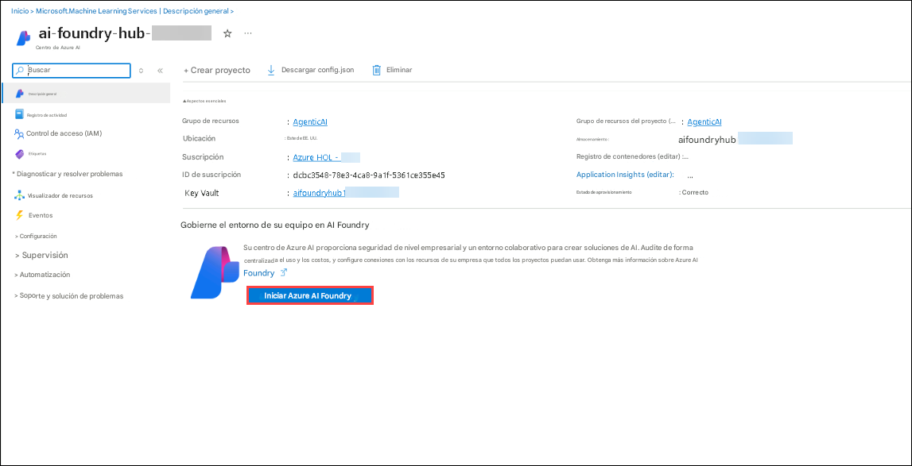
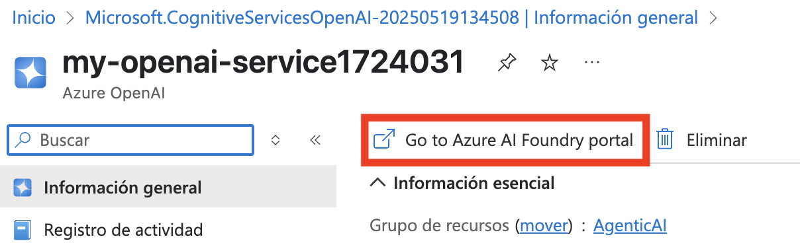
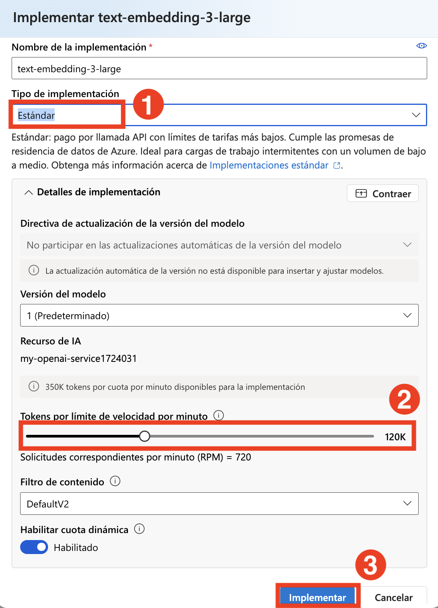
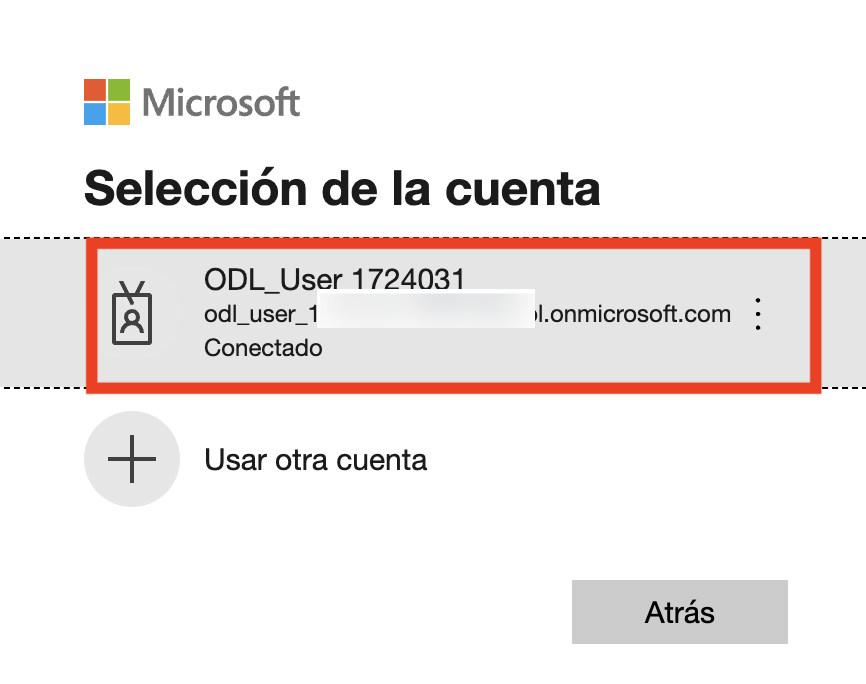

# 실습 1: AI 프로젝트 설정 및 VS Code에서 대화 완성(Chat Completion) 수행

### 예상 소요 시간: 120분

## 시나리오

이 실습에서는 AI 에이전트를 구축하기 위한 필수 환경을 설정합니다. 먼저 Azure AI Foundry에서 AI 프로젝트를 구성한 후, 대형 언어 모델(LLM)과 임베딩 모델을 배포합니다.그다음 Visual Studio Code에서 AI 프로젝트로의 연결을 설정하고, 마지막으로 간단한 대화 완성(Chat Completion)을 호출하여 설정이 제대로 완료되었는지 검증합니다.

## 목표

이 실습에서는 다음 과제를 수행합나다.

- 과제 1: Azure AI Foundry에서 AI 프로젝트 설정
- 과제 2: LLM(대형 언어 모델) 및 임베딩 모델 배포
- 과제 3: 종속 모듈 설치, 가상 환경 생성, 환경 변수 파일 생성

## 과제 1: Azure AI Foundry에서 AI 프로젝트 설정

이 과제에서는 Azure AI Foundry 내에서 AI 프로젝트를 생성하고 구성합니다. 필요한 리소스를 설정하고, 프로젝트 매개변수를 정의하며, AI 모델을 배포할 수 있도록 환경을 준비하는 과정이 포함됩니다. 이 과제를 완료하면, 향후 개발 및 실험의 기반이 되는 AI 프로젝트가 완전히 초기화된 상태로 준비됩니다.

1. **Azure 포털** 페이지 상단의 **리소스 검색** 상자에 **Azure AI 파운드리 (1)** 를 입력한 후, **서비스** 항목 아래의 **Azure AI 파운드리 (2)** 를 선택합니다.

   

2. **Azure AI 파운드리** 의 왼쪽 탐색 창에서 **AI 허브 (1)** 를 선택합니다.
   **AI 허브** 페이지에서 **만들기 (2)** 를 클릭한 후 드롭다운에서 **허브 (3)** 를 선택합니다.

   

3. **Azure AI 허브 만들기** 창에서 다음 정보를 입력합니다:

   * **구독**: **기본 구독 유지**

   * **리소스 그룹**: **AgenticAI** (1)

   * **지역**: **Region** (2)

   * **이름**: **ai-파운드리-허브-{suffix}** (3)

      

   * **AI 서비스(OpenAI 포함) 연결**: **새로 만들기 (1)** 클릭

   * **AI 서비스(OpenAI 포함) 이름**: **마이AI서비스{suffix}** (2) 입력

   * **저장 (3)** 을 클릭한 후, **다음: 저장소 (4)**를 클릭합니다.

      

4. **검토 + 만들기** 탭을 클릭한 후 **만들기** 버튼을 클릭합니다.

   
   

5. 배포가 완료될 때까지 기다렸다가, **리소스로 이동** 버튼을 클릭합니다.

   

6. **개요** 창에서 **Azure AI Foundry 실행**을 클릭합니다.
   이 작업은 **Azure AI Foundry 포털**로 이동합니다.

   

7. 아래로 스크롤하여 **+ 새 프로젝트** 버튼을 클릭합니다 (허브 개요에서).

   

8. 프로젝트 이름을 **ai-파운드리-프로젝트-{suffix}** **(1)** 로 입력하고, **만들기 (2)** 를 클릭합니다.

   

9. 프로젝트가 생성되면 아래로 스크롤하여 **프로젝트 연결 문자열**을 복사하고, 메모장 또는 안전한 위치에 저장합니다.
   이 문자열은 이후 작업에 필요합니다.

   


## 과제 2: LLM(대형 언어 모델) 및 임베딩 모델 배포

이 과제에서는 Azure AI Foundry 프로젝트 내에 대형 언어 모델(LLM) 과 임베딩 모델을 배포합니다. 이 모델들은 이후 실습에서 AI 기반 애플리케이션과 벡터 기반 검색 기능에 활용될 예정입니다.

1. **AI Foundry 프로젝트**에서 **내 자산 (1)** 섹션으로 이동한 다음, **모델 + 엔드포인트 (2)** 를 선택합니다.
   **+ 모델 배포 (3)** 를 클릭하고, **기본 모델 배포 (4)** 를 선택하여 진행합니다.

   

1. **모델 선택** 창에서 **gpt-4o (1)** 를 검색하고, **gpt-4o (2)** 를 선택한 다음 **확인 (3)** 을 클릭합니다.

   

1. **gpt-4o 배포** 창에서 **사용자 지정**을 선택합니다.

   

   - **모델 버전**을 **2024-08-06 (1)** 으로 변경합니다.
   - **분당 토큰 제한**을 **200K (2)** 로 설정합니다.
   - **배포 (3)** 를 클릭합니다.

     

1. **모델 + 엔드포인트 (1)** 를 클릭하면, 배포된 **gpt-4o (2)** 모델을 확인할 수 있습니다.

   

1. **Azure 포털**로 돌아가 **Open AI (1)** 를 검색한 후, **Azure Open AI (2)** 리소스를 선택합니다.

   

1. **Azure AI services | Azure OpenAI** 페이지에서 **+ 만들기** 를 클릭하여 Azure OpenAI 리소스를 생성합니다.

   

1. **Create Azure OpenAI** 페이지에서 아래 내용을 참고하여 설정을 완료하고 **다음 (6)** 을 클릭합니다.

   | 설정 항목    | 값                                                                                  |
   | -------- | ---------------------------------------------------------------------------------- |
   | 구독       | 기본 구독 유지 **(1)**                                                                   |
   | 리소스 그룹   | **AgenticAI (2)**                                                                  |
   | 지역       | **East US (3)**                                                                    |
   | 이름       | **my-openai-service{suffix} (4)** |
   | 가격 책정 계층 | **Standard S0 (5)**                                                                |

   

1. **다음**을 두 번 클릭합니다.

1. **검토 + 제출** 페이지에서 **만들기** 를 클릭합니다.

   

1. 배포가 완료될 때까지 기다린 후, **리소스로 이동** 을 선택합니다.

   

1. **my-openai-service{suffix} (1)** 을 검색하고, **my-openai-service{suffix} (2)** 를 선택합니다.

   

1. **my-openai-service{suffix}** 리소스 페이지에서 **Go to Azure AI Foundary portal** 을 선택합니다.

   

1. **AI Foundry 프로젝트** 내에서 **공유 리소스** 섹션으로 이동한 후, **배포 (1)** 를 선택합니다.
    **모델 배포 (2)** 를 클릭하고, **기본 모델 배포 (3)** 를 선택하여 진행합니다.

   

   > **참고**: 이후 실습에서 사용할 Azure AI Search의 가져오기 및 벡터화 마법사는 현재 AI Foundry 프로젝트 내의 텍스트 임베딩 모델을 지원하지 않습니다.
   > 따라서 별도의 Azure OpenAI 서비스를 생성하고, 텍스트 임베딩 모델을 그곳에 배포해야 합니다. 이 모델은 나중에 벡터 인덱스를 생성할 때 사용됩니다.

1. **모델 선택** 창에서 **text-embedding-3-large (1)** 를 검색한 후, **text-embedding-3-large (2)** 를 선택하고 **확인 (3)** 을 클릭합니다.

   

1. **text-embedding-3-large 배포** 창에서 다음을 설정합니다.

   - **배포 유형**: **표준 (1)** 선택
   - **분당 토큰 제한**: **120K (2)** 입력
   - **배포 (3)** 를 클릭하여 모델을 배포합니다.

      

1. **배포 (1)** 를 클릭하면, 배포된 **text-embedding-3-large (2)** 모델이 표시됩니다.

   

> **축하합니다** 작업 완료! 이제 검증할 차례입니다. 단계는 다음과 같습니다.
> - 해당 작업의 "검증" 버튼을 누르세요. 성공 메시지가 나타나면 다음 작업으로 진행할 수 있습니다.
> - 그렇지 않은 경우, 오류 메시지를 주의 깊게 읽고 랩 가이드의 지침에 따라 단계를 다시 시도해 보세요.
> - 도움이 필요하시면 cloudlabs-support@spektrasystems.com으로 문의해 주세요. 24시간 연중무휴로 도와드리겠습니다.

   <validation step="7c33fad8-d6b2-4f1c-9314-c8c7f39afba6" />

## 과제 3: 종속 모듈 설치, 가상 환경 생성, 환경 변수 파일 생성

이 과제에서는 필요한 종속 항목을 설치하고, 가상 환경을 설정하며, 환경 변수 파일을 생성합니다. 이를 통해 개발 환경을 안정적으로 구성하고, AI 프로젝트에 필요한 설정 정보를 안전하게 관리할 수 있습니다.

1. **Lab VM** 에서 **Visual Studio Code**를 실행합니다.

1. **File (1)** 을 클릭한 다음 **Open Folder** 를 선택합니다.

   

1. `C:\LabFiles\Day-2-Azure-AI-Agents` 경로로 이동하여 **azure-ai-agents-labs (2)** 폴더를 선택한 후, **Select folder (3)** 을 클릭합니다.

   

1. **Yes, I Trust the authors** 를 클릭합니다.

   

1. 오른쪽 상단의 **... (1)** 를 클릭한 후, **Terminal (1)** → **New Terminal (3)** 을 클릭합니다.

   

1. 현재 디렉터리가 **azure-ai-agents-labs** 인지 확인한 후, 다음 PowerShell 명령어를 실행하여 가상 환경을 생성하고 활성화합니다:

   ```powershell
   python -m venv venv
   venv/Scripts/activate
   ```

   

1. 다음 PowerShell 명령어를 실행하여 필요한 패키지를 설치합니다:

   ```powershell
   pip install -r requirements.txt
   ```

   

1. pip을 최신 버전으로 설치하거나 업그레이드하려면 다음 명령어를 실행합니다:

   ```powershell
   python.exe -m pip install --upgrade pip
   ```

   

1. 아래 명령어를 실행하여 Azure 계정에 로그인합니다:

   ```powershell
   az login
   ```

1. 로그인 화면이 열리면 `AzureAdUserEmail` 계정을 선택하여 인증을 완료합니다.

   

1. 인증이 완료되면 Visual Studio Code로 돌아갑니다.

   

1. **Sample.env** 파일을 열고 필요한 환경 변수들을 입력합니다.

   

   - **Azure AI Foundry 프로젝트**에서 아래 값을 확인해 복사합니다.

   - **ai-foundry-project-{suffix}** 의 **개요 (1)** 페이지로 이동하여 **프로젝트 연결 문자열 (2)** 을 복사해 메모장에 붙여넣습니다.

      

   - **내 자산**의 **모델 + 엔드포인트(1)** 항목에서 **gpt-4o(2)** 모델로 이동한 후, 오른쪽 창에 있는 **엔드포인트** 정보를 복사합니다.
   **대상 URI(1)** 와 **키(2)** 를 복사하여 메모장에 붙여넣습니다.

      
      

1. **Sample.env** 파일에서 다음 값을 입력합니다:

   - `AIPROJECT_CONNECTION_STRING`: 앞에서 복사한 **프로젝트 연결 문자열**
   - `CHAT_MODEL_ENDPOINT`: 앞에서 복사한 **gpt-4o** 모델의 **대상 URI**
   - `CHAT_MODEL_API_KEY`: 앞에서 복사한 **gpt-4o** 모델의 **키**
   - `CHAT_MODEL`: `gpt-4o`

      

1. **Sample.env** 파일을 저장합니다.

1. 다음 PowerShell 명령어를 실행하여 **.env** 파일을 생성합니다:

   ```powershell
   cp sample.env .env
   ```

   

1. 이후 **Lab 1 - Project Setup.ipynb** 파일을 엽니다.
    이 노트북은 Azure AI Foundry에서 AI 프로젝트 설정, LLM 및 임베딩 모델 배포, VS Code 연결 구성, 대화 완성 API 호출 등을 단계별로 안내합니다.
    해당 노트북을 실행하면 AI 기반 애플리케이션 개발을 위한 환경 구성이 완료됩니다.

   

1. 우측 상단에서 **Select kernel (1)** 을 클릭하고, **Install/Enable suggested extensions Python + Jupyter (2)** 를 선택합니다.

   

1. **Python Environments** 을 선택하여 Jupyter Notebook이 적절한 인터프리터에서 실행되도록 설정합니다.

   

1. 목록에서 **venv (Python)** 을 선택합니다. 이 버전은 Azure AI Foundry SDK와 호환되는 버전입니다.

   

1. 첫 번째 셀을 실행하여 Azure AI 서비스 사용에 필요한 Python 라이브러리를 가져옵니다.

   

1. 다음 셀을 실행하여 환경 변수로부터 **프로젝트 연결 문자열**과 **모델 이름**을 가져옵니다. 이를 통해 민감한 정보를 하드코딩하지 않고 안전하게 모델과 상호작용할 수 있습니다.

   

1. 다음 셀을 실행하여 연결 문자열을 기반으로 Azure AI Foundry 프로젝트에 연결합니다.
    이로써 **AIProjectClient**를 통해 프로젝트 리소스에 안전하게 접근할 수 있습니다.

   

1. 마지막 셀을 실행하여 **GPT-4o 모델과 상호작용**합니다.
    코드에서는 테디베어에 관한 농담을 요청하고, 그에 대한 응답을 출력합니다.

   

## 복습

이번 실습을 통해 다음 작업을 완료하였습니다. 
- Azure AI Foundry에서 AI 프로젝트를 설정하였습니다.
- 대형 언어 모델(LLM)과 임베딩 모델을 배포하였습니다.
- Visual Studio Code에서 AI 프로젝트로 연결을 설정하였습니다.
- 간단한 대화 완성(Chat Completion) 기능을 호출 하였습니다. 

### 실습을 성공적으로 완료하셨습니다. 다음 실습으로 계속 진행하려면 다음 을 클릭하세요.

