# Ejercicio 1: Configura un proyecto de IA y realiza Chat Completion desde VS Code
## Duración estimada: 120 minutos
## Escenario del laboratorio

En este laboratorio práctico, configurarás el entorno necesario para construir agentes de IA. Comenzarás configurando un proyecto de IA en Azure AI Foundry, seguido del despliegue de un modelo de lenguaje grande (LLM) y modelos de embedding. Después, establecerás la conectividad desde Visual Studio Code al proyecto de IA. Finalmente, realizarás una llamada simple de chat completion para validar la configuración.

## Objetivos del laboratorio

En este laboratorio, realizarás:

- Tarea 1: Configuración del proyecto de IA en Azure AI Foundry
- Tarea 2: Despliegue de un LLM y modelos de embedding
- Tarea 3: Instalar dependencias, crear un entorno virtual y crear un archivo de variables de entorno

## Tarea 1: Configuración del proyecto de IA en Azure AI Foundry

En esta tarea, crearás y configurarás un Proyecto de IA dentro de Azure AI Foundry. Esto implica configurar los recursos necesarios, definir los parámetros del proyecto y asegurarte de que el entorno esté listo para implementar modelos de IA. Al final de esta tarea, tendrás un Proyecto de IA completamente inicializado, que servirá como base para futuros desarrollos y experimentos.

1. En la página del portal de Azure, en el cuadro **Buscar recursos** en la parte superior del portal, escribe **Azure AI Foundry (1)** y luego selecciona **Azure AI Foundry (2)** en Servicios.

   

2. En el panel de navegación izquierdo de AI Foundry, selecciona **AI Hubs (1)**. En la página de AI Hubs, haz clic en **Create (2)** y selecciona **Hub (3)** en el menú desplegable.

   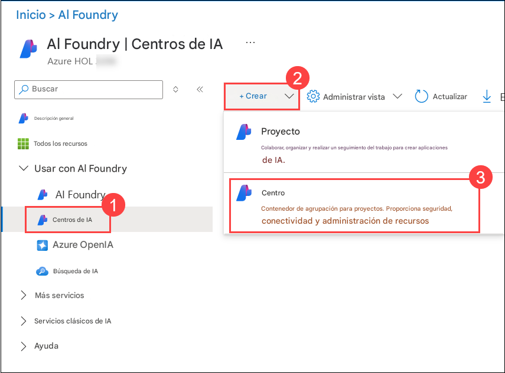

3. En el panel **Create an Azure AI hub**, ingresa los siguientes detalles:
   - **Subscription** : **Deja la suscripción predeterminada**
   - **Resource Group** : **AgenticAI (1)**
   - **Region** : **Region (2)**
   - **Name** : **ai-foundry-hub-{suffix} (3)**

   

   - **Connect AI Services incl. OpenAI** : Haz clic en **Create New (1)**.
   - **Connect AI Services incl. OpenAI** : Proporciona un nombre **my-ai-service-{suffix} (2)**.  
   - Haz clic en **Save (3)** y luego en **Next:Storage (4)**

   

4. Haz clic en la pestaña **Review + Create** y luego en **Create**.

   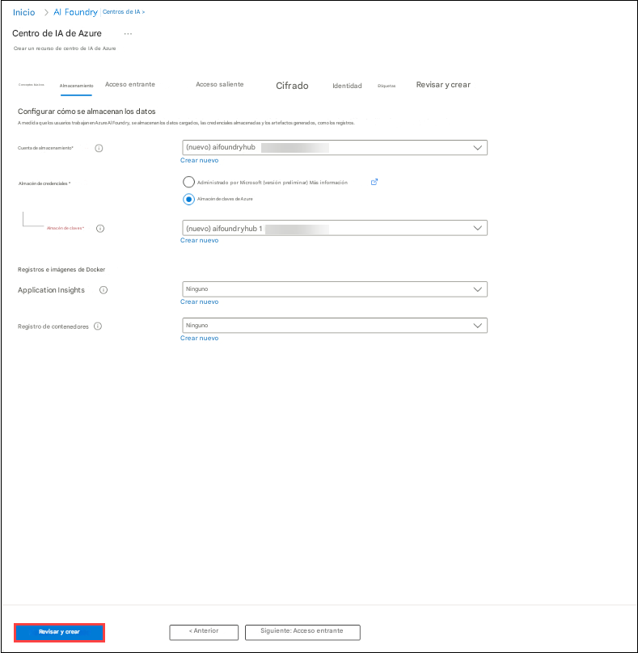

   

5. Espera a que se complete la implementación y luego haz clic en **Go to resource**.

   

6. En el panel **Overview**, haz clic en **Launch Azure AI Foundry**. Esto te llevará al portal de Azure AI Foundry.

   

7. Desplázate hacia abajo y haz clic en **+ New project** en la vista general del Hub.

   

8. Proporciona el nombre del proyecto como **ai-foundry-project-{suffix} ,** y luego haz clic en **Create (2)**.

   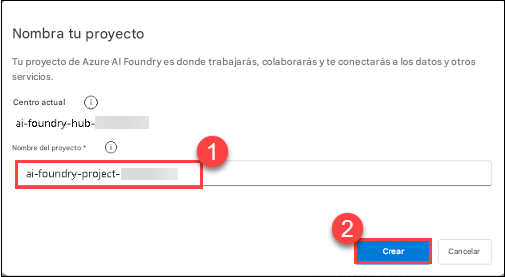

9. Una vez creado el proyecto, desplázate hacia abajo y copia el **Project connection string**, luego pégalo en Notepad o en una ubicación segura, ya que se necesitará para las próximas tareas.

   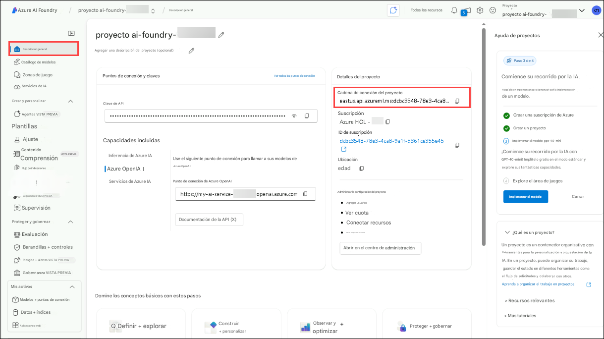

## Tarea 2: Despliegue de un LLM y modelos de embedding

En esta tarea, desplegarás un modelo de lenguaje grande (LLM) y un modelo de embedding dentro de tu proyecto de Azure AI Foundry. Estos modelos se utilizarán para aplicaciones impulsadas por IA y capacidades de búsqueda basada en vectores en los próximos laboratorios.

1. En tu **proyecto de AI Foundry**, navega a la sección **My assets (1)**, luego selecciona **Models + endpoints (2)**. Haz clic en **Deploy model (3)** y elige **Deploy base model (4)** para continuar.

   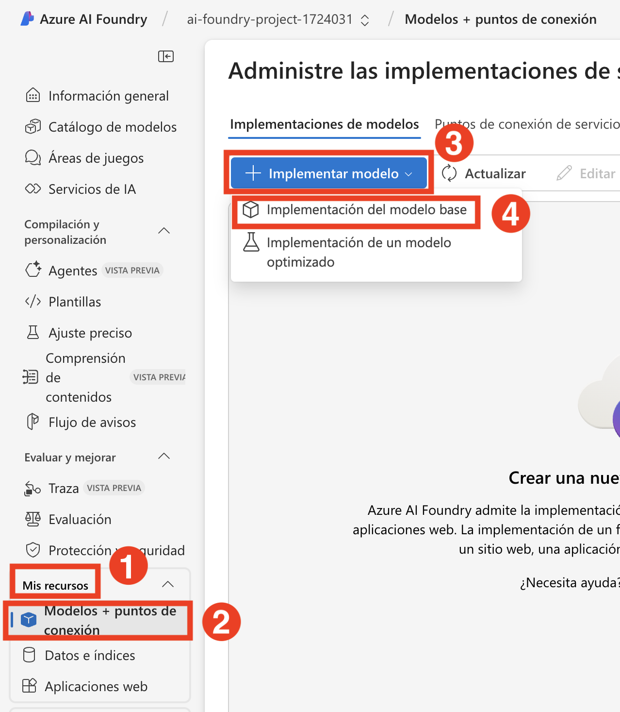

1. En la ventana **Select a model**, busca **gpt-4o (1)**, selecciona **gpt-4o (2)** y selecciona **Confirm (3)**

   

1. En la ventana **Deploy model gpt-4o**, selecciona **Customize**.

   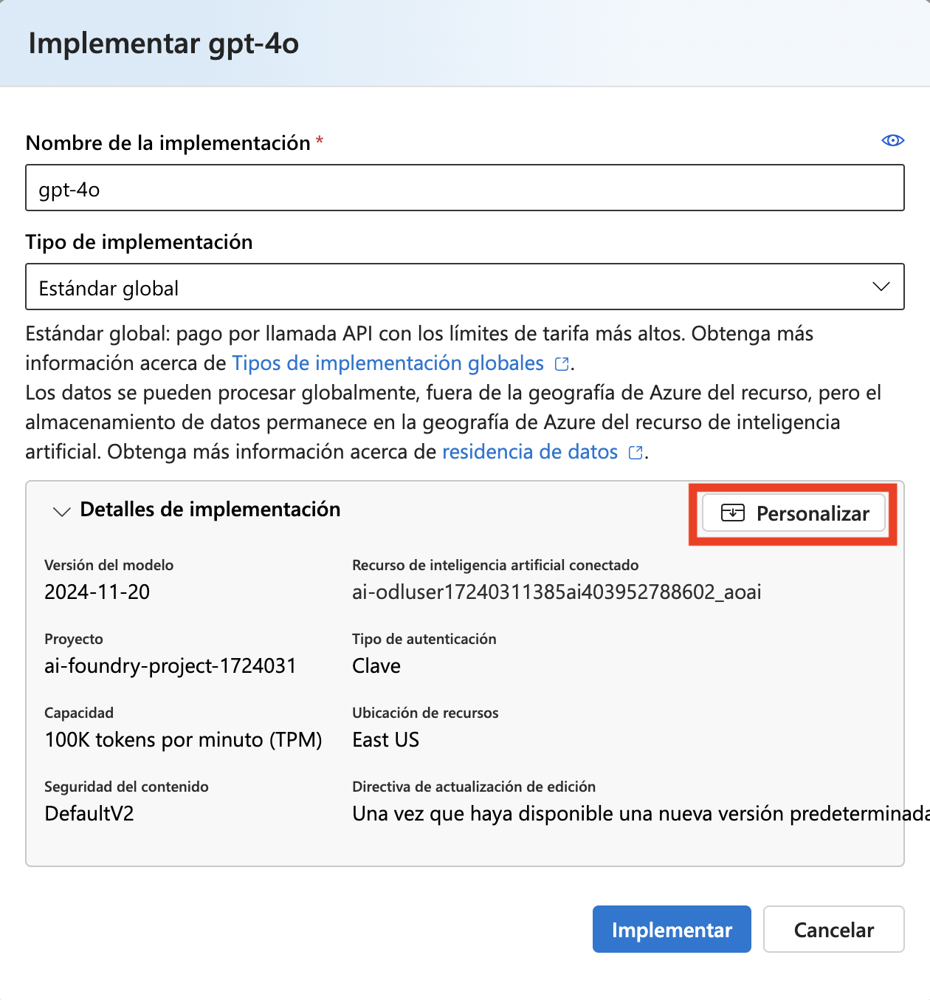

   - Nombre de la implementación: **gpt-4o**
   - Tipo de implementación: **Global Standard**
   - Cambia la **Model version a 2024-08-06 (1)**
   - Cambia el Tokens per Minute Rate Limit a **200K (2)**
   - Haz clic en **deploy (3)**

        

1. Haz clic en **Model + Endpoints (1)**, ahí podrás ver el modelo **gpt-4o (2)** desplegado.

   

1. Regresa al **Azure Portal** y busca **Open AI (1)** y selecciona el recurso **Azure Open AI (2)**.

   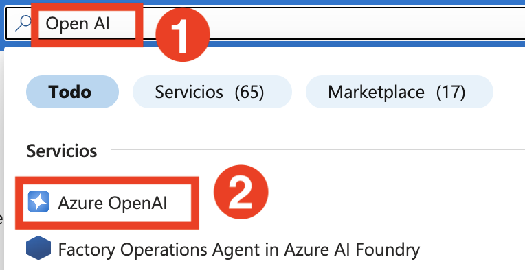

1. En la página **Azure AI services | Azure OpenAI**, selecciona **+ Create** para crear el recurso Azure OpenAI.

   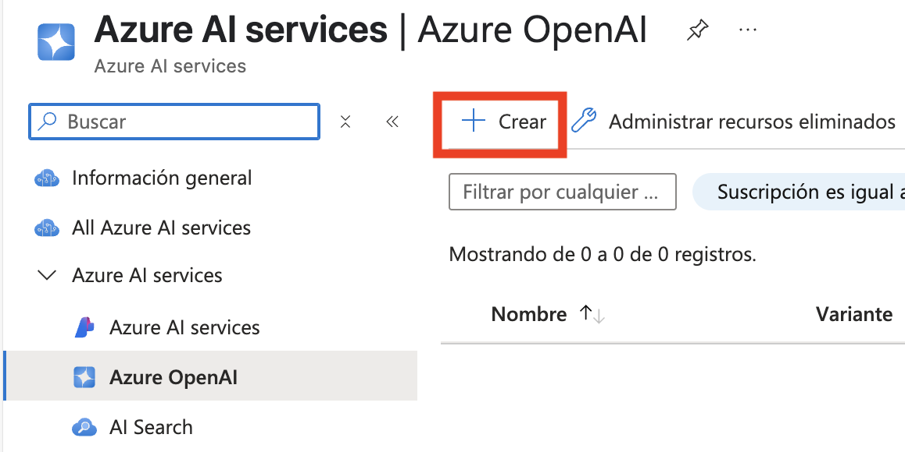

1. En la página **Create Azure OpenAI**, proporciona la siguiente configuración y haz clic en **Next (6)**

   | Configuración | Valor | 
   | --- | --- |
   | Subscription | deja la suscripción predeterminada **(1)** |
   | Resource group | **AgenticAI (2)** |
   | Region | **East US (3)** |
   | Name | **my-openai-service{suffix} (4)** |
   | Pricing tier | **Standard S0 (5)** |

   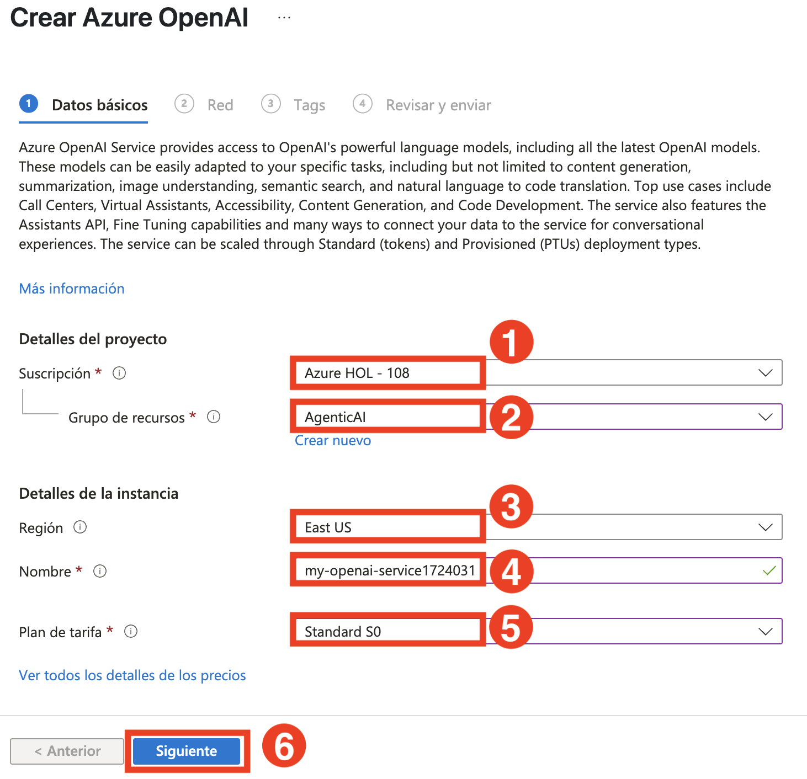

1. Haz clic en **Next** dos veces.

1. En la página **Review + submit**, haz clic en **Create**
 
   

1. Espera hasta que el despliegue se complete y selecciona **Go to resource**.

   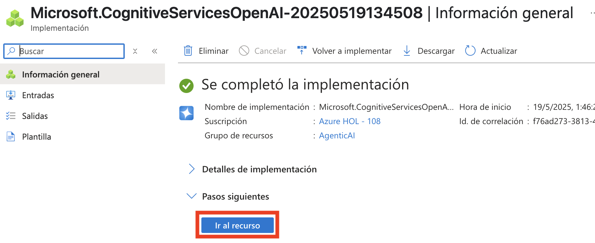

1. Busca **my-openai-service{suffix} (1)** y luego selecciona **my-openai-service{suffix} (2)**.

   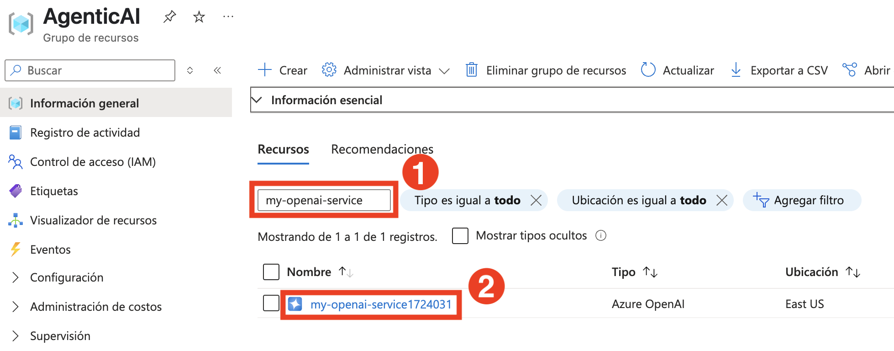

1. En la página del recurso **my-openai-service{suffix}**, selecciona **Go to Azure AI Foundry portal**

   

1. En tu proyecto de AI Foundry, navega a la sección **Shared resources**, luego selecciona **Deployments (1)**. Haz clic en **Deploy model (2)** y elige **Deploy base model (3)** para continuar.

   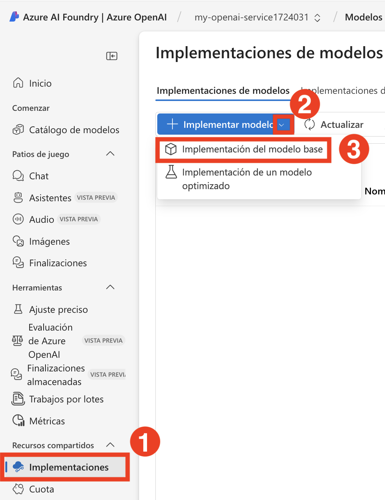

    >**Nota**: El asistente de importación y vectorización en Azure AI Search, que se usará en los siguientes laboratorios, aún no soporta modelos de embedding de texto dentro de tu proyecto de AI Foundry. Por esto, necesitamos crear un servicio Azure OpenAI y desplegar un modelo de embedding de texto ahí. Usaremos este modelo de embedding más adelante cuando creemos nuestro índice vectorial.

1. En la ventana **Select a model**, busca **text-embedding-3-large (1)**, luego selecciona **text-embedding-3-large (2)** y selecciona **Confirm (3)**

   

1. En la ventana **Deploy model text-embedding-3-large**,

   - Deployment type: Selecciona **Standard (1)**
   - Tokens per Minutes Rate Limit: **120K (2)**
   - Selecciona **Deploy (3)** para desplegar el modelo.

     

1. Haz clic en **Deployment (1)**, podrás ver el modelo **text-embedding-3-large (2)** desplegado.

   


## Tarea 3: Instalar dependencias, crear un entorno virtual y crear un archivo de variables de entorno

En esta tarea, instalarás las dependencias requeridas, configurarás un entorno virtual y crearás un archivo de variables de entorno. Esto asegura un entorno de desarrollo controlado y gestiona de forma segura la configuración de tu proyecto de IA.

1. En tu **Lab VM**, abre **Visual Studio Code**.

1. Haz clic en **File (1)**, luego en **Open Folder**.

    

1. Navega a `C:\LabFiles\Day-2-Azure-AI-Agents` **(1)**, selecciona la carpeta **azure-ai-agents-labs (2)** y luego haz clic en **Select folder (3)**.

   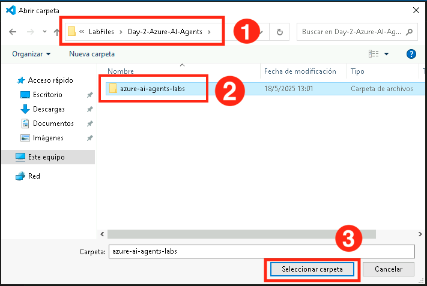 

1. Haz clic en **Yes, I Trust the authors**,

   

1. Haz clic en los **elipses(...) (1)**, luego en **Terminal (1)** y después en **New Terminal (3)**.

   

1. Asegúrate de estar en el directorio del proyecto **azure-ai-agents-labs**. Ejecuta los siguientes comandos de powershell para crear y activar tu entorno virtual:

   ```powershell
   python -m venv venv
   venv/Scripts/activate
   ```

   

1. Ejecuta el siguiente comando de powershell para instalar todos los paquetes requeridos:

   ```powershell
   pip install -r requirements.txt
   pip install azure-ai-ml azure-identity
   ```
   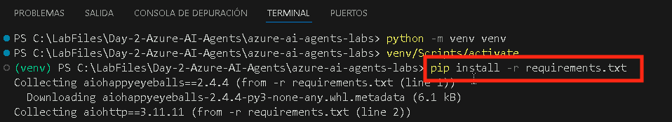

1. Ejecuta el siguiente comando de powershell para instalar o actualizar pip a la última versión.

   ```powershell
   python.exe -m pip install --upgrade pip
   ```

   

1. Ejecuta el siguiente comando para iniciar sesión en tu cuenta de Azure.

   ```
   az login
   ```

1. Selecciona la cuenta de usuario AzureAdUserEmail para autorizar.

   

1. Una vez completada la autorización, regresa a Visual Studio Code.

   

1. Abre el archivo **Sample.env** y proporciona las variables de entorno necesarias. 

   

   - Recupera los valores requeridos de tu **proyecto de Azure AI Foundry**.
   - Navega a la página **Overview (1)** de **ai-foundry-project-{suffix}** y copia y pega el **Project connection string (2)** en un bloc de notas.

     

   - Navega al modelo **gpt-4o**, copia el **Endpoint** del panel derecho, copia y pega el **Target URI (1)** y **Key (2)** en un bloc de notas

     

1. En el archivo **Sample.env**,

   - `AIPROJECT_CONNECTION_STRING`: Proporciona el valor de **Project connection string** que copiaste en el paso anterior
   - `CHAT_MODEL_ENDPOINT`: Proporciona el **Target URI** del modelo **gpt-4o** que copiaste en el paso anterior
   - `CHAT_MODEL_API_KEY`: Proporciona el valor de **Key** del modelo **gpt-4o** que copiaste en el paso anterior
   - `CHAT_MODEL`: **gpt-4o**

     

1. Guarda los cambios en el archivo **Sample.env**.

1. Ejecuta el siguiente comando de powershell para crear tu archivo **.env**:

   ```powershell
   cp sample.env .env
   ```

      

1. Luego abre el archivo **Lab 1 - Project Setup.ipynb**. El notebook **Lab 1 - Project Setup.ipynb** te guía en la configuración de un proyecto de IA en Azure AI Foundry, el despliegue de un LLM y modelos de embedding, y la configuración de la conectividad con VS Code. También incluye una llamada simple a la API de Chat Completion para verificar la configuración. Ejecutar este notebook asegura que tu entorno esté correctamente configurado para desarrollar aplicaciones impulsadas por IA. 

   

1. Selecciona la opción **Select kernel (1)** disponible en la esquina superior derecha y selecciona **Install/enable selected extensions (python+jupyter) (2)**.

   

1. Selecciona **Python Environments** para asegurarte de que Jupyter Notebook se ejecute en el intérprete de Python correcto con las dependencias necesarias instaladas. 

   

1. Selecciona **venv (Python)** de la lista, ya que probablemente sea necesario para la compatibilidad con Azure AI Foundry SDK y otras dependencias.

   

1. Ejecuta la primera celda para importar las librerías de Python necesarias para trabajar con los servicios de Azure AI.   

   

1. Ejecuta la siguiente celda para recuperar la cadena de conexión del proyecto y el nombre del modelo desde las variables de entorno. Estos valores son necesarios para interactuar de forma segura con el modelo de lenguaje grande (LLM), sin exponer información sensible en el código.

   

1. Ejecuta la siguiente celda para conectarte a tu proyecto de Azure AI Foundry usando la cadena de conexión. Esto establece una conexión segura con AIProjectClient, permitiendo interactuar con los recursos de tu proyecto.

   

1. Ejecuta la siguiente celda para interactuar con el modelo GPT-4o usando tu proyecto de Azure AI Foundry. Este código inicializa un cliente de chat, envía una solicitud para un chiste sobre un oso de peluche y muestra la respuesta. Finalmente, observa la salida proporcionada por el modelo de chat.

   

## Revisión

En este laboratorio, lograste lo siguiente:
- Configuraste el proyecto de IA en Azure AI Foundry.
- Desplegaste un LLM y modelos de embedding.
- Estableciste la conectividad desde VS Code al proyecto de IA.
- Realizaste una llamada simple de Chat Completion.

### Has completado exitosamente el laboratorio. Haz clic en **Next** para continuar con el siguiente laboratorio.


