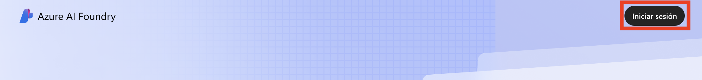
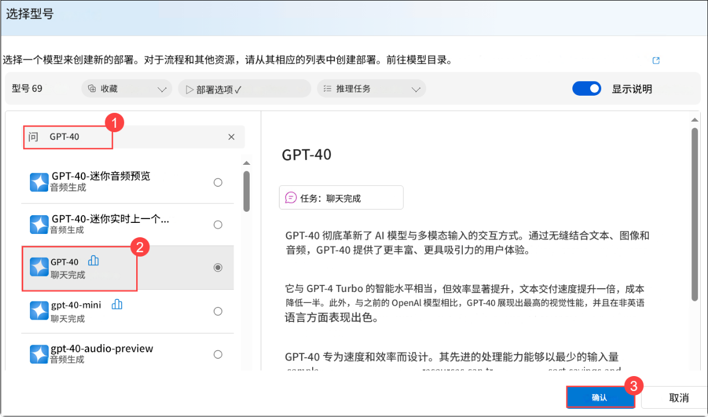
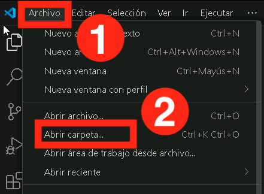
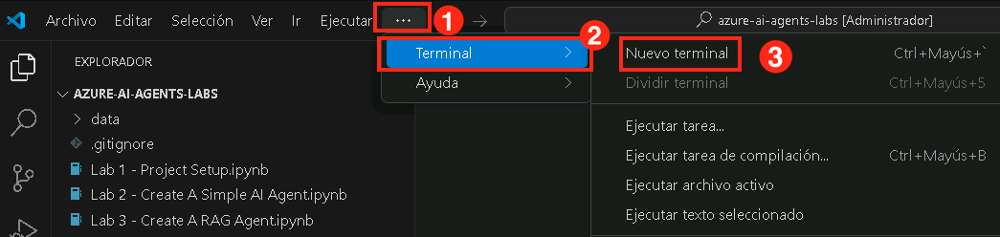

# 练习 1：在 VS Code 中设置 AI 项目并执行聊天完成
## 预计用时：120 分钟
## 实验场景

在本动手实验中，您将设置构建 AI 代理所需的环境。首先配置 Azure AI Foundry 中的 AI 项目，然后部署大型语言模型 (LLM) 和嵌入模型。接下来，建立从 Visual Studio Code 到 AI 项目的连接。最后，执行简单的聊天完成调用以验证设置。

## 实验目标

在本实验中，您将完成：

- 任务 1：在 Azure AI Foundry 中设置 AI 项目
- 任务 2：部署 LLM 和嵌入模型
- 任务 3：安装依赖项、创建虚拟环境和创建环境变量文件

## 任务 1：在 Azure AI Foundry 中设置 AI 项目

在本任务中，您将在 Azure AI Foundry 中创建和配置 AI 项目。这包括设置必要的资源、定义项目参数，并确保环境准备就绪以部署 AI 模型。到本任务结束时，您将拥有一个完全初始化的 AI 项目，作为进一步开发和实验的基础。

1. 在浏览器中打开新标签页，使用以下链接导航到 Azure AI Foundry 门户

   ```
    https://ai.azure.com/
   ```

2. 点击 **登录**。

   

3. 如果出现提示，请使用以下凭据登录：

   - **电子邮件/用户名：**AzureAdUserEmail

   - **密码：** AzureAdUserPassword

4. 点击 **创建项目 (1)**。

   

5. 提供以下项目名称，然后点击 **自定义 (2)**。

   ```
   ai-foundry-project-{suffix}
   ```

   

6. 在 **创建项目** 页面上，指定以下配置选项并点击 **下一步 (4)**：
   - **资源组**：**AgenticAI** (1)
   - **位置**：**Region** (2)
   - **连接 Azure AI Search**：点击 **创建新的 AI Search (3)**，输入以下名称并点击 **下一步 (2)**

      ```
      ai-search-{suffix}
      ```

      

      

7. 点击 **创建 (1)**。

   


## 任务 2：部署 LLM 和嵌入模型

在本任务中，您将在 Azure AI Foundry 项目中部署大型语言模型 (LLM) 和嵌入模型。这些模型将用于后续实验中的 AI 驱动应用程序和基于向量的搜索功能。

1. 在您的 **AI Foundry 项目** 中，导航到 **我的资产 (1)** 部分，然后选择 **模型 + 终结点 (2)**。点击 **部署模型 (3)**，并选择 **部署基础模型 (4)** 继续。

   

2. 在 **选择模型** 窗口中，搜索 **gpt-4o (1)**，选择 **gpt-4o (2)** 并点击 **确认 (3)**

   

3. 在 **部署模型 gpt-4o** 窗口中，选择 **自定义**。

   

   - 将 **模型版本** 更改为 **2024-08-06 (1)**
   - 将每分钟令牌速率限制更改为 **200K (2)**
   - 点击 **部署 (3)**

        

4. 点击 **模型 + 终结点 (1)**，您可以看到已部署的 **gpt-4o (2)** 模型。

   

5. 返回 **Azure 门户**，搜索 **Open AI (1)** 并选择 **Azure Open AI (2)** 资源。

   

6. 在 **Azure AI 服务 | Azure OpenAI** 页面上，选择 **+ 创建** 以创建 Azure OpenAI 资源。

   

7. 在 **创建 Azure OpenAI** 页面上，提供以下设置并点击 **下一步 (6)**

   | 设置 | 值 | 
   | --- | --- |
   | 订阅 | 保留默认订阅 **(1)** |
   | 资源组 | **AgenticAI (2)** |
   | 区域 | **美国东部 (3)** |
   | 名称 | **my-openai-service{suffix} (4)** |
   | 定价层 | **标准 S0 (5)** |

   

8. 连续点击两次 **下一步**。

9. 在 **查看 + 提交** 页面上，点击 **创建**
 
   

10. 等待部署成功后选择 **转到资源**。

      

11. 搜索 **my-openai-service{suffix} (1)** 然后选择 **my-openai-service{suffix} (2)**。

    

12. 在 **my-openai-service{suffix}** 资源页面上，选择 **转到 Azure AI Foundry 门户**

     

13. 在您的 AI Foundry 项目中，导航到 **共享资源** 部分，然后选择 **部署 (1)**。点击 **部署模型 (2)**，并选择 **部署基础模型 (3)** 以继续。

      

      **注意**：Azure AI Search 中的导入和向量化向导（将在后续实验中使用）尚不支持 AI Foundry 项目中的文本嵌入模型。因此，我们需要创建一个 Azure OpenAI 服务并在那里部署文本嵌入模型。我们将在稍后创建向量索引时使用此文本嵌入模型。

14. 在 **选择模型** 窗口中，搜索 **text-embedding-3-large (1)**，然后选择 **text-embedding-3-large (2)** 并选择 **确认 (3)**

     

15. 在 **部署模型 text-embedding-3-large** 窗口中，

      - 部署类型：选择 **标准 (1)**
      - 每分钟令牌速率限制：**120K (2)**
      - 选择 **部署 (3)** 以部署模型。

        

16. 点击 **部署 (1)**，您可以看到已部署的 **text-embedding-3-large (2)** 模型。

     

## 任务 3：安装依赖项、创建虚拟环境和创建环境变量文件

在本任务中，您将安装所需的依赖项，设置虚拟环境，并创建环境变量文件。这确保了一个受控的开发环境，并安全地管理 AI 项目的配置设置。

1. 在您的 **实验虚拟机** 上，启动 **Visual Studio Code**。

2. 点击 **文件 (1)**，然后 **打开文件夹**。

    

3. 导航到 `C:\LabFiles\Day-2-Azure-AI-Agents` **(1)**，选择 **azure-ai-agents-labs (2)** 文件夹，然后点击 **选择文件夹 (3)**。

    

4. 点击 **是，我信任作者**。

   

5. 点击 **省略号(...) (1)**，然后 **终端 (2)**，最后点击 **新建终端 (3)**。

   

6. 确保您在 **azure-ai-agents-labs** 项目目录中。运行以下 PowerShell 命令来创建和激活虚拟环境：

   ```powershell
   python -m venv venv
   venv/Scripts/activate
   ```

   

7. 运行以下 PowerShell 命令。这将安装所有必需的包：

   ```powershell
   pip install -r requirements.txt
   ```
   

8. 运行以下 PowerShell 命令以安装或升级到最新版本的 pip。

   ```powershell
   python.exe -m pip install --upgrade pip
   ```

   

9. 运行以下命令登录到您的 Azure 账户。

   ```
   az login
   ```

10. 选择 AzureAdUserEmail 用户账户进行授权。

    

11. 授权完成后，返回到 Visual Studio Code。

    

12. 打开 **Sample.env** 文件并提供必要的环境变量。

    

    - 从您的 **Azure AI Foundry 项目** 中检索所需的值。
    - 导航到 **ai-foundry-project-{suffix}** 的 **概述 (1)** 页面，然后复制 **项目连接字符串 (2)** 并粘贴到记事本中。

      

    - 导航到 **gpt-4o** 模型，从右侧窗格的 **终结点** 下复制 **目标 URI (1)** 和 **密钥 (2)** 并粘贴到记事本中。

      

13. 在 **Sample.env** 文件中：

    - `AIPROJECT_CONNECTION_STRING`：提供您在上一步中复制的 **项目连接字符串** 值
    - `CHAT_MODEL_ENDPOINT`：提供您复制的 **gpt-4o** 模型的 **目标 URI**
    - `CHAT_MODEL_API_KEY`：提供您复制的 **gpt-4o** 模型的 **密钥** 值
    - `CHAT_MODEL`：**gpt-4o**

      

14. 保存对 **Sample.env** 文件的更改。

15. 运行以下 PowerShell 命令。这将创建您的 **.env** 文件：

    ```powershell
    cp sample.env .env
    ```

       

16. 然后打开 **Lab 1 - Project Setup.ipynb** 文件。**Lab 1 - Project Setup.ipynb** 笔记本指导您完成在 Azure AI Foundry 中设置 AI 项目、部署 LLM 和嵌入模型，以及配置 VS Code 连接。它还包括一个简单的聊天完成 API 调用来验证设置。运行此笔记本可确保您的环境正确配置，以开发 AI 驱动的应用程序。

    

17. 选择右上角可用的 **选择内核 (1)** 设置，然后选择 **安装/启用所选扩展（python+jupyter）(2)**。

    

18. 选择 **Python 环境** 以确保 Jupyter Notebook 在具有必要依赖项的正确 Python 解释器中运行。

    

19. 从列表中选择 **venv (Python)**，因为这个版本可能需要与 Azure AI Foundry SDK 和其他依赖项兼容。

    

20. 运行第一个单元格以导入使用 Azure AI 服务所需的 Python 库。

    

21. 运行以下单元格以从环境变量中检索项目连接字符串和模型名称。这些值需要安全地与大型语言模型 (LLM) 交互，而无需硬编码敏感信息。

    

22. 运行以下单元格以使用连接字符串连接到您的 Azure AI Foundry 项目。这将建立与 AIProjectClient 的安全连接，使您能够与项目资源交互。

    

23. 运行以下单元格以使用您的 Azure AI Foundry 项目与 GPT-4o 模型交互。此代码初始化聊天客户端，发送关于泰迪熊的笑话请求，并打印响应。最后查看聊天模型提供的输出。

    

## 回顾

在本实验中，您已完成以下内容：
- 在 Azure AI Foundry 中设置了 AI 项目
- 部署了 LLM 和嵌入模型
- 建立了从 VS Code 到 AI 项目的连接
- 执行了简单的聊天完成调用

### 您已成功完成实验。点击 **下一步** 继续下一个实验。 
