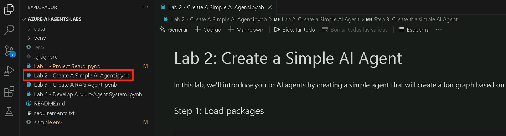
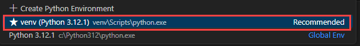
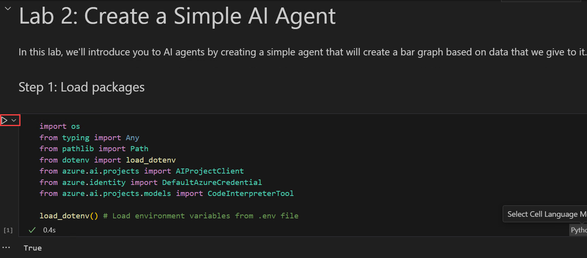
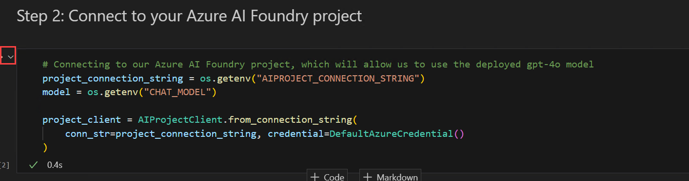
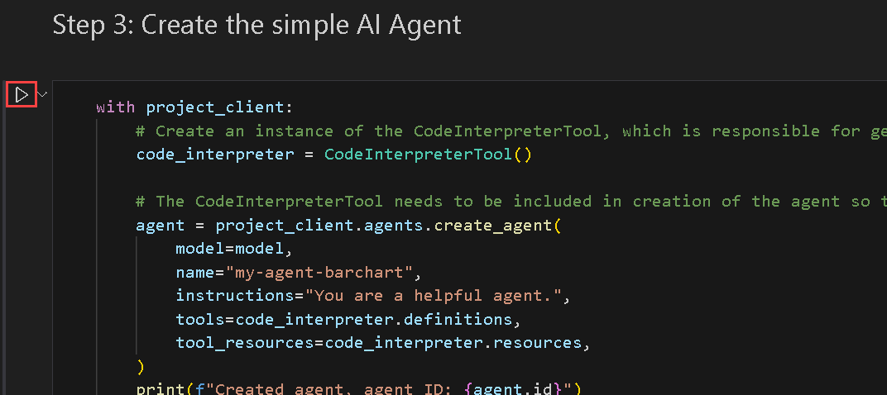
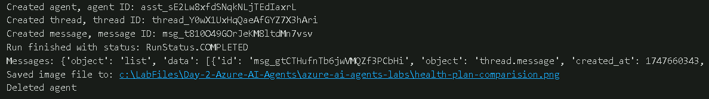

# Exercício 2: Criar um Agente de IA Simples

## Tempo estimado: 30 minutos
## Cenário do laboratório

Agentes de IA são projetados para automatizar tarefas e gerar insights com base na entrada do usuário. Neste laboratório, você aprenderá a criar um agente de IA simples que processa dados e gera um gráfico de barras comparando diferentes planos de benefícios de saúde. Este agente de IA utiliza os serviços de IA do Azure para analisar e visualizar dados de forma eficiente.

## Objetivo do Laboratório
Neste laboratório, você realizará as seguintes tarefas:

- Tarefa 1: Criar um Agente de IA Simples

## Tarefa 1: Criar um Agente de IA Simples

Nesta tarefa, você irá construir um agente de IA simples que processa dados e gera um gráfico de barras comparando diferentes planos de benefícios de saúde, utilizando os serviços de IA do Azure para análise e visualização.

1. Abra o arquivo **Lab 2 - Create A Simple AI Agent.ipynb**. Este notebook **Lab 2 - Create A Simple AI Agent.ipynb** orienta você na construção de um agente de IA simples que processa dados e gera um gráfico de barras comparando diferentes planos de saúde.

   

2. Selecione a configuração **Select kernel** disponível no canto superior direito. Escolha **venv (Python 3.x.x)** da lista.

   

3. Execute a célula abaixo para importar as bibliotecas necessárias e carregar variáveis de ambiente para trabalhar com Projetos de IA do Azure. Essa configuração permite autenticação segura e interação com os serviços de IA do Azure.

   

4. Execute a célula abaixo para conectar-se ao seu projeto Azure AI Foundry e acessar o modelo **gpt-4o** implantado. Isso estabelece uma conexão segura usando a string de conexão do projeto e as credenciais do Azure.

   

5. Execute esta célula para criar um **agente de IA simples** que processa dados e gera um gráfico de barras comparando diferentes planos de benefícios de saúde usando o Azure AI Foundry. Este script inicializa o agente de IA, envia um prompt contendo os dados dos planos de saúde e solicita um gráfico de barras. O agente processa a solicitação, gera o gráfico, salva a imagem e finaliza excluindo o agente.

   

6. Por fim, observe o resultado.

   

## Revisão

Neste laboratório, você realizou as seguintes atividades:

- Criou um Agente de IA Simples

### Você concluiu com sucesso o laboratório. Clique em **Próximo** para continuar para o próximo laboratório.
