# 练习 3：开发多代理系统
## 预计用时：30 分钟
## 实验场景
在本实验中，您将创建一个由 4 个代理组成的多代理系统，这些代理协同工作以生成有关健康计划文档的报告。您将构建以下 4 个 AI 代理：
- **搜索代理** - 该代理将在 Azure AI Search 索引中搜索有关特定健康计划政策的信息。
- **报告代理** - 该代理将根据搜索代理返回的信息生成有关健康计划政策的详细报告。
- **验证代理** - 该代理将验证生成的报告是否满足指定要求。在我们的案例中，确保报告包含有关覆盖范围排除的信息。
- **编排代理** - 该代理将作为编排器，管理搜索代理、报告代理和验证代理之间的通信。

    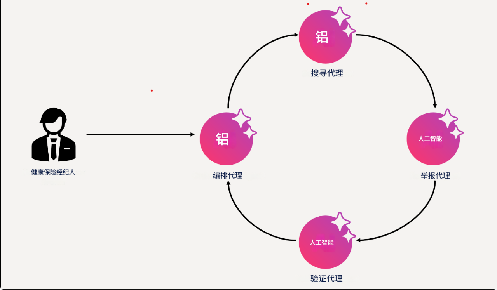

编排是多代理系统的关键部分，因为我们创建的代理需要能够相互通信以完成目标。

我们将使用 Azure AI Agent Service 创建搜索、报告和验证代理。但是，要创建编排代理，我们将使用 Semantic Kernel。Semantic Kernel 库提供了现成的功能来编排多代理系统。

## 实验目标
在本实验中，您将完成以下任务：
- 任务 1：创建 Azure AI Search 索引
- 任务 2：创建搜索、报告和验证代理

## 任务 1：创建 Azure AI Search 索引

在本任务中，您将创建一个 **Azure AI Search 索引** 来存储健康保险计划文档的向量化表示，实现 AI 驱动的搜索和分析的高效检索。

1. 导航到 **Azure 门户**，搜索 **AI Search (1)** 并从服务中选择 **AI Search (2)**。

   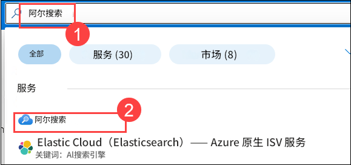

2. 选择 **my-search-service-{suffix}**。

   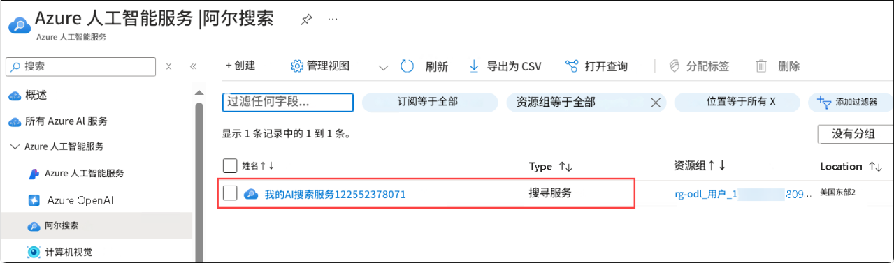

    >**注意**：`xxxxxx` 表示一些随机数字，会有所不同。

3. 在左侧菜单的 **设置** 下导航到 **密钥 (1)**。在 **API 访问控制** 下选择 **两者 (2)**。

   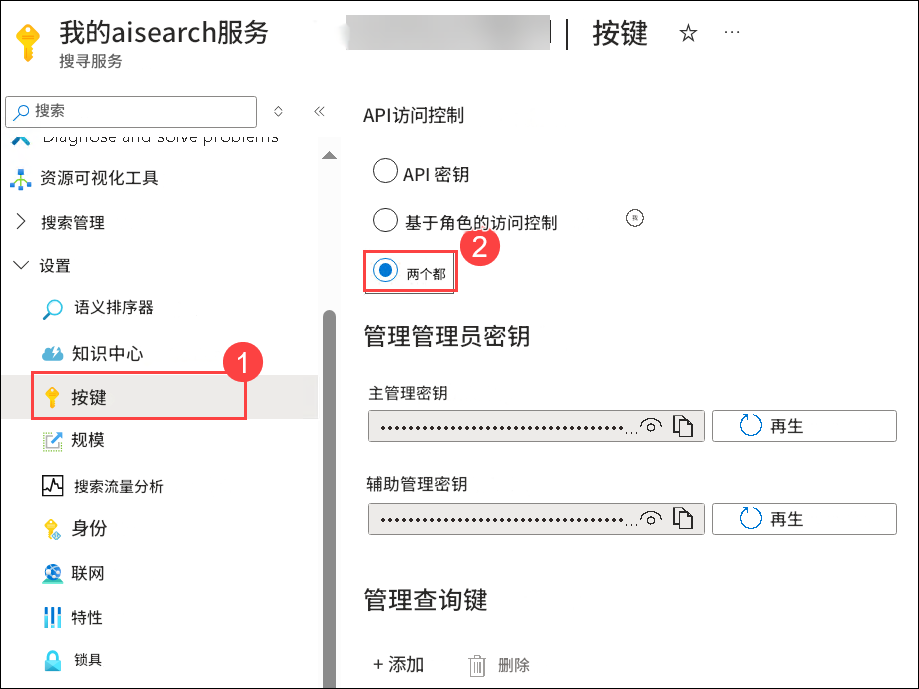

4. 对于 **您确定要更新此搜索服务的 API 访问控制吗** 选择 **是**。

   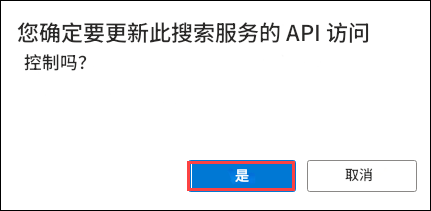

5. 在 **设置** 下导航到 **标识 (1)**。在系统分配下将状态设置为 **开启 (2)** 并点击 **保存 (3)**。

   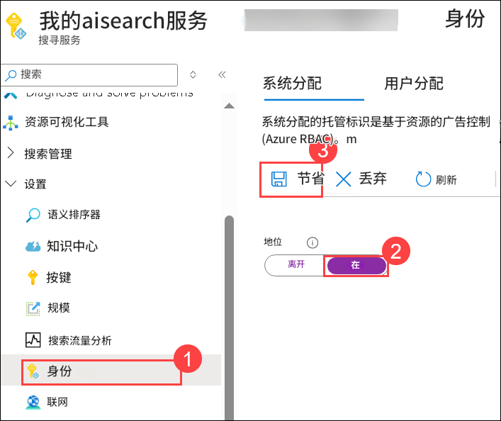

6. 对于 **启用系统分配的托管标识** 选择 **是**。

   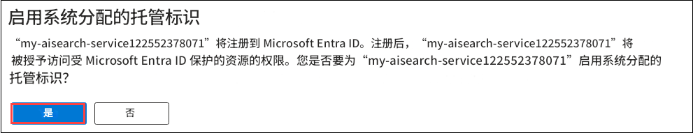

7. 在 Azure 门户中，搜索 **存储账户 (1)** 并从服务中选择 **存储账户 (2)**。

   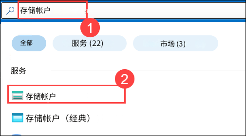

8. 现在导航到项目的 **存储账户**。

   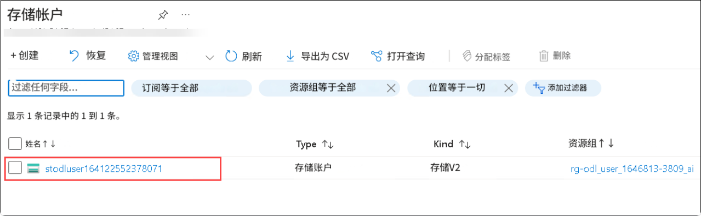

9. 选择 **访问控制(IAM)(1)**，然后点击 **添加(2)**，并选择 **添加角色分配**。

   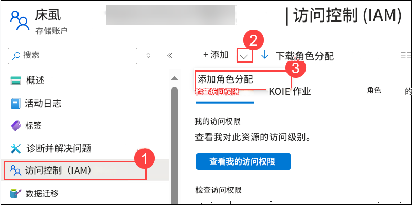

10. 在 **工作职能角色** 下，搜索 **存储 Blob 数据读取者 (1)**，选择 **存储 Blob 数据读取者 (2)**，然后选择 **下一步 (3)**。

    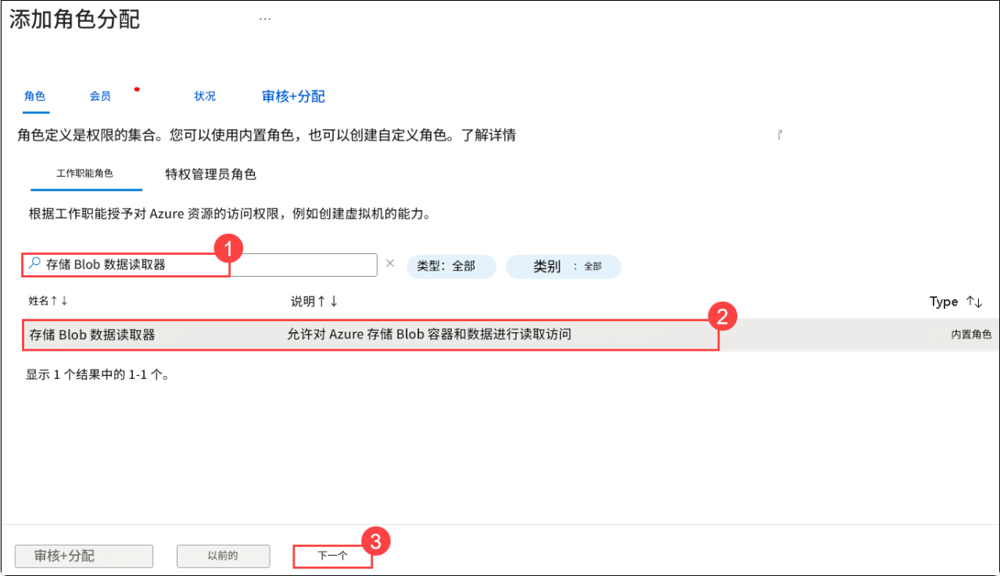

11. 在 **添加角色分配** 页面上：

    - 在成员下，选择 **托管标识(1)**
    - 选择 **成员 (2)**
    - 托管标识：**搜索服务(3)**
    - 然后选择 **my-search-service-{suffix} (4)** 搜索服务
    - 点击 **选择 (5)**

      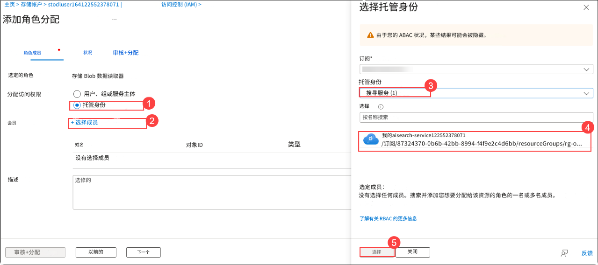

12. 连续两次选择 **查看 + 分配**。

    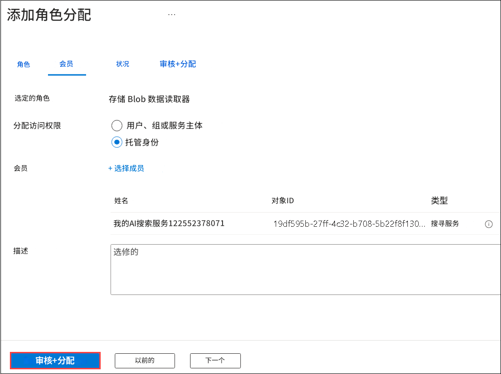  

13. 转到 **Azure OpenAI**，**my-openai-service{suffix}**。

    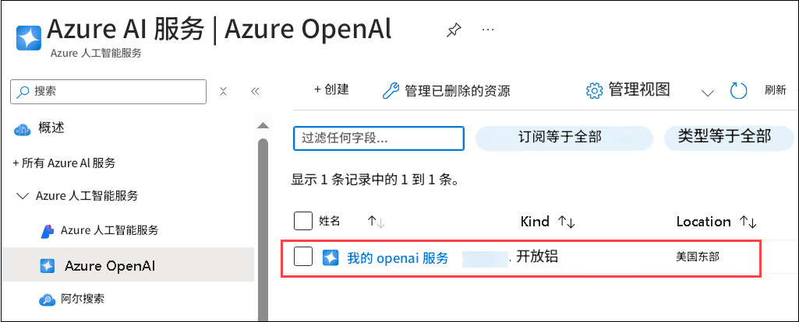

14. 选择 **访问控制(IAM)(1)**，然后点击 **添加(2)**，并选择 **添加角色分配**。

    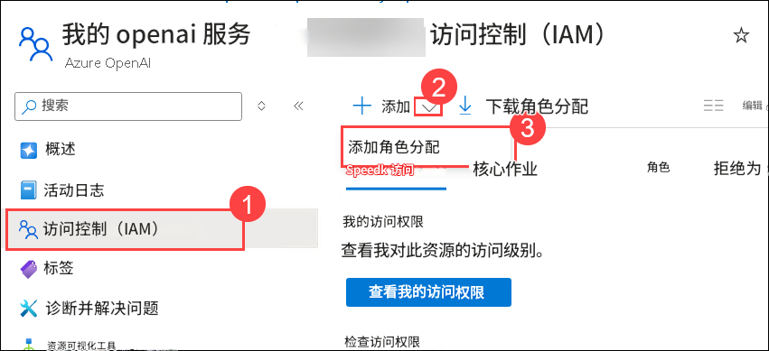

15. 在 **工作职能角色** 下，搜索 **认知服务 OpenAI 用户 (1)**，选择 **认知服务 OpenAI 用户 (2)**，然后选择 **下一步 (3)**。

    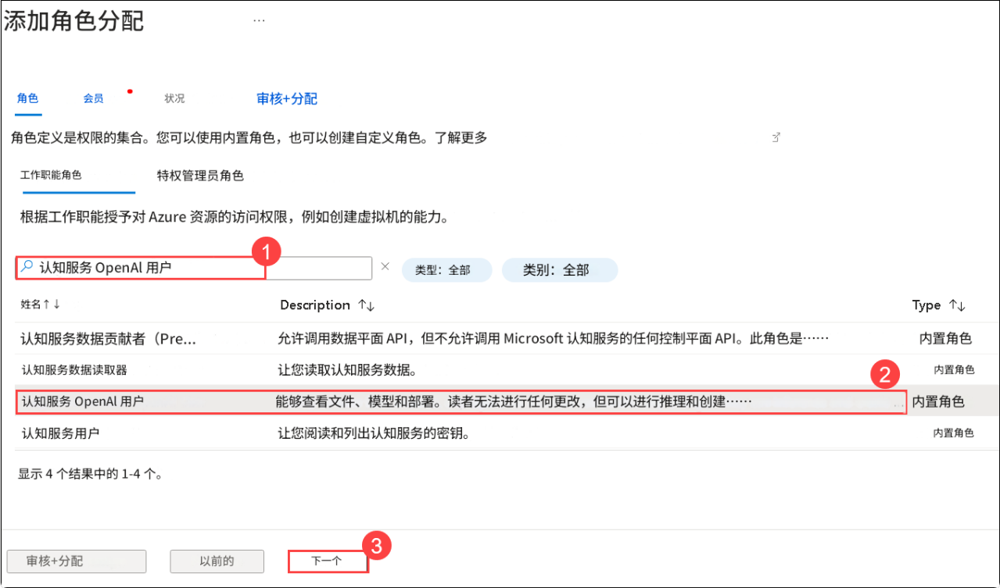

16. 在 **添加角色分配** 页面上：

    - 在成员下，选择 **托管标识(1)**
    - 选择 **成员 (2)**
    - 托管标识：**搜索服务(3)**
    - 然后选择 **my-search-service-{suffix} (4)** 搜索服务
    - 点击 **选择 (5)**

      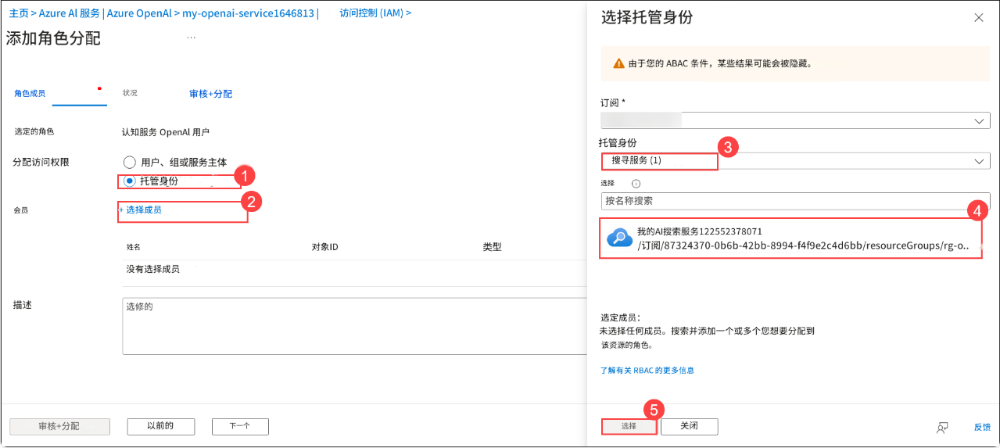

17. 连续两次选择 **查看 + 分配**。

    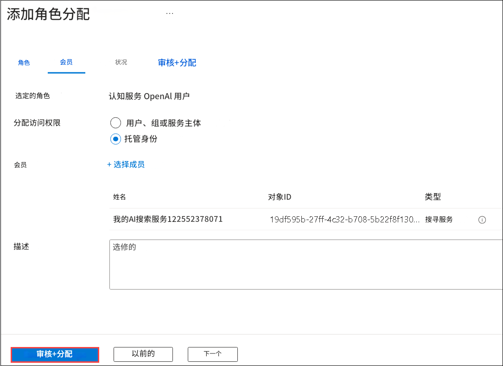

18. 导航到 **Azure 门户**，搜索 **存储账户 (1)** 并选择 **存储账户 (2)**。

    

19. 选择以 **aifoundry** 开头的存储账户。

    

20. 点击数据存储下的 **容器(1)**，然后选择 **+容器(2)**。

    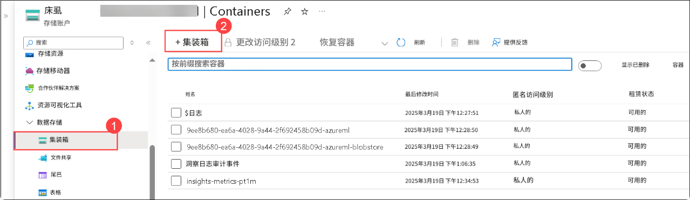

21. 在新建容器页面输入 `healthplan`(1) 作为名称并点击 **创建(2)**。

    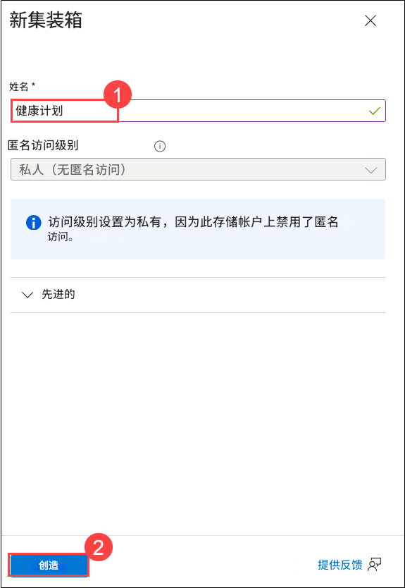

22. 点击打开 **healthplan** 容器。

    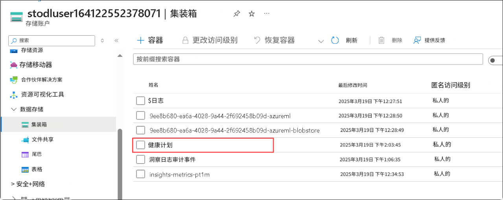

23. 点击 **上传 (1)** 上传文件，然后点击 **浏览文件 (2)**。

    

24. 导航到 `C:\LabFiles\Day-2-Azure-AI-Agents\azure-ai-agents-labs\data` **(1)** 并选择要上传的两个 PDF **(2)**，然后点击 **打开 (3)**。

    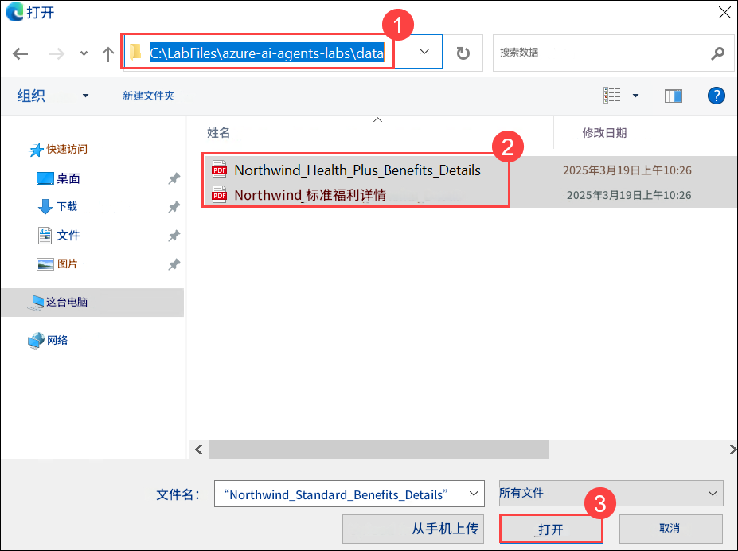

25. 点击 **上传**。

26. 在 Azure 门户中导航到 **Azure AI Search** 服务 **my-search-service-{suffix}**。

    

27. 点击 **导入和向量化数据**。

    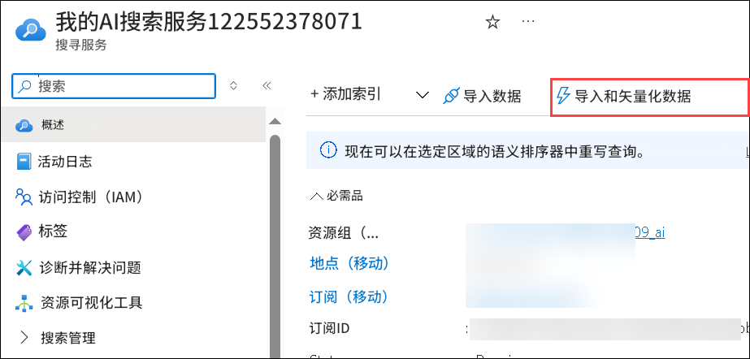

28. 选择 **Azure Blob 存储**。

    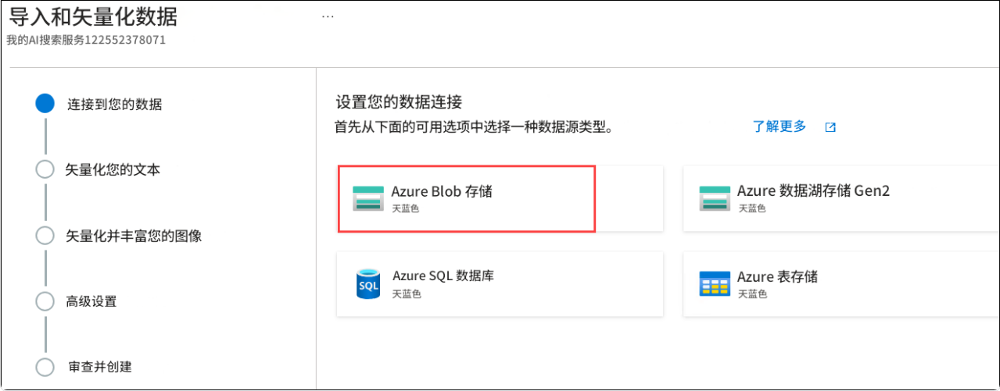

29. 在配置 Azure Blob 存储页面上，输入以下详细信息并点击 **下一步(5)**：
    |设置|值|
    |---|---|
    |订阅|保持默认 **(1)**|
    |存储账户|选择前缀为 **aifoundry** 的存储账户 **(2)**|
    |Blob 容器|**healthplan** **(3)**|
    |托管标识类型|**系统分配** **(4)**|

       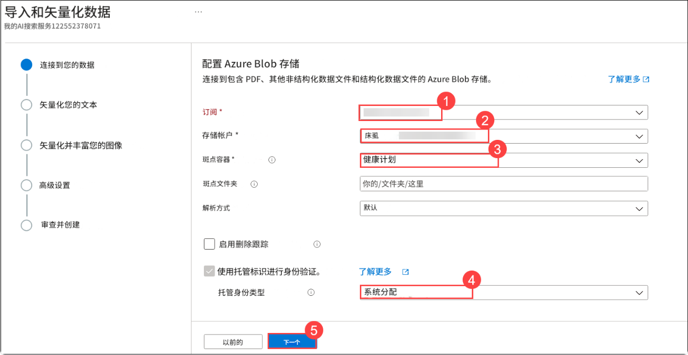

30. 在向量化文本页面上，输入以下详细信息并点击 **下一步 (7)**：
    |设置|值|
    |---|---|
    |类型|**Azure OpenAI (1)**|
    |订阅|保持默认 **(2)**|
    |Azure OpenAI 服务|**my-openai-service{suffix}** **(3)**|
    |模型部署|**text-embedding-3-large** **(4)**|
    |身份验证类型|**系统分配标识** **(5)**|
    |确认复选框|**已选中** **(6)**|

       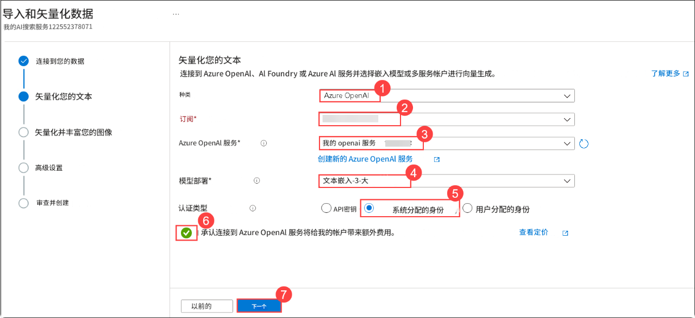

31. 连续两次点击 **下一步**。

32. 输入 **health-plan (1)** 作为对象名称前缀并点击 **创建 (2)**。

    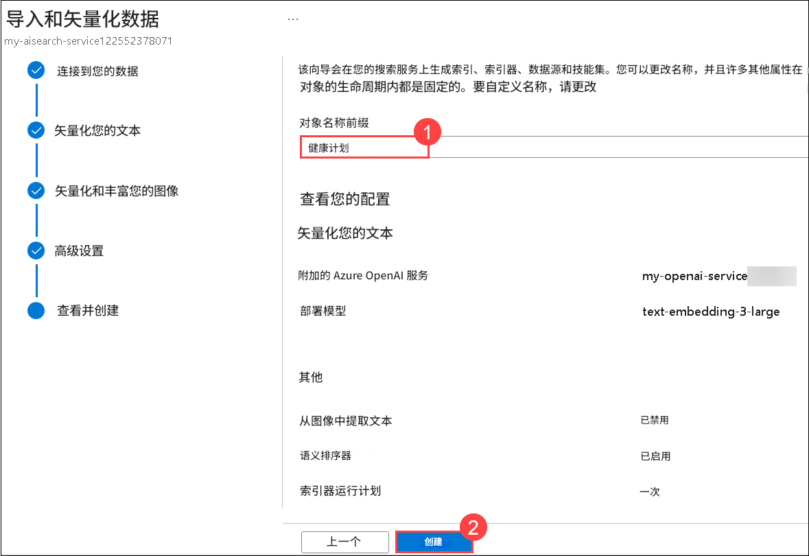

## 任务 2：创建搜索、报告和验证代理

在本任务中，您将创建搜索、报告和验证代理来检索、生成和验证健康计划报告。这些代理将协同工作以确保准确性和符合要求。每个代理在检索、编制和确保报告准确性方面都发挥着不同的作用。

1. 打开 **Lab 4 - Develop A Mult-Agent System.ipynb** 文件，这个 **Lab 4 - Develop A Mult-Agent System.ipynb** 笔记本指导您开发一个包含搜索、报告、验证和编排代理的多代理系统，用于生成和验证健康计划报告。每个代理在检索、编制和确保报告准确性方面都发挥着不同的作用。

   

2. 选择右上角可用的 **选择内核 (1)** 设置，并从列表中选择 **venv (Python) (2)**。

   

3. 运行此单元格以开发一个集成了 Azure AI Search、GPT-4o 和 Semantic Kernel 的 **多代理系统**，用于智能任务执行。此设置使多个 AI 代理能够在检索信息、生成响应和处理复杂查询方面进行协作。

   

4. 运行此单元格以创建 **搜索代理**，该代理使用 GPT-4o 从 Azure AI Search 检索健康计划详细信息。此代理实现了从健康计划文档中高效检索结构化信息。

   

5. 运行此单元格以创建 **报告代理**，该代理使用 GPT-4o 生成有关健康计划的详细报告。此代理通过提供各种计划的结构化见解、覆盖范围详细信息和排除项来增强文档。

   

6. 运行此单元格以创建 **验证代理**，该代理确保报告代理生成的报告满足质量标准，特别是检查覆盖范围排除项。

   
   
7. 最后观察输出。

   
   
8. **创建多代理系统**：当您运行以下单元格时，您将看到一个聊天框在 VS Code 顶部弹出，要求您输入健康计划的名称。
  
     
  
9. 如果您还记得，我们向搜索索引上传了两个健康计划。在框中输入以下健康计划之一并按回车键开始运行多代理系统：

    - Northwind Health Standard
    - Northwind Health Plus

        
      
    > **注意**：单元格成功运行后，您将收到以下结果。

    **中文**
    ```
    编排代理正在启动...
    正在调用搜索代理...
    搜索代理已成功完成。
    正在调用报告代理...
    报告代理已成功完成。
    正在调用验证代理...
    验证代理已成功完成。
    已生成 Northwind Plus 的报告。请查看 Northwind Plus Report.md 文件获取报告。
    编排代理正在启动...
    ```

     **英文**
    ```
    Orchestrator Agent is starting...
    Calling SearchAgent...
    SearchAgent completed successfully.
    Calling ReportAgent...
    ReportAgent completed successfully.
    Calling ValidationAgent...
    ValidationAgent completed successfully.
    The report for Northwind Plus has been generated. Please check the Northwind Plus Report.md file for the report.
    Orchestrator Agent is starting...
    ```

## 回顾

在本实验中，您已完成以下内容：
- 创建了搜索、报告和验证代理

## 您已成功完成实验。 
