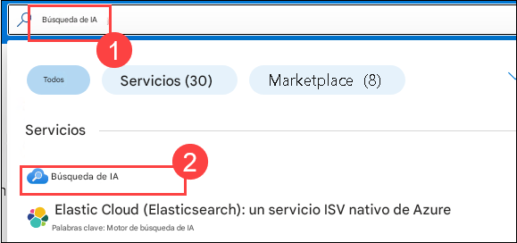
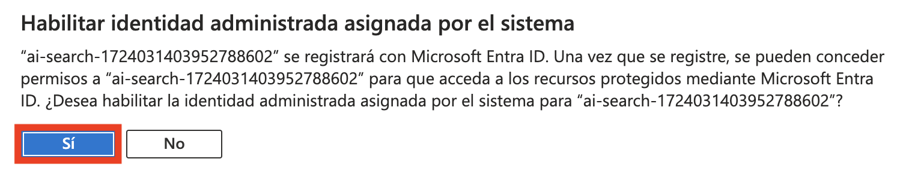
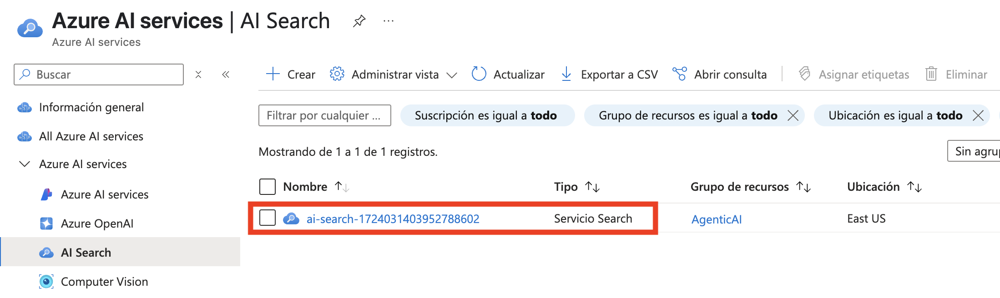
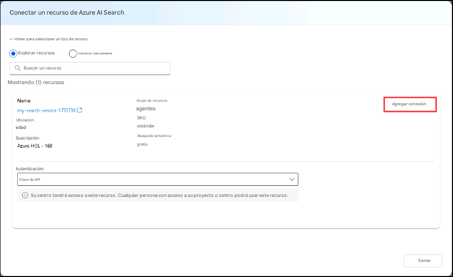

# 실습 4: 멀티 에이전트 시스템 개발

### 예상 소요 시간: 30분

## 시나리오

이 실습에서는 건강 보험 문서에 대한 보고서를 생성하기 위해 함께 작동하는 4개의 에이전트로 구성된 멀티 에이전트 시스템을 만들게 됩니다. 여러분은 다음의 4가지 AI 에이전트를 구축하게 됩니다:

- 검색 에이전트 (Search Agent) – 이 에이전트는 Azure AI Search 인덱스에서 특정 건강 보험 정책에 대한 정보를 검색합니다.
- 보고서 에이전트 (Report Agent) – 이 에이전트는 검색 에이전트로부터 반환된 정보를 기반으로 건강 보험 정책에 대한 상세 보고서를 생성합니다.
- 검증 에이전트 (Validation Agent) – 이 에이전트는 생성된 보고서가 지정된 요구 사항을 충족하는지 검증합니다. 이 실습에서는 보고서에 보장 제외 항목에 대한 정보가 포함되어 있는지를 확인합니다.
- 오케스트레이터 에이전트 (Orchestrator Agent) – 이 에이전트는 검색, 보고서, 검증 에이전트 간의 통신을 관리하는 조율자 역할을 합니다.

    

멀티 에이전트 시스템에서 오케스트레이션은 핵심적인 요소입니다. 우리가 생성하는 에이전트들이 목표를 달성하기 위해 서로 원활하게 소통할 수 있어야 하기 때문입니다.

우리는 검색(Search), 보고서(Report), 검증(Validation) 에이전트는 Azure AI Agent Service를 사용할 것이지만, 오케스트레이터(Orchestrator) 에이전트는 Semantic Kernel을 사용할 예정입니다. Semantic Kernel 라이브러리는 멀티 에이전트 시스템의 오케스트레이션 기능을 기본적으로 제공하므로 이를 활용할 것입니다.

## 목표

이 실습에서는 다음 작업을 수행하게 됩니다:

과제 1: Azure AI Search 인덱스 생성
과제 2: 검색(Search), 보고서(Report), 검증(Validation) 에이전트 생성

## 과제 1: Azure AI Search 인덱스 생성

이 과제에서는 건강 보험 문서의 벡터화된 표현을 저장하기 위해 **Azure AI Search 인덱스**를 생성합니다.
이를 통해 AI 기반 검색 및 분석을 위한 효율적인 정보 검색이 가능해집니다.

1. **Azure 포털**로 이동하여 **AI Search (1)** 를 검색한 뒤, **AI 검색 (2)** 리소스를 선택합니다.

   

1. 이렇게 하면 **AI Foundry**로 이동하며, **AI 검색 (1)** 내에서 **만들기 (2)** 를 클릭합니다.

   

1. **검색 서비스 만들기** 창에서 다음 세부 정보를 입력하고 **검토 + 만들기** 를 클릭합니다.

   * 구독 : **기본 구독 유지**
   * 리소스 그룹 : **AgenticAI (1)** 선택
   * 이름 : **my-search-service-{suffix} (2)**
   * 지역 : **Region(3)**

      

1. **검토 + 만들기** 에서 **만들기** 를 클릭합니다.

   

1. 배포가 완료될 때까지 기다린 후 **리소스로 이동** 을 클릭합니다.

   

1. 왼쪽 메뉴의 **설정** 에서 **키 (1)** 로 이동합니다.
   **API 액세스 제어** 항목에서 **모두 (2)** 를 선택합니다.

   

1. **이 검색 서비스에 대한 API 액세스 제어를 업데이트 하시겠습니까?** 라는 메시지에 대해 **예** 를 선택합니다.

   

1. 다시 **설정(Settings)** 에서 **ID (1)** 로 이동한 후, **시스템 할당 항목** 의 **상태** 를 **켜기 (2)** 로 설정하고 **저장 (3)** 을 클릭합니다.

   

1. **시스템 할당된 관리 ID 사용** 라는 메시지에 대해 **예** 를 클릭합니다.

   

1. Azure 포털에서 **스토리지 계정 (1)** 을 검색하고, 해당 서비스를 선택합니다.

   

1. aifoundry로 시작하여 프로젝트에 해당하는 스토리지 계정으로 이동합니다.

   

1. 왼쪽 메뉴에서 **액세스 제어(IAM) (1)** 을 선택하고, **추가 (2)** → **역할 할당 추가** 를 선택합니다.

   

1. **작업 기능 역할** 아래에서 **Storage Blob 데이터 Reader (1)** 를 검색하여 선택한 후, **다음 (3)** 을 클릭합니다.

   

1. **역할 할당 추가** 페이지에서 다음을 수행합니다:

   - 구성원(Members)에서 **관리 ID (1)** 선택
   - **+ 구성원 선택 (1)** 클릭
   - 관리 ID 에서 **Search Services (3)** 선택
   - 선택 에서 **my-search-service-{suffix}** **(4)** 검색 서비스를 선택
   - **선택 (5)** 클릭

      

1. **검토 + 할당** 을 두 번 클릭하여 역할 할당을 완료합니다.

   

1. Azure 포털에서 **Azure OpenAI**, **my-openai-service{suffix}** 로 이동합니다.

   

1. **액세스 제어(IAM) (1)** 를 선택한 후, **추가(Add) (2)** → **역할 할당 추가** 를 선택합니다.

   

1. **Cognitive Services OpenAI User (1)** 를 검색하고 선택한 후, **다음 (3)** 을 클릭합니다.

   

1. **역할 할당 추가** 페이지에서 다음을 수행합니다:

   - 구성원에서 **관리 ID (1)** 선택
   - **구성원 선택 (1)** 클릭
   - 관리 ID에서 **Search Services (3)** 선택
   - 선택 에서 **my-search-service-{suffix}** **(4)** 검색 서비스를 선택
   - **선택 (5)** 클릭

      

1. **검토 + 할당** 을 두 번 클릭하여 역할 할당을 완료합니다.

   

1. 다시 Azure 포털에서 **스토리지 계정 (1)** 를 검색하고, 해당 **스토리지 계정 (2)** 를 선택합니다.

   

1. **아이파운드리허브....** 로 시작하는 **저장소 계정**을 선택합니다.

   

1. 왼쪽 메뉴에서 **컨테이너 (1)** 를 클릭하고, **+컨테이너 (2)** 를 선택합니다.

   

1. **새 컨테이너** 페이지에서 이름을 `healthplan (1)` 으로 입력하고, **만들기 (2)** 를 클릭합니다.

   

1. **healthplan** 컨테이너를 클릭하여 엽니다.

   

1. **업로드 (1)** 를 클릭한 후, **파일 찾아보기 (2)** 를 클릭합니다.

   

1. `C:\LabFiles\Day-2-Azure-AI-Agents\azure-ai-agents-labs\data` **(1)** 폴더로 이동하여 PDF 파일 두 개를 선택한 후 **Open (3)** 를 클릭합니다.

   

1. **업로드** 를 클릭하여 파일을 업로드합니다.

1. Azure 포털에서 다시 **my-search-service-{suffix}** Azure AI Search 리소스로 이동합니다.

   

1. **데이터 가져오기 및 벡터화** 를 클릭합니다.

   

1. **Azure Blob Storage** 를 선택합니다.

   

1. **RAG** 모델을 선택합니다.

   

1. **Azure Blob Storage 구성** 화면에서 다음과 같이 설정한 후 **다음 (5)** 을 클릭합니다:

   | 항목| 값 |
   | --- | --- |
   | 구독 | 기본값 유지 **(1)** |
   | 스토리지 계정 | **aifoundryhubxxxxx** 로 시작하는 계정 선택 **(2)** |
   | Blob 컨테이너 | **healthplan** **(3)** |
   | 관리 ID 유형 | **시스템 할당 ** **(4)** |

      

1. **텍스트 벡터화** 화면에서 다음 값을 입력한 후 **다음 (7)** 을 클릭합니다:

   | 항목 | 값 |
   | --- | --- |
   | 종류 | **Azure OpenAI (1)** |
   | 구독 | 기본값 유지 **(2)** |
   | Azure OpenAI Service | **my-openai-service{suffix}** **(3)** |
   | 모델 배포 | **text-embedding-3-large** **(4)** |
   | 인증 유형 | **시스템 할당 ID** **(5)** |
   | 동의 확인 | **체크** **(6)** |

      

1. **다음** 을 두 번 클릭합니다.

1. **객체 이름 접두사** 에 **health-plan (1)** 을 입력하고, **만들기 (2)** 를 클릭합니다.

   

   > **참고**: 검색 서비스의 인덱스로 데이터가 업로드되고 처리되는 데에는 약 5\~10분이 소요될 수 있습니다.

1. **ai-foundry-project-{suffix} ** 의 **개요 (1)** 페이지로 이동한 후, **관리 센터에서 열기 (2)** 를 클릭합니다.

   

1. **연결된 리소스 (1)** 를 선택하고 **새 연결 (2)** 을 클릭합니다.

   

1. 검색창에 **Azure AI 검색 (1)** 을 입력하고 **Azure AI 검색 (2)** 을 선택합니다.

   

1. 계속하려면 **연결 추가** 를 클릭합니다.

   


## 과제 2: 검색, 보고, 검증 에이전트 생성

이 과제에서는 건강 보험 보고서를 검색(Search), 생성(Report), 검증(Validation)**하기 위한 세 가지 에이전트를 생성합니다.
이 에이전트들은 상호 협력하여 보고서의 정확성과 요구 사항 준수를 보장합니다.각 에이전트는 정보를 검색하고, 내용을 정리하며, 보고서의 정확성을 확인하는 고유한 역할을 수행합니다.

1. **Lab 4 - Develop A Multi-Agent System.ipynb** 파일을 엽니다.
   이 노트북은 **Search, Report, Validation, Orchestrator 에이전트**로 구성된 다중 에이전트 시스템을 개발하는 과정을 안내합니다.
   각 에이전트는 건강 보험 플랜 보고서를 검색, 생성, 검증하는 고유한 역할을 수행합니다.

   

1. 오른쪽 상단의 **Select kernel (1)** 을 클릭한 뒤, 목록에서 **venv (Python) (2)** 를 선택합니다.

   

1. 이 셀을 실행하여 **다중 에이전트 시스템** 을 구성합니다.
   이 시스템은 **Azure AI Search**, **GPT-4o**, **Semantic Kernel**을 통합하여 지능적인 작업 처리를 가능하게 합니다.
   여러 에이전트가 협력하여 정보 검색, 응답 생성, 복잡한 질의 처리를 수행할 수 있게 됩니다.

   

1. 이 셀을 실행하여 **Search Agent** 를 생성합니다.
   이 에이전트는 GPT-4o를 이용하여 Azure AI Search에서 건강 플랜 정보를 검색하며, 문서로부터 구조화된 정보를 효율적으로 추출할 수 있게 합니다.

   

1. 이 셀을 실행하여 **Report Agent** 를 생성합니다.
   이 에이전트는 GPT-4o를 사용하여 건강 플랜에 대한 상세 보고서를 생성하며, 플랜별로 구조화된 인사이트, 보장 내용, 제외 항목 등을 포함하는 문서를 생성합니다.

   

1. 이 셀을 실행하여 **Validation Agent** 를 생성합니다.
   이 에이전트는 보고 에이전트가 생성한 보고서가 품질 기준을 충족하는지 검토하며, 특히 **보장 제외 항목**이 포함되었는지 확인합니다.

   

1. 결과 출력을 확인합니다.

   

1. **다중 에이전트 시스템 실행**: 아래 셀을 실행하면 VS Code 상단에 채팅 입력 창이 나타나며, 건강 플랜 이름을 입력하라는 메시지가 표시됩니다.

   

1. 앞서 검색 인덱스에 업로드한 두 개의 건강 플랜 중 하나를 입력하고 Enter 키를 눌러 다중 에이전트 시스템을 실행합니다:

   * Northwind Health Standard
   * Northwind Health Plus

   

   > **참고**: 셀 실행이 성공하면 아래와 같은 출력 결과를 확인할 수 있습니다:

   ```
   Orchestrator Agent is starting...
   Calling SearchAgent...
   SearchAgent completed successfully.
   Calling ReportAgent...
   ReportAgent completed successfully.
   Calling ValidationAgent...
   ValidationAgent completed successfully.
   The report for Northwind Plus has been generated. Please check the Northwind Plus Report.md file for the report.
   Orchestrator Agent is starting...
   ```

1. `exit`라고 입력하고 Enter를 눌러 코드 실행을 중단 합니다.

## 복습

이번 실습에서는 다음 작업을 완료하였습니다:

- 검색(Search), 보고(Report), 검증(Validation) 에이전트를 생성하였습니다.

### 실습을 성공적으로 완료하셨습니다.
