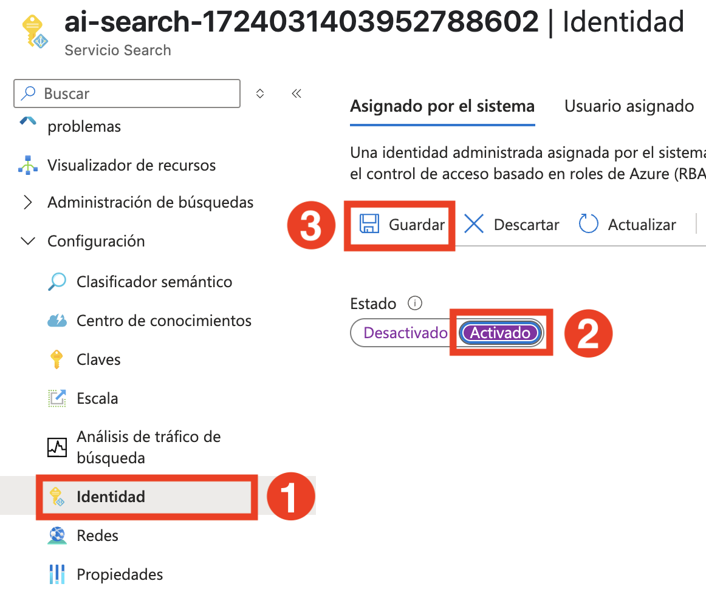
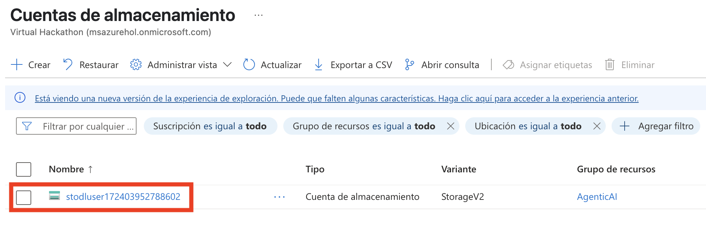
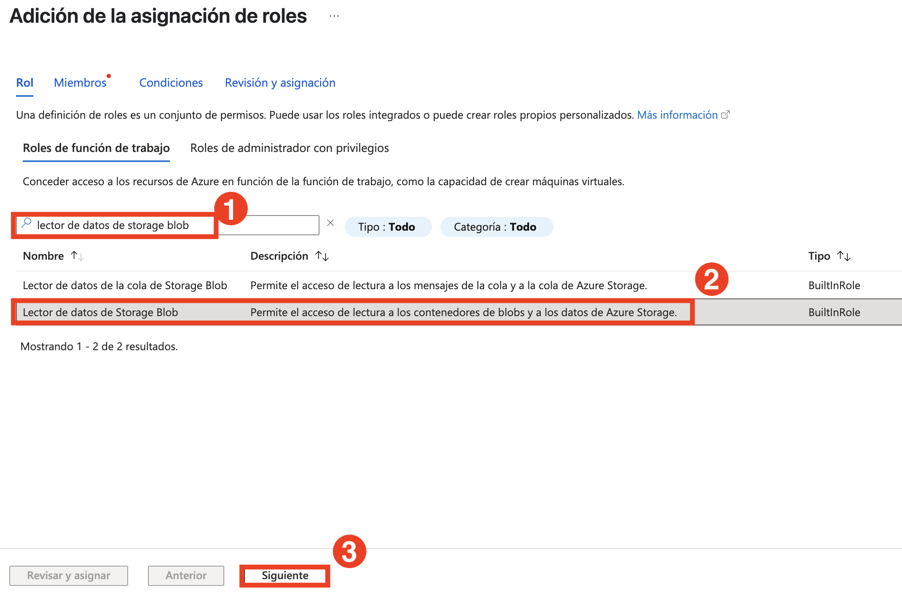
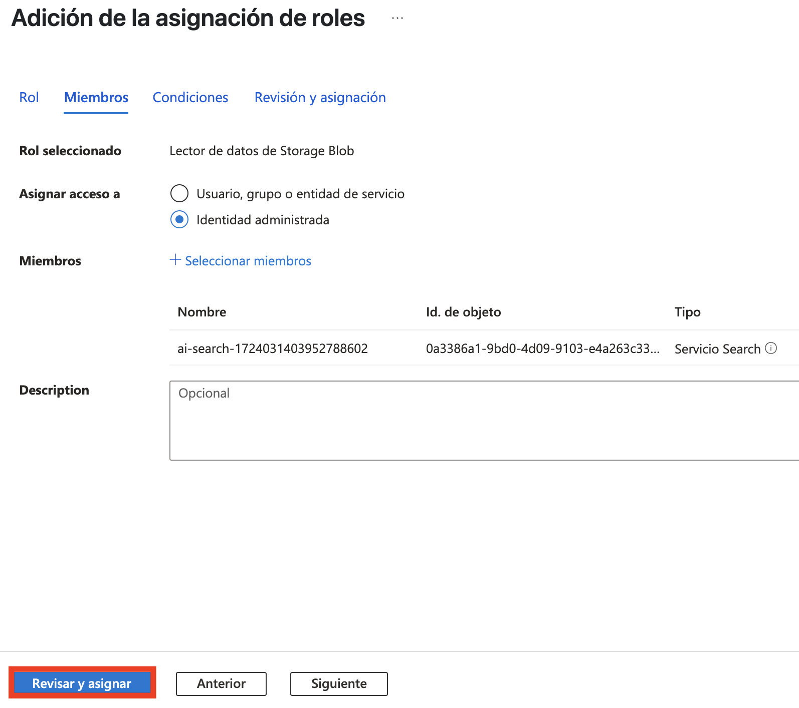
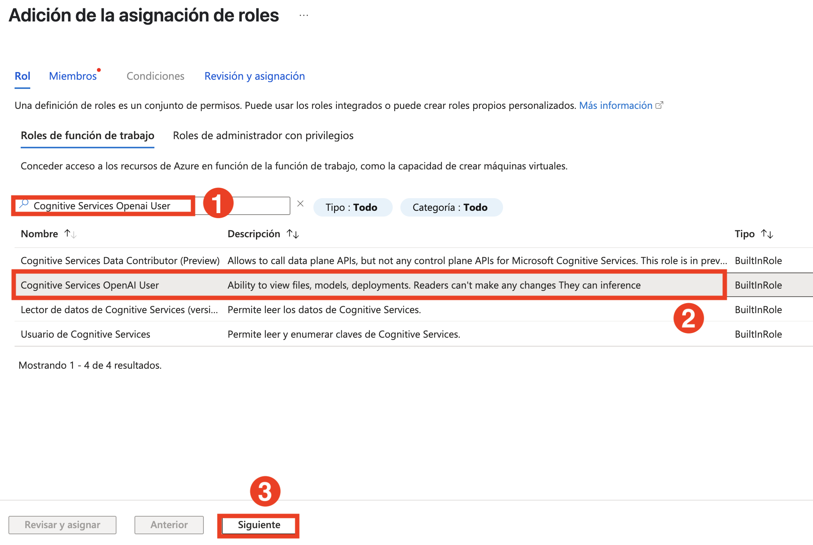
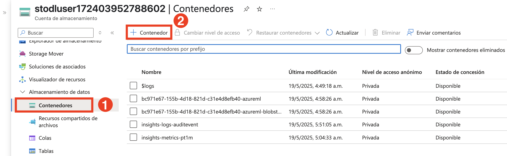
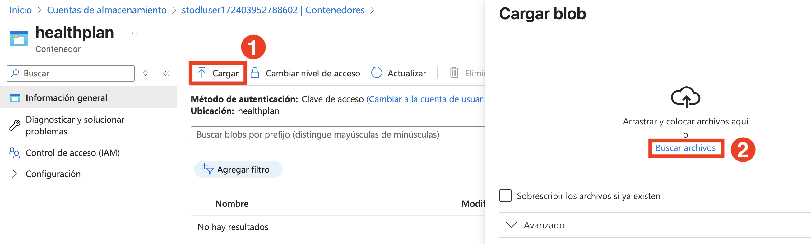
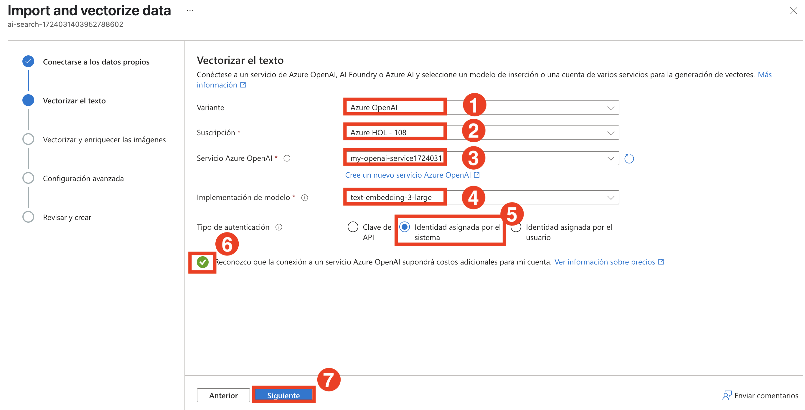
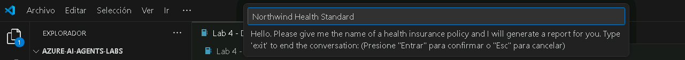

# 演習 3: マルチエージェントシステムの開発
## 推定時間: 30 分
## ラボシナリオ
このラボでは、4つのエージェントが協力して健康保険プランのドキュメントに関するレポートを生成するマルチエージェントシステムを作成します。以下の4つのAIエージェントを構築します：

- **検索エージェント** - このエージェントは、特定の健康保険ポリシーに関する情報をAzure AI Searchインデックスで検索します。
- **レポートエージェント** - このエージェントは、検索エージェントから返された情報に基づいて健康保険ポリシーに関する詳細なレポートを生成します。
- **検証エージェント** - このエージェントは、生成されたレポートが指定された要件を満たしていることを検証します。具体的には、レポートにカバレッジの除外情報が含まれていることを確認します。
- **オーケストレーターエージェント** - このエージェントは、検索エージェント、レポートエージェント、および検証エージェント間の通信を管理するオーケストレーターとして機能します。

    

オーケストレーションはマルチエージェントシステムの重要な部分であり、作成するエージェントが目標を達成するために互いに通信できる必要があります。

検索、レポート、および検証エージェントを作成するためにAzure AIエージェントサービスを使用します。ただし、オーケストレーターエージェントを作成するためには、Semantic Kernelを使用します。Semantic Kernelライブラリは、マルチエージェントシステムのオーケストレーションのための機能を提供します。

## ラボの目的
このラボでは、以下のタスクを完了します：
- タスク1：Azure AI Searchインデックスの作成
- タスク2：検索、レポート、および検証エージェントの作成

## タスク1：Azure AI Searchインデックスの作成

このタスクでは、健康保険プランのドキュメントのベクトル化された表現を保存し、AI駆動の検索と分析のための効率的な取得を可能にする **Azure AI Searchインデックス** を作成します。

1. **Azure portal** に移動します。**AI Search (1)** を検索し、サービスから **AI Search (2)** リソースを選択します。

   

2. するとAIファウンドリーに移動します。**AI Search** (1)内で**Create** (2)をクリックします。
   

3. **検索サービスの作成** ペインで次の詳細を入力し、**確認と作成** をクリックします (4)

   - サブスクリプション : **デフォルトのサブスクリプションのままにする**
   - リソースグループ : **AgenticAI (1)** を選択
   - サービス名 : **my-search-service-{suffix} (2)**
   - 位置 : **Region** **(3)**

      

4. **確認 + 作成** で、**作成** をクリックします。

   

5. デプロイが完了するまで待ってから、[**リソースに移動**] をクリックします。

   


6. 左側のメニューの **設定** の下の **キー (1)** に移動します。**APIアクセス制御** の下で **両方(2)** を選択します。

   

7. **この検索サービスのAPIアクセス制御を更新してもよろしいですか？** に対して **はい** を選択します。 

   

8. **設定** の下の **アイデンティティ(1)** に移動します。システム割り当てのステータスを **オン(2)** に設定し、**保存(3)** をクリックします。 

   

9. **システム割り当ての管理対象IDを有効にしますか？** に対して **はい** を選択します。

   
   
10. Azureポータルで **ストレージアカウント (1)** を検索し、サービスから **ストレージアカウント (1)** を選択します。

   

11. プロジェクトの **ストレージアカウント** に移動します。 aifoundry で始まるストレージ アカウントを選択します。

   

12. **アクセス制御(IAM)(1)** を選択し、**追加(2)** をクリックして **ロールの割り当てを追加** を選択します。

    

13. **ジョブ機能ロール** の下で **Storage Blob Data Reader (1)** を検索し、**Storage Blob Data Reader (2)** を選択し、**次へ (3)** を選択します。

    

14. **ロールの割り当てを追加** ページで: 

   - メンバーの下で **管理対象ID(1)** を選択します。
   - **メンバー (1)** を選択します。
   - 管理対象ID：**検索サービス(1) (3)**
   - **my-search-service-{suffix} (4)** 検索サービスを選択します。
   - **選択 (5)** をクリックします。

     

15. **レビュー + 割り当て** を2回選択します。

      

16. **Azure OpenAI** に移動し、 **my-openai-service{suffix}** を選択します。.

    

17. **アクセス制御(IAM)(1)** を選択し、**追加(2)** をクリックして **ロールの割り当てを追加** を選択します。

    

18. **ジョブ機能ロール** の下で **Cognitive Services OpenAI User (1)** を検索し、**Cognitive Services OpenAI User (2)** を選択し、**次へ (3)** を選択します。

    

19. **ロールの割り当てを追加** ページで、 

   - メンバーの下で **管理対象ID(1)** を選択します。
   - **メンバー (1)** を選択します。
   - 管理対象ID：**検索サービス(1) (3)**
   - ****my-search-service-{suffix} (4)** 検索サービスを選択します。
   - **選択 (5)** をクリックします。

     

18. **レビュー + 割り当て** を2回選択します。

    

19. **Azureポータル** に移動し、**ストレージアカウント (1)** を検索し、**ストレージアカウント (2)** を選択します。

    

20. **aifoundry** で始まるストレージアカウントを選択します。

    

21. データストレージの下の **コンテナ(1)** をクリックし、**+コンテナ(2)** を選択します。

    

22. 新しいコンテナページで `healthplan` **(1)** を名前として入力し、**作成(2)** をクリックします。

    

23. **healthplan** コンテナをクリックして開きます。

    

24. ファイルをアップロードするために **アップロード (1)** をクリックし、**ファイルを参照 (2)** をクリックします。

    

25. `C:\LabFiles\Day-2-Azure-AI-Agents\azure-ai-agents-labs\data` **(1)** に移動し、アップロードするPDFを両方選択 **(2)** し、**開く (3)** をクリックします。

    

26. **アップロード** をクリックします。

27. Azureポータルで **Azure AI Search** サービスの **my-search-service-{suffix}** に移動します。

    

28. **データのインポートとベクトル化** をクリックします。

    

29. **Azure Blob Storage** を選択します。

    

30. **RAG** モデルを選択します。

      

31. Azure Blob Storageの構成ページで、以下の詳細を入力し、**次へ(5)** をクリックします：

    |設定|値|
    |---|---|
    |サブスクリプション|デフォルトのまま **(1)**|
    |ストレージアカウント|**aifoundryhubxxxxx** で始まるストレージアカウントを選択 **(2)**|
    |Blobコンテナ|**healthplan (3)**|
    |管理対象IDタイプ|**システム割り当て (4)**|

    

32. テキストのベクトル化ページで、以下の詳細を入力し、**次へ (7)** をクリックします：

    |設定|値|
    |---|---|
    |種類|**Azure OpenAI (1)**|
    |サブスクリプション|デフォルトのまま **(2)**|
    |Azure OpenAIサービス|**my-openai-service{suffix}** **(3)**|
    |モデルデプロイメント|**text-embedding-3-large** **(4)**|
    |認証タイプ|**システム割り当てID** **(5)**|
    |確認チェックボックス|**チェック済み** **(6)**|

    

33. **次へ** を2回クリックします。

34. **オブジェクト名のプレフィックス** に **health-plan (1)** を入力し、**作成 (2)** をクリックします。

    

   >**注:** 検索サービスへのデータのインデックスへのアップロードには5〜10分かかる場合があります。


35. **概要** (1) ページに移動します。 **ai-foundry-project-{suffix}**. **管理センターで開く**(2)をクリックします。

   
36. **接続されたリソース** (1) を選択し、**新しい接続** (2) をクリックします。

   
37. 検索バーに「**Azure AI Search**」(1) と入力し、「**Azure AI Search**」(2) を選択します。

   
38. 続行するには、[**接続を追加**] をクリックします。

   

## タスク2：検索、レポート、および検証エージェントの作成

このタスクでは、検索、レポート、および検証エージェントを作成して、健康保険プランのレポートを取得、生成、および検証します。これらのエージェントは協力して、要件の正確性と準拠性を確保します。各エージェントは、レポートの取得、編纂、および正確性の確保において異なる役割を果たします。

1. **Lab 4 - Develop A Mult-Agent System.ipynb** ファイルを開きます。この **Lab 4 - Develop A Mult-Agent System.ipynb** ノートブックは、検索、レポート、検証、およびオーケストレーターエージェントを使用して健康保険プランのレポートを生成および検証するマルチエージェントシステムの開発をガイドします。各エージェントは、レポートの取得、編纂、および正確性の確保において異なる役割を果たします。

   

2. 右上隅にある **カーネルの選択 (1)** 設定を選択し、リストから **venv (Python) (2)** を選択します。

   

3. このセルを実行して、Azure AI Search、GPT-4o、およびSemantic Kernelを統合した **マルチエージェントシステム** を開発します。このセットアップにより、複数のAIエージェントが情報の取得、応答の生成、および複雑なクエリの処理に協力できます。

   

4. このセルを実行して、GPT-4oを使用してAzure AI Searchから健康保険プランの詳細を取得する **検索エージェント** を作成します。このエージェントにより、健康保険ドキュメントから構造化された情報を効率的に取得できます。

   

5. このセルを実行して、GPT-4oを使用して健康保険プランに関する詳細なレポートを生成する **レポートエージェント** を作成します。このエージェントは、さまざまなプランの構造化された洞察、カバレッジの詳細、および除外事項を提供することで、ドキュメントを強化します。

   

6. このセルを実行して、レポートエージェントによって生成されたレポートが品質基準を満たしていることを確認し、特にカバレッジの除外事項をチェックする **検証エージェント** を作成します。

   
   
7. 最後に出力を確認します。

   
   
8. **マルチエージェントシステムの作成：** 以下のセルを実行すると、VS Codeの上部にチャットボックスが表示され、健康保険プランの名前を入力するように求められます。
  
     
  
9. 検索インデックスに2つの健康保険プランをアップロードしたことを思い出してください。以下のいずれかの健康保険プランをボックスに入力し、エンターキーを押してマルチエージェントシステムの実行を開始します：

    - Northwind Health Standard
    - Northwind Health Plus

        
      
    > **注：** セルの実行が成功すると、次の結果が得られます。

    ```
    Orchestrator Agent is starting...
    Calling SearchAgent...
    SearchAgent completed successfully.
    Calling ReportAgent...
    ReportAgent completed successfully.
    Calling ValidationAgent...
    ValidationAgent completed successfully.
    The report for Northwind Plus has been generated. Please check the Northwind Plus Report.md file for the report.
    Orchestrator Agent is starting...
    ```

## レビュー

このラボでは、以下を達成しました：
- 検索、レポート、および検証エージェントを作成しました。

## ラボを正常に完了しました。
