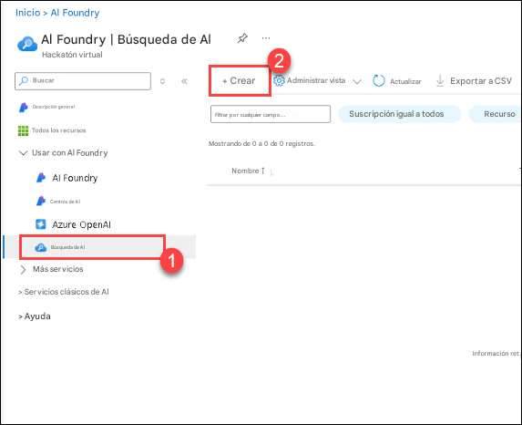
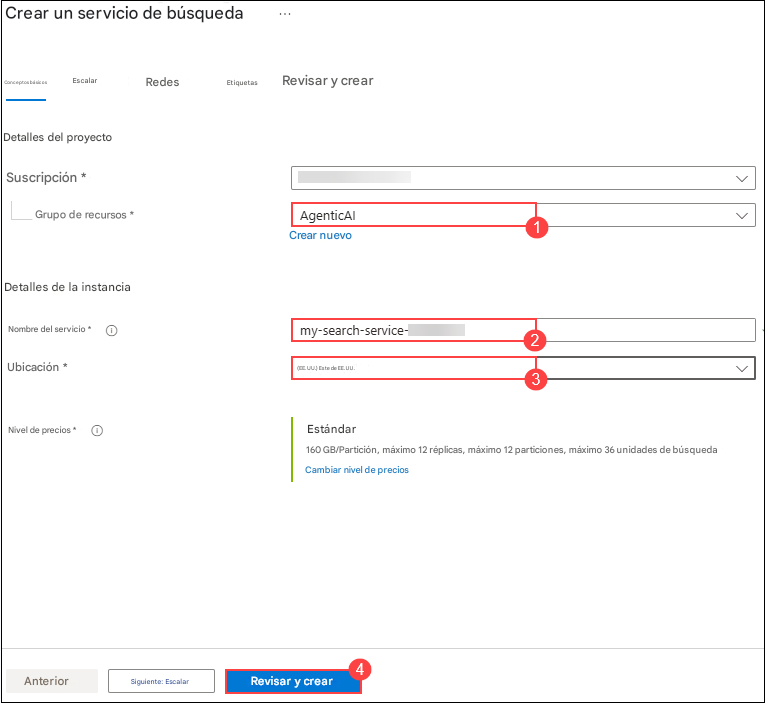
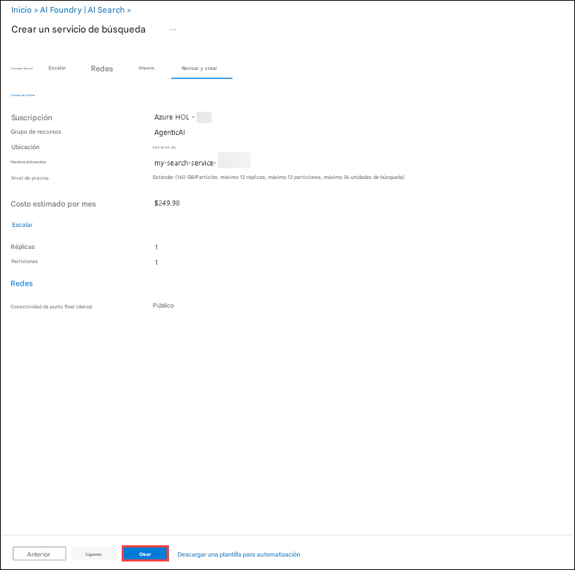
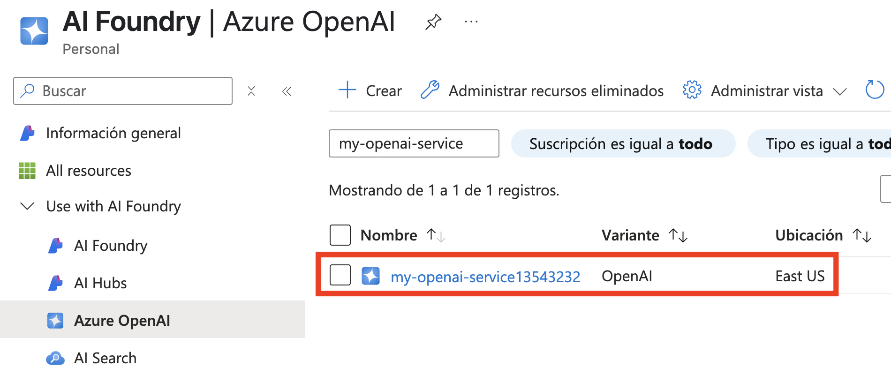
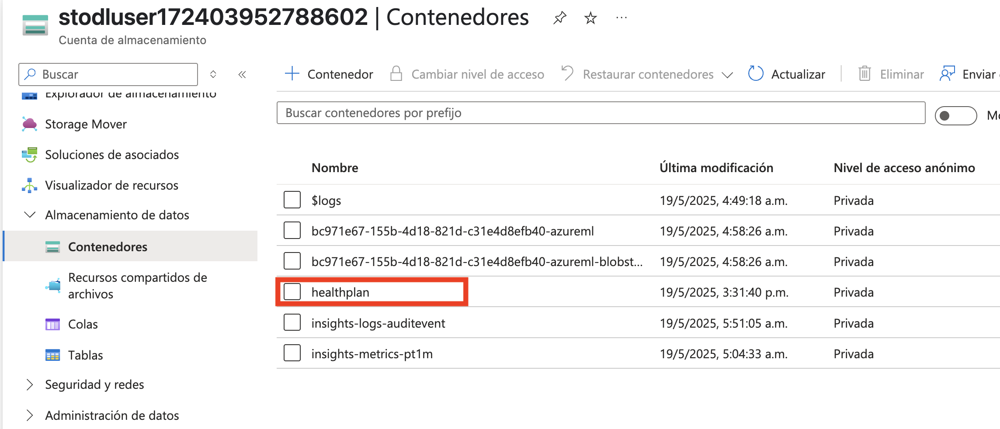
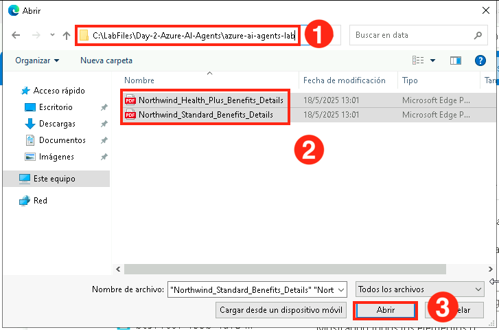
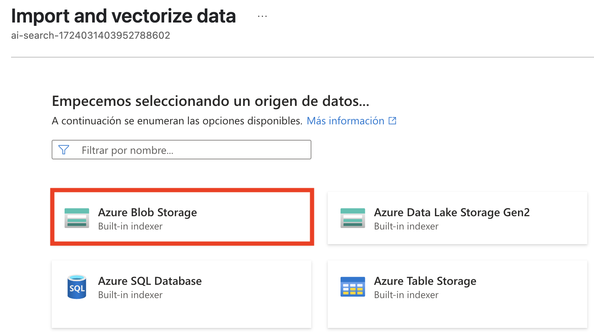
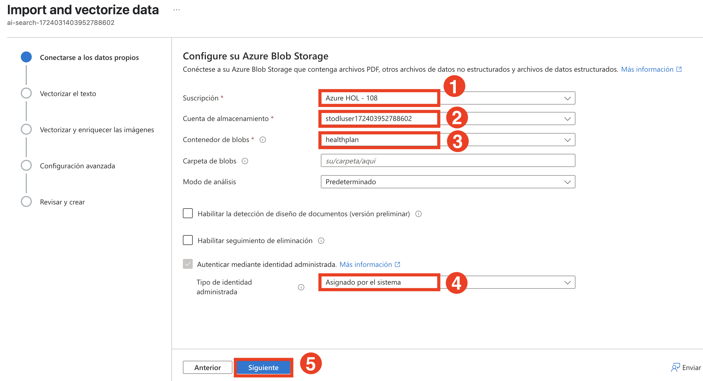

# Ejercicio 3: Desarrolla un sistema multiagente
## Tiempo estimado: 30 minutos
## Escenario del laboratorio
En este laboratorio, crearás un sistema multiagente compuesto por 4 agentes que trabajan juntos para generar reportes sobre documentos de planes de salud. Construirás estos 4 agentes de IA:
- **Search Agent**: Este agente buscará en un índice de Azure AI Search información sobre pólizas de planes de salud específicos.
- **Report Agent**: Este agente generará un reporte detallado sobre la póliza del plan de salud basado en la información devuelta por el Search Agent.
- **Validation Agent**: Este agente validará que el reporte generado cumpla con los requisitos especificados. En nuestro caso, asegurando que el reporte contenga información sobre exclusiones de cobertura.
- **Orchestrator Agent**: Este agente actuará como orquestador gestionando la comunicación entre el Search Agent, Report Agent y Validation Agent.

    

La orquestación es una parte clave de los sistemas multiagente, ya que los agentes que creamos deben poder comunicarse entre sí para lograr el objetivo.

Usaremos Azure AI Agent Service para crear los agentes Search, Report y Validation. Sin embargo, para crear el Orchestrator Agent, utilizaremos Semantic Kernel. La librería Semantic Kernel proporciona funcionalidad lista para usar para orquestar sistemas multiagente.

## Objetivo del laboratorio
En este laboratorio, completarás las siguientes tareas:
- Tarea 1: Crear el índice de Azure AI Search
- Tarea 2: Crear los agentes Search, Report y Validation

## Tarea 1: Crear el índice de Azure AI Search

En esta tarea, crearás un **Azure AI Search index** para almacenar representaciones vectorizadas de documentos de planes de seguro de salud, permitiendo una recuperación eficiente para búsquedas y análisis impulsados por IA.

1. Navega al **portal de Azure**, busca **AI Search (1)** y selecciona el recurso **AI Search (2)** desde los servicios.

   

1. Esto te llevará a AI Foundry, dentro de **AI Search (1)**, haz clic en **Create (2)**.

   

1. En el panel **Create a Search service**, ingresa los siguientes detalles y haz clic en **Review + Create (4)**

   - **Subscription** : **Deja la suscripción predeterminada**
   - **Resource Group** : Selecciona **AgenticAI (1)**
   - **Service Name** : **my-search-service-{suffix} (2)**
   - **Location** : **Region (3)**

   

1. En **Review + Create**, haz clic en **Create**

   

1. Espera hasta que se complete la implementación y luego haz clic en **Go to resource**

   


1. Navega a **Keys (1)** en **Settings** en el menú izquierdo. Bajo **API Access control** selecciona **Both(2)**.

   

1. Selecciona **Yes** para **Are you sure want to update the API Access Control for this search service**. 

   

1. Navega a **Identity(1)** en **Settings**. Bajo System-assigned, establece Status en **On(2)** y haz clic en **Save(3)**. 

   

1. Selecciona **Yes** para **Enable System assigned managed identity**.

   
1. En el Azure portal, busca **Storage accounts (1)** y selecciona **Storage accounts (1)** de los servicios.

   

1. Selecciona la cuenta de almacenamiento que comienza con **aifoundry**.

   

1. Selecciona **Access control(IAM)(1)**, luego haz clic en **Add(2)** y selecciona **Add role assignment**.

   

1. Bajo **Job function roles**, busca **Storage Blob Data Reader (1)**, selecciona **Storage Blob Data Reader (2)** y luego selecciona **Next (3)**.

   

1. En la página **Add role assignment**:
   - Bajo Members, selecciona **Managed identity(1)**
   - Selecciona **Members (1)**
   - Managed identity: **search services(1)** **(3)**
   - Luego selecciona el servicio de búsqueda **my-search-service-{suffix}**.
   - Haz clic en **Select (5)**

     

1. Selecciona **Review + assign** dos veces.

     

1. Ve a **Azure OpenAI**, **my-openai-service{suffix}**.

   

1. Selecciona **Access control(IAM)(1)**, luego haz clic en **Add(2)** y selecciona **Add role assignment**.

   

1. Bajo **Job function roles**, busca **Cognitive Services OpenAI User (1)**, selecciona **Cognitive Services OpenAI User (2)** y luego selecciona **Next (3)**.

   

1. En la página **Add role assignment**:
   - Bajo Members, selecciona **Managed identity(1)**
   - Selecciona **Members (1)**
   - Managed identity: **search services(1)** **(3)**
   - Luego selecciona el servicio de búsqueda **my-search-service-{suffix} (4)**.
   - Haz clic en **Select (5)**

     

1. Selecciona **Review + assign** dos veces.

   

1. Navega a **Azure Portal**, busca **Storage account (1)** y selecciona la **Storage account (2)**.

   

1. Selecciona la cuenta de almacenamiento que comienza con **aifoundry**.

   

1. Haz clic en **Containers(1)** bajo data storage, luego selecciona **+Container(2)**.

   

1. En la página New Container, ingresa `healthplan`(1) como nombre y haz clic en **Create(2)**.

   

1. Abre el contenedor **healthplan** haciendo clic en él.

   

1. Haz clic en **upload (1)** para subir el archivo y luego haz clic en **browse for files (2)**.

   

1. Navega a `C:\LabFiles\Day-2-Azure-AI-Agents\azure-ai-agents-labs\data` **(1)** y selecciona ambos PDFs para subir **(2)**, y haz clic en **Open (3)**.

   

1. Haz clic en **upload**.

1. Navega al servicio **Azure Ai search** **ai-search-xxxx** en el portal de Azure.

   

1. Haz clic en **import and vectorize data**.

   

1. Selecciona **azure blob storage**.

   

1. Elige el modelo RAG.

   

1. En Configure your Azure Blob Storage, ingresa los siguientes datos y haz clic en **Next(5)**:
   |Configuración|Valor|
   |---|---|
   |Subscription|déjalo por defecto **(1)**|
   |Storage account|selecciona la cuenta de almacenamiento con prefijo **aifoundryhubxxxxx**(2)|
   |Blob container|**healthplan**(3)|
   |Management identity type|**System-assigned**(4)|

      

1. En Vectorize your text, ingresa los siguientes datos y haz clic en **Next (7)**:
   |Configuración|Valor|
   |---|---|
   |Kind|**Azure OpenAI (1)**|
   |Subscription|déjalo por defecto **(2)**|
   |Azure OpenAI service|**my-openai-service{suffix}** **(3)**|
   |Model deployment|**text-embedding-3-large** **(4)**|
   |Authentication type|**System assigned identity** **(5)**|
   |Acknowledgement rectangle|**checked** **(6)**|

      

1. Haz clic en **Next** dos veces.
1. Ingresa **health-plan (1)** para **Objects name prefix** y haz clic en **Create (2)**.

   

   >**Nota**: La carga de datos a los índices en el servicio de búsqueda puede tardar 5-10 minutos.

1. Navega a la página de **Overview** (1) de **ai-foundry-project-{suffix}** y haz clic en **Open In management center** (2).

   

1. Selecciona **Connected resources** (1) y haz clic en **New connection** (2).

   

1. Escribe **Azure AI Search** (1) en la barra de búsqueda y selecciona **Azure AI Search** (2).

   

1. Haz clic en **Add connection** para continuar.

   


## Tarea 2: Crear los agentes Search, Report y Validation

En esta tarea, crearás los agentes Search, Report y Validation para recuperar, generar y validar reportes de planes de salud. Estos agentes trabajarán juntos para asegurar la precisión y el cumplimiento de los requisitos. Cada agente cumple un rol distinto en la recuperación, compilación y validación de los reportes.

1. Abre el archivo **Lab 4 - Develop A Mult-Agent System.ipynb**, este notebook te guiará para desarrollar un sistema multiagente con los agentes Search, Report, Validation y Orchestrator para generar y validar reportes de planes de salud. Cada agente cumple un rol distinto en la recuperación, compilación y validación de los reportes.

   

1. Selecciona la opción **Select kernel (1)** disponible en la esquina superior derecha y selecciona **venv (Python) (2)** de la lista.

   

1. Ejecuta esta celda para desarrollar un **sistema multiagente** que integre Azure AI Search, GPT-4o y Semantic Kernel para la ejecución inteligente de tareas. Esta configuración permite que múltiples agentes de IA colaboren en la recuperación de información, generación de respuestas y manejo de consultas complejas.

   

1. Ejecuta esta celda para crear el **Search Agent**, que recupera detalles de planes de salud desde Azure AI Search usando GPT-4o. Este agente permite la recuperación eficiente de información estructurada de documentos de planes de salud.

   

1. Ejecuta esta celda para crear el **Report Agent**, que genera reportes detallados sobre planes de salud usando GPT-4o. Este agente mejora la documentación proporcionando información estructurada, detalles de cobertura y exclusiones para varios planes.

   

1. Ejecuta esta celda para crear el **Validation Agent**, que asegura que los reportes generados por el Report Agent cumplan con los estándares de calidad, verificando específicamente las exclusiones de cobertura.

   
   
1. Finalmente, observa el resultado.

   
   
1. **Crea un sistema multiagente**: Cuando ejecutes la siguiente celda, verás que aparece una caja de chat en la parte superior de VS Code pidiéndote que ingreses el nombre de un plan de salud.
  
     
  
1. Si recuerdas, subimos dos planes de salud al índice de búsqueda. Escribe uno de los siguientes planes de salud en la caja y presiona enter para comenzar a ejecutar el sistema multiagente:

    - Northwind Health Standard
    - Northwind Health Plus

        
      
    > **Nota**: Tras la ejecución exitosa de la celda recibirás el siguiente resultado.

    ```
    Orchestrator Agent is starting...
    Calling SearchAgent...
    SearchAgent completed successfully.
    Calling ReportAgent...
    ReportAgent completed successfully.
    Calling ValidationAgent...
    ValidationAgent completed successfully.
    The report for Northwind Plus has been generated. Please check the Northwind Plus Report.md file for the report.
    Orchestrator Agent is starting...
    ```

1. Escribe `exit` en la caja y presiona enter para detener la ejecución del bloque de código.

## Revisión

En este laboratorio, lograste lo siguiente:
- Crear los agentes Search, Report y Validation.

## Has completado exitosamente el laboratorio.
