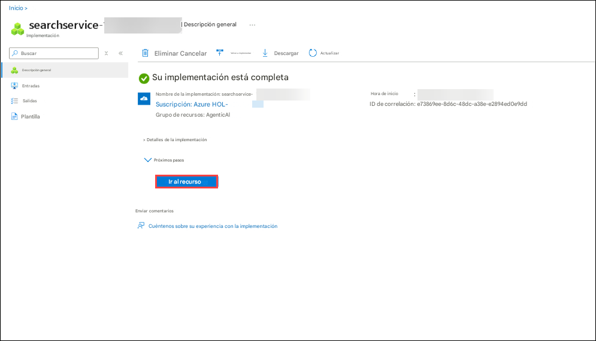
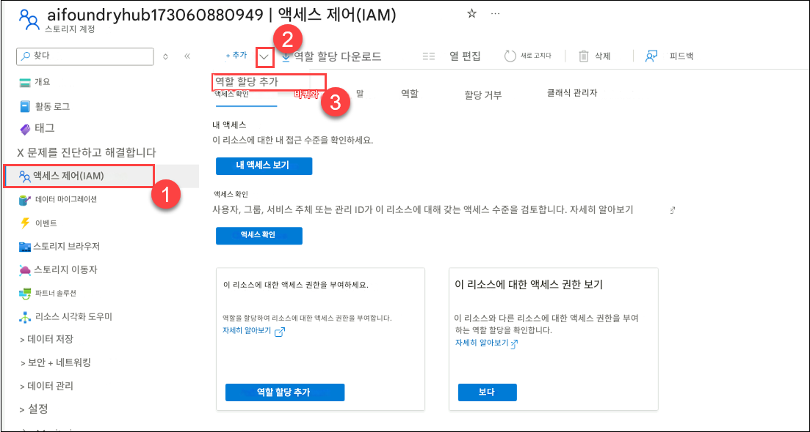
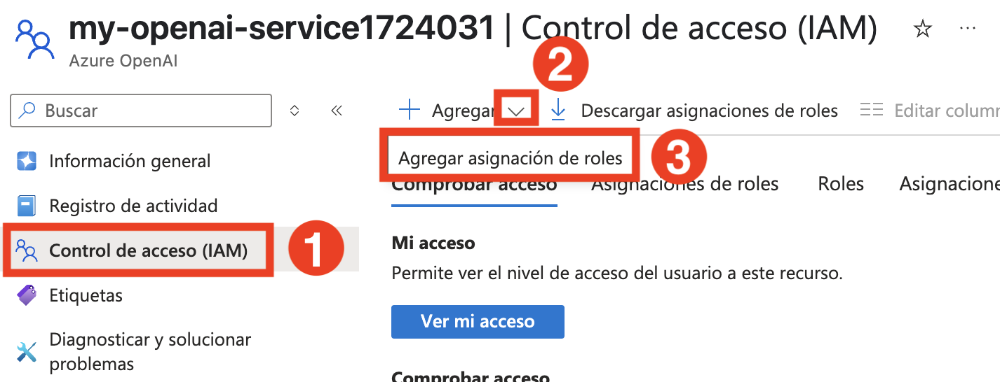
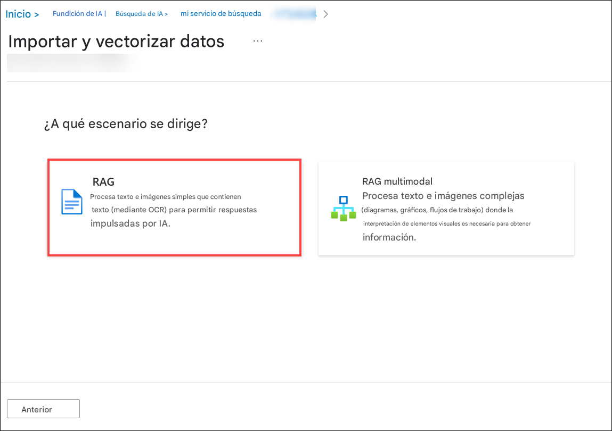
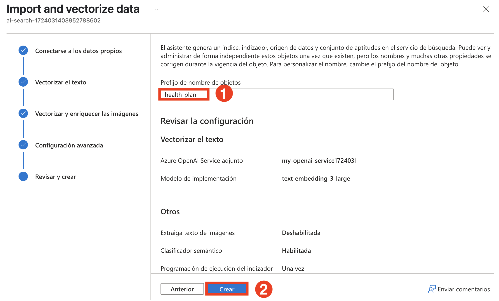
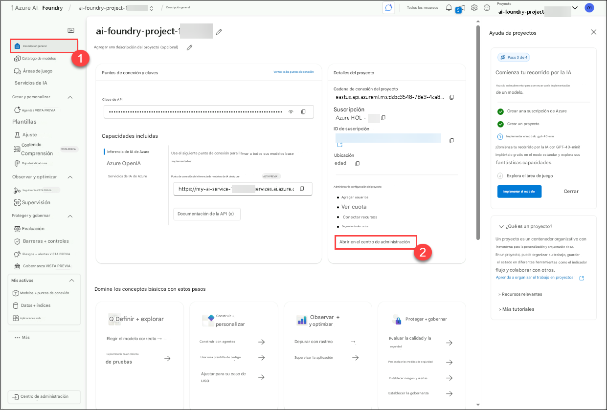
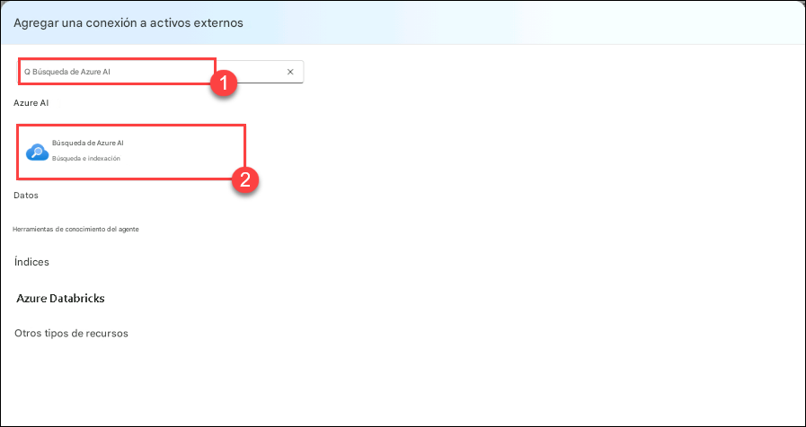
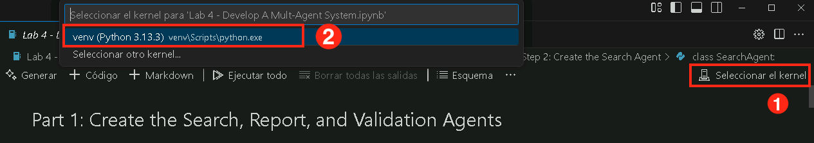

# 練習 3：開發多代理系統
## 預估時間：30 分鐘
## 實驗情境 

在本次實驗中，您將建立一個由 4 個代理組成的多代理系統，這些代理將協同合作，針對健康保險計畫文件產生報告。您將建立以下 4 個 AI 代理：
- **Search Agent** **（搜尋代理）** - 此代理將在 Azure AI Search 索引中搜尋特定健康保險政策的相關資訊。
- **Report Agent** **（報告代理）** - 此代理將根據搜尋代理回傳的資訊，產生一份詳細的健康保險政策報告。
- **Validation Agent** **（驗證代理）** - 此代理將驗證產生的報告是否符合指定的需求。在本實驗中，需確認報告中是否包含有關保障排除項目的資訊。
- **Orchestrator Agent** **（協調代理）** - 此代理將作為協調者，負責管理搜尋代理、報告代理與驗證代理之間的溝通。

    

在多代理系統中，協調（Orchestration）是一個關鍵部分，因為我們所建立的代理需要能夠彼此溝通，才能完成任務目標。

我們將使用 Azure AI Agent Service 來建立三個代理，分別是搜尋代理、報告代理與驗證代理。不過，為了建立協調代理，我們將使用 Semantic Kernel。Semantic Kernel 函式庫提供了現成的功能，可用於協調多代理系統的運作。

## 實驗目標
在本次實驗中，您將完成以下任務：
- 任務 1：建立 Azure AI Search Index
- 任務 2：建立搜尋代理、報告代理與驗證代理

## 任務 1：建立 Azure AI Search Index

在此任務中，您將建立一個 **Azure AI Search Index** ，用來儲存健康保險計畫文件的向量化表示，以利 AI 進行高效的搜尋與分析。

1. 前往 **Azure portal** 入口網站，搜尋 **AI Search** **(1)** ，並從服務中選取 **AI Search** **(2)** 資源。

   

2. 這將導航到 AI Foundry，在 **AI Search** **(1)** 中，按一下 **建立** **(2)**。

   

3. 在“建立搜尋服務”窗格中，輸入以下詳細信息，然後點擊 “**檢閱 + 建立**”

   - 訂用帳戶：**保留預設訂閱**
   - 資源群組：選擇 **AgenticAI** **(1)**
   - 位置： **Region** **(3)**
   - 服務名稱：**my-search-service-{suffix}(2)**

     

4. 在 **檢閱 + 建立** 中，按一下 **建立**

   

5. 等待部署完成，然後點選 **前往資源**

   

6. 在左側功能表中，導覽至「設定」下的 **金鑰** **(1)**。在 **API 存取控制** 下，選擇 **兩者** **(2)**。

   

7. 對於 **您確定要更新此搜尋服務的 API 存取控制嗎**，請選擇 **是的**。

   

8. 導航至 **設定** 下的 **識別** **(1)**。在“系統分配”下，將“狀態 **設定為 "開啟"** **(2)**，然後點選 **儲存** **(3)**。

   

9. 對於 **Enable System assigned managed identity**，請選擇 **Yes**。

   

10. 在 Azure 入口網站上，搜尋 **儲存體帳戶 (1)** 並從服務中選擇 **儲存體帳戶 (2)**。

    

11. 點選並導航到專案的 **儲存體帳戶**。

    

12. 選擇 **存取控制(IAM)** **(1)**，然後點選 **新增** **(2)**，然後選擇 **新增角色指派**。

    

13. 在 **工作函式角色** 下，搜尋 **儲存體 Blob 資料讀者** **(1)**，選擇 **儲存體 Blob 資料讀者** **(2)**，然後選擇 **下一步 (3)**。

    

14. 在 **新增角色指派** 頁面中：

    - 在「成員」區段，選擇 **受控識別** **(1)**
    - 點選 **+ 選取成員** **(2)**
    - 受控識別：選擇 **搜尋服務(1)** **(3)**
    - 然後選擇搜尋服務 **my-search-service-{suffix}** **(4)** 
    - 點選 **選取** **(5)**

      

15. 選擇兩次 **檢閱 + 指派**。

      

16. 前往 **Azure OpenAI**，選取 **my-openai-service-{suffix}**。

    

17. 選擇 **存取控制(IAM)** **(1)**，然後點選 **新增** **(2)**，然後選擇 **新增角色指派**。

    

18. 在 **工作函式角色** 下，搜尋 **認知服務 OpenAI 使用者** **(1)**，選擇 **認知服務 OpenAI 使用者** **(2)**，然後選擇 **下一步** **(3)**。

    

19. 在 **新增角色指派** 頁面中： 

    - 在「成員」區段，選擇 **受控識別** **(1)**
    - 點選 **+ 選取成員** **(2)**
    - 受控識別：選擇 **搜尋服務(1)** **(3)**
    - 然後選擇搜尋服務 **my-search-service-{suffix}** **(4)**
    - 點選 **選取** **(5)**

      

20. 選擇兩次 **檢閱 + 指派**。

    

21. 導航至 **Azure 入口網站**，搜尋 **儲存體帳戶 (1)** 並選擇 **儲存體帳戶 (2)**。

    

22. 選擇以 **aifoundryhub....** 開頭的儲存體帳戶。

    

23. 點選**資料儲存**下的 **容器** **(1)**，然後選擇 **+ 新增容器** **(2)**。

    

24. 在新容器頁面輸入 `健康計劃` **(1)** 作為名稱，然後按一下 **建立** **(2)**。

    

25. 點選開啟 **健康計劃** 容器。

    

26. 點擊 **上傳** **(1)** 上傳文件，然後點擊 **瀏覽檔案** **(2)**。

    

27. 導覽至 `C:\LabFiles\Day-2-Azure-AI-Agents\azure-ai-agents-labs\data` **(1)** 並選擇兩個要上傳的 PDF **(2)**，然後按一下 **開啟** **(3)**。

    

28. 點選 **上傳**.

29. 在 Azure 入口網站中導覽至 **Azure AI 搜尋** 服務 **my-search-service-{suffix}**。

    

30. 點選 **匯入並向量化資料**。

    

31. 選擇 **Azure Blob 儲存體**。

    

32. 選擇 **RAG** 模型。

    

33. 在配置 Azure Blob 儲存體時，輸入以下詳細信息，然後點擊 **下一步** **(5)**：

    |設定|值|
    |---|---|
    |訂用帳戶| 保留預設值 **(1)**|
    |儲存體帳戶| 選擇前綴為 **aifoundryhubxxxxx** 的儲存帳戶 **(2)**|
    |Blob 容器| **健康計劃** **(3)**|
    |受控識別類型| **系統指派** **(4)**|

    

34. 在 **向量化您的文字** 上，輸入以下詳細信息，然後點擊 **下一步** **(7)**：
    
    |設定|值|
    |---|---|
    |種類|**Azure OpenAI (1)**|
    |訂閱帳戶|保留預設值 **(2)**|
    |Azure OpenAI 服務|**my-openai-service-{suffix}** **(3)**|
    |模型部署|**text-embedding-3-large** **(4)**|
    |驗證類型|**系統指派的身份** **(5)**|
    |確認了解|**已選取** **(6)**|

    

35. 點擊 **下一步** 兩次。

36. 在 **物件名稱前置詞** 中輸入 **健康計劃** **(1)**，然後點選 **建立 (2)**。

    

    >**注意**：將資料上傳到搜尋服務中的索引可能需要 5-10 分鐘。

37. 導航到你的 **概觀** **(1)** 頁面上的 **ai-foundry-project-{suffix}**，然後點擊 **在管理中心開啟** **(2)**。

    

38. 選擇 **已連線資源** **(1)** 然後點擊 **新增連線** **(2)**。

    

39. 在搜尋欄中輸入 **Azure AI 搜尋服務** **(1)** 並選擇 **Azure AI 搜尋服務** **(2)**。

    

40. 點擊**新增連線**以繼續。

    

## 任務 2：建立搜尋代理、報告代理與驗證代理

在此任務中，您將建立三個代理，分別是搜尋代理、報告代理與驗證代理，用於擷取、產生並驗證健康保險報告。這些代理將協同合作，以確保報告的準確性與符合需求。每個代理在資訊擷取、彙整與驗證方面都扮演著不同的角色。

1. 開啟 **Lab 4 - Develop A Mult-Agent System.ipynb** 文件，此 **Lab 4 - Develop A Mult-Agent System.ipynb** 筆記本將指導您開發一個包含搜尋、報告、驗證和協調器代理的多代理系統，以產生和驗證健康計劃報告。每個代理程式在檢索、編譯和確保報告準確性方面都發揮著獨特的作用。

   

2. 選擇右上角的 **選擇內核 (1)** 設置，然後從清單中選擇 **venv (Python 3.x.x) (2)**。

   

3. 運行此單元以開發一個整合 Azure AI Search、GPT-4o 和語義核心的 **多智能體系統**，用於智慧執行任務。此設定允許多個 AI 智慧體協作檢索資訊、產生回應並處理複雜查詢。

   

4. 執行此單元以建立 **搜尋代理**，該代理程式使用 GPT-4o 從 Azure AI 搜尋中擷取健康計劃詳細資訊。此代理程式能夠有效率地從健康計劃文件中檢索結構化資訊。

   

5. 運行此單元格即可建立 **報告代理**，該代理使用 GPT-4o 產生有關健康計劃的詳細報告。此代理透過提供結構化的洞察、覆蓋範圍詳情以及各種計劃的除外責任，增強了文件的可讀性。

   

6. 執行此單元以建立 **驗證代理**，確保報告代理程式產生的報告符合品質標準，特別是檢查覆蓋範圍排除。

   
   
7. 最後觀察輸出。

   
   
8. **建立多代理系統**：當您執行下面的儲存格時，您將看到 VS Code 頂部彈出一個聊天框，要求您輸入健康計畫的名稱。
  
     
  
9. 如果您還記得的話，我們已將兩個健康計劃上傳到搜尋索引。請在方塊中輸入以下任一健康計劃，然後按 Enter 鍵即可開始執行多代理系統：

    - Northwind Health Standard
    - Northwind Health Plus

        
      
    > **注意**：成功運行單元後，您將收到以下結果。

    ```
    Orchestrator Agent is starting...
    Calling SearchAgent...
    SearchAgent completed successfully.
    Calling ReportAgent...
    ReportAgent completed successfully.
    Calling ValidationAgent...
    ValidationAgent completed successfully.
    The report for Northwind Plus has been generated. Please check the Northwind Plus Report.md file for the report.
    Orchestrator Agent is starting...
    ```

## 回顧

在本次實驗中，您已完成以下項目：
- 建立了三個代理，分別是搜尋代理、報告代理與驗證代理。


### 恭喜！您已成功完成本次實驗課程！
### 請點選導覽連結，以繼續進行下一個實驗課程。
