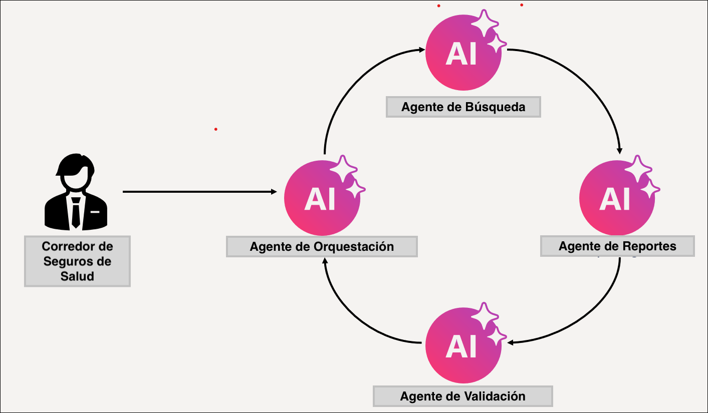
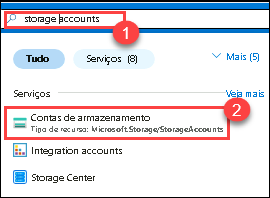

# Exercício 3: Desenvolver um sistema multiagente
## Tempo estimado: 30 minutos
## Cenário do laboratório

Neste laboratório, você criará um sistema multiagente composto por 4 agentes que trabalham juntos para gerar relatórios sobre documentos de planos de saúde. Você criará estes 4 Agentes de IA:

- **Agente de Pesquisa (Search Agent)** – Este agente buscará em um índice do Azure AI Search informações sobre políticas específicas de planos de saúde.
- **Agente de Relatório (Report Agent)** – Este agente gerará um relatório detalhado sobre a política do plano de saúde com base nas informações retornadas pelo Agente de Pesquisa.
- **Agente de Validação (Validation Agent)** – Este agente validará se o relatório gerado atende aos requisitos especificados. Neste caso, garantindo que o relatório contenha informações sobre exclusões de cobertura.
- **Agente Orquestrador (Orchestrator Agent)** – Este agente atuará como orquestrador, gerenciando a comunicação entre os agentes de Pesquisa, Relatório e Validação.



A orquestração é uma parte fundamental de sistemas multiagente, pois os agentes precisam se comunicar entre si para cumprir o objetivo.

Usaremos o Azure AI Agent Service para criar os agentes de Pesquisa, Relatório e Validação. No entanto, para criar o Agente Orquestrador, usaremos o Semantic Kernel. A biblioteca Semantic Kernel fornece funcionalidades prontas para orquestração de sistemas multiagente.

## Objetivo do Laboratório

Neste laboratório, você realizará as seguintes tarefas:

- Tarefa 1: Criar o índice do Azure AI Search
- Tarefa 2: Criar os Agentes de Pesquisa, Relatório e Validação

## Tarefa 1: Criar o índice do Azure AI Search

Nesta tarefa, você criará um **índice do Azure AI Search** para armazenar representações vetoriais dos documentos dos planos de saúde, permitindo uma recuperação eficiente por meio de busca e análise com IA.

1. Acesse o **Portal do Azure**, digite **Pesquisa de IA (1)** na barra de pesquisa superior. e selecione o recurso **Pesquisa de IA (2)** nos serviços.

   

2. Criar novo serviço.

   

3. Preencher os detalhes do serviço.

   * Assinatura: **Selecione a assinatura desejada (1)**.

   * Grupo de recursos: Selecione **Agentic AI (2)**
   
   * Nome do serviço: Insira um nome único **my-search-service-{suffix}** **(3)**.
   
   * Localização: Selecione uma região **Region** **(4)**.

   * Clique em **Revisar + criar (5)**.

       

       

4. Após a implantação ser concluída, clique em Ir para o recurso.

      

5. Configurar o acesso por chave

   * No painel esquerdo, clique em Chaves.

   * Marque a opção Ambos (para permitir o uso de chaves de API e identidade).

   * Confirme clicando em Sim na janela pop-up.

       

      

6. Ativar identidade gerenciada
   
   * Vá para a opção Identidade no menu à esquerda.

   * Clique em Ligar para ativar a identidade gerenciada.

   * Clique em Salvar.

   * Confirme clicando em Sim na caixa de diálogo.

       

       

7. Pesquise por **Storage accounts (1)** e selecione a opção nos serviços.

     

8. Acesse a **Storage Account** do projeto.

   

9. Vá em **Controle de acesso (IAM) (1)**, clique em **Adicionar (2)** e selecione **Atribuição de função**.

     

10. Em **Funções por função de trabalho**, procure e selecione **Leitor de Dados de Blob de Armazenamento (Storage Blob Data Reader)**, e clique em **Próximo (3)**.

     

11. Na página de **Atribuição de função**,

    - Em Membros, selecione **Identidade gerenciada (1)**
    - Clique em **Membros (2)**
    - Identidade gerenciada: **serviços de pesquisa (3)** **(3)**
    - Selecione o serviço **my-search-service-{suffix} (4)**
    - Clique em **Selecionar (5)**

      

        

12. Clique em **Revisar e atribuir** duas vezes.

13. Vá para o recurso **Azure OpenAI**, **my-openai-service{suffix}**.

      

14. Em **Controle de acesso (IAM)**, clique em **Adicionar** e selecione **Atribuição de função (Add role assignment)**.

    

15. Em **Funções de trabalho**, pesquise por **Usuário do Cognitive Services OpenAI (1)**, selecione **Usuário do Cognitive Services OpenAI (2)** e então clique em **Avançar (3)**.

      


16. Na página de **Atribuição de Função**:

    * Selecione **Identidade gerenciada(1)**
    * Clique em **Membros (2)**
    * Identidade: **search services (3)** **(3)**
    * Escolha **my-search-service-{suffix} (4)** 
    * Clique em **Selecionar (5)**

        

17. Clique em **Revisar e atribuir** duas vezes.

    

18. No Portal do Azure, pesquise por **Storage Account (1)** e selecione **Storage Account (2)**.

     
    
19. Selecione a conta de armazenamento que começa por **aifoundry.**

     

20. Vá em **Contêineres (1)** em armazenamento de dados, e selecione **+Contêiner (2)**. Nomeie como `healthplan` e clique em **Criar**.

     

21. Abra o contêiner **healthplan**. Clique em **Carregar (1)** e depois em **Procurar arquivos (2)**.

     

        

22. Navegue até `C:\LabFiles\Day-2-Azure-AI-Agents\azure-ai-agents-labs\data` **(1)** e selecione os dois arquivos PDF para upload **(2)** e clique em **Abrir (3)**.

      

23. Clique em **Upload**.

    

24. Vá ao serviço **Azure AI Search**, no recurso **my-search-service-{suffix}** no portal do Azure.

     

25. Clique em **Importar e vetorizar dados**.

     

28. Selecione **Armazenamento Blob do Azure**.

       

29. Na configuração do seu Azure Blob Storage, insira os seguintes detalhes e clique em **Avançar (5)**:

      | Configuração                        | Valor                                                              |
      | ----------------------------------- | ------------------------------------------------------------------ |
      | Assinatura                          | mantenha a padrão **(1)**                                          |
      | Conta de armazenamento              | selecione a conta de armazenamento com o prefixo **stodluser** (2) |
      | Container Blob                      | **healthplan** (3)                                                 |
      | Tipo de identidade de gerenciamento | **Atribuída pelo sistema** (4)                                     |

       

30. Na seção **Vetorização do seu texto**, insira os seguintes detalhes e clique em **Avançar (7)**:

      | Configuração             | Valor                                                                                  |
      | ------------------------ | -------------------------------------------------------------------------------------- |
      | Tipo                     | **Azure OpenAI (1)**                                                                   |
      | Assinatura               | mantenha a padrão **(2)**                                                              |
      | Serviço Azure OpenAI     | **my-openai-service{suffix}** **(3)** |
      | Implantação do modelo    | **text-embedding-3-large** **(4)**                                                     |
      | Tipo de autenticação     | **Identidade atribuída pelo sistema** **(5)**                                          |
      | Retângulo de confirmação | **marcado** **(6)**                                                                    |

       

31. Clique em **Próximo** duas vezes.

32. Para o **Prefixo do nome dos objetos**, use **health-plan (1)** e clique em **Criar**.

       

       > **Nota**: O upload para o índice pode levar de 5 a 10 minutos.


## Tarefa 2: Criar os Agentes de Pesquisa, Relatório e Validação

Nesta tarefa, você criará os Agentes de Pesquisa, Relatório e Validação para recuperar, gerar e validar relatórios de planos de saúde. Cada agente possui um papel específico para garantir precisão e conformidade dos relatórios.

1. Abra o arquivo **Lab 4 - Develop A Mult-Agent System.ipynb**. Este notebook **Lab 4 - Develop A Mult-Agent System.ipynb** guia você no desenvolvimento de um sistema multiagente com os agentes de Busca, Relatório, Validação e Orquestrador para gerar e validar relatórios de planos de saúde. Cada agente desempenha um papel distinto na recuperação, compilação e garantia da precisão dos relatórios.

   

1. Selecione a opção **Select kernel (1)** disponível no canto superior direito e escolha **venv (Python) (2)** na lista.

   

2. Execute esta célula para desenvolver um **sistema multiagente** que integra Azure AI Search, GPT-4o e Semantic Kernel para execução inteligente de tarefas. Essa configuração permite que múltiplos agentes de IA colaborem na recuperação de informações, geração de respostas e no tratamento de consultas complexas.

   

3. Execute esta célula para criar o **Agente de Busca (Search Agent)**, que recupera detalhes dos planos de saúde do Azure AI Search usando o GPT-4o. Este agente permite a recuperação eficiente de informações estruturadas dos documentos dos planos de saúde.

   

4. Execute esta célula para criar o **Agente de Relatórios (Report Agent)**, que gera relatórios detalhados sobre os planos de saúde usando o GPT-4o. Este agente melhora a documentação fornecendo insights estruturados, detalhes de cobertura e exclusões para vários planos.

   

5. Execute esta célula para criar o **Agente de Validação (Validation Agent)**, que garante que os relatórios gerados pelo Agente de Relatórios atendam aos padrões de qualidade, verificando especificamente exclusões de cobertura.

   

6. Por fim, observe o resultado.

   

7. **Crie um sistema multiagente**: ao executar a célula abaixo, uma caixa de chat aparecerá no topo do VS Code, pedindo para você digitar o nome de um plano de saúde.

   

8. Se lembrar, enviamos dois planos de saúde para o índice de busca. Digite um dos seguintes planos na caixa e pressione Enter para iniciar a execução do sistema multiagente:

   - Northwind Health Standard
   - Northwind Health Plus

     

   > **Nota**: Após a execução bem-sucedida da célula, você receberá a seguinte mensagem:

    ```
    Orchestrator Agent is starting...
    Calling SearchAgent...
    SearchAgent completed successfully.
    Calling ReportAgent...
    ReportAgent completed successfully.
    Calling ValidationAgent...
    ValidationAgent completed successfully.
    The report for Northwind Plus has been generated. Please check the Northwind Plus Report.md file for the report.
    Orchestrator Agent is starting...
    ```


## Revisão

Neste laboratório, você:
- Criou os Agentes de Pesquisa, Relatório e Validação.

## Você concluiu com sucesso o laboratório.

