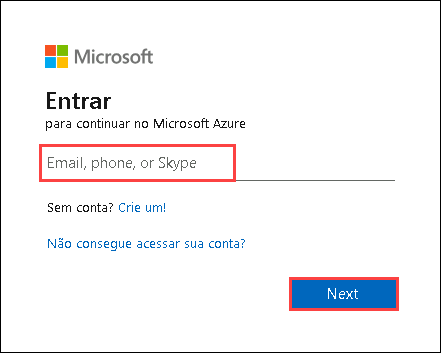
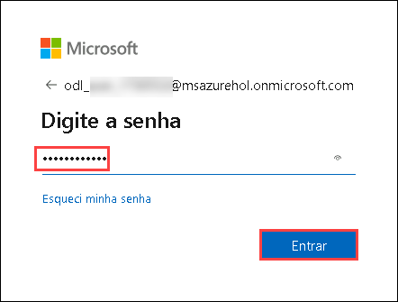
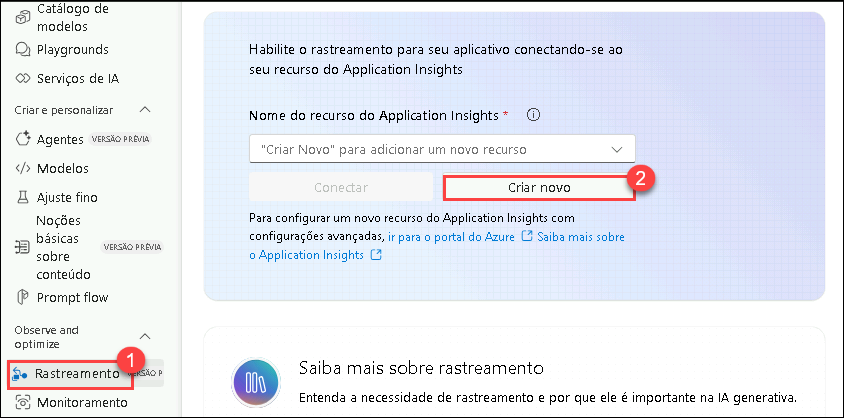
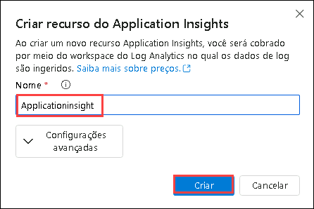
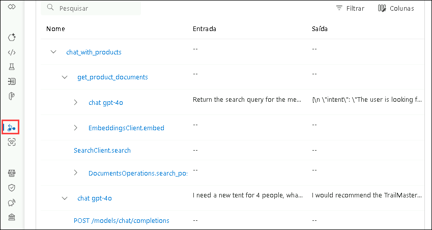
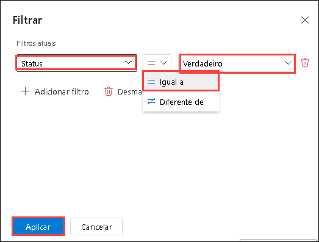
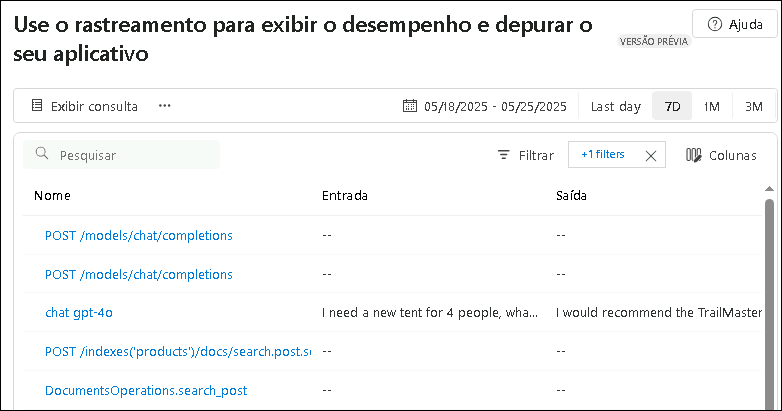

# Exercício 2: Criar um Pipeline de Geração Aumentada por Recuperação (RAG)

Neste exercício, você vai aprimorar um aplicativo de chat básico integrando um pipeline de Geração Aumentada por Recuperação (RAG). Isso inclui indexar fontes de conhecimento, implementar um mecanismo de recuperação, gerar respostas com conhecimento aumentado e adicionar registros de telemetria para monitorar desempenho e precisão.

## Objetivos

Neste exercício, você realizará as seguintes tarefas:

- Tarefa 1: Indexar Fontes de Conhecimento
- Tarefa 2: Implementar o Pipeline de Recuperação
- Tarefa 3: Gerar Respostas com Conhecimento Aumentado
- Tarefa 4: Adicionar registros de telemetria

### Tarefa 1: Indexar Fontes de Conhecimento

Nesta tarefa, você vai indexar fontes de conhecimento processando e armazenando dados vetorizados a partir de um arquivo CSV usando um índice de busca. Você também vai autenticar sua conta Azure, executar o script de indexação e registrar o índice no seu projeto em nuvem.

1. Abra uma nova aba no navegador e acesse o portal Azure AI Foundry usando o link abaixo:

   ```
   https://ai.azure.com/
   ```

2. Clique no ícone **Azure AI Foundry** no canto superior esquerdo.

3. Selecione o projeto AI Foundry que você criou anteriormente no laboratório: **ai-foundry-project-{suffix} (1)**

4. Clique em **Modelos + endpoints (1)** em **Meus ativos** no painel à esquerda e depois em **+ Implantar modelo**, seguido de **Implantar modelo base (2)**.

5. Pesquise por **text-embedding-ada-002**, selecione o modelo e clique em **Confirmar**.

6. Clique em **Implantar**.

7. Expanda a pasta **assets (1)** e selecione o arquivo **products.csv**. Este arquivo contém exemplos de todos os conjuntos de dados usados no seu app de chat.

    

8. Selecione **create_search_index.py**, que armazena dados vetorizados a partir do modelo de embeddings.

    

9. Revise a estrutura do código, que contém:

   - Código para importar bibliotecas, criar o cliente do projeto e configurar definições:

     ```bash
     <imports_and_config>

     </imports_and_config>
     ```
   
   - Função para definir um índice de busca:

     ```bash
     <create_search_index>

     </create_search_index>
     ```

   - Função para adicionar um arquivo CSV ao índice:

     ```bash
     <add_csv_to_index>

     </add_csv_to_index>
     ```

   - Código para rodar as funções, construir o índice e registrá-lo no projeto em nuvem:

     ```bash
     <test_create_index>

     </test_create_index>
     ```

10. No seu console, faça login na sua conta Azure e siga as instruções para autenticação:

    ```bash
    az login
    ```

    

11. Minimize a janela do Visual Studio Code.

    - Selecione **Conta corporativa ou de estudante (1)** e clique em **Continuar (2)**

    - Digite o **Nome de usuário AzureAdUserEmail (1)** e clique em **Próximo (2)**

        

    - Digite a **Senha AzureAdUserPassword (1)** e clique em **Entrar (2)**

        
   

12. Volte ao terminal do Visual Studio Code e pressione **Enter** para aceitar a assinatura padrão.

    

13. Execute o código para criar o índice localmente e registrá-lo no projeto em nuvem:

    ```bash
    python create_search_index.py
    ```

     


### Tarefa 2: Implementar o Pipeline de Recuperação

Nesta tarefa, você vai implementar o pipeline de recuperação extraindo documentos relevantes do índice de busca. Você vai configurar e executar um script que transforma consultas dos usuários em requisições de busca, retornando os resultados mais relevantes.

1. Selecione o arquivo **get_product_documents.py**, que contém o script para obter documentos do índice de busca.

    

    - Este arquivo contém o código para importar as bibliotecas necessárias, criar um cliente de projeto e configurar as definições.
    - Código para adicionar a função que obtém os documentos do produto.
    - Por fim, adicione o código para testar a função quando você executar o script diretamente.


2. Expanda **assets (1)** e selecione **intent_mapping.prompty (2)**. Este template instrui como extrair a intenção do usuário na conversa.

    

    - O script **get_product_documents.py** usa este modelo de prompt para converter a conversa em uma consulta de pesquisa.

3. Execute o comando abaixo no terminal para testar quais documentos são retornados por uma consulta:

   ```bash
   python get_product_documents.py --query "Preciso de uma nova barraca para 4 pessoas, o que você recomenda?"
   ```

          

### Tarefa 3: Gerar Respostas com Conhecimento Aumentado

Nesta tarefa, você irá gerar respostas usando conhecimento aumentado, aproveitando os documentos recuperados. Você vai executar um script que integra as capacidades RAG para gerar respostas relevantes e fundamentadas.

1. Selecione o arquivo **chat_with_products.py**. Este script recupera documentos e gera uma resposta com base na pergunta do usuário.

    

   - O script inclui código para importar bibliotecas, configurar definições, gerar a função de chat com capacidades RAG e executá-la.

2. Expanda a pasta **assets (1)** e selecione **grounded_chat.prompty (2)**. Este template orienta como gerar uma resposta com base na pergunta e nos documentos.

    

    - O script **chat_with_products.py** chama este modelo de prompt para criar uma resposta à pergunta do usuário.

3. Execute o comando abaixo no terminal para testar seu app de chat com RAG:

   ```bash
   python chat_with_products.py --query "Preciso de uma nova barraca para 4 pessoas, o que você recomenda?"
   ```

       

### Tarefa 4: Adicionar Registros de Telemetria

Nesta tarefa, você vai ativar registros de telemetria integrando o **Application Insights** ao seu projeto. Isso permitirá monitorar o desempenho do app RAG, rastrear consultas e registrar respostas para melhor observabilidade e depuração.

1. Acesse novamente o portal Azure AI Foundry:

   ```
   https://ai.azure.com/
   ```

2. Clique no ícone **Azure AI Foundry** no canto superior esquerdo.

3. Selecione o projeto criado anteriormente: **ai-foundry-project-{suffix} (1)**

4. Vá até a aba **Tracing (1)** e clique em **Create new (2)** para criar um novo recurso do **Application Insights**.

    

5. Digite o nome **Applicationinsight (1)** e clique em **Criar (2)**.

    

6. No terminal do VS Code, instale o pacote `azure-monitor-opentelemetry`:

   ```bash
   pip install azure-monitor-opentelemetry
   ```

       

   > **Nota:** Aguarde a instalação. Pode levar alguns minutos.

7. Adicione a flag `--enable-telemetry` ao usar o script `chat_with_products.py`:

   ```bash
   python chat_with_products.py --query "Preciso de uma nova barraca para 4 pessoas, o que você recomenda?" --enable-telemetry 
   ```

8. **Ctrl+clique** no link exibido no console para ver os dados de telemetria no Application Insights e clique em **Abrir (2)**.

    

9. Isso abrirá a aba **Tracing** no portal **AI Foundry**, onde você verá os dados de telemetria no Application Insights.

    

   > **Nota:** Pode demorar cerca de 5 minutos para os dados aparecerem. Clique em **Atualizar** se necessário.

10. No seu projeto, você pode **filtrar** os rastreamentos conforme desejar. Clique em **Filtrar**.

    

11. Clique em **+ Adicionar filtro**, defina como **Status (1)**, **Igual a (2)** -> **True (3)** e clique em **Aplicar (4)**.

    

12. Agora, você verá apenas os dados com sucesso igual a **True**.

    

### Revisão

Este exercício teve como foco construir um pipeline de  Geração Aumentada por Recuperação (RAG), indexando fontes de conhecimento e implementando um sistema eficiente de recuperação. Os participantes geraram respostas com dados relevantes e integraram telemetria para monitorar e otimizar o desempenho do sistema.

Você concluiu com sucesso as seguintes tarefas:

- Tarefa 1: Indexar Fontes de Conhecimento
- Tarefa 2: Implementar o Pipeline de Recuperação
- Tarefa 3: Gerar Respostas com Conhecimento Aumentado
- Tarefa 4: Adicionar registros de telemetria

### Você concluiu o exercício com sucesso. Clique em **Próximo** para continuar para o próximo exercício.
