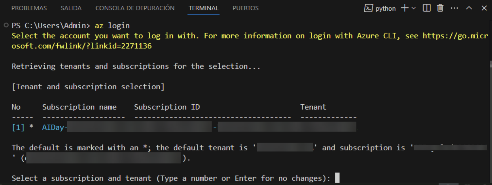
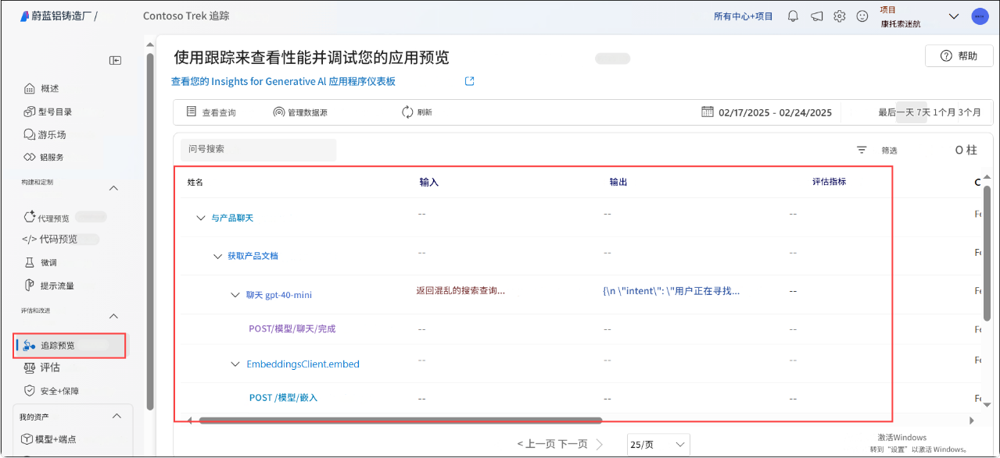

# 练习 2：构建检索增强生成 (RAG) 管道

在本练习中，您将通过集成检索增强生成 (RAG) 管道来增强基本的聊天应用程序。这包括索引知识源、实现检索机制、使用增强知识生成响应，以及添加遥测日志记录以监控性能和准确性。

## 目标

在本练习中，您将完成以下任务：

- 任务 1：索引知识源
- 任务 2：实现检索管道
- 任务 3：使用增强知识生成响应
- 任务 4：添加遥测日志记录

### 任务 1：索引知识源

在本任务中，您将通过处理和存储来自 CSV 文件的向量化数据到搜索索引来索引知识源。您还将验证您的 Azure 账户，执行索引脚本，并将索引注册到您的云项目。

1. 在浏览器中打开新标签页，使用以下链接导航到 Azure AI Foundry 门户

   ```
    https://ai.azure.com/
   ```

1. 点击左上角的 **Azure AI Foundry** 图标。
1. 选择您之前在实验中创建的 AI foundry 项目，即 **ai-foundry-project-{suffix} (1)**
1. 点击左侧窗格中 **我的资产** 下的 **模型 + 终结点 (1)**，然后点击 **+ 部署模型**，接着选择 **部署基础模型 (2)**。

1. 搜索 **text-embedding-ada-002**，选择该模型并点击 **确认**。
1. 点击 **部署**。
1. 展开 **assets (1)** 文件夹并选择 **products.csv** 文件 **(2)**。该文件包含将在您的聊天应用中使用的所有数据集示例。

    

1. 选择 **create_search_index.py**，该文件用于存储来自嵌入模型的向量化数据。

    

1. 浏览以下代码列表，其中包含：

    - 导入所需库、创建项目客户端和配置一些设置的代码：

      ```bash
      <imports_and_config>

      </imports_and_config>
      ```

    - 添加定义搜索索引函数的代码：

      ```bash
      <create_search_index>

      </create_search_index>
       ```

    - 创建将 CSV 文件添加到索引的函数的代码：

      ```bash
      </add_csv_to_index>

      </add_csv_to_index>
      ```

    - 运行函数、构建索引并将其注册到云项目的代码：

      ```bash
      <test_create_index>

      </test_create_index>
      ```    

1. 从您的控制台登录到您的 Azure 账户，并按照说明验证您的账户：

    ```bash
    az login
    ```

    

1. 最小化 Visual Studio Code 窗口。

    - 选择 **工作或学校账户 (1)** 并点击 **继续 (2)**。

          

    - 输入 **用户名 AzureAdUserEmail (1)**，然后点击 **下一步 (2)**。

        

    - 输入 **密码 AzureAdUserPassword (1)**，然后点击 **登录 (2)**。

          

    - 点击 **否，仅登录此应用程序**。

            

1. 返回到 Visual Studio Code 终端并按 **Enter** 接受默认订阅。

    

1. 运行代码以在本地构建索引并将其注册到云项目：

    ```bash
    python create_search_index.py
    ```    

         


### 任务 2：实现检索管道

在本任务中，您将通过从搜索索引中提取相关产品文档来实现检索管道。您将配置和执行一个脚本，该脚本将用户查询转换为搜索请求，从索引的知识源中检索最相关的结果。

1. 选择 **get_product_documents.py** 文件，该文件包含从搜索索引中获取产品文档的脚本。

    

    - 该文件包含导入所需库、创建项目客户端和配置设置的代码。
    - 添加获取产品文档函数的代码。
    - 最后，添加在直接运行脚本时测试函数的代码。

1. 展开 **assets (1)** 并选择 **intent_mapping.prompty (2)**。该模板指导如何从对话中提取用户意图。

    

    - **get_product_documents.py** 脚本使用此提示模板将对话转换为搜索查询。

1. 现在，在终端中运行以下命令来测试搜索索引从查询中返回的文档。

    ```bash
    python get_product_documents.py --query "I need a new tent for 4 people, what would you recommend?"
    ```

          

### 任务 3：使用增强知识生成响应

在本任务中，您将通过利用检索到的产品文档使用增强知识生成响应。您将运行一个脚本，该脚本集成了检索增强生成 (RAG) 功能，以根据用户查询提供相关和有根据的响应。

1. 选择 **chat_with_products.py** 文件。该脚本检索产品文档并生成对用户问题的响应。

    

    - 该脚本包含导入所需库、创建项目客户端和配置设置的代码。
    - 生成使用 RAG 功能的聊天函数的代码。
    - 最后，添加运行聊天函数的代码。

1. 展开 **assets (1)** 文件夹并选择 **grounded_chat.prompty (2)**。该模板指导如何根据用户的问题和检索到的文档生成响应。

    

    - **chat_with_products.py** 脚本调用此提示模板来创建对用户问题的响应。

1. 在终端中运行以下命令来使用脚本并测试具有 RAG 功能的聊天应用。

    ```bash
    python chat_with_products.py --query "I need a new tent for 4 people, what would you recommend?"
    ```

       

### 任务 4：添加遥测日志记录

在本任务中，您将通过将 Application Insights 集成到您的项目中来启用遥测日志记录。这允许您监控和分析 RAG 应用程序的性能，跟踪查询，并记录响应详细信息以实现更好的可观察性和调试。

1. 在浏览器中打开新标签页，使用以下链接导航到 Azure AI Foundry 门户

   ```
    https://ai.azure.com/
   ```

1. 点击左上角的 **Azure AI Foundry** 图标。
1. 选择您之前在实验中创建的 AI foundry 项目，即 **ai-foundry-project-{suffix} (1)**
1. 选择 **追踪 (1)** 标签页以向您的项目添加 **Application Insights** 资源，然后点击 **创建新的 (2)** 选项来创建新资源。

    

1. 输入名称为 **Applicationinsight (1)**，然后点击 **创建 (2)**。

    

1. 返回到 VS Code 终端并运行以下命令来安装 `azure-monitor-opentelemetry`

   ```bash
   pip install azure-monitor-opentelemetry
   ```

       

     >**注意：** 等待安装完成。这可能需要一些时间。

1. 在使用 `chat_with_products.py` 脚本时添加 `--enable-telemetry` 标志：

   ```bash
   python chat_with_products.py --query "I need a new tent for 4 people, what would you recommend?" --enable-telemetry 
   ```      

       

1. **Ctrl+点击** 控制台输出中的链接以在您的 Application Insights 资源中查看遥测数据 **(1)** 并点击 **打开 (2)**。

    

1. 这将带您进入 **Azure AI Foundry** 门户的 **追踪** 标签页，您可以在那里查看 Application Insights 资源中的遥测数据。

    

     >**注意：** 如果数据没有立即出现，请在工具栏中选择 **刷新**。可能需要大约 5 分钟才能显示。

1. 在您的项目中，您可以根据需要 **筛选** 您的追踪。点击 **筛选**。

    

1. 点击 **+ 添加筛选器**，将筛选器设置为 **状态 (1)**，**等于 (2)** -> **True (3)**，然后点击 **应用 (4)**。

    

1. 现在，您只能看到 **成功** 为 **True** 的数据。

    

### 回顾

本练习重点关注构建检索增强生成 (RAG) 管道，通过索引知识源和实现高效的检索系统。参与者生成了用相关数据增强的 AI 响应，并集成了遥测日志记录以监控和优化系统性能。

在本练习中，您已完成以下任务：
- 任务 1：索引知识源
- 任务 2：实现检索管道
- 任务 3：使用增强知识生成响应
- 任务 4：添加遥测日志记录

### 您已成功完成实验。点击 **下一步** 继续下一个实验。 
